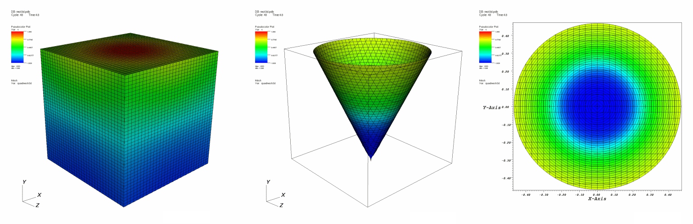

.. _Cone operator:

Cone operator
~~~~~~~~~~~~~

Like the Slice operator, the Cone operator is also a slice operator. The Cone 
operator slices a 3D database with a cone, creating a surface that can be left 
in 3D or be projected to 2D. Plots to which the Cone operator has been applied 
become surfaces that exist on the surface of the specified cone. The resulting 
plot can be left in 3D space or it can be projected to 2D space where other 
operations can be done to it. A Pseudocolor plot to which a Cone operator has 
been applied is shown in :numref:`Figure %s <cone>`.

.. _cone:

   Cone operator example: original plot; sliced with cone; sliced with cone and projected to 2D

Specifying the slice cone
"""""""""""""""""""""""""

You can specify the slice cone by setting various fields in the **Cone 
attributes window**, shown in :numref:`Figure %s <conewindow>`. To specify how 
pointy the cone should be, type a new angle (in degrees) into the **Angle** 
text field. The cone is defined relative to its origin, which is the point at 
the tip of the cone. To move the cone, type in a new origin vector into the 
**Origin** text field. The origin is represented by three floating point numbers
separated by spaces. Once the cone is positioned, you can set its direction 
(where the cone points) by entering a new direction vector into the 
**Direction** text field.

.. _conewindow:

.. figure:: images/conewindow.png

   Cone operator window.

The cone can extend forever or it can be clipped at some distance along its 
length. To clip the cone at a certain length, check the **Cut cone off** check 
box and enter a new length value into the **Length** text field.

Projecting the slice to 2D
""""""""""""""""""""""""""

The Cone operator usually flattens sliced plots to 2D along the cone's direction
vector. This results in circular 2D plots in the visualization window. The Cone 
operator can also unfold sliced plots into a cylinder and then into rectangular 
2D plots. Alternatively, the Cone operator can leave the sliced plots in 3D 
space where their cone shape is obvious. To set the cone projection mode, click 
on one of the following radio buttons: **In 3D**, **Project to 2D**, or **Cylindrical**.

