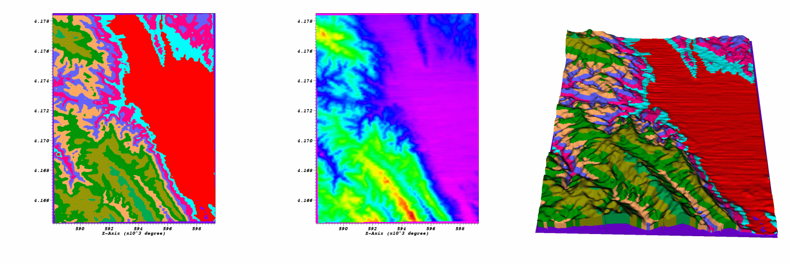
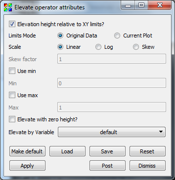
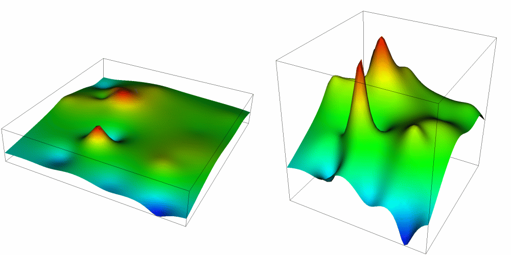
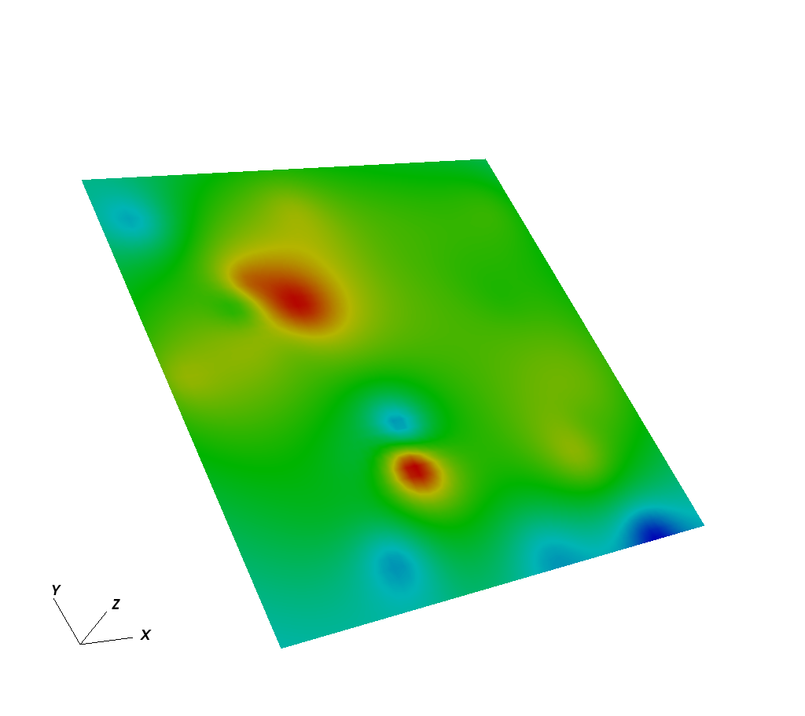

.. _Elevate operator:

Elevate operator
~~~~~~~~~~~~~~~~

The Elevate operator uses a scalar field on a 2D mesh to elevate each node in 
the input mesh, resulting in a topologically 2D surface in 3D. The Elevate 
operator allows you to perform much of the same functionality as a Surface plot 
and it allows you to do additional things like elevate plots that do not accept 
scalar variables. The Elevate operator can also elevate plots whose input data 
was produced from higher dimensional data that has been sliced. Furthermore, 
the Elevate operator allows you to display multiple scalar fields in a single 
plot such as when a Pseudocolor plot of scalar variable A is elevated by scalar 
variable B (see: :numref:`Figure %s <elevate>`).

.. _elevate:

   Elevate operator example:  2D plot of rainfall; 2D plot of elevation; Plot of rainfall elevated by elevation

Using the Elevate operator
""""""""""""""""""""""""""

The Elevate operator can be used to create plots that look much like a Surface 
plot if you simply apply the Elevate operator to a plot that accepts scalar 
values. The Elevate operator is more flexible than a Surface plot because 
whereas the Surface plot limits you to elevating by one variable and coloring 
by the same variable, the Elevate operator can be used with any plot and still 
achieve the Surface plot's elevated effect. You could use the Elevate operator 
to elevate a Pseudocolor plot of rainfall by elevation. You could also take 
Vector or FilledBoundary plots (among others) and elevate them by a scalar 
variable.  

Since the Elevate operator uses a scalar variable to elevate all of the points 
in the mesh, the Elevate operator has a number of controls related to scaling 
scalar data. For example, the Elevate operator allows you to artificially set 
minimum and maximum values for the scalar variable so you can eliminate data 
that might otherwise cause your elevated plot to be stretched undesirably in 
the Z direction. To set minimum and maximum values for the Elevate operator, 
click on the **Min** or **Max** check boxes in the **Elevate attributes window**
(see :numref:`Figure %s <elevatewindow>`) and type new values into the adjacent 
text fields. The options for scaling the plots created using the Elevate 
operator are the same as those for scaling Surface plots. For more information 
on scaling, see the Surface plot documentation.

.. _elevatewindow:

   Elevate window

The most useful feature of the Elevate operator is its ability to elevate plots 
using an arbitrary scalar variable. By default, the Elevate operator uses the 
plotted variable in order to elevate the plot's mesh. This only works when the 
plotted variable is a scalar variable. When you apply the Elevate operator to 
plots that do not accept scalar variables, the Elevate operator will fail unless
you choose a specific scalar variable using the **Elevate by Variable** variable
menu in the **Elevate attributes window**.

Changing elevation height
"""""""""""""""""""""""""

The Elevate operator uses a scalar variable's data values as the Z component 
when converting a mesh's 2D coordinates into 3D coordinates. When the scalar 
variable's data extents are small relative to the mesh's X and Y extents then 
you often get what appears to be a flat 2D version of the data floating in 3D 
space. It is sometimes necessary to scale the scalar variable's data extents 
relative to the spatial extents in order to produce a visualization where the Z 
value differs noticeably. If you want to exaggerate the Z values that the scalar
variable contributes to make differences more obvious, you can click on the 
**Elevation height relative to XY limits** check box in the 
**Elevate attributes window**.

.. _elevatescale:

   Effect of scaling relative to XY limits

The Elevate operator can be used to simply place a 2D plot in 3D space by 
use of the **Elevate with zero height** option. This will assign a value of
zero to all of the z coordinates when converting into 3D. 

.. _elevatezeroheight:

   Effect of elevating with zero height
