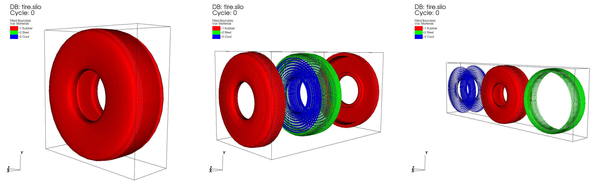

.. _Explode operator:

Explode operator
~~~~~~~~~~~~~~~~~~

.. _explode_operator_example:

   
   Explode operator example: original plot; exploding cells of a material; exploding materials.

The Explode operator has three primary targets, which are **materials, domains, and
cells**. There are three different origins of explosion—**point, plane, and 
cylinder**—all of which have unique results and can be applied to any of the 
above mentioned targets. While this operator is primarily meant to be used on datasets 
containing materials or domains, the capability of exploding all cells remains available for 
datasets that lack either. 

Using the Explode operator
""""""""""""""""""""""""""""

The Explode operator has three areas for user definition. These are the **Origin**
of explosion, **Material Explosion** settings, and **Cell Explosion** settings. 
You can add as many explosions as you'd like to a single instance of the operator, 
and you have the ability to **Add**, **Remove**, or **Update** explosions 
through the **Explode attributes window** shown below.

.. _explode_window:

   
   Explode attributes window

Explode origin
""""""""""""""""""""""""""""

As mentioned earlier, there are three different choices for an explode **Origin**. 
To explode from a **Point**, click the tab labeled Point in the **Origin** section of
the **Explode attributes window**. You will then have the opportunity to enter a 
3D coordinate defining your point. Similarly, to explode from a **Plane**, 
you must click on the Plane tab. You will then have the option to define a plane
by a point located on that plane and the plane's normal. Lastly, to explode from
a **Cylinder**, first click on the Cylinder tab, and then enter two points that 
lie on a line traveling through the center (lengthwise) of your cylinder. By
default, the cylinder has a radius of zero and is treated as a *line* to explode from. 
If you do define a positive radius, any data that is located within that radius 
will *not* be exploded when executing this explosion. 

Exploding materials
""""""""""""""""""""""""""""

Exploding a material results in an individual material within a dataset being 
displaced by a specified **Factor** from a specified origin. Both the 
factor with which the material is displaced and the actual material to be 
acted upon are set within the **Material Explosion** section of the attributes 
window. If you refer to the far right image in :numref:`Figure %s<explode_operator_example>`,
you will find an example of two material explosions. In this example, we see 
the materials Cord and Steel, shown in blue and green, being exploded 
from the Tire dataset. 

Exploding domains
""""""""""""""""""""""""""""

To explode the domains of a dataset, you must first make sure that your dataset has 
domains that can be plotted using the Subset plot. If this condition is met, all you 
need to do is apply the Explode operator to a Subset plot of your domains. The domains
will then be substituted in for materials and treated as such. You can then refer to
the section on exploding materials for usage tips. 

Exploding cells
""""""""""""""""""""""""""""

Exploding cells results in the separation and displacement of the 
cells within your dataset. This can either be applied to an individual material 
or the entire dataset. If you refer to the middle image in
:numref:`Figure %s<explode_operator_example>`, 
you will see the cells of the material Rubber, shown in red, being exploded by a plane. As a 
result, the material is split open and separated to allow us to see the inner 
contents. As before, you also have control over the explosion 
**Factor** that is applied to the cells. Additionally, you have two options for the 
**Explosion Pattern**. The first option is to explode through **Impact**, which results in cells 
that are *closest* to the origin being displaced furthest from the origin. The 
second option is to explode through **Scatter**, which results in cells *furthest*
from the origin being displaced furthest from the origin. 
