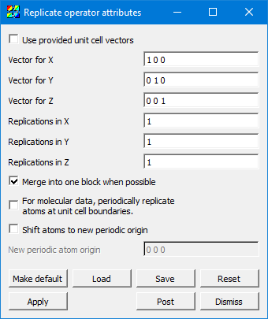

.. _replicate_operator_head:

Replicate operator
~~~~~~~~~~~~~~~~~~

The Replicate operator is most often used in atomic and molecular visualization in VisIt_, and can be combined with the :ref:`molecule_plot_head` and :ref:`createbonds_operator_head`.
See :ref:`moleculardatafeatures_head` for examples of the Replicate operator in use with the :ref:`molecule_plot_head`.

.. _replicatewindow:

   Replicate attributes window

Some file formats specify the vectors for the unit cell (sometimes called "direct lattice" vectors) containing the molecular data in the file. If they are present and **Use provided unit cell vectors** is checked, then it will use those values instead of the ones specified in this window.

**Vector for X, Y, and Z** are controls for specifying the actual vectors describing the amount to displace for a replication in each of the three axes. (The X, Y, and Z labels are only for disambiguation; there is no requirement that the actual vectors specified be related to their name.)

**Replications in X, Y, and Z** specifies the total number of instances of the data set to create. E.g. 1,1,1 specifies the original data set with no replications. 2,1,1 specifies a total of two instances -- one is the original, and the other is a new one created at a displacement of 1x along the "X" vector.

The **Merge into one block when possible** flag specifies that the output of this operator should be created in a single "chunk", and helps with correct operation of the :ref:`createbonds_operator_head`.  It is recommended to leave this enabled.

When there are periodic boundary conditions, atoms at the boundaries of the unit cell are, by definition, logically present at the matching opposite boundaries as well. By checking **For molecular data, periodically replicate atoms at unit cell boundaries**, it creates those atoms which, after replication, would still fall in the unit cell's inclusive boundaries.

For example, in a periodic unit cell with origin [0,0,0] and dimensions [1,1,1], suppose there is an atom centered on the minimum-Z face, i.e. located at [0.5, 0.5, 0]. Due to the periodic boundary conditions, this means that there should be another instance of this atom at the maximum-Z face, i.e. at [0.5, 0.5, 1]. If you set the number of Z replications to at least 2, then it will create this other instance of the atom as desired. However, it will also create any atoms which lie in the replicated cell between z=1 and z=2. Sometimes you want to replicate just those atoms which are still within the original unit cell after replication (within epsilon). By checking this flag, but leaving the number of replications at 1,1,1, this operator will create the instance of the atom at [0.5, 0.5, 1] without adding the other atoms at z>1.

**Shift atoms to new periodic origin** enables the ability to set an origin (using **New periodic atom origin**) for periodic atom creation.

