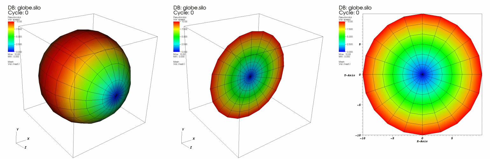
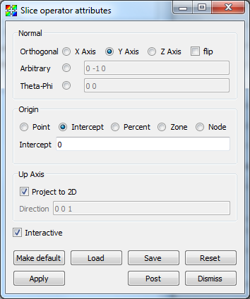
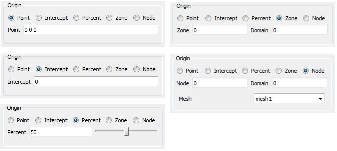

.. _Slice operator:

Slice operator
~~~~~~~~~~~~~~

This operator slices a 3D database with a plane that can have an arbitrary 
orientation. Plots to which the Slice operator has been applied are turned into 
2D planar surfaces that are coplanar with the slice plane. The resulting plot 
can be left as a 2D slice in 3D space or it can be projected to 2D space where 
other operations can be done to it. A Pseudocolor plot to which a Slice operator
has been applied is shown in :numref:`Figure %s <slice>`.

.. _slice:

  Slice operator example

Positioning the slice plane
"""""""""""""""""""""""""""

You can position the slice plane by setting the origin, normal, and up-axis 
vectors in the **Slice operator** **attributes window,** shown in
:numref:`Figure %s <slicewindow>` . The slice plane is specified using the 
origin-normal form of a plane where all that is needed to specify the plane are 
two vectors; the origin and the normal. The origin of the plane is a point in 
the slice plane. The normal vector is a vector that is perpendicular to the 
slice plane.

.. _slicewindow:

  Slice attributes window

VisIt allows the slice plane normal to be aligned to a specific axis or it can 
be set to any arbitrary vector. If you want the slice plane to be along any of 
the three axes, click the **X-Axis**, **Y-Axis**, or **Z-Axis** radio button. 
If you want to make a slice plane that does not align with the principle axes, 
click the **Arbitrary** or **Theta-Phi** radio button and then type a direction
vector into the text field to the right of the radio button. The vector need 
not be normalized since VisIt will normalize the vector before using it.

The slice plane's origin, which specifies the location of the slice plane, can 
be set five different ways. The middle of the **Slice attributes window**, or 
**Origin area** (see the Figures below), provides the necessary controls 
required to set the slice plane origin. The **Origin area** provides five 
radio buttons: **Point**, **Intercept**, **Percent**, **Zone**, and 
**Node**. Clicking on one of these radio buttons causes the **Origin area** to 
display the appropriate controls for setting the slice plane origin.  To set 
the slice plane origin to a specific point, click the **Point** radio button in 
the **Origin area** and then type a new 3D point into the **Point** text field. 
To set the slice plane origin to a specific value along the principle slice 
axis (usually an orthogonal slice), click the **Intercept** radio button and 
then type a new value into the **Intercept** text field.

.. _slicewindow_origins:

  Origin area appearance

If you don't know a good value to use for the intercept, consider using the 
percent slice mode. Percent slice mode, which is most often used for an 
orthogonal slice, allows you to slice along a particular axis using some 
percentage of the distance along that axis. For example, this allows you to see 
what the slice plane looks like if its origin is 50% of the distance along the 
X-Axis. To set the origin using a percentage of the distance along an axis, 
click the **Percent** radio button and then type a new percentage value into 
the **Percent** text field or use the **Percent** slider.

Sometimes it is useful to slice through a particular zone or node. The Slice 
operator allows you to pick an origin for the slice plane so a specific zone or 
node lies in the slice plane. To make sure that a particular zone is sliced by 
the Slice operator, click on the **Zone** radio button and then enter the zone 
to be sliced into the **Zone** text field. Be sure to also enter the domain that
contains the zone into the **Domain** text field if you are slicing a 
multi-domain database. If you want to make sure that the slice plane's origin 
is at a specific node in a mesh, click the **Node** radio button and enter a 
new node number into the **Node** text field. Note that you must also specify a 
domain if you are slicing a multi-domain database.  If the database contains
multiple meshes, their will also be **Mesh** combo box option from which to
choose the mesh to use, as seen in the **Node** example in 
:numref:`Figure %s <slicewindow_origins>`.

Use the up-axis vector when you want the slice plane to be projected to 2D. The 
up-axis vector is a vector that lies in the slice plane and defines a 2D 
coordinate system within the plane where the up-axis vector corresponds to the 
Y-axis. To change the up-axis vector, type a new 3D vector into the
**Direction** text field in the **Up Axis** area of the window.

Positioning the slice plane using the Plane Tool
""""""""""""""""""""""""""""""""""""""""""""""""

You can also position the slice plane using VisIt's interactive plane tool. The 
plane tool, which is available in the visualization window's popup menu, 
allows you to position a slice plane interactively using the mouse. The plane 
tool is an object in the visualization window that can be moved and rotated. 
When the plane tool is changed, it gives its new slice plane to the Slice 
operator if the operator is set to accept information interactively. To make 
sure that the Slice operator can accept a new slice plane from the plane tool, 
check the **Interactive** check box in the **Slice attributes window**.
For more information about the plane tool, read the :ref:`InteractiveTools`
chapter.

Projecting the slice to 2D
""""""""""""""""""""""""""

The Slice operator usually leaves sliced plots in 3D so you can position the 
slice with the plane tool. However, you might want the plot projected to 2D. 
When a sliced plot is projected to 2D, any 2D operation, like **Lineout**
, can be applied to the plot. To project a plot to 2D, check the **Project 2D**
check box in the **Slice attributes window** .

