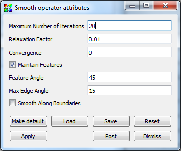

.. _Smooth operator:

Smooth operator
~~~~~~~~~~~~~~~

The Smooth Operator applies Laplacian Smoothing to a mesh, making the cells
better shaped and the nodes more evenly distributed, which results in smoother
edges and peaks throughout the mesh. Each node is moved
towards a coordinate that is the average of its connected nodes. The
**relaxation factor** determines how far along that path to move the node. A
sweep over all nodes is a single iteration. 

.. _smooth:

.. figure:: images/smooth.png

   Smooth operator example

Using the Smooth operator
"""""""""""""""""""""""""

The Smooth operator has a number of
controls that can be used to tune mesh smoothness.

Maximum number of iterations
    Controls the maximum number of times the mesh relaxation algorithm is
    applied to the input mesh. Larger numbers of iterations will produce
    smoother meshes but will also take more time to compute. Values must be
    integers.

Relaxation Factor
    Controls how much the mesh is relaxed. Values near 1 produce a mesh that is 
    very smooth relative to the input mesh. Values must be floating point
    numbers between 0 and 1.

Convergence
    Limit the maximum point motion. The smoothing process will terminate if the
    maximum point motion during an iteration is less than this value. Smaller
    numbers result in more iterations, and if 0 is supplied then the Smooth
    operator will perform **Maximum number of iterations**. Values must be
    floating point numbers between 0 and 1.

Maintain Features
    When the surface angle between two zones sharing an edge is greater than
    **Feature Angle**, then the edge is classified as a *feature edge*. The
    nodes in the mesh are then classified as *simple* (not used by a feature
    edge), *interior edge* (used by exactly two feature edges), or *fixed* (all
    other nodes). *Simple* nodes are smoothed as before, *fixed* nodes are not
    smoothed at all, and *interior edge* nodes are only smoothed along the two
    connected *feature edges*, and only if the angle between the edges is less
    than **Max Angle Edge**. This distinction allows the smoothing operation to
    preserve sharp peaks in the mesh while still smoothing out
    most of the mesh.

Feature Angle
    Used to determine the number of feature edges for each node. Values must be
    floating point numbers between 0 and 90.

Max Angle Edge
    Used to determine if *interior edge* nodes will be smoothed. Values must be
    floating point numbers between 0 and 90.

Smooth Along Boundaries
    Enable the smoothing operation on nodes that are along the boundaries of
    the mesh.

.. _smoothwindow:

   Smooth attributes
