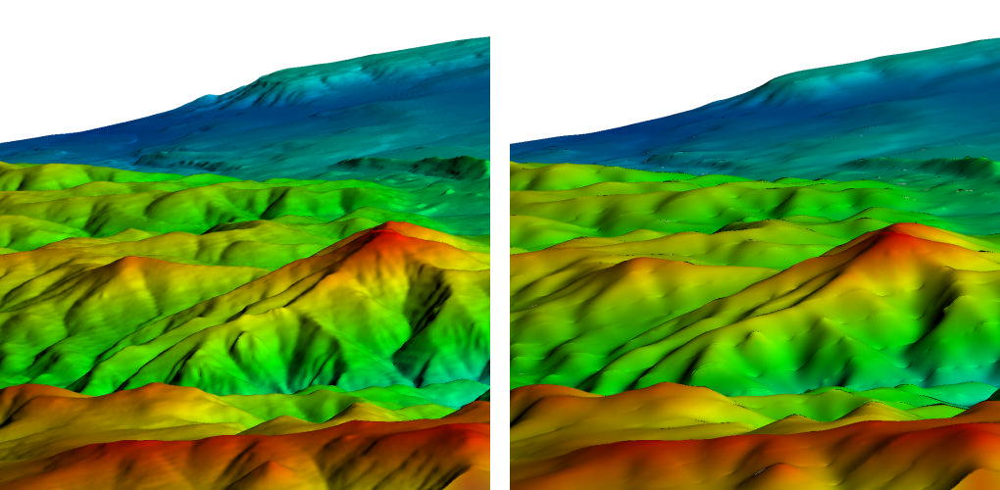

.. _Smooth operator:

Smooth operator
~~~~~~~~~~~~~~~

The Smooth operator smooths a mesh to improve areas plagued by jagged edges or sharp peaks.

.. _smooth:

   Smooth operator example

Using the Smooth operator
"""""""""""""""""""""""""

The Smooth operator has a number of controls that can be used to tune mesh 
smoothness. One such control is the number of iterations, which controls the 
number of times the mesh relaxation algorithm is applied to the input mesh. 
Larger numbers of iterations will produce smoother meshes but will also take 
more time to compute. To change the number of iterations, type a new integer 
value into the **Maximum number of iterations** text field in the 
**Smooth attributes window** (see :numref:`Figure %s <smoothwindow>`). 
The relaxation factor is a floating point number in the range [0,1] and it 
controls how much the mesh is relaxed. Values near 1 produce a mesh that is 
very smooth relative to the input mesh. To use a new relaxation factor, type a 
floating point number into the **Relaxation Factor** text field. The 
**Maintain Features** check box allows you to tell VisIt to preserve sharp 
peaks in the mesh while still smoothing out most of the mesh. The angle in the
**Feature Angle** text field determines which features are kept. Any mesh 
angles less than the feature angle are preserved while others are smoothed.

.. _smoothwindow:

.. figure:: images/smoothwindow.png

   Smooth attributes
