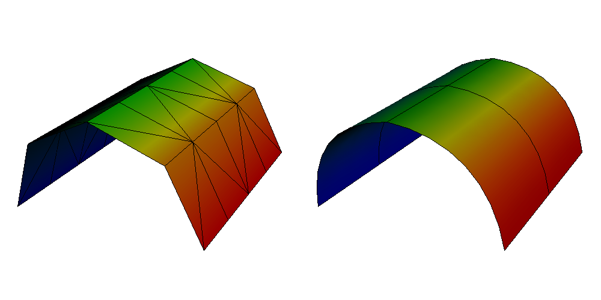
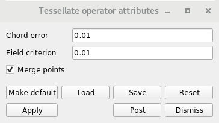

.. _Tessellate operator:

Tessellate operator
~~~~~~~~~~~~~~~~~~~

The Tessellate operator is an operator that tessellates high order elements
so that they appear curved.

.. _tessellate:

   Tessellate operator example

The Tessellate operator supports the following high order element types.

* QUADRATIC_EDGE
* CUBIC_LINE
* LAGRANGE_TRIANGLE
* QUADRATIC_TRIANGLE
* BIQUADRATIC_TRIANGLE
* LAGRANGE_QUADRILATERAL
* BIQUADRATIC_QUAD
* QUADRATIC_QUAD
* LAGRANGE_TETRAHEDRON
* QUATRADIC_TETRA
* LAGRANGE_HEXAHEDRON
* QUADRATIC_HEXAHEDRON

If the Tessellate operator encounters an unsupported element type it will
remove the element from the mesh.

Changing the tessellation accuracy
""""""""""""""""""""""""""""""""""

The tessalation accuracy is controlled by the **Chord error** and 
**Field criterion**. The **Chord error** is with respect to the curvature
of the element and is ratio of a chord to the distance from the curve and
is independent of the scale of the object. The default **Chord error** is
0.035, which will typically do a good job. The **Field criterion** is with
respect to the error in the field within the element. The default
**Field criterion** is also 0.035, which will also typically do a good job.
Reducing the **Chord error** and **Field criterion** will both improve the
discretization. They should only be decreased if necessary, since reducing
them will increase the number of elements a single high order element is
tessellated into. This in turn increases the memory usage and the time to
perform operations. The number of elements a single high order element
gets tessellated into may easily get into the hundreds.

.. _tessellatewindow:

   Tessellate attributes window

Merging the points
""""""""""""""""""

The points from the cells generated by the tessellation can either be
shared or not shared by cells. The default **Merge points** setting will
merge the points. Point merging typically only affects the appearance of
the Mesh plot. When points are merged, the mesh lines of individual
cells of the tessellation will be visible. When points are not merged,
the mesh lines of the high order element will typically only be visible.
