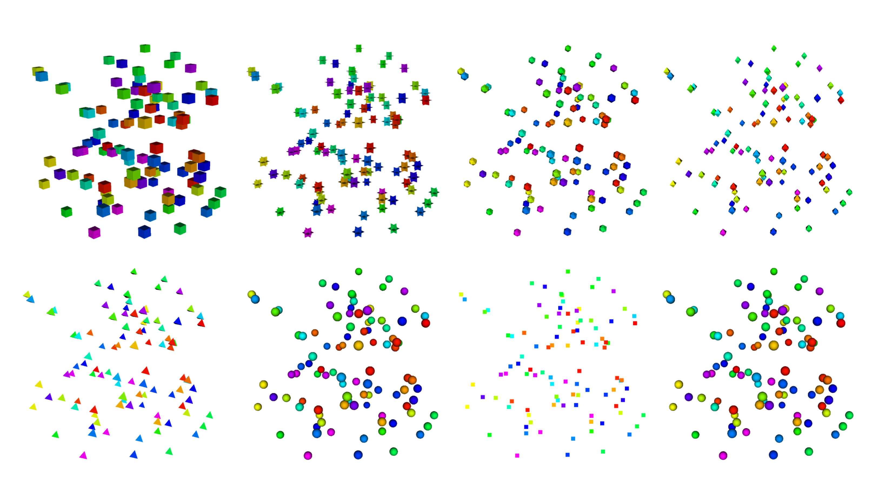

Common Controls
~~~~~~~~~~~~~~~

There are a number of attributes of plots that are common to
many, if not all plots. These include such things as **Color table**,
**Foreground** and **Background** colors, **Opacity**,
**Line style** and **Point type**, **Log** or **Linear** scaling,
the **Legend** checkbox and others. These common plot attributes
are described here first using the **Pseudocolor plot** as an example.

.. _pseudocolorwindow_1:

.. figure:: ../images/pseudocolorwindow.png

   Example of **Pseudocolor plot attribute window**

Then, attributes specific to each plot type are described in the
remaining sections.

Plot buttons
""""""""""""

All plot attribute windows have several buttons at the bottom for
common operations. Use the **Apply** after you have changed one or
more attributes of a plot to make the new settings take effect.
The **Make default** button is used to take the current settings
and make those the default for the remainder of the VisIt session.
Each time a new plot of that type is created, it will be created
with whatever the current defaults are for that plot. If you want
these settings to persist across VisIt sessions, you can either
**Save session**, and then restart from this saved session later,
or **Save settings** and then all VisIt sessions will use those
defaults. For more about saving sessions and settings, see
:ref:`How to Save Settings`. The **Save** and
**Load** buttons give you the option of saving and loading plot
attributes using their own separate XML. This allows users to
easily share individual plot attributes. The reset button will
return the plot's attributes to whatever the current defaults are.
The **Dismiss** button will dismiss the window. The **Post** 
button will place the window in the **Notepad area**
(see :ref:`Intro_Posting_a_window`).

Plot colors
"""""""""""

By default, VisIt uses the **Hot** color table which maps values at
the minimum of the data range to blues, values at the maximum of
the data range to reds with transitions from blue to violet, to
green, to yellow in between. However, many plots offer the option of
selecting a specific color table. In the picture of the
**Pseudocolor plot attributes** window, above, the color table may
be changed by selecting the currently named table. A pull-down list
will appear from which you can select a different table.
For more information about
**Color tables**, see :ref:`Color_tables`.

In addition, many plots have options to control colors and
transparency (opacity) of individual plot elements such as lines on
the **Mesh plot** or contours on the **Contour plot**.

Point type and size
"""""""""""""""""""

The Pseudocolor, Mesh and Scatter plots can use eight different point types
for drawing point meshes (see :numref:`Figure %s <glyphtypes>`). Each of these
plots will draw an object of the desired point type, scaled by the point size
for each point in a point mesh. Setting the point type to anything other than
**Point** will have no effect if the plotted mesh is not a point mesh.

.. _glyphtypes:

   Point types: Box, Axis, Icosahedron, Octahedron, Tetrahedron, Sphere Geometry, Point, Sphere

To set the point type choose a new point type from the **Point type** combo 
box. 

.. _pointtypecombo:

.. figure:: ../images/point_type_dropdown.png

   Point type combo box, expanded

The following table describes the shape associated with each point type
for 2D and 3D.

+------------------+------------------------+-----------------------+
| Point type       |  2D shape              | 3D Shape              |
|                  |                        |                       |
+==================+========================+=======================+
| Box              |  Square                | Cube                  |
|                  |                        |                       |
+------------------+------------------------+-----------------------+
| Axis             |  2 Axis aligned lines  | 3 Axis Aligned planes |
|                  |                        |                       |
+------------------+------------------------+-----------------------+
| Icosahedron      |  Dodecagon             | Icosahedron           |
|                  |                        |                       |
+------------------+------------------------+-----------------------+
| Octahedron       |  Diamond               | Octahedron            |
|                  |                        |                       |
+------------------+------------------------+-----------------------+
| Sphere Geometry  |  Dodecagon             | Sphere                |
|                  |                        |                       |
+------------------+------------------------+-----------------------+
| Point            |  Quadrilateral         | Quadrilateral         |
|                  |                        |                       |
+------------------+------------------------+-----------------------+
| Sphere           |  Quadrilateral         | Quadrilateral         |
|                  |  textured to look like | textured to look like |
|                  |  a sphere              | a sphere              |
+------------------+------------------------+-----------------------+

In general, setting the **Point type** to *Point* will cause the plot to 
have the fastest rendering performance.

To control how large the points appear, enter a new number into the 
**Point size**  text field. Larger point size values result in larger points 
in the visualization window. For *Point* type, the value is specified as
an integer representing pixels, for all others, the value is a floating point
value representing relative size in object space..

For Mesh and Pseudocolor plots, the point size can also be scaled by a scalar 
variable if you check the **Scale point size by variable** check box and
select a new scalar variable from the **Variable** button. The value ``default``
must be replaced with the name of another scalar variable if you want VisIt to
scale the points with a variable other than the one being plotted.

