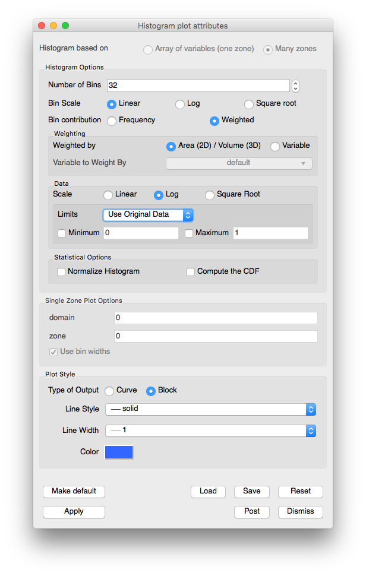

Histogram Plot
~~~~~~~~~~~~~~

The Histogram plot divides the data range of a scalar variable into a number
of bins and groups the variable's values, weighted by cell area or revolved
volume, into different bins. The values in each bin are then used to create
a bar graph or curve that represents the distribution of values throughout
the variable's data range. The Histogram plot can be used to determine where
data values cluster in the range of a scalar variable. The Histogram plot is
shown in :numref:`Figure %s <histogramplot>`.

.. _histogramplot:

.. figure:: ../images/histogramplot.png
   :height: 400px
   :width: 400px

   Histogram plot

Setting the histogram data range
""""""""""""""""""""""""""""""""

By default, the Histogram plot profiles a variables entire data range. If you
want to restrict the Histogram plot so it only takes a subset of a variable's
data range into consideration when assigning values to bins, you can set the
minimum and maximum values that will be considered by the Histogram plot. To
specify a data range, click the **Specify Range** check box and then type in
floating point numeric values into the **Minimum** and **Maximum** text fields
in the **Histogram plot attributes window**
(see :numref:`Figure %s <histogramwindow>`) before clicking its **Apply**
button. Once the data range is set, the Histogram plot will restrict the values
that it considers to the specified data range.

.. _histogramwindow:

   Histogram attributes

Setting the type of graph
"""""""""""""""""""""""""

The Histogram plot has two mode in which it can appear: curve and block. When the
Histogram plot is drawn as a curve, it looks like the Curve plot. When the
Histogram plot is drawn in block mode, it is drawn as a bar graph where each
bin is plotted along the X-axis and the height of each bar corresponds to the
number of values that were assigned to that bin. You can set change the
Histogram plot's appearance by clicking the **Curve** or **Block** radio buttons.

Setting the number of bins
""""""""""""""""""""""""""

The Histogram plot divides a variable's data range into a number of bins and
then counts the weighted values that fall within each bin. The bins and the
counted data are then used to create a graph that represents the distribution
of data within the variable's data range. As the Histogram plot uses more bins,
the graph of data distribution becomes more accurate. However, the graph can
also become rougher because as the number of bins increases, the likelihood
that no data values fall within a particular bin also increases. To set the
number of bins for the Histogram plot, type a new number of bins into the
**Number of Bins** text field and click the **Apply** button in the
**Histogram plot attributes window**.

Setting the histogram calculation method
""""""""""""""""""""""""""""""""""""""""

When the Histogram plot groups data values into bins, it weights the data value
by the surface area or revolved volume of the cell so contributions from
different sizes of cells are compared fairly. To change the calculation method
used to weight the cells, click on the **Area** radio button to make VisIt use
surface area or click on the **Revolved volume** radio button to make VisIt use
the revolved volume of a 2D cell as the weighting multiplier used to group cells
into the right bins.

Data scaling
""""""""""""

There are three radio buttons that controls how the data values are scaled. The three 
options are:

  - **Linear**: no scaling is applied. This is the default option. 
  - **Log**: the logarithms of all the scalars are binned.
  - **Square Root**: the square roots of all scalars are binned.

