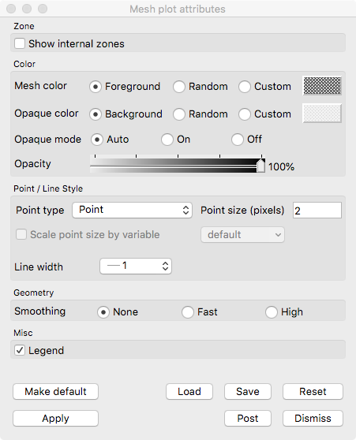

Mesh Plot
~~~~~~~~~

The Mesh plot, shown in :numref:`Figure %s <meshplot>`, displays the computational
mesh over which a database's variables are defined. The mesh plot is often
added to the visualization window when other plots are visualized to allow
individual cells to be clearly seen.

.. _meshplot:

   Mesh plot

.. _meshwindow:

   Mesh plot window

Mesh plot opaque modes
""""""""""""""""""""""

By default, VisIt's Mesh plot draws in opaque mode so that hidden surface
removal is performed when the plot is drawn and each face of the externally
visible cells are outlined with lines. When the Mesh plot's opaque mode is
set to automatic, the Mesh plot will be drawn in opaque mode unless it is
forced to share the visualization window with other plots, at which point
the Mesh plot is drawn in wireframe mode. When the Mesh plot is drawn in
wireframe mode, only the edges of each externally visible cell face are
drawn, which prevents the Mesh plot from interfering with the appearance of
other plots. In addition to having an automatic opaque mode, the Mesh plot
can be forced to be drawn in opaque mode or wireframe mode by clicking the
**On** or **Off** Radio buttons to the right of the **Opaque mode** label in the
**Mesh plot attributes window**.

Showing internal zones
""""""""""""""""""""""

Sometimes it is useful to create mesh plot that shows all internal zones for a
3D database. Rather then plotting just the externally visible zones, which is
the Mesh plot's default behavior, you can click the **Show internal zones**
check box to force the Mesh plot to draw the edges of every internal zone.

Changing the opaque color
"""""""""""""""""""""""""

An opaque Mesh plot uses the background color of the visualization window for
the Mesh plot faces. To set the opaque color to a color other than the
visualization window's background color, uncheck the **Use background**
check box and click on the **Opaque color** button and select a new color from
the **Popup color menu**.

Changing the mesh color
"""""""""""""""""""""""

The mesh color is the color used to draw the mesh lines. The mesh lines normally
use the visualization window's foreground color. To use a different color,
uncheck the **Use foreground** check box, click the **Mesh color** button, and
select a new color from the **Popup color menu**.

Changing mesh line attributes
"""""""""""""""""""""""""""""

The Mesh plot's mesh lines have two user-settable attributes that control their
width and line style. You can set the line width and line style are set by
selecting new options from the **Line style** or **Line width** menus at the top
of the **Mesh plot attributes window**.

Changing point type and size
""""""""""""""""""""""""""""

Controls for points are described in :ref:`plot_point_type_and_size`.

Geometry smoothing
""""""""""""""""""

Sometimes visualization operations such as material interface reconstruction can
alter mesh surfaces so they are pointy or distorted. The Mesh plot provides an
optional Geometry smoothing option to smooth out the mesh surfaces so they look
better when the mesh is visualized. Geometry smoothing is not done by default,
you must click the **Fast** or **High** radio buttons to enable it. The
**Fast** geometry smoothing setting smooths out the geometry a little while the
**High** setting works produces smoother surfaces.
