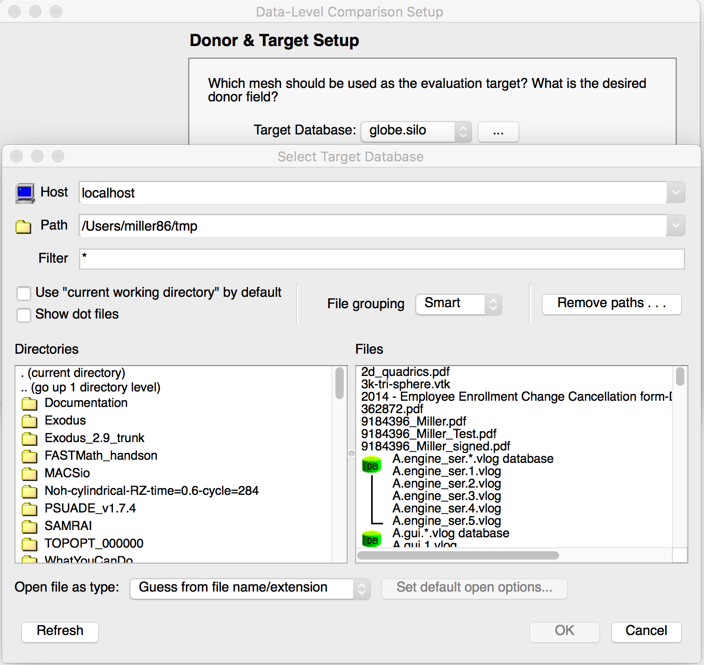
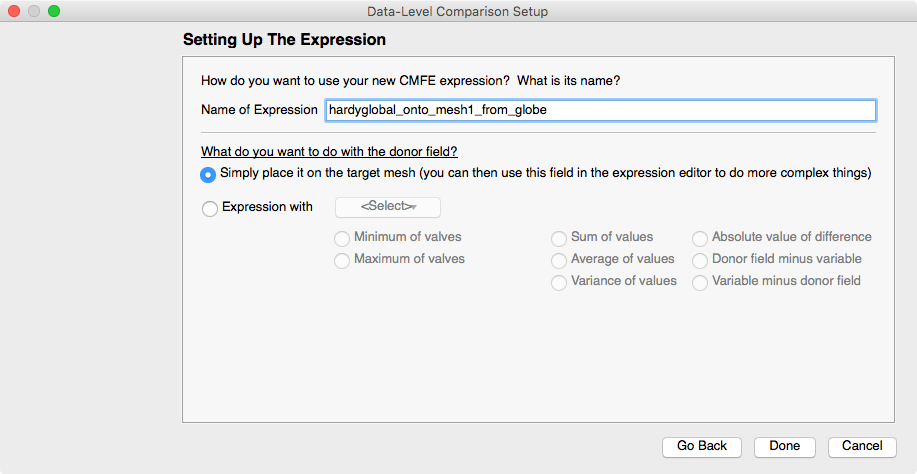

.. _DataLevelComparisonsWizard:

Data-Level Comparisons Wizard
-----------------------------
The data-level comparisons wizard facilitates creation of expressions that can
be used when comparing fields on different meshes and/or in different databases.
Such expressions are also known as
:ref:`Cross-Mesh Field Evaluation (CMFE) <Comparison_Expressions>`
expressions because they effectively take a field defined on one mesh and
*evaluate* it (e.g. map it) onto a new mesh. The data-level comparisons wizard
is a very helpful alternative to entering CMFE expressions directly into the
expression system manually.

These expressions involve the concepts of a *donor variable*
and a *target mesh*. The donor variable is the variable to be mapped onto a new
mesh. The target mesh is the mesh onto which the donor variable is to be mapped.
In addition, the term *donor mesh* refers to the mesh upon which the donor
variable is defined. Also, the target mesh is always interpreted as a mesh in
the currently *active* database. Data-level comparison expressions (CMFEs) are
always mapping data from *other* meshes, possibly in *other* databases onto a
target mesh which is understood to be in the currently *active* database.

To start the wizard, go to Controls->Data-Level Comparisons... as shown
in :numref:`Figure %s <dlc_1>`.

.. _dlc_1:

.. figure:: images/DataLevelComparisons0.png

   Starting the Data-Level Comparisons Wizard

This will open the the initial window where the user is asked to choose
between a few basic varieties of CMFE expressions. These differ in the
relative locations (e.g. which database) of the donor variable and target
mesh.

    #. Donor variable and target mesh are in the *same* database.
    #. Donor variable and target mesh are from different time states of the
       *same* database.
    #. Donor variable and target mesh are in wholly different databases.

**Note:** if you wish to create a CMFE that works properly across a time series
with wholly different databases (3rd case above),
the data-level comparisons wizard does not directly support that. However, you
can use wizard to construct an *initial* CMFE expression and then edit it manually
in the :ref:`Expression Window <expressionwindow>` to adjust it for a time series 
following the documentation on
:ref:`donor variable syntax <Pos_Cmfe_Donor_Variable_Synax>`.

.. _dlc_2:

   Selecting among varieties of CMFE expressions

If the user is unsure, selecting the last option is usually fine. There are
some simplifications and maybe some small performance optimizations in the
creation and evaluation of the expressions that can be made for the other cases.
But, VisIt_ will operate fine even if those are not chosen. In the description
that follows, we demonstrate only this selection but describe variations where
necessary.

After selecting the variety of CMFE expression to create,
the user is presented with the next wizard window to specify the
target mesh and donor variables to be used in the expression.

.. _dlc_3b:

   Setting up the target mesh and donor variables

The target mesh
selection will present the user with a pull-down list of currently opened
databases with the currently *active* database in the list selected. If another
database is desired, the user may either select it from among the pull-down list
of currently open databases or, if the database is not yet open, press the
ellipsis (3 dots) button next to the database selection list to open a file
browser and navigate to the desired database in the file system as shown in
:numref:`Figure %s <dlc_3c>`

.. _dlc_3c:

   Setting up the target mesh and donor variables

Once the database of the target mesh is specified, the target mesh within that
database is specified with the **Target Mesh:** pull down list.

A similar sequence of steps is followed for specifying the donor variable. The
example in :numref:`Figure %s <dlc_3d>` demonstrates the selection of a specific
donor variable from the donor database with the **Donor Variable:** pull down
list.

.. _dlc_3d:

   Selecting a specific variable from a database

Next, the user is presented with a window to specify the manner in which the
CMFE expression is to be evaluated. The choices are either *connectivity-based*
or *position-based*. A position-based CMFE is a more general evaluation at the
likely expense of lower performance. When in doubt, it is best to use this
option. Connectivity-based evaluation is applicable *only* when donor and
target meshes are one-for-one *both* topologically and geometrically. In this
case, VisIt_ can optimize the evaluation and avoid having to deal with cases
where the donor and target meshes do not wholly overlap.

.. _dlc_4:

   Selecting the mode of evaluation

For a position-based CMFE, the user is required to also specify what VisIt_
should do for those positions on the target mesh that do not overlap with the
mesh of the donor variable. The user can choose either a constant numerical
value (e.g. a *fill value*) or can specify a variable already defined on the 
target mesh. It is possible for the user to make a choice that either enhances
or inhibits one's ability to distinguish between values in the result that
come from the donor and values that come from the selected *fill* choice.
A common practice is to choose a constant value that is an extremum of the
donor variable's range. For example, if the donor variable has a maximum value
of 25.7, then selecting this as the constant to use for non-overlapping regions
in the CMFE has the benefit of not altering the variable's range but
then also being indistinguishable from real data. Another practice is to choose
a value that is easily distinguishable and later apply a threshold operator to
remove those portions of the result.

The final step in the wizard is to give the result variable a name and then
decide what to do with the result variable. In :numref:`Figure %s <dlc_5>`,
we have given the result variable the name *hardyglobal_onto_mesh1_from_globe*.

.. _dlc_5:

   Selecting result variable name and comparison method

Often, it is sufficient to have VisIt_ just compute the mapped variable and then
allow the user to use the result variable in other expressions. However, for
convenience, the wizard also offers a number of options common to the work of
*comparing* the mapped variable to another variable. This last window in the
wizard allows the user to select from among several common methods for comparing
the mapped variable to another variable on the target mesh. By selecting the
*Expression with* option, the user is then offered the ability to select a
variable already defined on the target mesh from the pull down list. Then,
the user can select from one of several common methods for comparing the two
variables. For example, the *Absolute value of difference* choice will have the
effect of creating a single expression that computes the difference in the
donor and selected variables and then take its absolute value.

At any point during the steps in the wizard, the user can hit the *Go Back* 
button to go back and make different choices. The user completes the wizard by
hitting the **Done** button. There is no way to *go back* after hitting the 
**Done** button. Upon completion of the wizard, a new expression is created
according to user's selections. This new expression can be edited in the
expression window, like any other expression as illustrated in
:numref:`Figure %s <dlc_6>`

.. _dlc_6:

   New can be manipulated in the Expression window

In addition, this new expression can be used in other expressions. Finally,
if for some reason the resulting expression is problematic, it can be deleted
from the Expression system and the Data-Level Comparisons wizard can be run
again to re-create it as desired.

.. _dlc_for_time_series:
