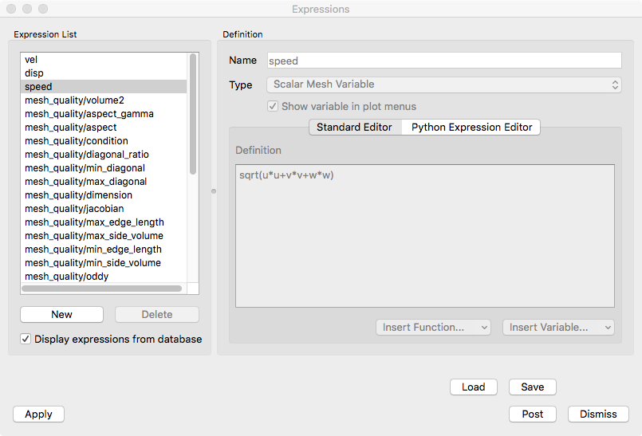

.. _Expressions:

Expressions
-----------

.. danger::
   Confirm the text here adequately characterizes that an expression has
   value everywhere over the whole mesh it is defined on. Its a field.

Scientific simulations often keep track of several dozen variables as they
run. However, only a small subset of those variables are usually written
to a simulation database to save disk space. Sometimes variables can be
derived from other variables using a variable expression. VisIt_ provides
variable expressions to allow scientists to create derived variables using
variables that are stored in the database. Expressions are extremely powerful
because they allow users to analyze new data without necessarily having to
rerun a simulation. Variables created using expressions behave just like
variables stored in a database; they appear in menus where database variables
appear and can be visualized like any other database variable.

Expression Window
~~~~~~~~~~~~~~~~~

VisIt_ provides an **Expression Window**, shown in
:numref:`Figure %s <expressionwindow>`, that allows users to create new
variables that can be used in visualizations. Users can open the
**Expression Window** by clicking on the **Expressions** option in the
**Main Window's Controls** menu. The **Expression Window** is divided
vertically into two main areas with the **Expression list** on the left
and the **Definition** area on the right.
The **Expression list** contains the list of expressions. The **Definition**
area displays the definition of the expression that is highlighted in
the **Expression list** and provides controls to edit the expression
definition.

.. _expressionwindow:

   Expression Window

Expressions in VisIt_ are created either manually by the user or automatically
by various means including...

* Preferences

  * Mesh quality expressions
  * Time derivative expressions
  * Vector magnitude expressions

* GUI wizards
* Operators
* Databases

By default, the **Expression list** will display only those expressions
created manually by the user. A check box near the bottom of the
**Expression list** controls the display of automatically created
expressions. When this box is checked, the **Expression list** will also
include expressions created automatically by **Preferences** and **Databases**
but not expressions created automatically by **GUI wizards** or **Operators**.

Creating a new expression
"""""""""""""""""""""""""

Users can create a new expression by clicking on the **Expression Window's New**
button. When the user clicks on the **New** button, VisIt_ adds a new expression
and shows its new, empty definition in the **Definitions** area. The initial
name for a new expression is *"unnamed"* followed by some integer suffix.
As the user types a new name for the expression into the **Name** text field,
the expression's name in the **Expression list** will update.

Each expression also has a **Type** that specifies the type of variable
the expression produces. The available types are:

* Scalar
* Vector
* Tensor
* Symmetric Tensor
* Array
* Curve

Users must be sure to select the appropriate type for any expression they
create. The selected type determines the menu in which the variable appears
and subsequently the plots that can operate on the variable.

To edit an expression's definition, users can type a new expression
comprised of constants, variable names, and even other VisIt_ expressions into
the **Definition** text field. The expression definition can span multiple
lines as the VisIt_ expression parser ignores whitespace. For a complete
list of VisIt_'s built-in expressions, refer to the table in section
:ref:`Built-in_expressions`. Users can also use the **Insert Function...**
menu, shown in :numref:`Figure %s <expressionwindow-functionmenu>`, to
insert any of VisIt_'s built-in expressions directly into the expression
definition. The list of built-in expressions is divided into certain
categories as shown by the structure of the **Insert Function...**
menu.

.. _expressionwindow-functionmenu:

   Expression Window's Insert Function... menu

In the example shown in :numref:`Figure %s <expressionwindow-functionmenu>`,
the **Insert Function...** operation inserted a sort of *template* for the
function giving some indication of the argument(s) to the function and their
meanings. Users can then simply edit those parts of the function template that
need to be specified.

In addition to the **Insert Function...** menu, which lets users insert built-in
functions into the expression definition, VisIt_'s **Expression Window**
provides an **Insert Variable...** menu that allows users to insert variables
from the active database into the expression definition. The
**Insert Variable...** menu, shown in
:numref:`Figure %s <expressionwindow-varmenu>`, is broken up into Scalars,
Vectors, Meshes, etc. and has the available variables under the appropriate
heading so they are easy to find.

.. _expressionwindow-varmenu:

.. figure:: images/expressionwindow-varmenu.png

   Expression Window's Insert Variable... menu

Some variables can only be expressed as very complex expressions containing
several intermediate subexpressions that are only used to simplify the
overall expression definition. These types of subexpressions are seldom
visualized on their own. If users want to prevent them from being added to
the **Plot** menu, turn off the **Show variable in plot menus** check box.

Deleting an expression
""""""""""""""""""""""

Users can delete an expression by clicking on it in the **Expression list**
and then clicking on the **Delete** button. Deleting an expression removes
it from the list of defined expressions and will cause unresolved references
for any other expressions that use the deleted expression. If a plot uses
an expression with unresolved references, VisIt_ will not be able to generate
it until the user resolves the reference.

Expression grammar
~~~~~~~~~~~~~~~~~~

VisIt_ allows expressions to be written using a host of unary and binary
math operators as well as built-in and user-defined functions. VisIt_'s
expressions follow C-language syntax, although there are a few differences.
The following paragraphs detail the syntax of VisIt_ expressions.

Math operators
""""""""""""""

These include use of +, -, \*, /, ^ as addition, subtraction, multiplication,
division, and exponentiation as infix operators, as well as the unary minus,
in their normal precedence and associativity. Parentheses may be used as
well to force a desired associativity.

*Examples: a+b^-c (a+b)*c*

Constants
"""""""""

Scalar constants include floating point numbers and integers, as well as
booleans (true, false, on, off) and strings.

*Examples: 3e4 10 "mauve" true false*

Vectors
"""""""

Expressions can be grouped into two or three dimensional vector variables
using curly braces.

*Examples: {xc, yc} {0,0,1}*

Lists
"""""

Lists are used to specify multiple items or ranges, using colons to create
ranges of integers, possibly with strides, or using comma-separated lists
of integers, integer ranges, floating points numbers, or strings.

*Examples: [1,3,2] [1:2, 10:20:5, 22] [silver, gold] [1.1, 2.5, 3.9] [level1, level2]*

Identifiers
"""""""""""

Identifiers include function names, defined variable and function names,
and file variable names. They may include alphabetic characters, numeric
characters, and underscores in any order. Identifiers should have at least
one non-numeric character so that they are not confused with integers, and
they should not look identical to floating point numbers such as 1e6.

*Examples: density x y z 3d_mesh*

Functions
"""""""""

These are used for built in functions, but they may also be used for
functions/macros defined by the user. They take specific types and numbers
of arguments within the parentheses, separated by commas. Some functions
may accept named arguments in the form identifier=value.

*Examples: sin(pi / 2) cross(vec1, {0,0,1}) my_xform(mesh1) subselect(materials=[a,b])*

Database variables
""""""""""""""""""

These are like identifiers, but may also include periods, plus, and minus
characters. A normal identifier will map to a file variable when it is not
defined as another expression. To force variables that look like integers
or floating point numbers to be interpreted as variable names, or to force
variable names which are defined by another expression to map to a variable
in a file, they should be enclosed with < and >, the left and right
carats/angle brackets. Note that quotation marks will cause them to be
interpreted as string constants, not variable names. In addition, variables
in files may be in directories within a file, so they may include slashes
in a path when in angle brackets.

*Examples: density <pressure> <a.001> <a.002> <domain1/density>*

Databases
"""""""""

A database specification looks similar to a database variable contained
in angle brackets, but it is followed by a colon before the closing angle
bracket, and it may also contain extra information. A database specification
includes a file specification possibly followed a machine name, a time
specification by itself, or a file/machine specification followed by a
time specification. A file specification is just a file name with a path
if needed. A machine specification is an at-sign @ followed by a host name.
A time specification looks much like a list in that it contains integer
numbers or ranges, or floating point numbers, separated by commas and
enclosed in square brackets. However, it may also be followed by a letter
c, t, or i to specify if the time specification refers to cycles, times,
or indices, respectively. If no letter is specified, then the parser
guesses that integers refer to cycles, floating point numbers refer to
times. There is also an alternative to force indices which is the pound
sign # after the opening square bracket.

*Examples: </dir/file:> <file@host.gov:> <[# 0:10]:> <file[1.234]:> <file[000, 023, 047]:> <file[10]c:>*

Qualified file variables
""""""""""""""""""""""""

Just like variables may be in directories within a file, they may also be
in other timesteps within the same database, within other databases, and
even within databases on other machines. To specify where a variable is
located, use the angle brackets again, and prefix the variable name with
a database specification, using the colon after the database specification
as a delimiter.

*Examples: <file:var> </dir/file:/domain/var> <file@192.168.1.1:/var> <[#0]:zerocyclevar>*

.. _Built-in_expressions:

Built-in expressions
~~~~~~~~~~~~~~~~~~~~

.. danger::
   Add examples for some of the more complicated cases.

The following table lists built-in expressions that can be used to create
more advanced expressions. Unless otherwise noted in the description, each
expression takes scalar variables as its arguments.

.. _Arithmetic_Operator_Expressions:

Arithmetic Operator Expressions (Math Expressions)
""""""""""""""""""""""""""""""""""""""""""""""""""

In binary arithmetic operator expressions, each operand must evaluate to
the same type field. For example, both must evaluate to a 
*scalar* field or both must evaluate to a *vector* field.

In addition, if the two expressions differ in centering (e.g. one is *zone*
or *cell* centered or *piecewise-constant* over mesh cells while the other is
*node* or *point* centered or *pieceiwse-linear* over mesh cells), VisIt_ will
*recenter* any :term:`node-centered` fields to *zone* centering to compute the
expression. This may not always be desirable. When it is not, the 
:ref:`recenter() <Recenter_Expression_Function>` may be used to explicitly
control the centering of specific operands in an expression.

.. _Sum_Expression_Operator:

Sum Operator (``+``) : ``exprL + exprR``
    Creates a new expression which is the sum of the ``exprL`` and ``exprR``
    expressions.
 
.. _Difference_Expression_Operator:

Difference Operator (``-``) : ``exprL - exprR``
    Creates a new expression which is the difference of the ``exprL`` and
    ``exprR`` expressions.

.. _Product_Expression_Operator:

Product Operator (``*``) : ``exprL * exprR``
    Creates a new expression which is the product of the ``exprL`` and
    ``exprR`` expressions.

.. _Division_Expression_Operator:

Division Operator (``/``) : ``exprL / exprR``
    Creates a new expression which is the quotient after dividing the ``exprL``
    expression by the ``exprR`` expression.

Division Operator : ``divide(val_numerator, val_denominator, [div_by_zero_value, tolerance])``
    Creates a new expression which is the quotient after dividing the
    ``val_numerator`` expression by the ``val_denominator`` expression. The
    ``div_by_zero_value`` is used wherever the ``val_denominator`` is within
    ``tolerance`` of zero.

.. _Exponent_Expression_Operator:

Exponent Operator (``^``) : ``exprL ^ exprR``
    Creates a new expression which is the product after multiplying the
    ``exprL`` expression by itself ``exprR`` times.

.. _Logical_AND_Expression_Operator:

Logical AND Operator (``&``) : ``exprL & exprR``
    Creates a new expression which is the logical *AND* of the ``exprL`` and 
    ``exprR`` expressions treating each value as a binary bit field. It is
    probably most useful for expressions involving integer data but can be
    applied to expressions involving any type.

.. _Associative_Expression_Operator:

Associative Operator (``()``) : ``( expr0 OP expr1 )``
    Parenthesis, *()* are used to explicitly group partial results of sub
    expressions and control evaluation order. 

    For example, the expression ``(a + b) / c`` first computes the sum, ``a+b``
    and then divides by ``c``.

.. _Absolute_Value_Expression_Function:

Absolute Value Function (``abs()``) : ``abs(expr0)``
    Creates a new expression which is everywhere the absolute value if its
    argument.

.. _Ceiling_Expression_Function:

Ceiling Function (``ceil()``) : ``ceil(expr0)``
    Creates a new expression which is everywhere the *ceiling* (smallest integer
    greater than or equal to) of its argument. 

.. _Exponent_Expression_Function:

Exponent Function (``exp()``) : ``exp(expr0)``
    Creates a new expression which is everywhere *e* (base of the natural
    logarithm) raised to the power of its argument.

.. _Floor_Expression_Function:

Floor Function (``floor()``) : ``floor(expr0)``
    Creates a new expression which is everywhere the *floor* (greatest integer
    less than or equal to) of its argument. 

.. _Natural_Logarithm_Expression_Function:

Natural Logarithm Function (``ln()``) : ``ln(expr0)``
    Creates a new expression which is everywhere the natural logarithm of its
    argument.

.. _Base10_Logarithm_Expression_Function:

Base 10 Logarithm Function (``log10()``) : ``log10(expr0)``
    Creates a new expression which is everywhere the base 10 logarithm of its
    argument.

.. _Max_Expression_Function:

Max Function (``max()``) : ``max(expr0, exrp1 [, ...])``
    Creates a new expression which is everywhere the maximum among all input
    variables.

.. _Min_Expression_Function:

Min Function (``min()``) : ``min(expr0, exrp1 [, ...])``
    Creates a new expression which is everywhere the minimum among all input
    variables.

.. _Modulo_Expression_Function:

Modulo Function (``mod()``) : ``mod(expr0,exrp1)``
    Creates a new expression which is everywhere the first argument, ``expr0``,
    modulo the second argument, ``expr1``.

.. _Random_Expression_Function:

Random Function (``random()``) : ``random(expr0)``
    Creates a new expression which is everywhere a random floating point number
    between 0 and 1, as computed by :math:`(\text{rand()} \% 1024) \div 1024`
    where ``rand()`` is the standard C library
    `rand() <http://www.cplusplus.com/reference/cstdlib/rand/>`_ random
    number generator. The argument, ``expr0``, must be a mesh variable. The seed
    used on each block of the mesh is the absolute domain number.

.. _Round_Expression_Function:

Round Function (``round()``) : ``round(expr0)``
    Creates a new expression which is everywhere the result of rounding
    its argument.

.. _Square_Expression_Function:

Square Function (``sqr()``) : ``sqr(expr0)``
    Creates a new expression which is everywhere the result of squaring
    its argument. 

.. _Square_Root_Expression_Function:

Square Root Function (``sqrt()``) : ``sqrt(expr0)``
    Creates a new expression which is everywhere the square root of
    its argument. 

Relational, Conditional and Logical Expressions
"""""""""""""""""""""""""""""""""""""""""""""""

The ``if()`` conditional expression is designed to be used in concert with
relation and logical expressions. Together, these expressions can be used to
build up more complex expressions in which very different evaluations are
performed depending on the outcome of other evaluations. For example, the
``if()`` conditional expression can be used together with one or more
relational expressions to create a new expression which evaluates to a
dot-product on part of a mesh and to the magnitude of a divergence operator
on another part of a mesh.

.. _If_Expression_Function:

If Function (``if()``) : ``if(exprCondition, exprTrue, exprFalse)``
    Creates a new expression which is equal to ``exprTrue`` wherever 
    the condition, ``exprCondition`` is non-zero and which is equal to
    ``exprFalse`` wherever ``exprCondition`` is zero.

    For example, the expression
    ``if(and(gt(pressure, 2.0), lt(pressure, 4.0)), pressure, 0.0)``
    combines the ``if`` expression with the ``gt`` and ``lt`` expressions
    to create a new expression that is equal to ``pressure`` wherever it is
    between 2.0 and 4.0 and 0 otherwise.

.. danger::
   Confirm relational and logical expressions produce new, boolean valued
   expression variables which are themselves plottable in VisIt_. Their
   original intent may have been only to be used as args in the IF expression
   and not so much be plottable outputs in their own right.

.. _Equal_Expression_Function:

Equal Function (``eq()``) : ``eq(exprL,exprR)``
    Creates a new expression which is everywhere a boolean value (1 or 0)
    indicating whether its two arguments are equal. A value of 1 is produced
    everywhere the arguments *are* equal and 0 otherwise.

.. _Greater_Than_Expression_Function:

Greater Than Function (``gt()``) : ``gt(exprL,exprR)``
    Creates a new expression which is everywhere a boolean value (1 or 0)
    indicating whether ``exprL`` is greater than ``exprR``. A value of 1
    is produced everywhere ``exprL`` is greater than ``exprR`` and 0
    otherwise.

.. _Greater_Than_or_Equal_Expression_Function:

Greater Than or Equal Function (``ge()``) : ``ge(exprL,exprR)``
    Creates a new expression which is everywhere a boolean value (1 or 0)
    indicating whether ``exprL`` is greater than or equal to ``exprR``.
    A value of 1 is produced everywhere ``exprL`` is greater than or equal to
    ``exprR`` and 0 otherwise.

.. _Less_Than_Expression_Function:

Less Than Function (``lt()``) : ``lt(exprL,exprR)``
    Creates a new expression which is everywhere a boolean value (1 or 0)
    indicating whether ``exprL`` is less than ``exprR``. A value of 1
    is produced everywhere ``exprL`` is less than ``exprR`` and 0 otherwise.

.. _Less_Than_or_Equal_Expression_Function:

Less Than or Equal Function (``le()``) : ``le(exprL,exprR)``
    Creates a new expression which is everywhere a boolean value (1 or 0)
    indicating whether ``exprL`` is less than or equal to ``exprR``. A value
    of 1 is produced everywhere ``exprL`` is less than or equal to ``exprR``
    and 0 otherwise.

.. _Not_Equal_Expression_Function:

Equal Function (``ne()``) : ``ne(exprL,exprR)``
    Creates a new expression which is everywhere a boolean value (1 or 0)
    indicating whether its two arguments are *not* equal. A value of 1
    is produced everywhere the arguments are *not* equal and 0 otherwise.
    
.. _Logical_And_Expression_Function:

Logical And Function (``and()``) : ``and(exprL,exprR)``
    Creates a new expression which is everywhere the logical *and* of its two
    arguments. Non-zero values are treated as true whereas zero values are
    treated as false.

.. _Logical_Or_Expression_Function:

Logical Or Function (``or()``) : ``or(exprL,exprR)``
    Creates a new expression which is everywhere the logical *or* of its two
    arguments. Non-zero values are treated as true whereas zero values are
    treated as false.

.. _Logical_Not_Expression_Function:

Logical Not Function (``not()``) : ``not(expr0)``
    Creates a new expression which is everywhere the logical *not* of its
    argument. Non-zero values are treated as true whereas zero values are
    treated as false.

Trigonometric Expressions
"""""""""""""""""""""""""

.. _Arc_Cosine_Expression_Function:

Arc Cosine Function (``acos()``) : ``acos(expr0)``
    Creates a new expression which is everywhere the arc cosine of its
    argument. The returned value is in *radians*.

.. _Arc_Sine_Expression_Function:

Arc Sine Function (``asin()``) : ``asin(expr0)``
    Creates a new expression which is everywhere the arc sine of its
    argument. The returned value is in *radians*.

.. _Arc_Tangent_Expression_Function:

Arc Tangent Function (``atan()``) : ``atan(expr0)``
    Creates a new expression which is everywhere the arc tangent of its
    argument. The returned value is in *radians*.

.. _Cosine_Expression_Function:

Cosine Function (``cos()``) : ``cos(expr0)``
    Creates a new expression which is everywhere the cosine of its
    argument. The argument is treated as in units of *radians*.

.. _Hyperbolic_Cosine_Expression_Function:

Hyperbolic Cosine Function (``cosh()``) : ``cosh(expr0)``
    Creates a new expression which is everywhere the hyperbolic cosine of its
    argument. The argument is the *hyperbolic angle*.

.. _Sine_Expression_Function:

Sine Function (``sin()``) : ``sin(expr0)``
    Creates a new expression which is everywhere the sine of its
    argument. The argument is treated as in units of *radians*.

.. _Hyperbolic_Sine_Expression_Function:

Hyperbolic Sine Function (``sinh()``) : ``sinh(expr0)``
    Creates a new expression which is everywhere the hyperbolic sine of its
    argument. The argument is the *hyperbolic angle*.

.. _Tangent_Expression_Function:

Tangent Function (``tan()``) : ``tan(expr0)``
    Creates a new expression which is everywhere the tangent of its
    argument. The argument is treated as in units of *radians*.

.. _Hyperbolic_Tangent_Expression_Function:

Hyperbolic Tangent Function (``tanh()``) : ``tanh(expr0)``
    Creates a new expression which is everywhere the hyperbolic tangent of its
    argument. The argument is the *hyperbolic angle*.

.. _Degree_To_Radians_Expression_Function:

Degrees To Radians Conversion Function (``deg2rad()``) : ``deg2rad(expr0)``
    Creates a new expression which is everywhere the conversion from degrees
    to radians of its argument. The argument should be a variable defined
    in units of degrees.

.. _Radians_To_Degrees_Expression_Function:

Radians To Degrees Conversion Function (``rad2deg()``) : ``rad2deg(expr0)``
    Creates a new expression which is everywhere the conversion from radians 
    to degrees of its argument. The argument should be a variable defined
    in units of radians.

Vector and Color Expressions
""""""""""""""""""""""""""""

.. _Vector_Compose_Expression_Operator:

Vector Compose Operator (``{}``) : ``{expr0, expr1, ... , exprN-1}``
    Curly braces, *{}* are used to create a new expression of higher tensor rank
    from 2 or more expression of lower tensor rank.  A common use is to compose 
    several tensor rank 0 expressions (e.g. scalar expressions) into a tensor
    rank 1 expression (e.g. a vector expression). The component expressions,
    ``expr0``, ``expr1``, etc.  must all be the same tensor rank and expression
    type. For example, they must all be rank 0 (e.g. *scalar* expressions) or
    they must all be rank 1 (e.g. *vector*) expressions of the same number of
    components. If they are all scalars, the result is a tensor of rank 1 (e.g.
    a vector). If they are all vectors, the result is a tensor of rank 2 (e.g.
    a tensor). The vector compose operator is also used to compose array
    expressions.

    For example, the expression ``{u, v, w}`` takes three scalar mesh variables
    named ``u``, ``v`` and ``w`` and creates a vector mesh variable.
    
.. _Vector_Component_Expression_Operator:

Vector Component Operator (``[]``) : ``expr[I]``
    Square brackets, *[]*, are used to create a new expression of lower tensor
    rank by extracting a component from an expression of higher tensor rank. 
    Components are indexed starting from 0. If ``expr``
    is a tensor of rank 2, the result will be a tensor of rank 1 (e.g. a
    vector). If ``expr`` is a tensor of rank 1, the result will be a tensor
    of rank 0 (e.g. a scalar). To obtain the ``J``-th component of the ``I``-th
    row of a tensor of rank 2, the expression would be ``expr[I][J]``

.. _Color_Expression_Function:

Color Function (``color()``) : ``color(exprR,exprG,exprB)``
    Creates a new, RGB *vector*, expression which defines a *color* vector where
    ``exprR`` defines the *red* component, ``exprG`` defines the *green*
    component and ``exprB`` defines the *blue* component of the color vector.
    The resulting expression is suitable for plotting with the
    :ref:`truecolor_plot`. The arguments are used to define color values in
    the range 0...255. Values outside that range are clamped. No normalization
    is performed. If the arguments have much smaller or larger range than
    [0...255], it may be appropriate to select a suitable multiplicative scale
    factor.

.. _Color4_Expression_Function:

Color4 Function (``color4()``) : ``color4(exprR,exprG,exprB,exprA)``
    See :ref:`color() <Color_Expression_Function>`. This function is similar to the
    ``color()`` function but also supports *alpha-transparency* as the
    fourth argument, again in the range 0...255.

.. _Colorlookup_Expression_Function:

Color lookup Function (``colorlookup()``) : ``colorlookup(expr0,tabname,scalmode,skewfac)``
    Creates a new *vector* expression that is the color that each value in
    ``expr0`` maps to. The ``tabname`` argument is the name of the color table.
    The ``expr0`` and ``tabname`` arguments are *required*. The ``scalmode``
    and ``skewfac`` arguments are optional. Possible values for ``scalmode`` are
    ``0`` (for *linear* scaling mode), ``1`` (for *log* scaling mode) and ``2``
    (for *skew* scaling mode). The ``skewfac`` argument is *required* only for
    a ``scalmode`` of ``2``.

.. _Cross_Product_Expression_Function:

Cross Product Function (``cross()``) : ``cross(exprV0,exprV1)``
    Creates a new *vector* expression which is the vector cross product created
    by crossing ``exprV0`` *into* ``exprv1``. Both arguments must be *vector*
    expression.

.. _Dot_Proeduct_Expression_Function:

Dot Product Function (``dot()``) : ``dot(exprV0,exprV1)``
    Creates a new *scalar* expression which is the vector dot product
    of ``exprV0`` with ``exprV1``.

.. _HSVColor_Expression_Function:

HSV Color Function (``hsvcolor()``) : ``hsvcolor(exprH,exprS,exprV)``
    See :ref:`color() <Color_Expression_Function>`. This function is similar to the
    ``color()`` function but takes *Hue*, *Saturation* and *Value* (Lightness)
    arguments as inputs and produces an RGB *vector* expression.

.. _Magnitude_Expression_Function:

Magnitude Function (``magnitude()``) : ``magnitude(exprV0)``
    Creates a new *scalar* expression which is everywhere the magnitude of the
    ``exprV0``.

.. _Normalize_Expression_Function:

Normalize Function (``normalize()``) : ``normalize(exprV0)``
    Creates a new *vector* expression which is everywhere a normalized vector
    (e.g. same direction but unit magnitude) of ``exprV0``.

.. _Curl_Expression_Function:

Curl Function: ``curl()`` : ``curl(expr0)``
     Creates a new *vector* expression which is everywhere the curl of
     its input argument, which must be vector valued. In a 3D context, the
     result is also a vector. However, in a 2D context the result *vector*
     would always be ``[0,0,V]`` so expression instead returns only the 
     *scalar* V.

.. _Divergence_Expression_Function:

Divergence Function: ``divergence()`` : ``divergence(expr0)``
    Creates a new *scalar* expression which is everywhere the divergence of
    its input argument, which must be vector valued.

.. _Gradient_Expression_Function:

Gradient Function: ``gradient()`` :  ``gradient(expr0)``
    Creates a new *vector* expression which is everywhere the gradient of its
    input argument, which must be *scalar*. The method of calculation varies
    depending on the type of mesh upon which the input is defined. See also
    :ref:`ij_gradient() <IJ_Gradient_Expression_Function>` and
    :ref:`ijk_gradient() <IJK_Gradient_Expression_Function>`.

.. _IJ_Gradient_Expression_Function:

IJ_Gradient Function: ``ij_gradient()`` :  ``ij_gradient(expr0)``
    No description available.

.. _IJK_Gradient_Expression_Function:

IJK_Gradient Function: ``ijk_gradient()`` :  ``ijk_gradient(expr0)``
    No description available.

.. _Surface_Normal_Expression_Function:

Surface Normal Function: ``surface_normal()`` :  ``surface_normal(expr0)``
    This function is an *alias* for
    :ref:`cell_surface_normal() <Cell_Surface_Normal_Expression_Function>`

.. _Point_Surface_Normal_Expression_Function:

Point Surface Normal Function: ``point_surface_normal()`` :  ``point_surface_normal(expr0)``
    Like :ref:`cell_surface_normal() <Cell_Surface_Normal_Expression_Function>`
    except that after computing face normals, they are averaged to the nodes. 

.. _Cell_Surface_Normal_Expression_Function:

Cell Surface Normal Function: ``cell_surface_normal()`` :  ``cell_surface_normal(<Mesh>)``
    Computes a *vector* variable which is the normal to a *surface*. The input
    argument is a *Mesh* variable. In addition, this function cannot be used
    in isolation. It must be used in combination the
    :ref:`external surface <ExternalSurface operator>`, *first*, and the
    :ref:`defer expression <DeferExpression operator>`, *second*, operators.
    
.. _Edge_Normal_Expression_Function:

Edge Normal Function: ``edge_normal()`` :  ``edge_normal(expr0)``
    No description available.

.. _Point_Edge_Normal_Expression_Function:

Point Edge Normal Function: ``point_edge_normal()`` :  ``point_edge_normal(expr0)``
    No description available.

.. _Cell_Edge_Normal_Expression_Function:

Cell Edge Normal Function: ``cell_edge_normal()`` :  ``cell_edge_normal(expr0)``
    No description available.

Tensor Expressions
""""""""""""""""""

.. _Contraction_Expression_Function:

Contraction Function: ``contraction()`` : ``contraction(expr0)``
    Creates a *scalar* expression which is everywhere the *contraction* of
    ``expr0`` which must be a *tensor* valued expression. The contraction is
    the sum of pairwise dot-products of each of the column vectors of the
    tensor with itself as shown in the code snip-it below.

.. container:: collapsible

    .. container:: header

        **Show/Hide Code for** ``contraction()``

    .. literalinclude:: ../../../../src/avt/Expressions/General/avtTensorContractionExpression.C
        :language: C++
        :start-after: For a rank 2 tensor, the contraction collapses to a scalar.
        :end-before: out->SetTuple(i, &ctract);

.. _Determinant_Expression_Function:

Determinant Function: ``determinant()`` : ``determinant(expr0)``
    Creates a *scalar* expression which is everywhere the
    `determinant <https://en.wikipedia.org/wiki/Determinant>`_ of
    ``expr0`` which must be *tensor* valued.

.. _Effective_Tensor_Expression_Function:

Effective Tensor Function: ``effective_tensor()`` : ``effective_tensor(expr0)``
    Creates a *scalar* expression which is everywhere the square root of three
    times the *second principal invariant of the stress deviator tenosr*,
    :math:`\sqrt{3*J_2}`, where :math:`J_2` is the *second principal invariant
    of the stress deviator tensor*. This is also known as the *von Mises stress*
    or the *Huber-Mises stress* or the *Mises effective stress*.

.. container:: collapsible

    .. container:: header

        **Show/Hide Code for** ``effective_tensor()``

    .. literalinclude:: ../../../../src/avt/Expressions/Derivations/avtEffectiveTensorExpression.C
        :language: C++
        :start-after: vals = in->GetTuple9(i);
        :end-before: out->SetTuple1(i, out2);

.. _Eigenvalue_Expression_Function:

Eigenvalue Function: ``eigenvalue()`` : ``eigenvalue(expr0)``
    The ``expr0`` argument must evaluate to a 3x3 *symmetric* tensor. The
    eigenvalue
    expression returns the eigenvalues of the 3x3 *symmetric* matrix argument
    as a vector valued expression where each eigenvalue is a component of
    the vector. Use the vector component operator,
    :ref:`[] <Vector_Component_Expression_Operator>`, to access individual
    eigenvalues. If a non-symmetric tensor is supplied, results are
    indeterminate.

.. _Eigenvector_Expression_Function:

Eigenvector Function: ``eigenvector()`` : ``eigenvector(expr0)``
    The ``expr0`` argument must evaluate to a 3x3 *symmetric* tensor. The
    eigenvector
    expression returns the eigenvectors of the 3x3 matrix argument as a tensor
    (3x3 matrix) valued expression where each column in the tensor is one of
    the eigenvectors.

    In order to use the vector component operator
    :ref:`[] <Vector_Component_Expression_Operator>`, to access individual
    eigenvectors, the result must be *transposed* with the
    :ref:`transpose() <Transpose_Expression_Function>`, expression function.

    For example, if
    ``evecs = transpose(eigenvector(tensor))``, the expression ``evecs[1]``
    will return the second eigenvector.

.. _Inverse_Expression_Function:

Inverse Function: ``inverse()`` : ``inverse(expr0)``
    Creates a new tensor expression which is everywhere the inverse of its
    input argument, which must also be a tensor.

.. _Principal_Deviatoric_Tensor_Expression_Function:

Principal Deviatoric Tensor Function: ``principal_deviatoric_tensor()`` : ``principal_deviatoric_tensor(expr0)``
    Deviatoric stress is the stress tensor which results after subtracting the
    `hydrostatic stress tensor <http://www.continuummechanics.org/hydrodeviatoricstress.html>`_.
    Hydrostatic stress is a *scalar* quantity also often referred to as
    *average pressure* or just *pressure*. However, it is often characterized in
    *tensor* form by multiplying it through a 3x3 identity matrix.

    The ``principal_deviatoric_tensor()`` expression function creates a new
    *vector* expression which is everywhere the principal components of the
    deviatoric stress tensor computed from the *symmetric* tensor argument
    ``expr0``. In other words, the *eigenvalues* of the deviatoric
    stress tensor.

    Potentially, it would be more appropriate to create a new *tensor* field
    here with all zeros for off-diagonal elements and the eigenvalues on the
    main diagonal.

    This expression can also be computed by using a combination of the ``trace()``
    and ``principal_tensor()`` expression functions. The ``trace()`` (divided by
    3) would be used to subtract out hydrostatic stress and the result could be
    used in the ``principal_tensor()`` expression to arrive at the same result.

.. container:: collapsible 

    .. container:: header

        **Show/Hide Code for** ``principal_deviatoric_tensor()``

    .. literalinclude:: ../../../../src/avt/Expressions/Derivations/avtPrincipalDeviatoricTensorExpression.C
        :language: C++
        :start-after: vals = in->GetTuple9(i);
        :end-before: out->SetTuple(i, out3);

.. _Principal_Tensor_Expression_Function:

Principal Tensor Function: ``principal_tensor()`` : ``principal_tensor(expr0)``
    Creates a new *vector* expression which is everywhere the 
    principal stress components of the input argument, which must a *symmetric*
    tensor. The principal stress components are the
    `eigenvalues of the stress tensor. <https://uclageo.com/CEE220/Section2.3.php>`_
    So, the vector expression computed here is the same as 
    :ref:`eigenvalue() <Eigenvalue_Expression_Function>`.

    Potentially, it would be more appropriate to create a new *tensor* field
    here with all zeros for off-diagonal elements and the eigenvalues on the
    main diagonal.

.. _Transpose_Expression_Function:

Transpose Function: ``transpose()`` : ``transpose(expr0)``
    Creates a new tensor expression which is everywhere the transpose of
    its input argument which must also be a tensor. The first row vector
    in the input becomes the first column vector in the output, etc.

.. _Tensor_Maximum_Shear_Expression_Function:

Tensor Maximum Shear Function: ``tensor_maximum_shear()`` : ``tensor_maximum_shear(expr0)``
    Creates a new *Scalar* expression which is everywhere the *maximum
    shear stress* as defined in *J.C. Ugural and S.K. Fenster "Advanced Strength
    and Applied Elasticity", Prentice Hall 4th Edition, page 81.* the specific
    mathematical operations of which are shown in the code snip-it below.

.. container:: collapsible

    .. container:: header

        **Show/Hide Code for** ``tensor_maximum_shear()``

    .. image:: images/tensor_max_shear_eqns.png

    .. literalinclude:: ../../../../src/avt/Expressions/Derivations/avtTensorMaximumShearExpression.C 
        :language: C++
        :start-after: 9 components of stress tensor
        :end-before: out->SetTuple1(i, (princ0 - princ2) * 0.5);

.. _Trace_Expression_Function:

Trace Function: ``trace()`` : ``trace(expr0)``
    Creates a new scalar expression which is everywhere the
    `trace <https://en.wikipedia.org/wiki/Trace_(linear_algebra)>`_
    of ``expr0`` which must be a 3x3 tensor. The trace is the sum of the
    diagonal elements.

.. _Viscous_Stress_Expression_Function:

Viscous Stress Function: ``viscous_stress()`` : ``viscous_stress(expr0)``
    Creates a new tensor expression which is everywhere the
    `viscous stress <https://en.wikipedia.org/wiki/Viscous_stress_tensor>`_.
    The key difference between *viscous* stress and *elastic* stress (which
    is the kind of stress many of the other functions here deal with) is
    that *viscous* stress is related to the *rate of change* of deformation
    whereas *elastic* stress is related to the *amount* of deformation.
    These two are related in the same way velocity and distance are related.

    The argument here, ``expr0`` is a *vector* valued velocity. In addition,
    the current implementation of this function works only for 2D, structured
    gridded meshes.

.. container:: collapsible

    .. container:: header

        **Show/Hide Code for** ``viscous_stress()``

    .. literalinclude:: ../../../../src/avt/Expressions/General/avtViscousStressExpression.C
        :language: C++
        :start-after: calculate the gradient

Array Expressions
"""""""""""""""""

.. _Array_Compose_Expression_Function:

Array Compose Function: ``array_compose()`` : ``array_compose(expr0, expr1, ..., exprN-1)``
    Create a new *array* expression variable which is everywhere the array
    composition of its arguments, which all must be *scalar* type.
    An array mesh variable is useful when using the label plot or when
    doing picks and wanting pick values to always return a certain selected
    set of mesh variables. But, all an array mesh variable really is is a
    convenient container to hold a group of individual scalar mesh variables.
    Each argument to the array_compose expression must evaluate to a scalar
    expression and all of the input expressions must have the same centering.
    Array variables are collections of scalar variables that are commonly used
    with certain plots to display the contents of multiple variables
    simultaneously. For example, the Label plot can display the values in an
    array variable.

.. _Array_Compose_With_Bins_Expression_Function:

Array Compose With Bins Function: ``array_compose_with_bins()`` : ``array_compose_with_bins(expr0,...,exprN-1,b0,...bn-1 )``
    This expression combines two related concepts. One is the array concept
    where a group of individual scalar mesh variables are grouped into an array
    variable. The other is a set of coordinate values (you can kinda think of
    as bin boundaries), that should be used by VisIt_ for certain kinds of
    operations involving the array variable. If there are N variables in the
    array, ``expr0``, ``expr1``, and so on, there are N+1 coordinate values
    (or bin boundaries), ``b0``, ``b1``. When such a variable is picked using
    one of VisIt_'s pick operations, VisIt_ can display a bar-graph. Each bar in
    the bar-graph has a height determined by the associated scalar mesh variable
    (at the picked point) and a width determined by the associated
    bin-boundaries.

    For example, suppose a user had an array variable, foo, composed of 5 scalar
    mesh variables, ``a1``, ``a2``, ``a3``, ``a4``, and ``a5`` like so...

    ``array_compose_with_bins(a1,a2,a3,a4,a5,0,3.5,10.1,10.7,12,22)``

    For any given point on a plot, when the user picked foo, there are 5 values
    returned, the value of each of the 5 scalar variable members of foo. If the
    user arranged for a pick to return a bar-graph of the variable using the
    bin-boundaries, the result might look like…

.. _Array_compose_with_bins:

   Bar graph created from picking an array variable created with array_compose_with_bins()

.. _Array_Decompose_Expression_Function:

Array Decompose Function: ``array_decompose()`` : ``array_decompose(Arr,Idx)``
    Creates a new *scalar* expression which is everywhere the scalar member of
    the *array* input argument at index ``Idx`` (numbered starting from zero).

.. _Array_Decompose2d_Expression_Function:

Array Decompose 2D Function: ``array_decompose2d()`` : ``array_decompose2d(expr0)``
    No description available.

.. _Array_Componentwise_Division_Expression_Function:

Array Component-wise Division Function: ``array_componentwise_division()`` : ``array_componentwise_division(<Array>,<Divisor>)``
    Return a new *array* variable which is the old input ``<Array>`` variable
    with each of its components divided by the ``<Divisor>``.

.. _Array_Componentwise_Product_Expression_Function:

Array Component-wise Product Function: ``array_componentwise_product()`` : ``array_componentwise_product(<Array>,<Multiplier>)``
    Return a new *array* variable which is the old input ``<Array>`` variable
    with each of its components multiplied by the ``<Multiplier>``.

.. _Array_Sum_Expression_Function:

Array Sum Function: ``array_sum()`` : ``array_sum(<Array>)``
    Return a new *scalar* variable which is the sum of the ``<Array>`` components.

Material Expressions
""""""""""""""""""""

.. _Dominant_Mat_Expression_Function:

Dominant Material Function: ``dominant_mat()`` : ``domimant_mat(<Mesh>)``
    Creates a new scalar expression which is for every mesh cell/zone the
    material having the largest volume fraction.

.. _Materror_Expression_Function:

Material Error Function: ``materror()`` : ``materror(<Mat>,[Const,Const...])``
    Creates a new scalar expression which is everywhere the difference in
    volume fractions as stored in the database and as computed by VisIt_'s
    material interface reconstruction (MIR) algorithm. The ``<Mat>`` argument
    is a *material variable* from a database and the ``Const`` argument is
    one of the material names as an quoted string or a material number
    as an integer. If multiple materials are to be selected from the 
    *material variable*, enclose them in square brackets as a list.

    Examples...

::

    materror(materials, 1)
    materror(materials, [1,3])
    materror(materials, "copper")
    materror(materials, ["copper", "steel"])

.. _Matvf_Expression_Function:

Material Volume Fractions Function: ``matvf()`` : ``matvf(<Mat>,[Const,Const,...])``
    Creates a new scalar expression which is everywhere the sum of the volume
    fraction of the specified materials within the specified material variable.
    The ``<Mat>`` argument is a *material variable* from a database and
    the ``Const`` argument(s) identify one or more materials within the
    *material variable*. 
    
    Examples...

::

    matvf(materials, 1)
    matvf(materials, [1,3])
    matvf(materials, "copper")
    matvf(materials, ["copper", "steel"])

.. _NMats_Expression_Function:

NMats Function: ``nmats()`` : ``nmats(<Mat>)``
    Creates a new scalar expression which for each mesh cell/zone is the number
    of materials in the cell/zone. The ``<Mat>`` argument is a
    *material variable* from a database.
    
.. _Specmf_Expression_Function:

Specmf Function: ``specmf()`` : ``specmf(<Spec>,<MConst>,[Const,Const,...])``
    Performs the analogous operation to ``matvf`` for species mass fractions.
    The ``<Spec>`` argument is a *species variable* from a database. The
    ``<MConst>`` argument is a specific material within the *species variable*.
    The ``<Const>`` argument(s) identify which species within the
    *species variable* to select.

    Examples:

::

    specmf(species, 1, 1)
    specmf(species, "copper", 1)
    specmf(species, "copper", [1,3])

.. _Value_For_Material_Expression_Function:

Value For Material Function: ``value_for_material()`` : ``value_for_material(<Var>,<Const>)``
    Creates a new scalar expression which is everywhere the material-specific
    value of the variable specified by ``<Var>`` for the material specified by
    ``<Const>``. If variable specified by ``<Var>`` has no material specific
    values, the values returned from this function will be just the variable's
    values.

Mesh Expressions
""""""""""""""""

.. _Area_Function:

Area Function: ``area()`` : ``area(<Mesh>)``
    See the Verdict Manual

.. _Cylindrical_Expression_Function:

cylindrical Function: ``cylindrical()`` : ``cylindrical(<Mesh>)``
    Creates a new vector variable on the mesh which is the cylindrical coordinate
    tuple (R,theta,Z) of each mesh node.

.. _Cylindrical_Radius_Expression_Function:

Cylindrical Radius : ``cylindrical_radius(<Mesh>)``
    Creates a scalar new variable on the mesh which is the radius component of the
    cylindrical coordinate (from the Z axis) of each mesh node.

.. _Cylindrical_Theta_Expression_Function:

cylindrical theta Function: ``cylindrical_theta()`` : ``cylindrical_theta(<Mesh>)``
    Creates a new scalar variable on the mesh which is the angle component of the
    cylindrical coordinate (around the Z axis from the +X axis) of each mesh node.

.. _Polar_Radius_Expression_Function:

polar radius Function: ``polar_radius()`` : ``polar_radius(<Mesh>)``
    Creates a new scalar variable on the mesh which is the radius component of
    the polar coordinate of each mesh node.

.. _Polar_Theta_Expression_Function:

polar theta Function: ``polar_theta()`` : ``polar_theta(<Mesh>)``
    Creates a new scalar variable on the mesh which is the theta component of
    the polar coordinate of each mesh node.

.. _Polar_Phi_Expression_Function:

polar phi Function: ``polar_phi()`` : ``polar_phi(<Mesh>)``
    Creates a new scalar variable on the mesh which is the phi component of
    the polar coordinate of each mesh node.

.. _Min_Coord_Expression_Function:

min coord Function: ``min_coord()`` : ``min_coord(expr0)``
    No description available.

.. _Max_Coord_Expression_Function:

max coord Function: ``max_coord()`` : ``max_coord(expr0)``
    No description available.

.. _External_Node_Expression_Function:

external node Function: ``external_node()`` : ``external_node(expr0)``
    No description available.

.. _External_Cell_Expression_Function:

external cell Function: ``external_cell()`` : ``external_cell(expr0)``
    No description available.

.. _Zoneid_Expression_Function:

Zoneid Function: ``zoneid()`` : ``zoneid(<Mesh>)``
    Return a :term:`zone-centered` *scalar* variable where the value for each
    zone/cell is local index of a zone, staring from zero, within its domain.

.. _Global_Zoneid_Expression_Function:

Global Zoneid Function: ``global_zoneid()`` : ``global_zoneid(<Mesh>)``
    If global zone ids are specified by the input database, return a
    :term:`zone-centered` *scalar* variable where the value for each zone/cell
    is the *global* index of a zone, as specified by the data producer.

.. _Nodeid_Expression_Function:

Nodeid Function: ``nodeid()`` : ``nodeid(expr0)``
    Return a :term:`node-centered` *scalar* variable where the value for each
    node/vertex/point is local index of a node, staring from zero, within
    its domain.

.. _Global_Nodeid_Expression_Function:

Global Nodeid Function: ``global_nodeid()`` : ``global_nodeid(expr0)``
    If global node ids are specified by the input database, return a
    :term:`node-centered` *scalar* variable where the value for each
    node/vertex/point is the *global* index of a node, as specified by
    the data producer.

.. _Volume_Function:

Volume Function: ``volume()`` : ``volume(<Mesh>)``
    No description available.

.. _Volume2_Function:

Volume2 Function: ``volume2()`` : ``volume2(<Mesh>)``
    No description available.

.. _Revolved_Volume_Function:

Revolved Volume Function: ``revolved_volume()`` : ``revolved_volume(<Mesh>)``
    No description available.

.. _Revolved_Surface_Area_Function:

Revolved Surface Area Function: ``revolved_surface_area()`` : ``revolved_surface_area(<Mesh>)``
    No description available.

.. _Zonetype_Expression_Function:

Zone Type Function: ``zonetype()`` : ``zonetype(<Mesh>)``
    Return a *zone* centered, character valued variable which indicates
    the *shape type* of each zone suitable for being used within the
    *label* plot. Upper case characters generally denote 3D shapes
    (e.g. ``T`` for ``tet``) while lower case characters denote 2D shapes
    (e.g. ``t`` for ``triangle``).

.. _Zonetype_Rank_Expression_Function:

Zone Type Rank Function: ``zonetype_rank()`` : ``zonetype_rank(<Mesh>)``
    Return a *zone* centered, integer valued variable which indicates
    the *VTK shape type* of each zone. This expression is often useful
    with the threshold operator to select only certain shapes within
    the mesh to be displayed.

Mesh Quality Expressions
""""""""""""""""""""""""

VisIt_ employs the *Verdict Mesh Quality Library* to support a number of
expressions related to computing cell-by-cell mesh quality metrics. The
specific definitions of the various mesh quality metrics defined by the
*Verdict Mesh Quality Library* are amply explained in the
:download:`Verdict Manual <./VerdictManual-revA.pdf>`. Below, we
simply list all the mesh quality metrics and describe in detail only
those that are not part of the *Verdict Mesh Quality Library*

In all cases in the **Mesh Quality Expressions**, the input argument is
a *mesh variable* from a database and the output is a *scalar* expression.

.. _Neighbor_Function:

Neighbor Function: ``neighbor()`` : ``neighbor(<Mesh>)``
    See the Verdict Manual

.. _Node_Degree_Function:

Node Degree Function: ``node_degree()`` : ``node_degree(<Mesh>)``
    See the Verdict Manual

.. _Degree_Expression_Function:

degree Function: ``degree()`` : ``degree(expr0)``
    No description available.

.. _Aspect_Function:

Aspect Function: ``aspect()`` : ``aspect(<Mesh>)``
    See the Verdict Manual

.. _Skew_Function:

Skew Function: ``skew()`` : ``skew(<Mesh>)``
    See the Verdict Manual

.. _Taper_Function:

Taper Function: ``taper()`` : ``taper(<Mesh>)``
    See the Verdict Manual

.. _Min_Corner_Angle_Function:

Minimum Corner Angle Function: ``min_corner_angle()`` : ``min_corner_angle(<Mesh>)``
    See the Verdict Manual

.. _Max_Corner_Angle_Function:

Maximum Corner Angle Function: ``max_corner_angle()`` : ``max_corner_angle(<Mesh>)``
    See the Verdict Manual

.. _Min_Edge_Length_Function:

Minimum Edge Length Function: ``min_edge_length()`` : ``min_edge_length(<Mesh>)``
    See the Verdict Manual

.. _Max_Edge_Length_Function:

Maximum Edge Length Function: ``max_edge_length()`` : ``max_edge_length(<Mesh>)``
    See the Verdict Manual

.. _Min_Side_Volume_Function:

Minimum Side Volume Function: ``min_side_volume()`` : ``min_side_volume(<Mesh>)``
    See the Verdict Manual

.. _Max_Side_Volume_Function:

Maximum Side Volume Function: ``max_side_volume()`` : ``max_side_volume(<Mesh>)``
    See the Verdict Manual

.. _Stretch_Function:

Stretch Function: ``stretch()`` : ``stretch(<Mesh>)``
    See the Verdict Manual

.. _Diagonal_Ratio_Function:

Diagonal Ratio Function: ``diagonal_ratio()`` : ``diagonal_ratio(<Mesh>)``
    See the Verdict Manual

.. _Max_Diagonal_Function:

Maximum Diagonal Function: ``max_diagonal()`` : ``max_diagonal(<Mesh>)``
    See the Verdict Manual

.. _Min_Diagonal_Function:

Minimum Diagonal Function: ``min_diagonal()`` : ``min_diagonal(<Mesh>)``
    See the Verdict Manual

.. _Dimension_Function:

Dimension Function: ``dimension()`` : ``dimension(<Mesh>)``
    See the Verdict Manual

.. _Oddy_Function:

Oddy Function: ``oddy()`` : ``oddy(<Mesh>)``
    See the Verdict Manual

.. _Condition_Function:

Condition Function: ``condition()`` : ``condition(<Mesh>)``
    See the Verdict Manual

.. _Jacobian_Function:

Jacobian Function: ``jacobian()`` : ``jacobian(<Mesh>)``
    See the Verdict Manual

.. _Scaled_Jacobian_Function:

Scaled Jacobian Function: ``scaled_jacobian()`` : ``scaled_jacobian(<Mesh>)``
    See the Verdict Manual

.. _Shear_Function:

Shear Function: ``shear()`` : ``shear(<Mesh>)``
    See the Verdict Manual

.. _Shape_Function:

Shape Function: ``shape()`` : ``shape(<Mesh>)``
    See the Verdict Manual

.. _Relative_Size_Function:

Relative Size Function: ``relative_size()`` : ``relative_size(<Mesh>)``
    See the Verdict Manual

.. _Shape_And_Size_Function:

Shape and Size Function: ``shape_and_size()`` : ``shape_and_size(<Mesh>)``
    See the Verdict Manual

.. _Aspect_Gamma_Function:

Aspect Gamma Function: ``aspect_gamma()`` : ``aspect_gamma(<Mesh>)``
    See the Verdict Manual

.. _Warpage_Function:

Warpage Function: ``warpage()`` : ``warpage(<Mesh>)``
    See the Verdict Manual

.. _Maximum_Angle_Function:

Maximum Angle Function: ``maximum_angle()`` : ``maximum_angle(<Mesh>)``
    See the Verdict Manual

.. _Minimum_Angle_Function:

Minimum Angle Function: ``minimum_angle()`` : ``minimum_angle(<Mesh>)``
    See the Verdict Manual

.. _Min_Corner_Area_Function:

Minimum Corner Area Function: ``min_corner_area()`` : ``min_corner_area(<Mesh>)``
    See the Verdict Manual

.. _Min_Sin_Corner_Function:

Minimum Sin Corner Function: ``min_sin_corner()`` : ``min_sin_corner(<Mesh>)``
    See the Verdict Manual

.. _Min_Sin_Corner_Cw_Function:

Minimum Sin Corner CW Function: ``min_sin_corner_cw()`` : ``min_sin_corner_cw(<Mesh>)``
    See the Verdict Manual

.. _Face_Planarity_Function:

Face Planarity Function: ``face_planarity()`` : ``face_planarity(<Mesh>)``
    Creates a new expression which is everywhere a measure of how close to
    *planar* all the points comprising a face are. This is computed for
    each face of a cell and the maximum over all faces is selected for each
    cell. Planarity is measured as the maximum distance from an arbitrary plane
    defined by the first 3 points of a face of the remaining points of the face.
    Values closer to zero are *better*. A triangle face will always have a
    planarity measure of zero. This mesh quality expression is not part of
    the Verdict library. 

.. _Relative_Face_Planarity_Function:

Relative Face Planarity Function: ``relative_face_planarity()`` : ``relative_face_planarity(<Mesh>)``
    Performs the same computation as the
    :ref:`face_planarity() <Face_Planarity_Function>`, except where each
    face's value is normalized by the average edge length of the face.

.. _Comparison_Expressions:

Comparison Expressions
""""""""""""""""""""""
Comparing variables defined on the *same* mesh is often as simple as taking
their difference. What about comparing variables when they are defined on
different meshes? A common example is taking the difference between results
from two runs of the same simulation application. Even if the two runs operate
on computationally *identical* meshes, the fact that each run involves its own
*instance* of that mesh means that as far as VisIt_ is concerned, they are
different meshes.

In order to compose an expression involving variables on different meshes, the
*first* step is to *map* the variables onto a *common* mesh. The position-based
CMFE function and its friend, the connectivity-based CMFE function,
:ref:`conn_cmfe() <Conn_Cmfe_Expression_Function>` are the work-horse methods
needed when working with variables from *different* meshes in the *same*
expression. *CMFE* is an abbreviation for *cross-mesh field evaluation*.

The syntax for specifying CMFE expressions can be complicated. Therefore, the
GUI supports a *wizard* to help create them. See the
:ref:`Data-Level Comparisons Wizard <DataLevelComparisonsWizard>` for more
information. Here, we describe the details of creating CMFE expressions
manually.

All of the comparison expressions involve the concepts of a *donor variable*
and a *target mesh*. The donor variable (e.g. *pressure*) is the variable to
be mapped. The target mesh is the mesh onto which the donor variable is to be
mapped. In addition, the term *donor mesh* refers to the mesh upon which the
donor variable is defined.

.. _Pos_Cmfe_Expression_Function:

Position-Based CMFE Function: ``pos_cmfe()`` : ``pos_cmfe(<Donor Variable>,<Target Mesh>,<Fill>)``
   The ``pos_cmfe()`` function performs the mapping assuming the two meshes,
   that is the ``<Target Mesh>`` and the mesh upon which the
   ``<Donor Variable>`` (e.g. the *donor mesh*) is defined, share *only* a
   common spatial (positional) extent. Its friend, the
   :ref:`conn_cmfe() <Conn_Cmfe_Expression_Function>`
   function is *optimized* to perform the mapping when the two meshes are also
   *topologically identical*. In other words, their *coordinate* **and**
   *connectivity* arrays are 1:1. In this case, the mapping can be performed
   with more efficiency and numerical accuracy. Therefore, when it is possible
   and makes sense to do so, it is always best to use ``conn_cmfe()``.

   We'll describe the arguments to ``pos_cmfe()`` working backwards from the
   last.

   The last, ``<Fill>`` argument is a numerical constant that VisIt_
   will use to determine the value of the result in places on the target
   mesh that do not spatially overlap with the mesh of the donor variable. Note
   that if a value is chosen within the range of the donor variable, it may
   by difficult to distinguish regions VisIt_ deemed were non-overlapping.
   On the other hand, if a value outside the range is chosen, it will effect
   the range of the mapped variable. A common practice is to choose a value that
   is an extremum of the donor variable's range. Another practice is to
   choose a value that is easily distinguishable and then apply a threshold
   operator to remove those portions of the result. If the ``Fill`` argument
   is not specified, zero is assumed.

   Working backwards, the next argument, is the ``<Target Mesh>``.
   The ``<Target Mesh>`` argument in ``pos_cmfe()`` is always
   interpreted as a mesh *within* the currently *active* database. The CMFE
   expressions are always mapping data from *other* meshes, possibly in *other*
   databases onto the ``<Target Mesh>`` which is understood to be in the
   currently *active* database. When mapping data between meshes
   *in different databases*, the additional information necessary to specify
   the other database is encoded with a special syntax prepending the
   ``Donor Variable`` argument.

.. _Pos_Cmfe_Donor_Variable_Synax:

   The ``Donor Variable`` argument is a string argument of the form::

    <PATH-TO-DATABASE-FROM-CWD[SSS]MM:VARNAME>

   consisting of the donor variable's name and up to three pre-pending
   sub-strings which may be optionally needed to specify...

       #. ...the *Database* (``PATH-TO-DATABASE-FROM-CWD``) in which the donor variable resides,
       #. ...the *State Id* (``[SSS]``) from which to take the donor variable,
       #. ...the *Modality* (``MM``) by which states are identified in the *State Id*
          sub-string.

   Depending on circumstances, specifying the ``Donor-Variable`` argument to
   the CMFE functions can get cumbersome. For this reason, CMFE expressions
   are typically created using the
   :ref:`Data-Level Comparisons Wizard <DataLevelComparisonsWizard>`
   under the *Controls* menu. Nonetheless, here we describe the syntax and
   provide examples for a number of cases of increasing complexity in specifying
   where the ``Donor Variable`` resides.

   When the donor variable is in the same database and state as the target mesh,
   then only the variable's name is needed. The optional substrings are not.
   See case A in the examples below.

   When the donor variable is in a different database **and** the databases
   do not have multiple time states, then only sub-string 1, above, is
   needed to specify the path to the database in the file system. The path
   to the database can be specified using either *absolute* or *relative*
   paths. *Relative* paths are interpreted relative to the current working
   directory in which the VisIt_ session was started. See cases B and C
   in the examples below.

   When the donor variable is in a different database **and** the databases
   have multiple states, then all 3 sub-strings, above, are required. The
   ``State Id`` substring is a square-bracket enclosed number used to identify
   *which state* from which to take the donor variable. The ``Modality``
   substring is a one- or two-character moniker. The first character indicates
   whether the number in the the ``State Id`` substring is a cycle (``c``),
   a time (``t``), or an index (``i``). The second character, if present, is a
   ``d`` character to indicate the cycle, time or index is *relative* (e.g. a
   *delta*) to the current state. For example, the substring ``[200]c`` means to
   treat the ``200`` as a *cycle* number in the donor database whereas the
   the substring ``[-10]id`` means to treat the ``-10`` as an (``i``) index
   (``d``) delta. So, ``[200]c`` would map the *donor* at cycle 200
   to the *current* cycle of the *target* and ``[-10]id`` would map the
   *donor* at the current *index minus 10* to the *current* index of the *target*.
   In particular, the string ``[0]id`` is needed to create a CMFE that keeps
   *donor* and *target* in lock step. Note that in cases where the donor database
   does not have an exact match for the specified cycle or time, VisIt_ will chose
   the state with the cycle or time which is closest in absolute distance. For the
   *index* modality, if there is no exact match for the specified index, an error
   results. See cases D-I in the examples below.

   Note that the *relative* form of specifying the *State Id* is needed even
   when working with different states *within the same database*. In particular,
   to create an expression representing a *time derivative* of a variable in
   a database, the key insight is to realize it involves mapping a donor
   variable from one state in the database onto a mesh at another state. In
   addition, the value in using the *relative* form of specifying the
   ``State Id`` of the donor variable is that as the current time is changed,
   the expression properly identifies the different states of the donor
   variable instead of always mapping a fixed state.

   Examples...
   
::

    # Case A: Donor variable, "pressure" in same database as mesh, "ucdmesh"
    # Note that due to a limitation in Expression parsing, the '[0]id:' is
    # currently required in the donor variable name as a substitute for 
    # specifying a file system path to a database file. The syntax '[0]id:'
    # means a state index delta of zero within the active database.
    pos_cmfe(<[0]id:pressure>,<ucdmesh>,1e+15)

    # Case B: Donor variable in a different database using absolute path
    pos_cmfe(</var/tmp/foo.silo:pressure>,<ucdmesh>,1e+15)

    # Case C: Donor variable in a different database using relative path
    pos_cmfe(<foo/bar.silo:pressure>,<ucdmesh>,1e+15)

    # Case D: Map "p" from wave.visit at state index=7 onto "mesh"
    pos_cmfe(<./wave.visit[7]i:p>, mesh, 1e+15)

    # Case E: Map "p" from wave.visit at state index current-1 onto "mesh"
    pos_cmfe(<./wave.visit[-1]id:p>, mesh, 1e+15)

    # Case F: Map "p" from wave.visit at state with cycle~200 onto "mesh"
    pos_cmfe(<./wave.visit[200]c:p>, mesh, 1e+15)

    # Case G: Map "p" from wave.visit at state with cycle~cycle(current)-200 onto "mesh"
    pos_cmfe(<./wave.visit[-200]id:p>, mesh, 1e+15)

    # Case H: Map "p" from wave.visit at state with time~1.4 onto "mesh"
    pos_cmfe(<./wave.visit[1.4]t:p>, mesh, 1e+15)

    # Case I: Map "p" from wave.visit at state with time~time(current)-0.8 onto "mesh"
    pos_cmfe(<./wave.visit[-0.8]td:p>, mesh, 1e+15)

.. _Conn_Cmfe_Expression_Function:

Connectivity-Based CMFE Function: ``conn_cmfe()`` : ``conn_cmfe(<Donor Variable>,<Target Mesh>)``
    The connectivity-based CMFE is an *optimized* version of
    :ref:`pos_cmfe() <Pos_Cmfe_Expression_Function>` for cases where the
    ``Target Mesh`` and the mesh of the ``Donor Variable`` are
    *topologically and geometrically identical*. In such cases, there is no
    opportunity for the two meshes to fail to overlap perfectly. Thus, there
    is no need for the third, ``<Fill>`` argument. In all other respects,
    ``conn_cmfe()`` performs the same function as
    :ref:`pos_cmfe() <Pos_Cmfe_Expression_Function>` except that
    ``conn_cmfe()`` *assumes* that any differences in the coordinates of the
    two meshes are numerically insignificant to the resulting mapped variable.
    In other words, differences in the coordinate fields, if they exist, are
    not incorporated into the resulting mapping.

.. _Curve_Cmfe_Expression_Function:

Curve CMFE Function: ``curve_cmfe()`` : ``curve_cmfe(<Donor Curve>,<Target Curve>)``
    The curve-based CMFE performs the same function as
    :ref:`pos_cmfe() <Pos_Cmfe_Expression_Function>` except for curves. The
    arguments specify the ``Target Curve`` and ``Donor Curve`` and the same
    syntax rules apply for specifying the ``Donor Curve`` as for the
    ``Donor Variable`` in :ref:`pos_cmfe() <Pos_Cmfe_Expression_Function>`.
    However, if curves represent different spatial extents or different
    numbers of samples or sample spacing, no attempt is made to unify them.

.. _Symm_Point_Expression_Function:

Symmetric Difference By Point Function: ``symm_point()`` : ``symm_point(<Scalar>,<Fill>,[Px,Py,Pz])``
    Return a new *scalar* variable which is the symmetric difference of
    ``<Scalar>`` reflected about the point ``[Px, Py, Pz]``. In 2D, ``Pz``
    is still required but ignored. The ``<Fill>`` argument is a numerical
    constant that VisIt_ will use to determine the value of the result in
    places symmetry about the point doesn't overlap with the donor mesh.
    This operation involves **both** the reflection about the point **and**
    taking the difference. If the input ``<Scalar>`` is indeed symmetric
    about the point, the result will be a constant valued variable of zero.

.. _Symm_Plane_Expression_Function:

Symmetric Difference By Plane Function: ``symm_plane()`` : ``symm_plane(<Scalar>,<Fill>,[Nx,Ny,Nz,Px,Py,Pz])``
    Return a new *scalar* variable which is the symmetric difference of
    ``<Scalar>`` reflected about the plane defined by the point ``[Px, Py, Pz]``
    and normal ``[Nx, Ny, Nz]``. In 2D, the ``Nz`` and ``Pz`` arguments are
    still required but ignored. The ``<Fill>`` argument is a numerical
    constant that VisIt_ will use to determine the value of the result in
    places symmetry about the plane doesn't overlap with the donor mesh.
    This operation involves **both** the reflection about the plane **and**
    taking the difference. If the input ``<Scalar>`` is indeed symmetric about
    the plane, the result will be a constant valued variable of zero.  

.. _Symm_Transform_Expression_Function:

Symmetric Difference By Transform Function: ``symm_transform()`` : ``symm_transform(<Scalar>,<Fill>,[T00,T01,T02,...,T22])``
    Return a new *scalar* variable which is the symmetric difference of
    ``<Scalar>`` reflected through the 3x3 transformation where each point,
    ``[Px,Py,Pz]``, in the mesh supporting ``<Scalar>`` is transformed by the
    transform coefficients, ``[T00, T01,...,T22]`` as shown below. In 2D, all
    9 transform coefficients are still required but the last row and column are
    ignored. The ``<Fill>`` argument is a numerical constant that VisIt_ will
    use to determine the value of the result in places symmetry through the
    transform doesn't overlap with the donor mesh. This operation involves
    **both** the transform **and** taking the difference. If the input
    ``<Scalar>`` is indeed symmetric through the transform, the result will
    be a constant valued variable of zero.

.. math::

    \begin{bmatrix}
        T_{00} & T_{01} & T_{02} \\
        T_{10} & T_{11} & T_{12} \\
        T_{20} & T_{21} & T_{22}
    \end{bmatrix}
    *
    \begin{bmatrix}
        P_{x} \\
        P_{y} \\
        P_{z}
    \end{bmatrix}
    =
    \begin{bmatrix}
        T_{00}*P_{x}+T_{01}*P_{y}+T_{02}*P_{z} \\
        T_{10}*P_{x}+T_{11}*P_{y}+T_{12}*P_{z} \\
        T_{20}*P_{x}+T_{21}*P_{y}+T_{22}*P_{z}
    \end{bmatrix}

.. _Eval_Point_Expression_Function:

Evaluate Point Function: ``eval_point()`` : ``eval_point(<Scalar>,<Fill>,[Px,Py,Pz])``
    Performs only the reflection half of the
    :ref:`symm_point() <Symm_Point_Expression_Function>` operation. That is, it
    computes a new *scalar* variable which is the input ``<Scalar>`` reflected
    through the symmetric point. It does not then take the *difference* between
    with the input ``<Scalar>`` as
    :ref:`symm_point() <Symm_Point_Expression_Function>` does.

.. _Eval_Plane_Expression_Function:

Evaluate Plane Function: ``eval_plane()`` : ``eval_plane(<Scalar>,<Fill>,[Nx,Ny,Nz,Px,Py,Pz])``
    Performs only the reflection half of the
    :ref:`symm_plane() <Symm_Plane_Expression_Function>` operation. That is, it
    computes a new *scalar* variable which is the input ``<Scalar>`` reflected
    through the symmetric plane. It does not then take the *difference* between
    with the input ``<Scalar>`` as
    :ref:`symm_plane() <Symm_Plane_Expression_Function>` does.

.. _Eval_Transform_Expression_Function:

Evaluate Transform Function: ``eval_transform()`` : ``eval_transform(expr0,<Fill>,[T00,T01,T02...T22])``
    Performs only the transform half of the
    :ref:`symm_transform() <Symm_Transform_Expression_Function>` operation.
    That is, it computes a new *scalar* variable which is the input
    ``<Scalar>`` mapped through the transform. It does not then take the
    *difference* between with the input ``<Scalar>`` as
    :ref:`symm_transform() <Symm_Transform_Expression_Function>` does.

Image Processing Expressions
""""""""""""""""""""""""""""

.. _Conservative_Smoothing_Expression_Function:

conservative smoothing Function: ``conservative_smoothing()`` : ``conservative_smoothing(expr0)``
    No description available.

.. _Mean_Filter_Expression_Function:

Mean Filter Function: ``mean_filter()`` : ``mean_filter(<Scalar>,<Int>)``
    Return a filtered version of the input *scalar* variable using the
    mean filter of width specified by ``<Int>`` argument. By default, the
    filter width is 3 (3x3). The input scalar must be defined on a structured
    mesh.

.. danger::
    It is not clear how filtering is handled across different domain
    boundaries.

.. _Median_Filter_Expression_Function:

Median Filter Function: ``median_filter()`` : ``median_filter(expr0)``
    Return a filtered version of the input *scalar* variable using a
    3x3 median filter. The input scalar must be defined on a structured
    mesh. 

.. _Abel_Inversion_Expression_Function:

Abel Inversion Function: ``abel_inversion()`` : ``abel_inversion(expr0)``
    No description available.

Miscellaneous Expressions
"""""""""""""""""""""""""

.. _Zonal_Constant_Expression_Function:

Zonal Constant Function: ``zonal_constant()`` : ``zonal_constant(expr0)``
    Return a *scalar*, :term:`zone-centered` field that is everywhere on
    ``<Mesh>`` the constant value ``<Const>``.

.. _Zone_Constant_Expression_Function:

Zone Constant Function: ``zone_constant()`` : ``zone_constant(<Mesh>,<Const>)``
    An alias for :ref:`zonal_constant() <Zonal_Constant_Expression_Function>`

.. _Cell_Constant_Expression_Function:

Cell Constant Function: ``cell_constant()`` : ``cell_constant(expr0)``
    An alias for :ref:`zonal_constant() <Zonal_Constant_Expression_Function>`

.. _Nodal_Constant_Expression_Function:

Nodal Constant Function: ``nodal_constant()`` : ``nodal_constant(<Mesh>,<Const>)``
    Return a *scalar*, :term:`node-centered` field that is everywhere on
    ``<Mesh>`` the constant value ``<Const>``.

.. _Node_Constant_Expression_Function:

Node Constant Function: ``node_constant()`` : ``node_constant(expr0)``
    An alias for :ref:`nodal_constant() <Nodal_Constant_Expression_Function>`

.. _Point_Constant_Expression_Function:

Point Constant Function: ``point_constant()`` : ``point_constant(expr0)``
    An alias for :ref:`nodal_constant() <Nodal_Constant_Expression_Function>`

.. _Time_Expression_Function:

Time Function: ``time()`` : ``time(expr0)``
    Return a *constant scalar* variable which is everywhere the time 
    of the associated input argument within its time-series.

.. _Cycle_Expression_Function:

Cycle Function: ``cycle()`` : ``cycle(expr0)``
    Return an integer *constant scalar* variable which is everywhere the cycle
    of the associated input argument within its time-series.

.. _Timestep_Expression_Function:

Timestep Function: ``timestep()`` : ``timestep(expr0)``
    Return an integer *constant scalar* variable which is everywhere the index
    of the associated input argument within its time-series.

.. _Curve_Domain_Expression_Function:

curve domain Function: ``curve_domain()`` : ``curve_domain(expr0)``
    No description available.

.. _Curve_Integrate_Expression_Function:

curve integrate Function: ``curve_integrate()`` : ``curve_integrate(expr0)``
    No description available.

.. _Curve_Swapxy_Expression_Function:

curve swapxy Function: ``curve_swapxy()`` : ``curve_swapxy(expr0)``
    No description available.

.. _Curve_Expression_Function:

curve Function: ``curve()`` : ``curve(expr0)``
    No description available.

.. _Enumerate_Expression_Function:

Enumerate Function: ``enumerate()`` : ``enumerate(<Int-Scalar>,<[Int-List]>)``
    Map an integer valued *scalar* variable to a new set of integer values.
    If *K* is the maximum value in the ``Int-Scalar`` input argument,
    the ``[Int-List]`` argument must be a square bracketed list of *K+1*
    integer values. Value *i* in the ``Int-Scalar`` input argument is used to
    index the *ith* entry in the ``[Int-List]`` to produce mapped value.

.. _Map_Expression_Function:

Map Function: ``map()`` : ``map(<Scalar>,<[Input-Value-List]>,<[Output-Value-List]>)``
    A more general form of :ref:`enumerate() <Enumerate_Expression_Function>`
    which supports non-integer input *scalar* variables and input and output
    maps which are not required to include all values in the input *scalar*
    variable. The ``[Input-Value-List]`` and ``[Output-Value-List]`` must have
    the same number of entries. A value in the input *scalar* variable that
    matches the *ith* entry in the ``[Input-Value-List]`` is mapped to the new
    value at the *ith* entry in the ``[Output-Value-List]``. Values that do not
    match any entry in the ``[Input-Value-List]`` are mapped to ``-1``.

.. _Resample_Expression_Function:

Resample Function: ``resample()`` : ``resample(<Var>,Nx,Ny,Nz)``
    Resample ``<Var>`` onto a regular grid defined by taking the
    X, Y and for 3D, Z spatial extents of the mesh ``<Var>`` is defined on and
    taking ``Nx`` samples over the spatial extents in X,
    ``Ny`` samples over the spatial extents in Y, and, for 3D,
    ``Nz`` samples over the spatial extents in Z.
    Any samples that *miss* the mesh ``<Var>`` is defined on are assigned
    the value ``-FLT_MAX``. For 2D, the ``Nz`` argument is still required but
    ignored.

.. _Recenter_Expression_Function:

Recenter Expression Function : ``recenter(expr, ["nodal", "zonal", "toggle"])``
    This function can be used to recenter ``expr``. The second argument is
    optional and defaults to *"toggle"* if it is not specified. A value of
    *"toggle"* for the second argument means that if ``expr`` is *node*
    centered, it is recentered to *zone* centering and if ``expr`` is
    *zone* centered, it is recentered to *node* centering. Note that the
    quotes are required for the second argument. This function is typically
    used to force a specific centering among the operands of some other
    expression.

.. _Procid_Expression_Function:

Process Id Function: ``procid()`` : ``procid(<Var>)``
    Return an integer *scalar* variable which is everywhere the MPI rank
    associated with each of the blocks of the possibly parallel decomposed mesh
    upon which ``<Var>`` is defined. For serial execution or for parallel
    execution of a single-block mesh, this will produce a constant zero
    variable. Otherwise, the values will vary block by block.

.. _Threadid_Expression_Function:

Thread Id Function: ``threadid()`` : ``threadid(expr0)``
    Return an integer *scalar* variable which is everywhere the local thread id
    associated with each of the blocks of the possibly parallel decomposed mesh
    upon which ``<Var>`` is defined. For non-threaded execution, this will
    produce a constant zero variable. Otherwise, the values will vary block
    by block.

.. _Isnan_Expression_Function:

isnan Function: ``isnan()`` : ``isnan(expr0)``
    No description available.

.. _Q_Criterion_Expression_Function:

q criterion Function: ``q_criterion()`` : ``q_criterion(<gradient(velocity[0])>, <gradient(velocity[1])>, <gradient(velocity[2])>)``
    Generates the Q-criterion value developed by Hunt et. al.. It is based on the
    observation that, in regions where the Q-criterion is greater than zero, rotation
    exceeds strain and, in conjunction with a pressure min, indicates the presence of
    a vortex. The three arguments to the function are gradient vectors of the x-, y-,
    and z-velocity. The gradient function (see :ref:`gradient() <Gradient_Expression_Function>`) can be used to create the gradient vectors.

.. _Lambda2_Expression_Function:

lambda2 Function: ``lambda2()`` : ``lambda2(<gradient(velocity[0])>, <gradient(velocity[1])>, <gradient(velocity[2])>)``
    Generates the Lambda-2 criterion. It is based on the observation that, in
    regions where Lambda-2 is less than zero, rotation exceeds strain and, in
    conjunction with a pressure min, indicates the presence of a vortex. The three
    arguments to the function are gradient vectors of the x-, y-, and z-velocity.
    The gradient function (see :ref:`gradient() <Gradient_Expression_Function>`) can be used to create the gradient vectors.

.. _Mean_Curvature_Expression_Function:

mean curvature Function: ``mean_curvature()`` : ``mean_curvature(expr0)``
    No description available.

.. _Gauss_Curvature_Expression_Function:

Gauss Curvature Function: ``gauss_curvature()`` : ``gauss_curvature(expr0)``
    No description available.

.. _Agrad_Expression_Function:

agrad Function: ``agrad()`` : ``agrad(expr0)``
    No description available.

.. _Key_Aggregate_Expression_Function:

key aggregate Function: ``key_aggregate()`` : ``key_aggregate(expr0)``
    No description available.

.. _Laplacian_Expression_Function:

Laplacian Function: ``laplacian()`` : ``laplacian(expr0)``
    No description available.

.. _Rectilinear_Laplacian_Expression_Function:

rectilinear Laplacian Function: ``rectilinear_laplacian()`` : ``rectilinear_laplacian(expr0)``
    No description available.

.. _Conn_Components_Expression_Function:

conn components Function: ``conn_components()`` : ``conn_components(expr0)``
    No description available.

.. _Resrad_Expression_Function:

resrad Function: ``resrad()`` : ``resrad(expr0)``
    No description available.

Time Iteration Expressions
""""""""""""""""""""""""""

.. _Average_Over_Time_Expression_Function:

Average Over Time Function: ``average_over_time()`` : ``average_over_time(<Scalar>,<Start>,<Stop>,<Stride>)``
    Return a new *scalar* variable in which each zonal or nodal value is the
    average over the times indicated by ``Start``, ``Stop`` and ``Stride``.

.. danger::
    How does this work with changing topology?
    Also, what is the actual math of the average? Is it an update algorithm or a sum and then
    division by number of iterations?

.. _Min_Over_Time_Expression_Function:

Min Over Time Function: ``min_over_time()`` : ``min_over_time(<Scalar>,<Start>,<Stop>,<Stride>)``
    Return a new *scalar* variable in which each zonal or nodal value is the
    minimum value the variable, ``<Scalar>``, attained over the times indicated
    by ``Start``, ``Stop`` and ``Stride``.

.. _Max_Over_Time_Expression_Function:

Max Over Time Function: ``max_over_time()`` : ``max_over_time(<Scalar>,<Start>,<Stop>,<Stride>)``
    Return a new *scalar* variable in which each zonal or nodal value is the
    maximum value the variable, ``<Scalar>``, attains over the times indicated
    by ``Start``, ``Stop`` and ``Stride``.

.. _Sum_Over_Time_Expression_Function:

Sum Over Time Function: ``sum_over_time()`` : ``sum_over_time(<Scalar>,<Start>,<Stop>,<Stride>)``
    Return a new *scalar* variable in which each zonal or nodal value is the
    sum of the values the variable, ``<Scalar>`` attains over the times
    indicated by ``Start``, ``Stop`` and ``Stride``.

.. _First_Time_When_Condition_Is_True_Expression_Function:

First Time When Condition Is True Function: ``first_time_when_condition_is_true()`` : ``first_time_when_condition_is_true(<Cond>,<Fill>,<Start>,<Stop>,<Stride>)``
    Return a new *scalar* variable in which each zonal or nodal value is the
    *first* time (not cycle and not time-index, but floating point time) at which
    the true/false condition, ``<Cond>`` is true. The ``<Fill>`` value is used
    if there is no *first* time the condition is true.

.. _Last_Time_When_Condition_Is_True_Expression_Function:

Last Time When Condition Is True Function: ``last_time_when_condition_is_true()`` : ``last_time_when_condition_is_true(<Cond>,<Fill>,<Start>,<Stop>,<Stride>)``
    Return a new *scalar* variable in which each zonal or nodal value is the
    *last* time (not cycle and not time-index, but floating point time) at which
    the true/false condition, ``<Cond>`` is true. The ``<Fill>`` value is used
    if there is no *last* time the condition is true.

.. _First_Cycle_When_Condition_Is_True_Expression_Function:

First Cycle When Condition Is True Function: ``first_cycle_when_condition_is_true()`` : ``first_cycle_when_condition_is_true(<Cond>,<Fill>,<Start>,<Stop>,<Stride>)``
    Return a new integer valued *scalar* variable in which each zonal or nodal
    value is the *first* cycle (not time and not time-index, but integer cycle)
    at which the true/false condition, ``<Cond>`` is true. The ``<Fill>`` value
    is used if there is no *first* cycle the condition is true.

.. _Last_Cycle_When_Condition_Is_True_Expression_Function:

Last Cycle When Condition Is True Function: ``last_cycle_when_condition_is_true()`` : ``last_cycle_when_condition_is_true(<Cond>,<Fill>,<Start>,<Stop>,<Stride>)``
    Return a new integer valued *scalar* variable in which each zonal or nodal
    value is the *last* cycle (not time and not time-index, but integer cycle)
    at which the true/false condition, ``<Cond>`` is true. The ``<Fill>`` value
    is used if there is no *last* cycle the condition is true.

.. _First_Time_Index_When_Condition_Is_True_Expression_Function:

First Time Index When Condition Is True Function: ``first_time_index_when_condition_is_true()`` : ``first_time_index_when_condition_is_true(<Cond>,<Fill>,<Start>,<Stop>,<Stride>)``
    Return a new integer valued *scalar* variable in which each zonal or nodal
    value is the *first* time index (not cycle and not time, but integer
    time-index) at which the true/false condition, ``<Cond>`` is true.
    The ``<Fill>`` value is used if there is no *first* time-index the
    condition is true.

.. _Last_Time_Index_When_Condition_Is_True_Expression_Function:

Last Time Index When Condition Is True Function: ``last_time_index_when_condition_is_true()`` : ``last_time_index_when_condition_is_true(<Cond>,<Fill>,<Start>,<Stop>,<Stride>)``
    Return a new integer valued *scalar* variable in which each zonal or nodal
    value is the *last* time index (not cycle and not time, but integer
    time-index) at which the true/false condition, ``<Cond>`` is true.
    The ``<Fill>`` value is used if there is no *last* time-index the
    condition is true.

.. _Var_When_Condition_Is_First_True_Expression_Function:

var when condition is first true Function: ``var_when_condition_is_first_true()`` : ``var_when_condition_is_first_true(expr0)``
    No description available.

.. _Var_When_Condition_Is_Last_True_Expression_Function:

var when condition is last true Function: ``var_when_condition_is_last_true()`` : ``var_when_condition_is_last_true(expr0)``
    No description available.

.. _Time_At_Minimum_Expression_Function:

time at minimum Function: ``time_at_minimum()`` : ``time_at_minimum(expr0)``
    No description available.

.. _cycle_At_Minimum_Expression_Function:

cycle at minimum Function: ``cycle_at_minimum()`` : ``cycle_at_minimum(expr0)``
    No description available.

.. _Time_Index_At_Minimum_Expression_Function:

time index at minimum Function: ``time_index_at_minimum()`` : ``time_index_at_minimum(expr0)``
    No description available.

.. _Value_At_Minimum_Expression_Function:

value at minimum Function: ``value_at_minimum()`` : ``value_at_minimum(expr0)``
    No description available.

.. _Time_At_Maximum_Expression_Function:

time at maximum Function: ``time_at_maximum()`` : ``time_at_maximum(expr0)``
    No description available.

.. _Cycle_At_Maximum_Expression_Function:

cycle at maximum Function: ``cycle_at_maximum()`` : ``cycle_at_maximum(expr0)``
    No description available.

.. _Time_Index_At_Maximum_Expression_Function:

time index at maximum Function: ``time_index_at_maximum()`` : ``time_index_at_maximum(expr0)``
    No description available.

.. _Value_At_Maximum_Expression_Function:

value at maximum Function: ``value_at_maximum()`` : ``value_at_maximum(expr0)``
    No description available.

.. _Localized_Compactness_Expression_Function:

localized compactness Function: ``localized_compactness()`` : ``localized_compactness(expr0)``
    No description available.

.. _Merge_Tree_Expression_Function:

merge tree Function: ``merge_tree()`` : ``merge_tree(expr0)``
    No description available.

.. _Split_Tree_Expression_Function:

split tree Function: ``split_tree()`` : ``split_tree(expr0)``
    No description available.

.. _Local_Threshold_Expression_Function:

local threshold Function: ``local_threshold()`` : ``local_threshold(expr0)``
    No description available.

.. _Python_Expression_Function:

python Function: ``python()`` : ``python(expr0)``
    No description available.

.. _Relative_Difference_Expression_Function:

relative difference Function: ``relative_difference()`` : ``relative_difference(expr0)``
    No description available.

.. _Var_Skew_Expression_Function:

var skew Function: ``var_skew()`` : ``var_skew(expr0)``
    No description available.

.. _Apply_Data_Binning_Expression_Function:

apply data binning Function: ``apply_data_binning()`` : ``apply_data_binning(expr0)``
    No description available.

.. _Distance_To_Best_Fit_Line_Expression_Function:

distance to best fit line Function: ``distance_to_best_fit_line()`` : ``distance_to_best_fit_line(expr0)``
    No description available.

.. _distance_to_best_fit_Line2_Expression_Function:

distance to best fit line2 Function: ``distance_to_best_fit_line2()`` : ``distance_to_best_fit_line2(expr0)``
    No description available.

.. _Geodesic_Vector_Quantize_Expression_Function:

geodesic vector quantize Function: ``geodesic_vector_quantize()`` : ``geodesic_vector_quantize(expr0)``
    No description available.

.. _Bin_Expression_Function:

bin Function: ``bin()`` : ``bin(expr0)``
    No description available.

.. _Biggest_Neighbor_Expression_Function:

biggest neighbor Function: ``biggest_neighbor()`` : ``biggest_neighbor(expr0)``
    No description available.

.. _Smallest_Neighbor_Expression_Function:

smallest neighbor Function: ``smallest_neighbor()`` : ``smallest_neighbor(expr0)``
    No description available.

.. _Neighbor_Average_Expression_Function:

neighbor average Function: ``neighbor_average()`` : ``neighbor_average(expr0)``
    No description available.

.. _Displacement_Expression_Function:

Displacement Function: ``displacement()`` : ``displacement(expr0)``
    No description available.

Expression Compatibility Gotchas
~~~~~~~~~~~~~~~~~~~~~~~~~~~~~~~~

VisIt_ will allow you to define expressions that it winds up determining to be
invalid later when it attempts to execute those expressions. Some common
issues are the mixing of incompatible mesh variables in the same expression
*without* the necessary additional functions to make them compatible.

Tensor Rank Compatibility
"""""""""""""""""""""""""

For example, what happens if you mix scalar and vector mesh variables in the
same expression? VisIt_ will allow users to define such an expression. But, when
it is plotted, the plot will fail.

As an aside, as the user goes back and forth between the Expressions window
creating and/or adjusting expression definitions, VisIt_ makes no attempt to
keep track of all the changes made in expressions and automatically update
plots as expressions change. Users have to manually clear or delete plots to
force VisIt_ to re-draw plots in which the expressions changed.

If what is really intended was a scalar mesh variable, then users must use
one of the expression functions that converts a vector to a scalar such as
the magnitude() built-in expression or the array de-reference operator.

Centering Compatibility
"""""""""""""""""""""""

Some variables are zone centered and some are node centered. What happens if
a user combines these in an expression? VisIt_ will default to zone centering
for the result. If this is not the desired result, the
:ref:`recenter() <Recenter_Expression_Function>` expression function should be
used, where appropriate, to adjust centering of some of the
terms in the expression.  Note that ordering of operations will probably be
important. For example

::

    node_var + recenter(zone_var)
    recenter(zone_var + node_var)

both achieve a :term:`node-centered` result. But, each expression is subtly
(and numerically) different. The first recenter's `zone_var` to the
nodes and then performs the summation operator at each node. In the
second, there is an implied recentering of `node_var` to the zones first. Then,
the summation operator is applied at each zone center and finally the results
are recentered back to the nodes. In all likelihood this creates in a
numerically lower quality result. The moral is that in a complex series of
expressions be sure to take care where you want recentering to occur.

Mesh Compatibility
""""""""""""""""""

In many cases, especially in Silo databases, all the available variables in a
database are not always defined on the same mesh. This can complicate matters
involving expressions in variables from different meshes.

Just as in the previous two examples of incompatible variables where the
solution was to apply some function to make the variables compatible, we have
to do the same thing when variables from different meshes are combined in an
expression. The key expression functions which enable this are called
**Cross Mesh Field Evaluation** or **CMFE** expression functions. We will only
briefly touch on these here. **CMFEs** will be discussed in much greater detail
elsewhere.

Just as for centering, we have two options when dealing with variables from
two different meshes. Each of which involves *mapping* one of the variables
onto the other variable's mesh using one of the CMFE expression functions.

Automatic expressions
~~~~~~~~~~~~~~~~~~~~~
