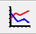
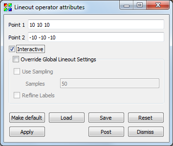
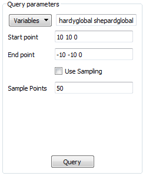
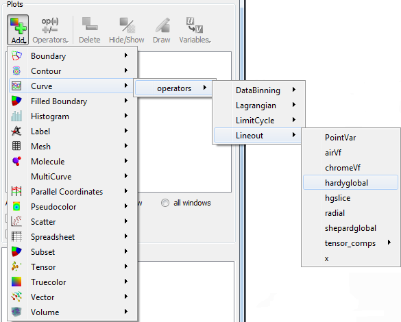
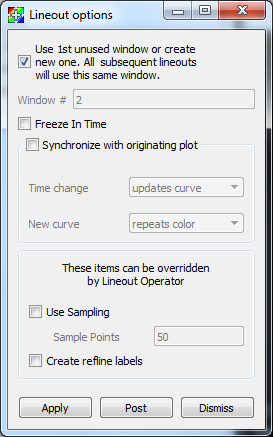
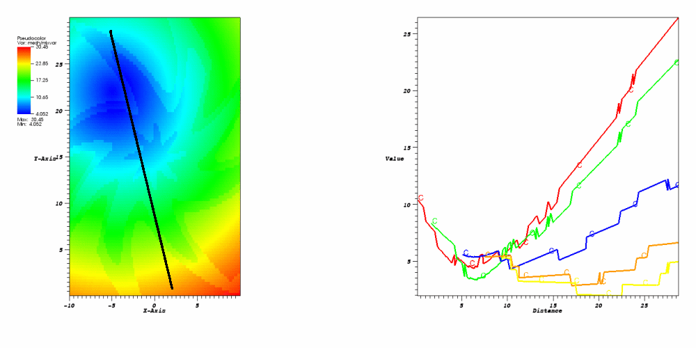

.. _Lineout_gui:

Lineout
-------

One-dimensional curves, created using data from 2D or 3D plots, are popular
for analyzing data because they are simple to compare. VisIt's visualization
windows can be put into a mode that allows you to draw lines, along which
data are extracted, in the visualization window. The extracted data are
turned into a Curve plot in another visualization window. If no other
visualization window exists, VisIt creates one and adds the Curve plot to
it. Curve plots are often more useful than 2D Pseudocolor plots because
they allow the data along a line to be seen spatially as a 1D curve instead
of relying on differences in color to convey information. Furthermore, the
curve data can be exported to curve files that allow the data to be imported
into other Lawrence Livermore National Laboratory curve analysis software
such as *Ultra*.

Lineout mode
~~~~~~~~~~~~

You can put the visualization window into lineout mode by selecting
the **Lineout** icon (:numref:`Figure %s <lineout_mode>`) in the visualization 
window's Toolbar or from the **Popup menu's Mode** submenu. Note that lineout 
mode is only available with 2D plots in this version though you can create 3D
lineouts using the Lineout query in the **Query Window**. After the
visualization window is in lineout mode, you can draw reference lines in
the window. Each reference line causes VisIt to extract data from the
database along the prescribed path and draw the data as a Curve plot in
another visualization window. Each reference line is drawn in a color that
matches the initial color of the Curve plot so the reference lines, which
may not have labels, can be easily associated with their corresponding Curve
plots. To clear the reference lines from the visualization window, select the
**Clear reference lines** option from **Popup menu's Clear**  submenu. 
An example of the visualization window with reference lines and Curve plots is 
shown in :numref:`Figure %s <lineoutexample>`.

.. _lineout_mode:

   Lineout mode toolbar icon

.. _lineoutexample:

   Visualization windows with reference line and Curve plots

Curve plot
~~~~~~~~~~

Curve plots are created by drawing reference lines. The visualization
window must be in lineout mode before reference lines can be created.
You can create a reference line by positioning the mouse over the first
point of interest, clicking the left mouse button and then moving the
mouse, while pressing the left mouse button, and releasing the mouse over
the second endpoint. Releasing the mouse button creates a reference line
along the path that was drawn with the mouse. When you draw a reference
line, you cause a Curve plot of the data along the reference line to
appear in another visualization window. If another visualization window
is not available, VisIt opens a new one before creating the Curve plot.
The Curve plot in the second window can be modified by setting the active
window to the visualization window that contains the Curve plots.

See :ref:`Curve plot` for information on changing the Curve plot's appearance.

Saving curves
"""""""""""""

Once a curve has been generated, it can be saved to a curve file. A curve
file is an ASCII text file that contains the X-Y pairs that make up the
curve and it is useful for exporting curve data to other curve analysis
programs. To save a curve, make sure you first set the active window to
the visualization window that contains the curve. Next, save the window
using the *curve* file format. All of the curves in the visualization
window are saved to the specified curve file.

Lineout Operator
~~~~~~~~~~~~~~~~

The Curve plot uses the Lineout operator to extract data from a database
along a linear path. The Lineout operator is not generally available
since curves are created only through reference lines and not the
**Plot menu**. Still, once a curve has been created using the Lineout
operator, certain attributes of the Lineout can be modified. Note that
when you modify the Lineout attributes, it is best to turn
off the **Apply operators to all plots** check box in the **Main Window**
so that all curves do not get the same set of Lineout operator
attributes. 

Setting lineout endpoints
"""""""""""""""""""""""""

You can modify the line endpoints by typing new coordinates into the
**Point 1** or **Point 2** text fields of the **Lineout attributes** window
(:numref:`Figure %s <lineoutwindow>`). Each endpoint is a 3D
coordinate that is specified by three space-separated floating point
numbers. If you are performing a Lineout operation on 2D data, you can
set the value for the Z coordinate to zero.

.. _lineoutwindow:

   Lineout attributes window

Setting the number of lineout samples
"""""""""""""""""""""""""""""""""""""

The Lineout operator works by extracting sample points along a line.
The sample points are then used to create Curve plots. The Lineout
operator's default sampling scheme is to sample data values at the
intersections between the sampling line and the cell boundaries
encountered along the way. This method gives rise to jagged Curve plots
favored by many VisIt users. See :numref:`Figure %s <lineoutsampling>`
for a comparison between the sampling methods. If you instead want
to smoothly sample the cells along the sampling line with some number
of evenly spaced sample points, you can make the Lineout operator use evenly
spaced sampling by clicking on the **Override Global Lineout Settings**
check box in the **Lineout attributes** window. Then click on
the **Use Sampling** check box and enter a number of sample points. The
number of sample points taken along the line determine the fidelity
of the Curve plot. Generally, it is best to set the number of sample
points such that each cell is sampled at least once. To set the number
of sample points, type a new number into the **Samples** text field.

.. _lineoutsampling:

.. figure:: images/lineoutsampling.png

   Lineout via cell intersection and lineout via sampling

Interactive mode
""""""""""""""""

When the **Interactive** check box is checked, changes to the Lineout
operator can be made by using the **Line tool** available from the
originating plot's visualization window Toolbar or Popup menu. 
*Interactive mode does not apply to lineouts created via the Curve plot's 
variable menu*.

To utilize the line tool to modify a Lineout curve, make the visualization
window with the originating plot the active window. Choose the Line tool. It
should be initialized with the endpoints of the reference line.  Moving the tool
will change the lineout.
(*Note:  Due to a current bug, the tool must be activated, deactivated, then activated a second time in order to be properly initialized with the Lineout's endpoint values.*)  
See :ref:`InteractiveTools` for more information on tool utilization.

Reference line labels
"""""""""""""""""""""

You can make the reference lines in the window that caused Curve plots to be
generated to have labels by checking the Lineout operator's **Refline Labels**
check box.

Lineout query
~~~~~~~~~~~~~
Performing a Lineout query requires an existing non-hidden plot in the active 
window. Choose **Lineout** from the **Query** window (available from the GUI's 
Controls dropdown menu). Set start and end points (similar to Setting lineout 
endpoints).  Lineout query is the only Lineout method that allows you to create
curves for multiple variables.  Simply select the desired variables from the
**Variables** dropdown menu.  *Default* means the variable as plotted in the
currently active plot.  A lineout curve will be generated for each variable, 
plotted along the same reference line.  Each curve will have its own color.
The **Use Sampling** and **Sample Points** option is the same as before.

.. _lineoutqueryparams:

   Lineout query's parameters window

Lineout via Curve plot variable menu
~~~~~~~~~~~~~~~~~~~~~~~~~~~~~~~~~~~~

With this method, Lineout is considered one of the 
:ref:`Operators that Generate New Variables`.  That means you can use it without
first generating a plot of the data from which you wish to extract the lineout.
To create a Lineout in this manner, open your database, select Curve plot, then 
choose *operators/Lineout/<var-name>* from the Curve plot's variable menu as 
shown in :numref:`Figure %s <lineout_from_curve>`. 

.. _lineout_from_curve:

   Choosing lineout from the Curve plot's variable menu

It is highly recommended that you modify the Lineout's endpoints before clicking
draw, as the defaults will probably not be appropriate for your data.

Global lineout options
~~~~~~~~~~~~~~~~~~~~~~

The **Lineout Options Window**, available by selecting **Lineout** from the 
**Controls** menu in the **Main Window** contains *global* lineout options.
They are *global* in the sense that they will apply to *all* future lineouts.
The **Lineout Options Window** has controls for choosing the destination
window of the lineout curve plots, as well as settings for how changes to
the originating plot affect the lineout curve plot.  Modifying these options 
will only apply to future lineouts, not lineouts already created.

.. _lineoutoptionswindow:

   Lineout Options Window

Lineout destination window
""""""""""""""""""""""""""

By default, VisIt will place all lineout curves in the same window.  It will
use the first unused open window or create one if one does not yet exist.  
You can override this behavior for future lineouts by unchecking the
**Use 1st unused window** checkbox, and typing a window number into the 
**Window #** text box.

Freeze In Time
""""""""""""""

If the plot that originated the Lineout curve was from a time-varying database,
the curve can be advanced in time using the animation controls for the window
containing the lineout curve.  If you would rather the lineout be frozen
at the timestep from which it was taken, check the **Freeze in Time** option.  
This will also disable the ability to synchronize the lineout curve with its 
originating plot.

Synchronous lineout
"""""""""""""""""""

Normally when you perform a lineout operation, the Curve plot that
results from the lineout operation is in no way connected to the plots
in the window that originated the Curve plot. If you want variable or time 
state changes made to the originating plots to also affect the Curve plots that 
were created via lineout, click the **Synchronize with originating plot** 
check box in the **Lineout Options Window** 
(see :numref:`Figure %s<lineoutoptionswindow>`).

With this option selected, any change to the variable in the plot that 
originated the lineout, will update the lineout to reflect the new variable's 
data.  When you change time states for the plot that originated the lineout, 
the lineout will update to reflect the data at the new time state.  

To make VisIt create a new Curve plot for the lineout instead of updating when
you change time states in the originating plot, change the **Time change** 
behavior in the **Lineout Options Window** from **updates curve** to 
**creates new curve**. VisIt will then put a new curve in the lineout 
destination window each time you advance to a new time state, resulting in many 
Curve plots (see :numref:`Figure %s <dynamiclineout>`). By default, VisIt will 
make all of the related Curve plots be the same color. You can override this
behavior by selecting **creates new color** instead of **repeats color** from
the **New curve** combo box.

*Synchronization does not apply to lineout curves created via the Curve plot
variable menu, as this type of lineout does not have an originating plot.*

.. _dynamiclineout:

   Dynamic lineout can be used to create curves for multiple time states

Sampling and Refline labels
"""""""""""""""""""""""""""

These options are the same as described for individual lineouts.  Use these
options when you want your choices to apply to *all* lineouts.

.. spelling::
    Refline
