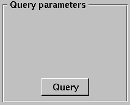
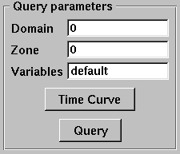
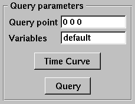
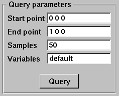

Query
-----

VisIt allows you to gather quantitative information from the database being
visualized through the use of queries. A query is a type of calculation that
can either return values from the database or values that are calculated
from data in the database. For example, VisIt's Pick and Lineout capabilities
(described later in this chapter) are specialized point and line queries
that print out the values of variables in the database at points or along
lines. In addition to point and line queries, VisIt provides database
queries that return values that are based on all of the data in a database.

Some queries can even be executed for all of the time states in a database
to yield a Curve plot of the query's behavior over time. This feature will
be covered in more detail a little later.

.. _querywindow:

.. figure:: images/querywindow.png

   Query window

VisIt's queries are available in the **Query Window** (shown in
:numref:`Figure %s <querywindow>`), which you can open by clicking the
**Query** option in the **Main Window's Control** menu. The **Query Window**
consists of upper and lower areas where the upper area allows you to select
a query and set its query parameters. The controls for setting a query's
parameters change as required and some queries have no parameters and thus
have no controls for setting parameters. The bottom area of the window
displays the results of the query once VisIt has finished processing it.
The results for new queries are appended to the output from previous queries
until you clear the **Query results** by clicking the **Clear results**
button.

Query types
~~~~~~~~~~~

VisIt's queries can be divided into three types: database queries, point
queries, and line queries. Database queries usually calculate information
for the database as a whole instead of concentrating on a single zone or
node but some Pick-related database queries do concentrate on cells and
nodes. Point queries calculate information for a point in the database
and several types of variable picking queries fall into this category.
Line queries calculate information along a line. Each type of query has
different controls in the **Query parameters** area (see
:numref:`Figure %s <queryparams_line>`) and as you highlight different
queries, the controls in the **Query parameters** area may change.

.. image:: images/queryparams_db2.png

.. _queryparams_line:

   Query parameters area

Database queries provide a few different interfaces depending on the query.
Many database queries require no additional input so they have no controls
except for the **Query** button. Other database queries ask whether the
query is to be performed with respect to the original data or the actual
data, which is that data that is left in the plot after subsets have been
removed and operators have transformed the data. Finally, some database
queries ask for a specific domain number and zone or node number.

Point queries provide interfaces in the **Query parameters** area that allow
you to enter a 3D point or a screen space point to use as the point for the
query. Line queries provide an interface that lets you specify the start
and end positions of the line as well as the number of sample points to
consider along the length of the line. Nearly all query types allow you to
provide additional variables to query in a **Variables** text field.

Built-in queries
~~~~~~~~~~~~~~~~

Database Queries
""""""""""""""""

2D area
    The 2D area query calculates the area of the 2D plot highlighted in the
    **Plot list** and prints the result to the **Query results**. VisIt can
    produce a Curve plot of this query with respect to time.

3D surfacea area
    The 3D surface area calculates the area of the plot highlighted in the
    **Plot list** and prints the result to the **Query results**. VisIt can
    produce a Curve plot of this query with respect to time.

Area Between Curves
    The Area Between Curves query calculates the area between 2 curve plots.
    The plots that will serve as input to this query must both be highlighted
    in the **Plot list** or VisIt will issue an error message. Once the area
    has been calculated, the result is printed to the **Query results**.

Centroid
    This query will calculate the centroid of a dataset. The contribution of
    each cell is calculated assuming its mass all lies at the center of the
    cell. If the query is performed on a Pseudocolor plot, the plot's variable
    will be assumed to be density. If the query is performed on a plot such as
    a Mesh plot or FilledBoundary plot, uniform density will be used. The
    results are print to the **Query results**. 

Chord Length Distribution
    The Chord Length Distribution query calculates a probability density
    function of chord length over a two or three dimensional object. Axially
    symmetric objects (RZ-meshes) are treated as 3D meshes and chords are
    calculated over the revolved, 3D object. A statistical approach, casting
    uniform density, random lines, is used. The result of this query is a
    curve, which is outputted as a separate file. This curve is a probability
    density function over length scale. The name of the resulting file is
    printed to the **Query results**.  

Compactness
    The Compactness query calculates mesh metrics and prints them in the
    **Query results**.

Cycle
    The Cycle query prints the cycle for the plot that is highlighted in the
    **Plot list** to the **Query results**.

Distance from Boundary
    The Distance From Boundary query calculates how much mass is at a given
    distance away from the boundary of a shape. An important distinction for
    this query is that distance from the boundary (for a given point) is not
    defined as the shortest distance to the boundary, but simultaneously as all
    surrounding distances. Axially symmetric objects (RZ-meshes) are treated as
    3D meshes and length scales are calculated over the revolved, 3D object.
    The implementation employs a statistical approach, with the casting of
    uniform density, random lines. The result of this query is a curve, which
    is outputted as a separate file. This curve contains the amount of mass as
    a function of length scale. Integrating the curve between P0 and P1 will
    give the total mass at distance between P0 and P1 (given the interpretation
    above). The name of the resulting file is printed to the **Query results**.

Eulerian
    The Eulerian query calculates the Eulerian number for the mesh that is used
    by the highlighted plot in the Plot list. The results are printed to the
    **Query results**.

Expected Value
    The Expected Value query calculates the integral of :math:`xf(x)dx` for
    some curve f(x). The curve should be highlighted in the **Plot list** and
    prints the result to the **Query results**. This query is intended for
    distribution functions.

Grid Information
    The Grid Information query prints information for each domain in a multi-
    domain mesh. The mesh type is printed as well as the mesh sizes. For
    structured meshes the size information contains the logical mesh dimensions
    (IJK sizes) and for unstructured meshes the size information contains the
    number of nodes and number of cells in the mesh. The query can optionally
    accept a *get_extents* parameter that will cause the spatial extents for
    each domain to be obtained. The query also accepts an optional
    *get_ghosttype* parameter that causes the ghost zone information for each
    domain to be obtained. Both the numerical value and list of or'd values for
    ghost values are obtained. All query outputs are printed to the
    **Queryresults**.

Integrate
    The Integrate query calculates the area under the Curve plot that is
    highlighted in the Plot list and prints the result to the
    **Query results**.

Kurtosis
    The Kurtosis query calculates the kurtosis of a normalized distribution
    function. The normalized distribution function must be represented as a
    Curve plot in VisIt. Kurtosis measures the variability of a distribution by
    comparing the ratios of the fourth and second central moments. The results
    are print to the **Query results**.

L2Norm
    The L2Norm query calculates the L2Norm, or square of the integrated area,
    of a Curve plot. The Curve plot must be highlighted in the **Plot list**.
    The results are printed to the **Query results**.

L2Norm Between Curves
    The L2Norm query takes two Curve plots as input and calculates the L2Norm
    between the 2 curves. Both Curve plots must be highlighted in the
    **Plot list** or VisIt will issue an error message. The results are printed
    to the **Query results**.

Min
    The Min query calculates the minimum value for the variable used by the
    highlighted plot in the **Plot list** and prints the value and the logical
    and physical coordinates where the minimum value was found to the
    **Query results**.

Mass Distribution
    The Mass Distribution query calculates how much mass occurs at different
    length scales over a two or three dimensional object. Axially symmetric
    objects (RZ-meshes) are treated as 3D meshes and length scales are
    calculated over the revolved, 3D object. The implementation employs a
    statistical approach, with the casting of uniform density, random lines.
    The result of this query is a curve, which is outputted as a separate file.
    This curve contains the amount of mass as a function of length scale.
    Integrating the curve between P0 and P1 will give the total mass between
    length scale P0 and length scale P1. The name of the resulting file is
    printed to the **Query results**.

Max
    The Max query calculates the maximum value for the variable used by the
    highlighted plot in the Plot list and prints the value and the logical and
    physical coordinates where the maximum value was found to the
    **Query results**.

MinMax
    The MinMax query calculates the minimum and maximum values for the variable
    used by the highlighted plot in the Plot list and prints the values and
    their logical and physical coordinates in the **Query results**.

Moment of inertia
    This query will calculate the moment of inertia tensor for each cell in a
    three-dimensional dataset. The contribution of each cell is calculated
    assuming its mass all lies at the center of the cell. If the query is
    performed on a Pseudocolor plot, the plot's variable will be assumed to be
    density. If the query is performed on a plot such as a mesh plot or
    FilledBoundary plot, uniform density will be used. The results are printed
    to the **Query results**.

NodeCoords
    The NodeCoords query prints the node coordinates for the specified node and
    prints the values in the **Query results**.

NumNodes
    The NumNodes query prints the number of nodes for the mesh used by the
    highlighted plot in the **Plot list** to the **Query results**.

NumZones
    The NumZones query prints the number of zones for the mesh used by the
    highlighted plot in the **Plot list** to the **Query results**.

Revolved surface area 
    The Revolved surface area query revolves the mesh used by the highlighted
    plot in the **Plot list** about the X-axis and prints the plot's revolved
    surface area to the **Query results**.

Revolved volume
    The Revolved volume area query revolves the mesh used by the highlighted
    plot in the **Plot list** about the X-axis and print's the plot's volume
    to the **Query results**.

Skewness
    The Skewness query calculates the skewness of a normalized distribution
    function. The normalized distribution function must be represented as a
    Curve plot in VisIt. Skewness measures the symmetry of a distribution using
    its second and third central moments. The results are print to the
    **Query results**

Spatial Extents
    The Spatial Extents query calculates the original or actual spatial extents
    for the plot that is highlighted in the **Plot list**. Whether the original
    or actual extents are calculated is determined by setting the options in
    the **Query parameters** area. The spatial extents are printed to the
    **Query results** when the query has finished.

Spherical compactness factor
    This query attempts to measure how spherical a three dimensional shape is.
    The query first determines what the volume of a shape is. It then
    constructs a sphere that has that same volume. Finally, the query positions
    the sphere so that the maximum amount of the original shape is within the
    sphere. The query returns the percentage of the original shape that is
    contained within the sphere. The results are print to the
    **Query results**. VisIt can produce a Curve plot of this query with
    respect to time.

Time
    The Time query prints the time for the plot that is highlighted in the Plot
    list to the **Query results**.

Variable Sum
    The Variable Sum query adds up the variable values for all cells using the
    plot highlighted in the **Plot list** and prints the results to the
    **Query results**. VisIt can produce a Curve plot of this query with
    respect to time.

Volume
    The Volume query calculates the volume of the mesh used by the plot
    highlighted in the **Plot list** and prints the value to the
    **Query results**. VisIt can use this query to produce a Curve plot of
    volume with respect to time.

Watertight
    The Watertight query determines if a three-dimensional surface mesh, of the
    plot highlighted in the **Plot list**, is "watertight", meaning that it is
    a closed volume with mesh connectivity such that every edge is incident to
    exactly two faces. This means that no edge can have a duplicate in the
    exact same position. The result of the query is printed in the
    **Query results**.

Weighted Variable Sum
    The Weighted Variable Sum query adds up the variable values, weighted by
    cell size, for all cells using the plot highlighted in the **Plot list**
    and prints the results to the **Query results**. VisIt can produce a Curve
    plot of this query with respect to time.

ZoneCenter
    The ZoneCenter query calculates the zone center for a certain cell in the
    database used by the highlighted plot in the Plot list. The cell center is
    printed to the **Query results** and the **Pick Window**.

Point Queries
"""""""""""""

NodePick
    The NodePick query performs node picking at the specified world coordinate
    which, if used in 3D, need not be on the surface of a 3D dataset.The plot
    to be picked must be highlighted in the **Plot list**. Information about
    the picked node, if there is one, is printed to the **Query results** and
    the **Pick Window**.

Pick
    The Pick query performs zone picking at the specified world coordinate 
    which, if used in 3D, need not be on the surface of a 3D dataset.The plot 
    to be picked must be highlighted in the **Plot list**. Information about 
    the picked node, if there is one, is printed to the **Query results** and 
    the **Pick Window**.

PickByNode
    The PickByNode query performs node pick using the highlighted plot in the
    **Plot list** and specified domain and node values. You can give a global
    node number if you turn on the **Use Global Node** check box. A pick point
    is added to the vis window and the query results appear in the
    **Query results** and the **Pick Window**. Note: this is the query to use
    if you want to query the database for the value of a variable at a certain
    node. VisIt can produce a Curve plot of this query with respect to time.

PickByZone
    The PickByZone query performs zone pick using the highlighted plot in the
    Plot list and specified domain and zone values. You can give a global node
    number if you turn on the **Use Global ** **Zone** check box. A pick point
    is added to the vis window and the query results appear in the
    **Query results** and the **Pick Window**. Note: this is the query to use
    if you want to query the database for the value of a variable at a certain
    cell. VisIt can produce a Curve plot of this query with respect to time.

Line Queries
""""""""""""

Lineout
    The Lineout query creates a new instance of the highlighted plot in the
    **Plot list**, applies a Lineout operator, and copies the plot to another
    vis window. The properties of the Lineout operator such as the start and
    end points are set using the controls in the **Query parameters area** of
    the **Query Window**. Creating Lineouts in this manner instead of using
    VisIt's interactive lineout allows you to create 1D Curve plots from 3D
    databases.  

Executing a query
~~~~~~~~~~~~~~~~~

VisIt has many queries from which to choose. You can choose the type of query
to execute by clicking on the name of the query in the **Queries list**. The
**Queries list** usually displays the names of all of the queries that VisIt
knows how to execute. If you instead want to view a subset of the queries,
grouped by function, you can make a selection from the **Display as** combo
box. Once you have clicked on a query in the **Query list**, the
**Query parameters** area updates to show the controls that you need to edit
the parameters for the query. In the case of a point query like Pick, the
only parameters you need to specify are the 3D point where VisIt will extract
values and the names of the variables that you want to examine. Once you
specify the query parameters, click the **Query** button to tell VisIt to
process the query. Once VisIt has fulfilled your request, the query results
are displayed in the **Query results** at the bottom of the **Query Window**.

Querying over time
~~~~~~~~~~~~~~~~~~

Many of VisIt's queries can be executed for every time state in the database
used by the queried plot. The results from a query over time is a Curve plot
that plots the query results with respect to time. The **Query parameters**
area contains a **Time Curve** button when the selected query can be plotted
over time. Clicking the **Time Curve** button executes the selected query
for each time state in the database used by the plot highlighted in the
**Plot list**. VisIt then creates a new Curve plot in a new vis window and
uses the query results versus time as the curve data.

.. _queryovertimewindow:

.. figure:: images/queryovertimewindow.png

   Query Over Time Window

By default, querying over time will force VisIt to execute the selected
query on every time state in the relevant database. If you want to restrict
the number of time states used when querying over time or if you want to
set some general options that also affect how time curves are created, you
can set additional options in the **Query Over Time Window** (see
:numref:`Figure %s <queryovertimewindow>`). If you want to open the
**Query Over Time Window**, click on the **Query over time** option in the
**Controls** menu in VisIt's **Main Window**.

Querying over a time range
""""""""""""""""""""""""""

You can restrict the range of time states that are considered when VisIt
is performing a query over time if you specify a start or end time state
in the **Query Over Time Window**. To set a starting time state, click the
**Starting timestep** check box and enter a new time state into the adjacent
text field. To set an ending time state, click the **Ending timestep**
check box and enter a new ending time state into the adjacent text field.

In addition to setting the starting and ending time states, you can also
specify a stride so VisIt can skip frames in the middle and consider every
Nth frame instead of every frame. If you want to specify a stride, enter
a new stride into the **Stride** text field in the **Query Over Time Window**
and click the **Apply** button.

Setting the axis title
""""""""""""""""""""""

When VisIt creates a new Curve plot, after having calculated a query over
time, the horizontal axis label is labeled with the database cycles. If you
prefer to think about time in terms of time state or simulation time then
you can change the axis label by clicking one of the following radio buttons
in the **Query Over Time Window** : **Cycle**, **Time**, **Timestep**.

Setting the time curve's destination window
"""""""""""""""""""""""""""""""""""""""""""

When VisIt creates a Curve plot using the results of a query over time,
the Curve plot is placed in a vis window designated for Curve plots. If
there is no vis window into which the Curve plot can be added, VisIt
creates a new vis window to contain the Curve plot. If you want VisIt to
always place the new Curve plot in a specific window, turn off the
**Use 1st unused window or create new one** check box and enter a new
window number into the **Window#** text field. After setting these
options, subsequent Curve plots created by querying over time will be
added to the specified vis window.
