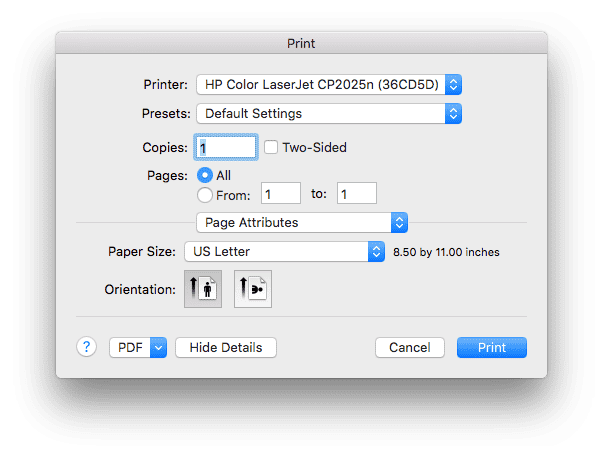

Printing
--------

VisIt allows you to print the contents of any visualization window to a
network printer or to a *PostScript* file.

The Printer Window
~~~~~~~~~~~~~~~~~~

.. _printer_window:

   
   Printer window 

Open the **Printer Window** by selecting **Print window** from the
**Main Window's File** menu. The **Printer Window's** appearance is influenced
by the platform on which you are running VisIt so you may find that it looks
somewhat different when you use the Windows, Unix, or MacOS X versions of
VisIt. The MacOS X  version of the **Printer Window** is shown in
:numref:`Figure %s<printer_window>` .

