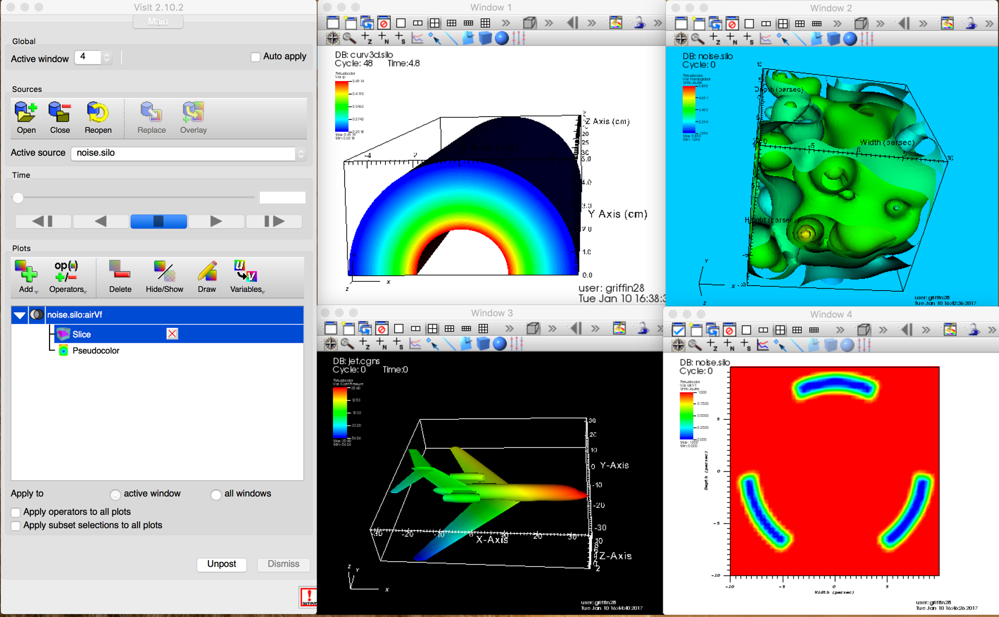

.. _saving_viz_window:

Saving the Visualization Window
-------------------------------

VisIt allows you to save the contents of any open visualization window to a 
variety of file formats. You can save visualizations as images so they can
be imported into presentations. Alternatively, you can save the geometry of
the plots in the visualization window so it can be imported into other
computer modeling and visualization programs.

VisIt currently supports the image files formats:
*BMP*, *JPEG*, *PNG*, *PPM*, *Raster Postscript*, *RGB*, and *TIFF*

VisIt currently supports the geometry file formats:
*Curve*, *Alias WaveFront Obj*, *PLY*, *POV*, *STL*, *ULTRA*, and *VTK*

The Curve and ULTRA file formats are specially designed to store the data 
created from curve plots and can be used with other Lawrence Livermore 
National Laboratory visualization software. The Alias Wavefront Obj file format
is supported so visualizations produced with VisIt can be imported into 
rendering programs such as Maya. VisIt can save visualizations into STL files,
which are used with stereolithographic printers to fabricate three-dimensional
parts. Finally, VisIt can save visualizations into the VTK (Visualization 
Toolkit) format so they can be read back into VisIt and used in other VTK-based
applications.

When saving the geometry of plots in the visualization window into any of the
afore-mentioned formats, you are performing a type of database export operation.
However, saving geometry in this manner differs from exporting databases using
the **Export Database Window**. Only the external faces of the plots are saved
out when saving plot geometry whereas during a database export, 3D cells are
preserved in the final exported database. The topic of exporting databases is
covered later in this chapter.

The Save Window
~~~~~~~~~~~~~~~

You can set the **Save window** options before saving by selecting **Set Save options. . .** from the
**Main Window's File menu**. The **Set save options** window contains the controls that
allow you to set the options that govern how visualizations are saved.

.. _save_window_fig:

   Save Window

The **Set Save options** window, shown in :numref:`Figure %s<save_window_fig>`,
contains four basic groups of controls. The first group, *Filename*, allows you
to set the file information. Use the file information controls to set the name
and destination. If the *Family* checkbox is selected, then each time an image
is saved with the same name, a number will be appended to the filename that is
one more than the current file with the same name. The second group,
*Format options*, allows you to set the file type, compression type, and any
optional quality parameters that may exist for the selected file type. Use the
third group of controls, *Aspect ratio and resolution*, to specify the
dimensions of the saved image. If *Screen capture* is checked, the aspect ratio
and width/height will be ignored and the current screen image will be saved. The
last group, *Multi-window save*, allows you to set options for each window being
saved by clicking on the **Window** drop-down and selecting the appropriate
window. When the save options are set and applied
by clicking the **Apply** button, the active visualization can be saved either
through the **Save Window** option in the **Main Window's File menu**, by the
keyboard shortcut *Ctrl+S* , or by clicking the **Save** button in the
**Set Save options** window.

Selecting the output directory for saved files
~~~~~~~~~~~~~~~~~~~~~~~~~~~~~~~~~~~~~~~~~~~~~~~

On most platforms, VisIt's default behavior is to save output files to the
current directory, which is the directory where VisIt was started. On the
Windows platform, VisIt saves images to the
:ref:`location <file_locations>` ``VUSER_HOME/My images``. If you want to specify
a special output directory for your output files, you can turn off the
**Output files to current directory** check box and type in the path to the
directory where you want VisIt to save your files in the **Output directory**
text field. If you want to browse the file system to find a suitable directory
in which to save your images, click on the *"..."* button to the right of the
**Output directory** text field to bring up a **Directory chooser** dialog.
Once you select a suitable directory using the **Directory chooser** dialog,
the path that you chose is inserted into the **Output directory** text field.

Setting the save file name
~~~~~~~~~~~~~~~~~~~~~~~~~~

To set the file name that will be used to save files, type a file name into
the **Filename** text field. The file name that you use may contain a path 
to a directory where you want to write the saved files. If no path is
specified, the saved files are written to the directory from which VisIt was
launched. A file extension appropriate for the type of file being generated
is automatically appended to the file name. For example, a *BMP* file will 
have a *".bmp"* extension, while a *JPEG* file will have a *".jpeg"*
extension, and so on.

The file name that VisIt uses to save visualizations is based on the specified
file name, the file format, and also the family toggle setting. The family
toggle setting is set by checking the **Family** check box towards the top 
right part of the **Save Window**.

The family toggle setting allows you to save series of files that all have
essentially the same name except for a number that is appended to the file
name. The number increases by one each time an image is saved. If the family
toggle setting is on then a file named *"visit"* of type *TIFF* will save out
as *"visit0000.tiff"*. If the family toggle setting is off, the file will save
as *"visit.tiff"*.

Setting the file type
~~~~~~~~~~~~~~~~~~~~~

You set the file type by making a selection from the **File type** menu.
You can choose from image file types or geometry file types. Note that some
areas of the **Save Window** become enabled or disabled for certain file types.

Choosing *JPEG* format files enables the **Quality** slider and the
**Progressive** check box. These controls allow you to specify the desired
degree of quality in the resulting JPEG images. A lower quality setting results
in blockier images that fit into smaller files. The progressive setting stores
the *JPEG* images in such a way that they progressively refine as they are
downloaded and displayed by Web browsers.

Choosing *TIFF* format files enables the **Compression type** combo box.
The available compression types are: *None*, *PackBits*, *JPEG*, and *Deflate*.
When compression is enabled for *TIFF* files, they are smaller than they would
be without compression.

Choosing *STL* or *VTK* file formats saves visualizations as geometry files
instead of images and also enables the **Binary** check box. The **Binary** 
check box tells these formats to write their geometry data as binary data files
instead of human-readable ASCII text files. In general, files written with the
binary option are smaller and faster to load than their non-binary counterparts.

Saving images with screen capture
~~~~~~~~~~~~~~~~~~~~~~~~~~~~~~~~~

The **Screen capture** check box tells VisIt to grab the image directly off of
the computer screen. This means that the saved image will be exactly the same
size as the image on the screen. There are advantages and disadvantages to
using screen capture. An advantage is that capturing the image from the screen
does not require VisIt to redraw the image to an internal buffer before
saving, which usually results in a faster save. A disadvantage of screen
capture is that any other windows on top of VisIt's visualization window
occlude portions of the image. Screen capture can also be very slow over a
sluggish network connection. Finally, using screen capture might not provide
images that have enough resolution. Weigh the advantages and disadvantages of
using screen capture for your own situation. Screen capture is on by default.

Setting image resolution
~~~~~~~~~~~~~~~~~~~~~~~~

You set image resolution using the controls in the **Aspect ratio and resolution**  group. These controls are disabled unless the file being saved is an image
format and screen capture is not being used. You specify the image height
and width by typing new values into the **Height** and **Width** text fields.
If the **Maintain 1:1 aspect** check box is on, VisIt forces the image's
height and width to be the same, yielding a square image. Turn off this
setting if you want to save rectangular images. The image resolution is
ignored unless you turn off the **Screen capture** check box.

Saving stereo images
~~~~~~~~~~~~~~~~~~~~

When the **Stereo** check box is turned on and you save an image, VisIt will
save a separate image for the left eye and for the right eye. The cameras
used to generate each image are offset such that when the images are played
together at high rates, they appear to have more depth. To enable saving of
stereo images, click the **Stereo** check box in the **Save Window** before
you try to save an image.

When **Family** mode is not enabled, VisIt will prepend *left_* and *right_*
designators to the saved filenames. However, when **Family** mode is enabled,
VisIt saves the two images in sequence without any left/right designation.
The left image is saved first followed by the right image. If next available
number in the **Family** is odd, the left will be odd and right will be even.
On the other hand, if next available number in the **Family** is even, the left
will be even and right will be odd. However, the notification messages VisIt
produces about the saved images may only mention the first (left) saved image
filename.

Saving binary geometry files
~~~~~~~~~~~~~~~~~~~~~~~~~~~~

Some geometry file formats such as *STL* and *VTK* have both ASCII and binary
versions of the file format. The ASCII file formats are human-readable and are
larger and slower for programs to process than binary formats, which are
not human-readable but are smaller and quicker for programs to read. When
geometry file formats support both ASCII and binary formats, the 
**Binary** check box is enabled. By default VisIt writes ASCII
geometry files but you can click the **Binary** check box to make VisIt write
binary geometry files.

Selecting pixel data
~~~~~~~~~~~~~~~~~~~~

Normally when saving an image, VisIt will simply save the RGB pixel data into
the specified image format. It is possible to request that VisIt saves additional
pixel data when saving an image. This may result in additional files being saved
alongside the normal image file. These additional images will share the same 
filename root as the image file but will have suffixes such as "value", "depth", 
or "lum", depending on their contents. Special file formats such as OpenEXR can
contain all of these additional image channels. When OpenEXR is the selected 
file format, a single ".exr" file will be written containing all pixel data.

The **Save options** window contains a 
**Pixel data** group that lets you request additional image channels. The **RGB**
check box selects RGB pixel data. The **Alpha** check box tells VisIt to also 
request transparency information and to not render with a background when saving
an image. This lets VisIt save images with a transparent background, which makes
compositing such an image in front of other backgrounds far easier (see 
:numref:`Figure %s<transparent_fig>`). The **Depth**
check box tells VisIt to export the depth buffer (Z-buffer) to a ZLib-compressed
binary file containing 32-bit floating point numbers. The **Luminance** check box
tells VisIt to save a luminance image, which shows how much lighting is used in
various parts of the scene. The luminance image is saved to the selected image
format. The **Value** check box tells VisIt to produce a rendering of the actual
scalar values in the scene in the form of a ZLib-compressed 32-bit floating point
buffer (same format as the depth image). 

.. _transparent_fig:

   Partially transparent plot saved to PNG with alpha channel

Saving tiled images
~~~~~~~~~~~~~~~~~~~

.. _save_tiled_fig:

   Saving tiled images example (before)

.. _save_tiled_fig1:

   Saving tiled images example (after)

A tiled image is a large image that contains the images from all visualization
windows that have plots. If you want to save tiled images, make sure to check
the **Save tiled** check box in the **Set Save options** window. To get an idea of how VisIt
saves your visualization windows into a tiled image, see :numref:`Figure %s<save_tiled_fig>` and 
:numref:`Figure %s<save_tiled_fig1>`.
