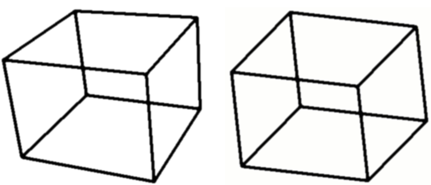
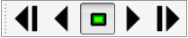
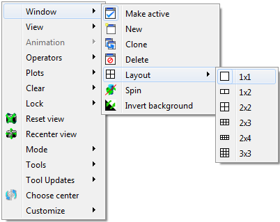
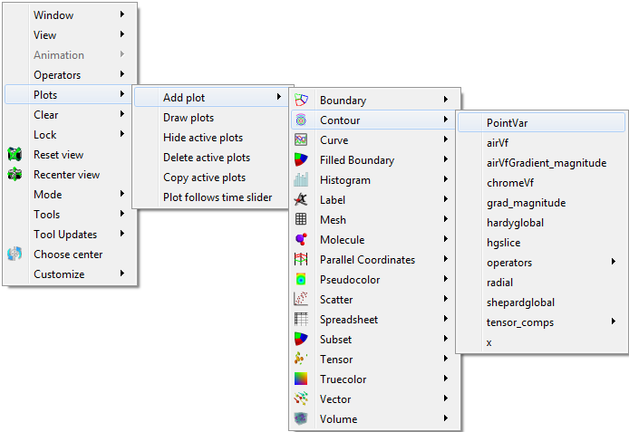
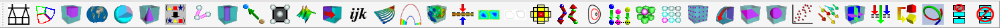

.. _The Popup menu and the Toolbar:

The Popup menu and the Toolbar
------------------------------

Each vis window contains a **Popup menu** and a **Toolbar**, which can be
used to perform several categories of operations such as window management,
setting the window mode, activating tools, manipulating the view, or
playing animations. Options in the **Popup menu** exist in the **Toolbar**
and vice-versa. A group of actions that is represented in the **Popup menu**
as a menu usually maps to a toolbar in the vis window's **Toolbar**. To
perform an action using the **Toolbar**, you can just click on its buttons.
Access the **Popup menu** by pressing the right mouse button in the vis
window. Select the desired item, then release the mouse button.

Hiding toolbars
~~~~~~~~~~~~~~~

The **Popup menu** has a **Customize** menu that lets you customize the
vis window's **Toolbar**. For instance, you can choose to hide all of the
toolbars so that they do not take up any of your screen space if you use
a small monitor. If you want to hide all toolbars, you can select the
**Hide toolbars** option from the **Customize** menu. If you want to
show the toolbars again, you can click the **Show toolbars** option in
the **Customize** menu. Note that when you select the **Show toolbars**
option, VisIt only shows the toolbars that were enabled before they
were hidden. If you want to enable or disable individual toolbars, you
can select from the **Toolbars** menu under the **Customize** menu so
VisIt only shows the toolbars that you routinely need. Once you tell
VisIt which toolbars you want to use, you can save your preferences
using the **Save settings** option in the **Main Window's Options**
menu so that the next time you run VisIt, it only shows the toolbars
that you enabled.

.. _customizemenu:

   Customize menu

Moving toolbars
~~~~~~~~~~~~~~~

Each of the vis window **Toolbar's** smaller toolbars can be moved to
other edges of the vis window by clicking the small tab on the left or
top side of the toolbar and dragging it to other edges of the vis window.

Switching window modes
~~~~~~~~~~~~~~~~~~~~~~

The **Popup menu** contains a **Mode** menu (see
:numref:`Figure %s <popupmode>`) that contains the 5 window modes.
You can select a window mode from the **Mode** menu to change the vis
window's mode. If you want to move or zoom the plot, choose navigate
or zoom modes. If you want to extract data from the plots in the vis
window, choose lineout mode or one of the pick modes. You can also use
the **Mode toolbar** to change the vis window's window mode.

.. _popupmode:

   Mode toolbar and menu 

Activating tools
~~~~~~~~~~~~~~~~

The **Popup menu** contains a **Tools** menu (see
:numref:`Figure %s <toolmenu>`) that lists of all of VisIt's interactive
tools. Each tool shown in the menu has an associated icon that is used
to indicate if the tool is enabled and if it is available in the vis
window. Some tools are not available if the vis window does not contain
plots or if the plots in the vis window are the wrong dimension to be
used with the tool. In that event, the tool cannot be activated and the
menu and toolbar entries for that tool are disabled. If a tool is
available, its icon is bright blue; otherwise the icon is grayed out. If
a tool is enabled, its icon has a selection rectangle around it. To
activate a tool, choose an inactive tool from the **Tools** menu or click
on its button in the **Toolbar**. To deactivate a tool, choose the tool
that you want to deactivate from the **Tools** menu or click on its
button in the **Toolbar**.

.. _toolmenu:

   Tool toolbar and menu

View options
~~~~~~~~~~~~

VisIt's **Popup menu** and **Toolbar** (see
:numref:`Figure %s <viewmenu>`) have several options that are available
for manipulating the view. You can reset the view, recenter the view,
undo a view change, toggle perspective viewing, save and reuse useful
views, or choose a new center of rotation.

.. _viewmenu:

   View toolbar and menu

Resetting the view
""""""""""""""""""

The **Popup menu** has a **Reset view** option (see
:numref:`Figure %s <viewmenu>`) that resets the view used to view the
plots in the vis window. The view is typically reset to look down the -Z
axis in a right-handed coordinate system. You can reset the view by
selecting the Reset view option from the **Popup menu** or by clicking
on the **Reset view icon** in the **Toolbar**.

Recentering the view
""""""""""""""""""""

Sometimes adding a plot to a vis window that already contains plots can
result in a lop-sided visualization. This happens when the spatial extents
of the plots do not match. The **Popup menu** has a **Recenter view**
option (see :numref:`Figure %s <viewmenu>`) to calculate a new center of
rotation for the plots so they are drawn in the center of the window. You
can also recenter the view by clicking on the **Recenter view icon** in
the **Toolbar**. To make sure that the view updates appropriately when
new plots are added to the vis window, you may also want to check the
**Auto center view** check box that is available in the **View Window** .  

Undo view
"""""""""

The vis window saves the last ten views in a buffer so that you can restore
them if you make an unintended change to the view. You can undo a view
change, by selecting the **Undo view** option in the **Popup menu's View**
menu or by clicking the **Undo view icon** in the **Toolbar** (see
:numref:`Figure %s <viewmenu>`).

Changing view perspective
"""""""""""""""""""""""""

.. _perspective:

   Perspective examples

When the vis window contains 3D plots, the perspective setting can be used
to enhance how 3D the plot looks. In a perspective projection, graphics
grow smaller as they recede into the distance which makes them look more
realistic. To change the perspective setting, click on the **Perspective**
option in the **Popup menu's View** menu (see
:numref:`Figure %s <viewmenu>`). When the vis window uses a perspective
projection, the Popup menu's Perspective option will have a selection
rectangle around its icon. You can also turn perspective on or off by
clicking on the **Perspective icon** in the **Toolbar**. The difference
in appearance having perspective and not having it is shown in
:numref:`Figure %s <perspective>`.

Locking views
"""""""""""""

The vis window can lock its view to other vis windows. When this toggle is
set, making a change that affects the view in the active vis window will
cause other vis windows that have the lock views toggle set to receive the
same view as the active window. To lock the view, select the **Lock view**
option from the **Popup menu's View** menu (see
:numref:`Figure %s <viewmenu>`) or click on the **Lock view icon** in the
**Toolbar**. Note that you can lock 2D and 3D windows separately.

Saving and reusing views
""""""""""""""""""""""""

Sometimes when analyzing a database, it is useful to be able to toggle
between several different views. VisIt allows you to save up to 15 views
that you can then use to look at different parts of your visualization.
When you navigate to a view that you like, click the **Save view**
icon in the **View** toolbar or click the **Save view** option in the
**Popup menu's View** menu to save the view. When you save a view, VisIt
adds a new numbered camera icon to the **View** toolbar and the **Popup menu**
. Clicking on a view icon makes VisIt use the view that is associated with
the clicked icon so you have one-click access to all of your saved views.
You can preserve the saved views across VisIt sessions if you save your
settings. If you want to delete the saved views so you can create different
saved views, click the **Clear saved views** icon next to the **Save views**
icon in the **View** toolbar.

Fullframe mode
""""""""""""""

Some databases yield plots that are so long and skinny that they leave
most of the vis window blank when VisIt displays them. VisIt provides
Fullframe mode to stretch the plots so they fill more of the vis window
so it is easier to see them. It is worth noting that Fullframe mode does
not preserve a 1:1 aspect ratio for the displayed plots because they are
stretched in each dimension so they fit better in the vis window. To
activate Fullframe mode, click on the **Fullframe** option in the
**Popup menu's View** menu.

Choosing a new center of rotation
"""""""""""""""""""""""""""""""""

When you are working with a 3D database and you have created plots and
zoomed in on them, you should set the center of rotation. The center of
rotation is the point about which the plots are rotated when you rotate
the plots in navigate mode. Normally, the center of rotation is set to
the center of the plots being visualized. When you zoom way in on plots
and attempt to rotate them, the default center of rotation often causes
plots to whiz off of the screen when you rotate because the center of
rotation is not close enough to the geometry that you are actually
viewing. To set the center of rotation to something more suitable, VisIt
provides the **Choose center** button, which can be accessed in the
**Popup** menu or in the **View** toolbar. Once you click the
**Choose center** button, VisIt temporarily switches to pick mode so
you can click on the part of your visualization that you want to become
the new center of rotation. Once you click on a plot, VisIt exits pick
mode and uses the picked point as the new center of rotation. After
setting the center of rotation, VisIt will make sure that the picked
point is visible at all times.

Animation options
~~~~~~~~~~~~~~~~~

The animation controls in VisIt's **Main Window** are not the only controls
that are provided for playing animations. Each vis window's **Popup menu**
and **Toolbar** has options for playing and stepping through animations. To
play an animation, select the Play option from the **Popup menu's Animation**
menu or click on the **Play icon** in the **Toolbar**, shown in
:numref:`Figure %s <animationmenu>`. To play the animation in reverse, select
the **Reverse play** option or click on the **Reverse play icon** in the
**Toolbar**. To stop the animation from playing, select the **Stop** option
in the **Animation** menu or click on the **Stop icon** in the **Toolbar**.
If you want to advance or reverse one frame at a time, use forward or reverse
step.

.. _animationmenu:

    Animation toolbar and menu

Window options
~~~~~~~~~~~~~~

Many window options have previously been explained in this chapter so this
section describes some addition options that were not covered. Many of the
options in the **Main Window's Windows** menu are also present in the
**Popup menu's** **Window** menu and toolbar (see
:numref:`Figure %s <popupmenuwindowmenu2>`).

.. _popupmenuwindowmenu2:

    Window toolbar and menu

Changing bounding-box mode
""""""""""""""""""""""""""

The vis window allows a simple wireframe box to be substituted for complex
plots when you want to rotate or move them. This is called bounding-box
navigation and you can use it during navigate mode for complex plots so you
can navigate faster when a vis window contains plots that take a long
time to redraw. You can change the bounding-box mode by selecting the
**Navigate bbox** option from the **Popup menu's Window** menu shown in
:numref:`Figure %s <popupmenuwindowmenu2>`.  You can also change the
bounding-box mode by clicking on the **Bounding-box icon** in the
**Toolbar**.

Engaging spin
"""""""""""""

Spin is a setting that makes plots spin after the user stops rotating them
and it provides a nice, easy way to see the entire plot without having to
actively rotate it. To spin a 3D plot, turn on the **Spin** option in the
**Popup menu's Windows** menu and then rotate the plot as you would in
navigate mode. The plot will continue to spin after you release the mouse
buttons. You can also engage spin using the **Spin** option in the
**Main Window's Windows** menu or by clicking the **Spin icon** in the
vis window's **Toolbar**. You can stop plots from spinning by turning off
spin.

Inverting the foreground and background colors
""""""""""""""""""""""""""""""""""""""""""""""

Sometimes it is useful to swap the vis window's foreground and background
colors. You can invert the background and foreground colors by clicking on
the **Windows** menu's **Invert background** option. Note that this option
is disabled when the vis window has a gradient background.

Clear options
~~~~~~~~~~~~~

The **Clear** menu (see :numref:`Figure %s <clearmenu>`) in the **Popup menu**
contains options that cause certain items such as: plots, pick points, and
reference lines to be removed from a vis window. The **Clear** menu also
appears in the **Main Window's Windows** menu.

.. _clearmenu:

   Clear menu

Clearing plots from all windows
"""""""""""""""""""""""""""""""

Sometimes it is useful to clear all plots from the vis window. Clearing
plots from the vis window does not delete the plots but instead deletes
their computed geometry and returns them to the new state so they appear
green in the **Plot list**. An example of when you might want to clear
plots is when you change material interface reconstruction options since
changing them requires a plot to be regenerated. Rather than deleting
plots that existed before changing the material interface reconstruction
parameters, you can clear the plots and force them to be completely
regenerated by clearing the plots.

Clearing pick points
""""""""""""""""""""

Click on the **Clear** menu's **Clear pick points** option if you want
to remove all of the pick labels that were added when you picked on the
plots in the vis window. Clearing the pick points also removes any pick
information related to those pick points in the **Pick** window.

Clearing reference lines
""""""""""""""""""""""""

Click on the **Clear** menu's **Clear reference lines** option if you
want to remove all of the reference lines that were added to the vis
window when you performed lineouts on the plots in the vis window.

Plot options
~~~~~~~~~~~~

The **Plot** toolbar and **Plot** menu let you create new plots using
variables from the open databases and also let you hide, delete, and
draw the plots that correspond to the selected plot entries in VisIt's
**Plot list**. The **Plot** menu is always available in the **Popup menu**
but the **Plot** toolbar is not visible by default. If you want to make
the **Plot** toolbar visible, you can turn it on in the
**Popup menu's Customize** menu. The **Plot** menu and toolbar are
shown in :numref:`Figure %s <plotmenu2>`.

.. _plotmenu2:

   Plot toolbar and menu

Adding a plot
"""""""""""""

The **Plot** menu and toolbar both provide options for you to add new
plots. Each plot has its own menu option or icon that contains the
variables that can be plotted from the open database. To add a new
plot using the **Plot** menu, click the **Add plot** option to activate
the list of available plots and then select a variable for the desired
plot type. To add a new plot using the **Plot** toolbar, click on the
icon for the desired plot type and select a variable from its variable
menu. A new plot will appear in the **Main Window's Plot list** and it
will be in the new state. To draw the plot, click the **Draw** button.

Drawing a plot
""""""""""""""

All plots added using the **Plot** menu or toolbar are in the new state,
indicating that they have not been generated yet. To generate a plot
once it has been created, click the **Draw** plots option in the **Plot**
menu.

Hiding active plots
"""""""""""""""""""

To hide the active plots, which are the plots that are highlighted in the
**Main Window's Plot list**, click the **Plot** menu's **Hide active plots**
option. Once clicked, the selected plots are made invisible until you hide
them again to show them.

Deleting active plots
"""""""""""""""""""""

To delete the active plots, which are the plots that are highlighted in
the **Main Window's Plot list**, click the **Plot** menu's Hide active
plots option. Once a plot has been deleted, you can't get it back.

Operator options
~~~~~~~~~~~~~~~~

The **Operator** menu and toolbar allow you to add new operators and
remove operators from plots. The **Operator** menu is always available
in the **Popup menu** but the **Operator toolbar** is not visible by
default. If you want to make the **Operator toolbar** visible, you can
turn it on in the **Popup menu's Customize menu**. The **Operator menu**
and **Operator toolbar** are shown in :numref:`Figure %s <operatormenu>`.

.. _operatormenu:

   Operator toolbar and menu

Adding an operator
""""""""""""""""""

The **Operator** menu and toolbar both provide options for you to add new
operators. Each operator has its own menu option or icon that adds an
operator of that type to the selected plots when you click its menu option
or icon.

Removing the last operator
""""""""""""""""""""""""""

The **Operator** menu and toolbar both have options for you to remove the
last operator from a plot. Each plot has a list of applied operators and
clicking the **Remove last operator** menu option or icon will remove the
last operator from each plot that is selected in the **Plot list**. Plots
that have been drawn are regenerated.

Removing all operators
""""""""""""""""""""""

The **Operator** menu and toolbar both have options for you to remove all
operators from a plot. Each plot has a list of applied operators and clicking
the **Remove all operators** menu option or icon will remove all operators
from each plot that is selected in the **Plot list**. Plots that have been
drawn are regenerated.

Lock options
~~~~~~~~~~~~

The **Lock menu** and toolbar, both shown in :numref:`Figure %s <lockmenu>`,
allow you to lock certain visualization window attributes so that when you
change them, other locked visualization windows also update. Currently, you
can lock the view, time and tools. See :ref:`Locking Windows` for more 
information on how to use the lock options.

.. _lockmenu:

   Lock toolbar and menu

