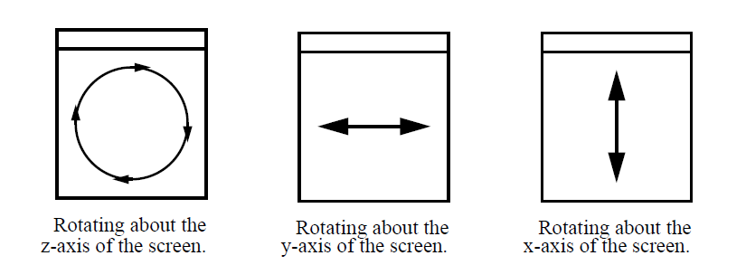

.. _Using vis windows:

Using vis windows
-----------------

The first thing to know about using a vis window is how to change window
modes. A window mode is a state in which the vis window behaves in a
specialized manner. There are four window modes: Navigate, Zoom, Lineout,
and Pick. Vis windows are in navigate mode by default. This means that most
mouse actions are used to move, rotate, or zoom-in on the plots that the
vis window displays. Each vis window has a **Popup menu** that can be
activated by clicking the right mouse button while the mouse is inside of
the vis window. The **Popup menu** contains options that can put the vis
window into other modes and perform other common operations. To put the
vis window into another window mode, open the **Popup menu**, select
**Mode** and then select one of the four window modes. You can also change
the window mode using the vis window's **Toolbar**, which has buttons to
set the window mode. You can find out more about the **Popup menu** and
**Toolbar** later in this chapter.

Navigate mode
~~~~~~~~~~~~~

Navigate mode is VisIt lingo for moving and zooming-in on plots. When
the vis window is in navigate mode, clicking the left mouse button and
dragging with the mouse will perform an action that moves, rotates, or
zooms the plot. The mouse motions used to rotate plots are shown in
:numref:`Figure %s <mousemotions>`. You can translate plots by holding
down the *Shift* key before left-clicking and dragging the plot. You zoom
in on plots by clicking the middle button and moving the mouse up or
down. Sometimes the controls are modified based on the interactor settings.
For more information, look at the section on *Interactor settings*.

.. _mousemotions:

   Mouse motions used to rotate plots in navigate mode

Zoom mode
~~~~~~~~~

When the window is in zoom mode, you can draw a box around the area of the
vis window that you want drawn larger. Press the left mouse button and move
the mouse to sweep out a box that will define the area to be zoomed. Release
the mouse button when the zoom box covers the desired area. If you start
zooming and decide against it before releasing the left mouse button,
clicking one of the other mouse buttons cancels the zoom operation. Changes
to the view can be undone by selecting the **Undo view** option from the
popup menu's **View** menu. Sometimes the zoom controls can change based
on the interactor settings, which are described further on in Interactor
settings.

Lineout mode
~~~~~~~~~~~~

Lineout mode is only available when the vis window contains 2D plots. A
lineout is essentially a slice of a two dimensional dataset that produces
a one dimensional curve in another vis window. When a vis window is in
lineout mode, pressing the left mouse button in the vis window creates
the first endpoint of a line that will be used to create a curve. As you
move the mouse around, the line to be created is drawn to indicate where
the lineout will be applied. When you release the mouse button, VisIt adds
a lineout to the vis window and a curve plot is created in another vis
window.

Pick mode
~~~~~~~~~

When a vis window is in pick mode, any click with the left mouse button
causes VisIt to calculate the value of the plot at the clicked point
and place a pick point marker in the vis window to indicate where you
clicked. The calculated value is printed to the **Output Window** and
the **Pick Window**.
