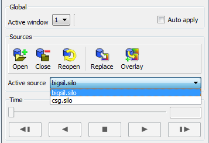

.. _Sources Pane:

Sources Pane
------------

The **Sources pane** , near the top of the **Main Window,** displays the 
currently active source, and contains controls to open, close, reopen, and
and overlay sources.  Sources are most frequently database files. 

Opening a file
~~~~~~~~~~~~~~

To open a file, you want to visualize, click on the **Open** button. 
This opens the  :ref:`File Open Window`.  Once a file is open, the **Close**
and **Reopen** buttons become enabled.

If you have opened multiple files, the **Active source** drop-down menu allows
you to switch between the files.

.. _ActiveSources:

   Controls for setting the active source

When the **ReOpen** button is clicked, all cached information about the open 
database is deleted, the database is queried again for its information, and 
any plots that use that database are regenerated using the new information. 
This allows VisIt to access data that was added to the database after VisIt 
first opened it.

Reopening a database
~~~~~~~~~~~~~~~~~~~~

Sometimes it is useful to begin visualizing simulation data before the 
simulation has finished writing out data files for all time steps. When you 
open a database in VisIt and create plots and later want to visualize new time 
steps that have been generated since you first opened the database, you can 
reopen the database to force VisIt to get the data for the new time steps. To 
reopen a database, click the **ReOpen** button in the **Sources pane**. When 
VisIt reopens a database, it clears the geometry for all plots that used that 
database and cached information about the database is erased so that when VisIt
reopens the database, plots are regenerated using the new data files.

Replacing a database
~~~~~~~~~~~~~~~~~~~~

If you have created a plot with one database and want to see what it looks like
using data from another database, you can replace the database using the
**File panel's** **Replace** button. To replace a database, first select a new 
database by clicking on a file in the **File panel's Selected files list**
and then click the **Replace** button. This will make VisIt try to replace the 
databases used in the plots with the new database. If the replace operation is 
a success, the plots are regenerated using the new database and they are 
displayed in the visualization window.

Overlaying a database
~~~~~~~~~~~~~~~~~~~~~

Overlaying a database is a way to duplicate every plot in the plot list using 
a new database. To overlay plots, select a new database from the
**Active sources** dropdown, then click the **Overlay** button. This copies
each plot in the **Active plot list** and replaces the database with the
specified database. If the operation succeeds, the plots are generated and
displayed in the visualization window. It is important to remember that each
time the **Overlay** button is clicked, the number of plots in the plot list
doubles.
