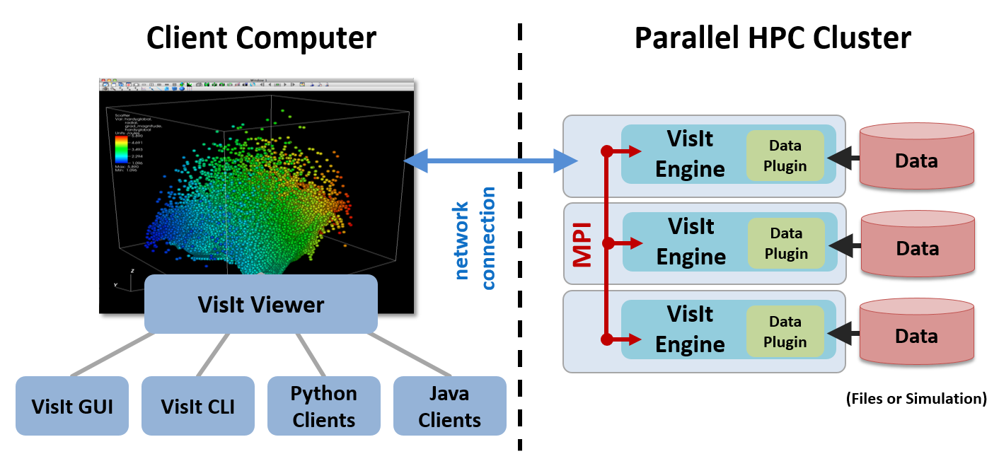
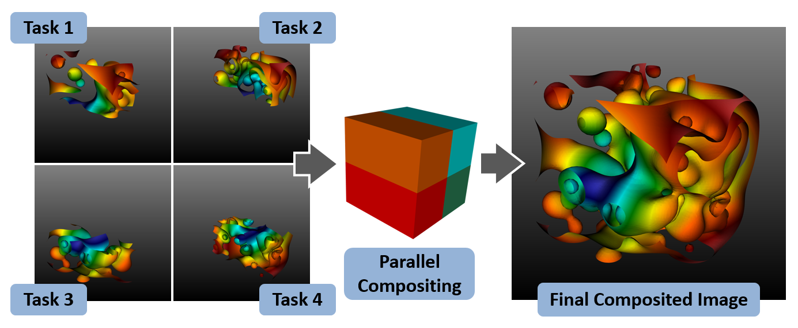
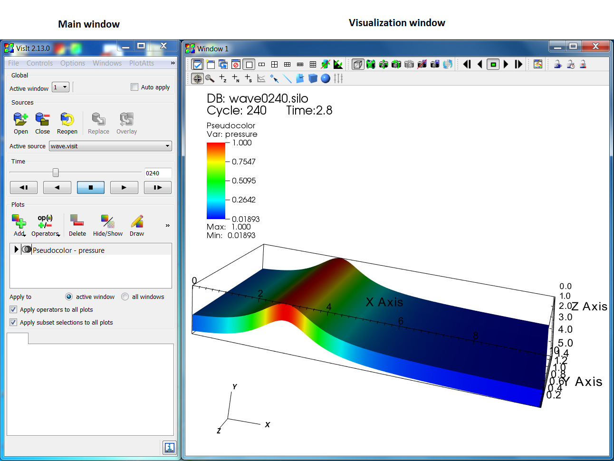

.. _Understanding how VisIt works:

Understanding how VisIt_ works
------------------------------

VisIt_'s Core Abstractions
~~~~~~~~~~~~~~~~~~~~~~~~~~

VisIt_'s interface is built around five core abstractions. These include:

* Databases
* Plots
* Operators
* Expressions
* Queries

Databases
"""""""""

Databases read data from files and presents the data in the user interface
as variables. VisIt_ supports many different types of variables including:

* Meshes
* Scalars
* Vectors
* Tensors
* Materials
* Species

Meshes are the foundation of all the other types of variables. They consist
of a discretization of space into cells. All the other variables are defined
on the cells of the mesh.

Scalars are single valued fields and examples include density, pressure
and temperature. Vectors are multi valued fields that have a direction
and magnitude. Examples include velocity and magnetic fields. Tensors are
multi valued fields that are typically thought of as 2 x 2 matrices in
the case of 2D data and 3 x 3 matrices in the case of 3D data. The typical
tensor variable is the stress tensor. Materials are a special type of
variable that associates one or more materials with a cell. The location
of the material is not specified within the cell and in the case of multi
material cells, algorithms must be used to determine where the material is
located in the cell, typically by looking at the materials in neighboring
cells. Species are variables that are associated with each material. For a
given material, species are a further breakdown of a material. The
distinctive property of a species is that it is uniformly distributed
throughout the material. For example, air consists of many different gases
such as oxygen, nitrogen, carbon monoxide, carbon dioxide, etc.

Plots
"""""

Plots take variables and generate a visual representation of the variable.
Some examples include the Mesh plot, which displays the mesh lines of the
mesh, the Pseudocolor plot, which maps scalar variables to color, and
the Vector plot, which displays vector glyphs indicating the direction
and magnitude of a vector field. Plots work on specific types of variables
and the graphical user interface limits the display of variables that
can be used with a given plot to the appropriate variables.

Operators
"""""""""

Operators take variables and modify them in some way. Operators perform
their operations before they are plotted. Multiple operators may be
applied to a variable forming a pipeline. For example, a mesh may be
subsetted so that all the values fall within a given range, furthermore,
the mesh may be subsetted to a portion of the mesh within a user specified
box.

Expressions
"""""""""""

Expressions perform calculations on variables to generate new variables.
Some common expressions consist of the standard mathematical operations
such as addition, subtraction, multiplication and division. It also includes
more complex operations such as gradient and divergence.

Queries
"""""""

Queries summarize data and typically take variables as input and generate
either a single value or some small number of values. Queries can also
create curves, the most common of which is the result of a query over time
that creates a curve of a scalar value over time. Some examples of queries
include minimum, maximum, spatial extents and volume.

VisIt_'s Architecture
~~~~~~~~~~~~~~~~~~~~~

VisIt_ has a client-server architecture that consists of one or more clients
that connect to a viewer, which connects to one or more parallel servers.
The clients and viewer typically run locally on the users desktop system
while the parallel servers run on some remote high performance compute
platform. This is shown in :numref:`Figure %s <Intro-Architecture>`. This
is the most general case, but the components can also all run on a single
system, either on the desktop or on a remote high performance compute
platform. The server can also run in serial and for small data sets is
completely sufficient.

.. _Intro-Architecture:

   VisIt_'s architecture

VisIt_ supports a number of different clients including a Graphical User
Interface (GUI), a Python based Command Line Interface (CLI), and a Java
programming interface. More than one client can be active at a time and
VisIt_ coordinates the state between them so that they are consistent.

The viewer is responsible for displaying the visual results of the plots
and coordinating the state information between the various clients.

The server is responsible for reading the data from disk and performing
all the manipulations on the data. The server reads and does all of its
processing in parallel when running in parallel. The server can either
render the data to be displayed in parallel or send the data to be rendered
by the viewer. For small data sets, rendering in the viewer is faster
and has less latency. For large data sets it is better to render the data
in parallel (using scalable rendering) and then send the rendered image to
the viewer for display. The implementation of scalable rendering is shown
in :numref:`Figure %s <Intro-ScalableRendering>`. VisIt_ is by default
configured to automatically switch between shipping data to the viewer
and performing scalable rendering based on the amount of geometry to be
rendered.

.. _Intro-ScalableRendering:

   VisIt_'s scalable rendering

VisIt_'s Graphical User Interface
~~~~~~~~~~~~~~~~~~~~~~~~~~~~~~~~~

When you run the VisIt_ graphical user interface, you are seeing windows
from the Qt based GUI and the viewer. The GUI is a VisIt_ client that provides
the user interface and menus that let you choose what to visualize. The 
viewer displays all of the visualizations and is responsible for keeping
track of VisIt_'s state and coordinating this state with the other components.
Both the GUI and the viewer are meant to run locally to take advantage of
the local computer's graphics hardware. The next two components can also be
run on a client computer but they are more often run on a remote, parallel
computer or cluster where the data files are generated. 

The viewer supports up to 16 visualization windows. Each window is independent
of the others. VisIt_ uses an active window concept; all changes made in
**Main** window or one of its popup windows apply to the currently active
visualization window. The **Main** window and visualization window are shown
in :numref:`Figure %s <Intro-VisItGUI>`.

.. _Intro-VisItGUI:

   VisIt_'s graphical user interface

Servers are launched on each machine where data to be visualized is located.
Servers are launched on demand, typically when a database is opened. If there
is more than one host profile on a system, VisIt_ will pop up a window asking
which profile to use and additional properties such as the number of processors
and nodes to use. The **Host Profiles** window is used to specify properties
about the servers for different machines, such as the number of processors to
use by default when running the server. The status of a compute engine is
displayed in the **Compute Engines** window.
