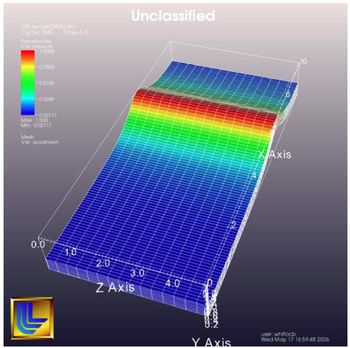

Quick Recipes
=============

Overview
--------

This manual contains documentation for over two hundred functions and several dozen extension object types. 
Learning to combine the right functions in order to accomplish a visualization task without guidance would involve hours of trial and error. 
To maximize productivity and start creating visualizations using Visit_'s Python Interface as fast as possible, this chapter provides some common patterns, or "quick recipes" that you can combine to quickly create complex scripts.

How to start
------------

The most important question when developing a script is: "Where do I start?". 
You can either use session files that you used to save the state of your visualization to initialize the plots before you start scripting or you can script every aspect of plot initialization.

Using session files
~~~~~~~~~~~~~~~~~~~

VisIt_'s session files contain all of the information required to recreate plots that have been set up in previous interactive VisIt sessions. 
Since session files contain all of the information about plots, etc., they are natural candidates to make scripting easier since they can be used to do the hard part of setting up the complex visualization, leaving the bulk of the script to animate through time or alter the plots in some way. 
To use session files within a script, use the RestoreSession function.

.. literalinclude:: ../../test/tests/quickrecipes/how_to_start.py
   :language: Python
   :start-after: # using session files {
   :end-before: # using session files }

Getting something on the screen
~~~~~~~~~~~~~~~~~~~~~~~~~~~~~~~

If you don't want to use a session file to begin the setup for your visualization then you will have to dive into opening databases, creating plots, and animating through time. 
This is where all of hand-crafted scripts begin. 
The first step in creating a visualization is opening a database. 
VisIt provides the OpenDatabase function to open a database. 
Once a database has been opened, you can create plots from its variables using the AddPlot function. 
The AddPlot function takes a plot plugin name and the name of a variable from the open database. 
Once you've added a plot, it is in the new state, which means that it has not yet been submitted to the compute engine for processing. 
To make sure that the plot gets drawn, call the DrawPlots function.

.. literalinclude:: ../../test/tests/quickrecipes/how_to_start.py
   :language: Python
   :start-after: # getting something on the screen {
   :end-before: # getting something on the screen }

Handling Command line Arguments
-------------------------------

In some cases, a VisIt_ python script also needs to handle its own command line arguments.
This is handled using the ``Argv()`` method.
For example, to run the python script, ``myscript.py`` with two arguments like so ::

    visit -nowin -cli -s myscript.py myarg1 myarg2

these arguments can be accessed using the ``Argv()`` method which returns the Python tuple, ``('myarg1', 'myarg2')``.
Similarly, ``sys.argv`` will return the Python list, ``['myscript.py', 'myarg1', 'myarg2']`` which includes the script name itself as the zeroth argument.

Saving images
-------------

Much of the time, the entire purpose of using VisIt_'s Python Interface is to create a script that can save out images of a time-varying database for the purpose of making movies. 
Saving images using VisIt_'s Python Interface is a straight-forward process, involving just a few functions.

Setting the output image characteristics
~~~~~~~~~~~~~~~~~~~~~~~~~~~~~~~~~~~~~~~~

VisIt provides a number of options for saving files, including: format, fileName, and image width and height, to name a few. 
These attributes are grouped into the SaveWindowAttributes object. 
To set the options that VisIt uses to save files, you must create a SaveWindowAttributes object, change the necessary attributes, and call the SetSaveWindowAttributes function. 
Note that if you want to create images using a specific image resolution, the best way is to use the *-geometry* command line argument with VisIt_'s Command Line Interface and tell VisIt to use screen capture. 
If you instead require your script to be capable of saving several different image sizes then you can turn off screen capture and set the image resolution in the SaveWindowAttributes object.

::

    # Save a BMP file at 1024x768 resolution 
    s = SaveWindowAttributes() 
    s.format = s.BMP 
    s.fileName = "mybmpfile" 
    s.width, s.height = 1024,768 
    s.screenCapture = 0 
    SetSaveWindowAttributes(s) 

Saving an image
~~~~~~~~~~~~~~~

Once you have set the SaveWindowAttributes to your liking, you can call the SaveWindow function to save an image. 
The SaveWindow function returns the name of the image that is saved so you can use that for other purposes in your script.

::

    # Save images of all timesteps and add each image filename to a list. 
    names = [] 
    for state in range(TimeSliderGetNStates()): 
      SetTimeSliderState(state) 
      # Save the image 
      n = SaveWindow() 
      names = names + [n] 
    print(names)

Working with databases
----------------------

VisIt allows you to open a wide array of databases both in terms of supported file formats and in terms how databases treat time. 
Databases can have a single time state or can have multiple time states. 
Databases can natively support multiple time states or sets of single time states files can be grouped into time-varying databases using .visit files or using virtual databases. 
Working with databases gets even trickier if you are using VisIt to visualize a database that is still being generated by a simulation. 
This section describes how to interact with databases.

Opening a database
~~~~~~~~~~~~~~~~~~

Opening a database is a relatively simple operation - most complexities arise in how the database treats time. 
If you only want to visualize a single time state or if your database format natively supports multiple timestates per file then opening a database requires just a single call to the OpenDatabase function.

::

    # Open a database at time state 0 
    OpenDatabase("/usr/local/visit/data/allinone00.pdb") 

Opening a database at late time
~~~~~~~~~~~~~~~~~~~~~~~~~~~~~~~

Opening a database at a later timestate is done just the same as opening a database at time state zero except that you must specify the time state at which you want to open the database. 
There are a number of reasons for opening a database at a later time state. 
The most common reason for doing so, as opposed to just changing time states later, is that VisIt uses the metadata from the first opened time state to describe the contents of the database for all timestates (except for certain file formats that don't do this, i.e. SAMRAI). 
This means that the list of variables found for the first time state that you open is used for all timestates. 
If your database contains a variable at a later timestate that does not exist at earlier time states, you must open the database at a later time state to gain access to the transient variable.

::

    # Open a database at a later time state to pick up transient variables 
    OpenDatabase("/usr/local/visit/data/wave.visit", 17) 

Opening a virtual database
~~~~~~~~~~~~~~~~~~~~~~~~~~

VisIt provides two ways for accessing a set of single time-state files as a single time- varying database. 
The first method is a .visit file, which is a simple text file that contains the names of each file to be used as a time state in the time-varying database. 
The second method uses "virtual databases", which allow VisIt to exploit the file naming conventions that are often employed by simulation codes when they create their dumps. 
In many cases, VisIt can scan a specified directory and determine which filenames look related. 
Filenames with close matches are grouped as individual time states into a virtual database whose name is based on the more abstract pattern used to create the filenames.

::

    # Opening first file in series wave0000.silo, wave0010.silo, ... 
    OpenDatabase("/usr/local/visit/data/wave0000.silo") 

    # Opening a virtual database representing all wave*.silo files. 
    OpenDatabase("/usr/local/visit/data/wave*.silo database") 

Opening a remote database
~~~~~~~~~~~~~~~~~~~~~~~~~

VisIt supports running the client on a local computer while also allowing you to process data in parallel on a remote computer. 
If you want to access databases on a remote computer using VisIt_'s Python Interface, the only difference to accessing a database on a local computer is that you must specify a host name as part of the database name.

::

    # Opening a file on a remote computer by giving a host name 
    # Also, open the database to a later time slice (17)
    OpenDatabase("thunder:/usr/local/visit/data/wave.visit", 17)

Opening a compute engine
------------------------

Sometimes it is advantageous to open a compute engine before opening a database. 
When you tell VisIt to open a database using the OpenDatabase function, VisIt also launches a compute engine and tells the compute engine to open the specified database. 
When the VisIt Python Interface is run with a visible window, the **Engine Chooser Window** will present itself so you can select a host profile. 
If you want to design a script that must specify parallel options, etc in batch mode where there is no **Engine ChooserWindow** then you have few options other than to open a compute engine before opening a database. 
To open a compute engine, use the OpenComputeEngine function. 
You can pass the name of the host on which to run the compute engine and any arguments that must be used to launch the engine such as the number of processors.

::

    # Open a local, parallel compute engine before opening a database 
    # Use 4 processors on 2 nodes
    OpenComputeEngine("localhost", ("-np", "4", "-nn", "2"))
    OpenDatabase("/usr/local/visit/data/multi_ucd3d.silo") 

The options for starting the compute engine are the same as the ones used on the command line. 
Here are the most common options for launching a compute engine.

::

    -l    <method>       Launch in parallel using the given method.
    -np   <# procs>      The number of processors to use.
    -nn   <# nodes>      The number of nodes to allocate.
    -p    <part>         Partition to run in.
    -b    <bank>         Bank from which to draw resources.
    -t    <time>         Maximum job run time.
    -machinefile <file>  Machine file.

The full list of parallel launch options can be obtained by typing ``visit --fullhelp``. 
Here is a more complex example of launching a compute engine.

::

    # Use the "srun" job launcher, the "batch" partition, the "mybank" bank,
    # 72 processors on 2 nodes and a time limit of 1 hour
    OpenComputeEngine("localhost",("-l", "srun",
                                   "-p", "batch",
                                   "-b", "mybank",
                                   "-np", "72",
                                   "-nn", "2",
                                   "-t", "1:00:00"))

You can also launch a compute engine using one of the existing host profiles defined for your system. 
In this particular case we know that the third profile is for the "parallel batch pbatch" profile. 
If you didn't know this you could print "p" to get all the properties.

::

    # Set the user name to "user1" and use the third profile,
    # overriding a few of its properties
    p = GetMachineProfile("quartz.llnl.gov")
    p.userName="user1"
    p.activeProfile = 2
    p.GetLaunchProfiles(2).numProcessors = 72
    p.GetLaunchProfiles(2).numNodes = 2
    p.GetLaunchProfiles(2).timeLimit = "00:30:00"
    OpenComputeEngine(p)

Working with plots
------------------

Plots are viewable objects, created from a database, that can be displayed in a visualization window. 
VisIt provides several types of plots and each plot allows you to view data using different visualization techniques. 
For example, the Pseudocolor plot allows you to see the general shape of a simulated object while painting colors on it according to the values stored in a variable's scalar field. 
The most important functions for interacting with plots are covered in this section.

Creating a plot
~~~~~~~~~~~~~~~

The function for adding a plot in VisIt is: AddPlot. 
The AddPlot function takes the name of a plot type and the name of a variable that is to be plotted and creates a new plot and adds it to the plot list.  
The name of the plot to be created corresponds to the name of one of VisIt_'s plot plugins, which can be queried using the PlotPlugins function. 
The variable that you pass to the AddPlot function must be a valid variable for the opened database. 
New plots are not realized, meaning that they have not been submitted to the compute engine for processing. 
If you want to force VisIt to process the new plot you must call the DrawPlots function.

::

    # Names of all available plot plugins 
    print(PlotPlugins())

    # Create plots 
    AddPlot("Pseudocolor", "pressure") 
    AddPlot("Mesh", "quadmesh") 
    # Draw the plots 
    DrawPlots() 

Plotting materials
~~~~~~~~~~~~~~~~~~

Plotting materials is a common operation in VisIt. 
The Boundary and FilledBoundary plots enable you to plot material boundaries and materials, respectively.

::

    # Plot material boundaries 
    AddPlot("Boundary", "mat1") 
    # Plot materials 
    AddPlot("FilledBoundary", "mat1") 

Setting plot attributes
~~~~~~~~~~~~~~~~~~~~~~~

Each plot type has an attributes object that controls how the plot generates its data or how it looks in the visualization window. 
The attributes object for each plot contains different fields. 
You can view the individual object fields by printing the object to the console. 
Each plot type provides a function that creates a new instance of one of its attribute objects. 
The function name is always of the form: plotname + "Attributes". 
For example, the attributes object creation function for the Pseudocolor plot would be: PseudocolorAttributes. 
To change the attributes for a plot, you create an attributes object using the appropriate function, set the properties in the returned object, and tell VisIt to use the new plot attributes by passing the object to the SetPlotOptions function. 
Note that you should set a plot's attributes before calling the DrawPlots method to realize the plot since setting a plot's attributes can cause the compute engine to recalculate the plot.

::

    # Creating a Pseudocolor plot and setting min/max values. 
    AddPlot("Pseudocolor", "pressure") 
    p = PseudocolorAttributes() 
    # Look in the object 
    print(p)
    # Set the min/max values 
    p.min, p.minFlag = 0.0, 1 
    p.max, p.maxFlag = 10.0, 1 
    SetPlotOptions(p) 

Working with multiple plots
~~~~~~~~~~~~~~~~~~~~~~~~~~~

When you work with more than one plot, it is sometimes necessary to set the active plots because some of VisIt_'s functions apply to all of the active plots. 
The active plot is usually the last plot that was created unless you've changed the list of active plots. 
Changing which plots are active is useful when you want to delete or hide certain plots or set their plot attributes independently. 
When you want to set which plots are active, use the SetActivePlots function. 
If you want to list the plots that you've created, call the ListPlots function.

::

    # Create more than 1 plot of the same type 
    AddPlot("Pseudocolor", "pressure") 
    AddPlot("Pseudocolor", "density") 

    # List the plots. The second plot should be active. 
    ListPlots() 

    # Draw the plots 
    DrawPlots() 

    # Hide the first plot 
    SetActivePlots(0) 
    HideActivePlots() 

    # Set both plots' color table to "hot" 
    p = PseudocolorAttributes() 
    p.colorTableName = "hot" 
    SetActivePlots((0,1)) 
    SetPlotOptions(p) 

    # Show the first plot again. 
    SetActivePlots(0) 
    HideActivePlots()

    # Delete the second plot 
    SetActivePlots(1) 
    DeleteActivePlots() 
    ListPlots() 

Plots in the error state
~~~~~~~~~~~~~~~~~~~~~~~~

When VisIt's compute engine cannot process a plot, the plot is put into the error state. 
Once a plot is in the error state, it no longer is displayed in the visualization window. 
If you are generating a movie, plots entering the error state can be a serious problem because you most often want all of the plots that you have created to animate through time and not disappear in the middle of the animation. 
You can add extra code to your script to prevent plots from disappearing (most of the time) due to error conditions by adding a call to the DrawPlots function.

::

    # Save an image and take care of plots that entered the error state. 
    drawThePlots = 0 
    for state in range(TimeSliderGetNStates()): 
      if SetTimeSliderState(state) == 0: 
        drawThePlots = 1 
      if drawThePlots == 1: 
        if DrawPlots() == 0: 
          print("VisIt could not draw plots for state: %d")% state 
        else: 
          drawThePlots = 0 
      SaveWindow() 

Operators
---------

Operators are filters that are applied to database variables before the compute engine uses them to create plots. 
Operators can be linked one after the other to form chains of operators that can drastically transform the data before plotting it.

Adding operators
~~~~~~~~~~~~~~~~

Adding an operator is similar to adding a plot in that you call a function with the name of the operator to be added. 
The list of available operators is returned by the OperatorPlugins function. 
Any of the names returned in that plugin can be used to add an operator using the AddOperator function. 
Operators are added to the active plots by default but you can also force VisIt to add them to all plots in the plot list.

::

    # Print available operators 
    print(OperatorPlugins())
    # Create a plot 
    AddPlot("Pseudocolor") 
    # Add an Isovolume operator and a Slice operator 
    AddOperator("Isovolume") 
    AddOperator("Slice") 
    DrawPlots() 

Setting operator attributes
~~~~~~~~~~~~~~~~~~~~~~~~~~~

Each plot gets its own instance of an operator which means that you can set each plot's operator attributes independently. 
Like plots, operators use objects to set their attributes. 
These objects are returned by functions whose names are of the form: operatorname + "Attributes". 
Once you have created an operator attributes object, you can pass it to the SetOperatorOptions to set the options for an operator. 
Note that setting the attributes for an operator nearly always causes the compute engine to recalculate the operator. 
You can use the power of VisIt's Python Interface to create complex operator behavior such as in the following code example, which moves slice planes through a Pseudocolor plot.

::

    OpenDatabase("/usr/local/visit/data/noise.silo") 
    AddPlot("Pseudocolor", "hardyglobal") 
    AddOperator("Slice") 
    s = SliceAttributes() 
    s.originType = s.Percent 
    s.project2d = 0 
    SetOperatorOptions(s) 
    DrawPlots() 

    nSteps = 20 
    for axis in (0,1,2): 
      s.axisType = axis 
      for step in range(nSteps): 
        t = float(step) / float(nSteps - 1) 
        s.originPercent = t * 100. 
        SetOperatorOptions(s) 
        SaveWindow()

Quantitative operations
-----------------------

This section focuses on some of the operations that allow you to examine your data more quantitatively.

Defining expressions
~~~~~~~~~~~~~~~~~~~~

VisIt allows you to create derived variables using its powerful expressions language. 
You can plot or query variables created using expressions just as you would if they were read from a database. 
VisIt_'s Python Interface allows you to create new scalar, vector, tensor variables using the DefineScalarExpression, DefineVectorExpression, and DefineTensorExpression functions.

::

    # Creating a new expression 
    OpenDatabase("/usr/local/visit/data/noise.silo") 
    AddPlot("Pseudocolor", "hardyglobal") 
    DrawPlots() 
    DefineScalarExpression("newvar", "sin(hardyglobal) + cos(shepardglobal") 
    ChangeActivePlotsVar("newvar") 

Pick
~~~~

VisIt allows you to pick on cells, nodes, and points within a database and return information for the item of interest. 
To that end, VisIt provides several pick functions. 
Once a pick function has been called, you can call the GetPickOutput function to get a string that contains the pick information. 
The information in the string could be used for a multitude of uses such as building a test suite for a simulation code.

::

    OpenDatabase("/usr/local/visit/data/noise.silo") 
    AddPlot("Pseudocolor", "hgslice") 
    DrawPlots() 
    s = [] 
    # Pick by a node id 
    PickbyNode(300) 
    s = s + [GetPickOutput()] 
    # Pick by a cell id 
    PickByZone(250) 
    s = s + [GetPickOutput()] 
    # Pick on a cell using a 3d point 
    Pick((-2., 2., 0.)) 
    s = s + [GetPickOutput()] 
    # Pick on the node closest to (-2,2,0) 
    NodePick((-2,2,0)) 
    s = s + [GetPickOutput()] 
    # Print all pick results 
    print(s)

Lineout
~~~~~~~

VisIt allows you to extract data along a line, called a :ref:`lineout <Lineout>`, and plot the data using a :ref:`Curve <Curve plot>` plot.

::

    p0 = (-5,-3)
    p1 = ( 5, 8)
    OpenDatabase("/usr/local/visit/data/noise.silo") 
    AddPlot("Pseudocolor", "hgslice") 
    DrawPlots() 
    Lineout(p0, p1)
    # Specify 65 sample points 
    Lineout(p0, p1, 65)
    # Do three variables ("default" is "hgslice")
    Lineout(p0, p1, ("default", "var1", "var2"))

The above steps produce the requested lineout(s), visually, as curve(s) in a (new) viewer window.
What if you want to access the actual lineout data and/or save it to a file? 

::

    # Set active window to one containing Lineout curve plots (typically #2)
    SetActiveWindow(2)
    # Get array of x,y pairs for first curve plot in window
    SetActivePlots(0)
    hgslice_vals = GetPlotInformation()["Curve"]
    # Get array of x,y pairs for second curve plot in window
    SetActivePlots(1)
    var1_vals = GetPlotInformation()["Curve"]
    # Get array of x,y pairs for third curve plot in window
    SetActivePlots(2)
    var2_vals = GetPlotInformation()["Curve"]

    # Write it as CSV data to a file
    for i in range(len(hgslice_vals) / 2):
        idx = i*2+1 # take only y-values in each array
        print "%g,%g,%g" % (hgslice_vals[idx], var1_vals[idx], var2_vals[idx])

Query
~~~~~

VisIt can perform a number of different queries based on values calculated about plots or their originating database.

::

    OpenDatabase("/usr/local/visit/data/noise.silo") 
    AddPlot("Pseudocolor", "hardyglobal") 
    DrawPlots() 
    Query("NumNodes") 
    print("The float value is: %g")% GetQueryOutputValue() 
    Query("NumNodes") 

Finding the min and the max
~~~~~~~~~~~~~~~~~~~~~~~~~~~

A common operation in debugging a simulation code is examining the min and max values. 
Here is a pattern that allows you to print out the min and the max values and their locations in the database and also see them visually.

::

    # Define a helper function to get the id's of the MinMax query. 
    def GetMinMaxIds(): 
      Query("MinMax") 
      import string 
      s = string.split(GetQueryOutputString(), " ") 
      retval = [] 
      nextGood = 0 
      idType = 0 
      for token in s: 
        if token == "(zone" or token == "(cell": 
          idType = 1 
          nextGood = 1 
          continue 
        elif token == "(node": 
          idType = 0 
          nextGood = 1 
          continue 
        if nextGood == 1: 
           nextGood = 0 
           retval = retval + [(idType, int(token))] 
      return retval

    # Set up a plot 
    OpenDatabase("/usr/local/visit/data/noise.silo") 
    AddPlot("Pseudocolor", "hgslice") 
    DrawPlots() 

    # Do picks on the ids that were returned by MinMax. 
    for ids in GetMinMaxIds(): 
      idType = ids[0] 
      id = ids[1] 
      if idType == 0: 
        PickByNode(id) 
      else: 
        PickByZone(id) 

Subsetting
----------

VisIt allows the user to turn off subsets of the visualization using a number of different methods. 
Databases can be divided up any number of ways: domains, materials, etc. 
This section provides some details on how to remove materials and domains from your visualization.

Turning off domains
~~~~~~~~~~~~~~~~~~~

VisIt_'s Python Interface provides the TurnDomainsOn and TurnDomainsOff functions to make it easy to turn domains on and off.

::

    OpenDatabase("/usr/local/visit/data/multi_rect2d.silo") 
    AddPlot("Pseudocolor", "d") 
    DrawPlots() 
    # Turning off all but the last domain 
    d = GetDomains() 
    for dom in d[:-1]: 
      TurnDomainsOff(dom) 
    # Turn all domains off 
    TurnDomainsOff() 
    # Turn on domains 3,5,7 
    TurnDomainsOn((d[3], d[5], d[7]))

Turning off materials
~~~~~~~~~~~~~~~~~~~~~

VisIt_'s Python Interface provides the TurnMaterialsOn and TurnMaterialsOff functions to make it easy to turn materials on and off.

::

    OpenDatabase("/usr/local/visit/data/multi_rect2d.silo") 
    AddPlot("FilledBoundary", "mat1") 
    DrawPlots() 
    # Print the materials are: 
    GetMaterials() 
    # Turn off material 2
    TurnMaterialsOff("2") 

View
----

Setting up the view in your Python script is one of the most important things you can do to ensure the quality of your visualization because the view concentrates attention on an object of interest. 
VisIt provides different methods for setting the view, depending on the dimensionality of the plots in the visualization window but despite differences in how the view is set, the general procedure is basically the same.

Setting the 2D view
~~~~~~~~~~~~~~~~~~~

The 2D view consists of a rectangular window in 2D space and a 2D viewport in the visualization window. 
The window in 2D space determines what parts of the visualization you will look at while the viewport determines where the images will appear in the visualization window. 
It is not necessary to change the viewport most of the time.

::

    OpenDatabase("/usr/local/visit/data/noise.silo") 
    AddPlot("Pseudocolor", "hgslice") 
    AddPlot("Mesh", "Mesh2D") 
    AddPlot("Label", "hgslice") 
    DrawPlots() 
    print("The current view is:", GetView2D())
    # Get an initialized 2D view object. 
    v = GetView2D() 
    v.windowCoords = (-7.67964, -3.21856, 2.66766, 7.87724) 
    SetView2D(v) 

Setting the 3D view
~~~~~~~~~~~~~~~~~~~

The 3D view is much more complex than the 2D view. 
For information on the actual meaning of the fields in the View3DAttributes object, refer to page 214 or the VisIt User Manual. 
VisIt automatically computes a suitable view for 3D objects and it is best to initialize new View3DAttributes objects using the GetView3D function so most of the fields will already be initialized. 
The best way to get new views to use in a script is to interactively create the plot and repeatedly call GetView3D() after you finish rotating the plots with the mouse. 
You can paste the printed view information into your script and modify it slightly to create sophisticated view transitions.

::

    OpenDatabase("/usr/local/visit/data/noise.silo") 
    AddPlot("Pseudocolor", "hardyglobal") 
    AddPlot("Mesh", "Mesh") 
    DrawPlots() 
    v = GetView3D() 
    print("The view is: ", v) 
    v.viewNormal = (-0.571619, 0.405393, 0.713378) 
    v.viewUp = (0.308049, 0.911853, -0.271346) 
    SetView3D(v)

Flying around plots
~~~~~~~~~~~~~~~~~~~

Flying around plots is a commonly requested feature when making movies.  
Fortunately, this is easy to script. 
The basic method used for flying around plots is interpolating the view. 
VisIt provides a number of functions that can interpolate View2DAttributes and View3DAttributes objects. 
The most useful of these functions is the EvalCubicSpline function. 
The EvalCubicSpline function uses piece-wise cubic polynomials to smoothly interpolate between a tuple of N like items. 
Scripting smooth view changes using EvalCubicSpline is rather like keyframing in that you have a set of views that are mapped to some distance along the parameterized space [0., 1.]. 
When the parameterized space is sampled with some number of samples, VisIt calculates the view for the specified parameter value and returns a smoothly interpolated view. 
One benefit over keyframing, in this case, is that you can use cubic interpolation whereas VisIt_'s keyframing mode currently uses linear interpolation.

::

    # Do a pseudocolor plot of u. 
    OpenDatabase("/usr/local/visit/data/globe.silo") 
    AddPlot("Pseudocolor", "u") 
    DrawPlots() 
        
    # Create the control points for the views. 
    c0 = View3DAttributes() 
    c0.viewNormal = (0, 0, 1) 
    c0.focus = (0, 0, 0) 
    c0.viewUp = (0, 1, 0) 
    c0.viewAngle = 30 
    c0.parallelScale = 17.3205 
    c0.nearPlane = 17.3205 
    c0.farPlane = 81.9615 
    c0.perspective = 1 
        
    c1 = View3DAttributes() 
    c1.viewNormal = (-0.499159, 0.475135, 0.724629) 
    c1.focus = (0, 0, 0) 
    c1.viewUp = (0.196284, 0.876524, -0.439521) 
    c1.viewAngle = 30 
    c1.parallelScale = 14.0932 
    c1.nearPlane = 15.276 
    c1.farPlane = 69.917 
    c1.perspective = 1 
        
    c2 = View3DAttributes() 
    c2.viewNormal = (-0.522881, 0.831168, -0.189092) 
    c2.focus = (0, 0, 0) 
    c2.viewUp = (0.783763, 0.556011, 0.27671) 
    c2.viewAngle = 30 
    c2.parallelScale = 11.3107 
    c2.nearPlane = 14.8914 
    c2.farPlane = 59.5324 
    c2.perspective = 1 
        
    c3 = View3DAttributes()
    c3.viewNormal = (-0.438771, 0.523661, -0.730246) 
    c3.focus = (0, 0, 0) 
    c3.viewUp = (-0.0199911, 0.80676, 0.590541) 
    c3.viewAngle = 30 
    c3.parallelScale = 8.28257 
    c3.nearPlane = 3.5905 
    c3.farPlane = 48.2315 
    c3.perspective = 1 
        
    c4 = View3DAttributes() 
    c4.viewNormal = (0.286142, -0.342802, -0.894768) 
    c4.focus = (0, 0, 0) 
    c4.viewUp = (-0.0382056, 0.928989, -0.36813) 
    c4.viewAngle = 30 
    c4.parallelScale = 10.4152 
    c4.nearPlane = 1.5495 
    c4.farPlane = 56.1905 
    c4.perspective = 1 
        
    c5 = View3DAttributes() 
    c5.viewNormal = (0.974296, -0.223599, -0.0274086) 
    c5.focus = (0, 0, 0) 
    c5.viewUp = (0.222245, 0.97394, -0.0452541) 
    c5.viewAngle = 30 
    c5.parallelScale = 1.1052 
    c5.nearPlane = 24.1248 
    c5.farPlane = 58.7658 
    c5.perspective = 1 
        
    c6 = c0 
        
    # Create a tuple of camera values and x values. The x values 
    # determine where in [0,1] the control points occur. 
    cpts = (c0, c1, c2, c3, c4, c5, c6) 
    x=[] 
    for i in range(7): 
      x = x + [float(i) / float(6.)] 
        
    # Animate the view using EvalCubicSpline. 
    nsteps = 100 
    for i in range(nsteps): 
      t = float(i) / float(nsteps - 1) 
      c = EvalCubicSpline(t, x, cpts) 
      c.nearPlane = -34.461 
      c.farPlane = 34.461 
      SetView3D(c)

Working with annotations
------------------------

Adding annotations to your visualization improve the quality of the final visualization in that you can refine the colors that you use, add logos, or highlight features of interest in your plots. 
This section provides some recipes for creating annotations using scripting.

Using gradient background colors
~~~~~~~~~~~~~~~~~~~~~~~~~~~~~~~~

VisIt_'s default white background is not necessarily the best looking background color for presentations. 
Adding a gradient background under your plots is an easy way to add a small professional touch to your visualizations. 
VisIt provides a few different styles of gradient background: radial, top to bottom, bottom to top, left to right, and right to left. 
The gradient style is set using the *gradientBackgroundStyle* member of the AnnotationAttributes object. 
The before and after results are shown in :numref:`Figure %s <annotations1>`.  

::

    # Set a blue/black, radial, gradient background. 
    a = AnnotationAttributes() 
    a.backgroundMode = a.Gradient 
    a.gradientBackgroundStyle = a.Radial 
    a.gradientColor1 = (0,0,255,255) # Blue 
    a.gradientColor2 = (0,0,0,255) # Black 
    SetAnnotationAttributes(a) 

.. _annotations1:

   Before and after image of adding a gradient background.

Adding a banner
~~~~~~~~~~~~~~~

Banners are useful for providing titles for a visualization or for marking its content (see :numref:`Figure %s <annotations2>`).  
To add an "Unclassified" banner to a visualization, use the following bit of Python code:

::

    # Create a text object that we'll use to indicate that our 
    # visualization is unclassified. 
    banner = CreateAnnotationObject("Text2D") 
    banner.text = "Unclassified" 
    banner.position = (0.37, 0.95) 
    banner.fontBold = 1 
    # print the attributes that you can set in the banner object. 
    print(banner)

.. _annotations2:

.. figure:: images/annotation2.png
   :alt: Adding a banner
   :width: 3in

   Adding a banner

Adding a time slider
~~~~~~~~~~~~~~~~~~~~

Time sliders are important annotations for movies since they convey how much progress an animation has made as well as how many more frames have yet to be seen. 
The time slider is also important for showing the simulation time as the animation progresses so users can get a sense of when in the simulation important events occur. 
VisIt_'s time slider annotation object is shown in :numref:`Figure %s <annotations3>`.

::

    # Add a time slider in the lower left corner 
    slider = CreateAnnotationObject("TimeSlider") 
    slider.height = 0.07 
    # Print the options that are available in the time slider object 
    print(slider)

.. _annotations3:

   Time slider annotation in the lower left corner

Adding a logo
~~~~~~~~~~~~~

Adding a logo to a visualization is an important part of project identification for movies and other visualizations created with VisIt.  
If you have a logo image file stored in TIFF, JPEG, BMP, or PPM format then you can use it with VisIt as an image annotation (see :numref:`Figure %s <annotations4>`). 
Note that this approach can also be used to insert images of graphs, plots, portraits, diagrams, or any other form of image data into a visualization.

::

    # Incorporate LLNL logo image (llnl.jpeg) as an annotation 
    image = CreateAnnotationObject("Image") 
    image.image = "llnl.jpeg" 
    image.position = (0.02, 0.02) 
    # Print the other image annotation options 
    print(image)

.. _annotations4:

   Image annotation used to incorporate LLNL logo

Modifying a legend 
~~~~~~~~~~~~~~~~~~

VisIt_'s plot legends can be customized. 
To obtain the proper annotation object, you must use the name of the plot, which is a unique name that identifies the plot. 
Once you have the plot's name, you can obtain a reference to its legend annotation object and start setting properties to modify the legend. 

::

    # Open a file and make a plot
    OpenDatabase("/usr/gapps/visit/data/noise.silo")
    AddPlot("Mesh", "Mesh")
    AddPlot("Pseudocolor", "hardyglobal")
    DrawPlots()
    # Get the legend annotation object for the Pseudocolor plot, the second
    # plot in the list (0-indexed).
    plotName = GetPlotList().GetPlots(1).plotName 
    legend = GetAnnotationObject(plotName)
    # See if we can scale the legend.
    legend.xScale = 3.
    legend.yScale = 3.
    # the bounding box.
    legend.drawBoundingBox = 1
    legend.boundingBoxColor = (180,180,180,230)
    # Make it horizontal
    legend.orientation = legend.HorizontalBottom
    # moving the legend
    legend.managePosition = 0
    legend.position = (0.7,0.15)
    # text color
    InvertBackgroundColor()
    legend.useForegroundForTextColor = 0
    legend.textColor = (255, 0, 0, 255)
    # number format
    legend.numberFormat = "%1.4e"
    # the font.
    legend.fontFamily = legend.Arial
    legend.fontBold = 1
    legend.fontItalic = 1
    # turning off the labels.
    legend.fontItalic = 0
    legend.drawLabels = legends.None 
    legend.drawMinMax = 0
    # turning off the title.
    legend.drawTitle = 0
    # Use user-supplied labels, rather than numeric values.
    legend.controlTicks=0
    legend.drawLabels = legend.Labels
    # suppliedLabels must be strings, only valid when controlTicks is 0
    legend.suppliedLabels=("A", "B", "C", "D", "E")
    # Give the legend a custom title
    legend.useCustomTitle=1
    legend.customTitle="my custom title"
    # Print the legend object so you can see the other properties
    # that you can set in order to modify the legend.
    print(legend)

Working with Color Tables
-------------------------

Sometimes it is helpful to create a new color table or manipulate an existing user defined color table.
Color tables consist of ``ControlPoints`` which specify color and position in the color spectrum as well as a few other standard options.

Existing color tables can be retreived by name via ``GetColorTable`` as in: ::

    hotCT = GetColorTable("hot")
    print(hotCT)
    # results of print
    GetControlPoints(0).colors = (0, 0, 255, 255)
    GetControlPoints(0).position = 0
    GetControlPoints(1).colors = (0, 255, 255, 255)
    GetControlPoints(1).position = 0.25
    GetControlPoints(2).colors = (0, 255, 0, 255)
    GetControlPoints(2).position = 0.5
    GetControlPoints(3).colors = (255, 255, 0, 255)
    GetControlPoints(3).position = 0.75
    GetControlPoints(4).colors = (255, 0, 0, 255)
    GetControlPoints(4).position = 1
    smoothing = Linear  # NONE, Linear, CubicSpline
    equalSpacingFlag = 0
    discreteFlag = 0

The ``colors`` field of the ``ControlPoint`` represent the (Red,Green,Blue,Alpha) channels of the color and must be in the range (0, 255).
The numbers indicate the contribution each channel makes to the overall color.
Higher values mean higher saturation of the color.
For example, `red` would be represented as `(255, 0, 0, 255)`, while `yellow` would be `(255, 255, 0, 255)`, an equal combination of red and green. 
Playing with the ``Color selection dialog`` from the ``Popup color menu`` in the gui can help in determining RGBA values for desired colors. 
See :numref:`Figure %s <fig-MakingItPretty-ColorSelectDialog>`.

Alpha indicates the level of transparency of the color, with a value of 255 meaning fully opaque, and 0, fully transparent. 
Not all plots in VisIt make use of the Alpha channel of a color table. 
For instance, for Pseudocolor plots, one must set the ``opacityType`` to ``ColorTable`` in order for a Color table with semi-transparent colors to have any effect.

The ``position`` field of the ``ControlPoint`` is in the range (0, 1) and should be in ascending order.

General information on VisIt's color tables can be found in the :ref:`Color Tables <Color_tables>` section of `Using VisIt`.

In all the examples below, ``silo_data_path()`` refers to a function specific to VisIt_ testing that returns the path to silo example data.  
When copying the examples don't forget to modify that reference according to your needs.

Modifying existing color tables
~~~~~~~~~~~~~~~~~~~~~~~~~~~~~~~

User-defined color tables can be modified by Adding or Removing ControlPoints, and by changing ControlPoint colors and position:

.. literalinclude:: ../../test/tests/quickrecipes/colortables.py
    :language: Python
    :start-after: # modifyTable1 {
    :end-before: # modifyTable1 }
    :dedent: 4

.. literalinclude:: ../../test/tests/quickrecipes/colortables.py
    :language: Python
    :start-after: # modifyTable2 {
    :end-before: # modifyTable2 }
    :dedent: 4

.. literalinclude:: ../../test/tests/quickrecipes/colortables.py
    :language: Python
    :start-after: # modifyTable3 {
    :end-before: # modifyTable3 }
    :dedent: 4

.. literalinclude:: ../../test/tests/quickrecipes/colortables.py
    :language: Python
    :start-after: # modifyTable4 {
    :end-before: # modifyTable4 }
    :dedent: 4

.. literalinclude:: ../../test/tests/quickrecipes/colortables.py
    :language: Python
    :start-after: # modifyTable5 {
    :end-before: # modifyTable5 }
    :dedent: 4

In the set of images below we can see how the plot changes as the color table it uses is modified: with original 'hot' color table; after removing control points; after changing colors; after using equal spacing and  after changing positions.

.. image::  https://media.githubusercontent.com/media/visit-dav/visit/develop/test/baseline/quickrecipes/colortables/standard_hot_table.png 
    :width: 15%

.. image::  https://media.githubusercontent.com/media/visit-dav/visit/develop/test/baseline/quickrecipes/colortables/modified_hot_table_1.png 
    :width: 15%

.. image::  https://media.githubusercontent.com/media/visit-dav/visit/develop/test/baseline/quickrecipes/colortables/modified_hot_table_2.png 
    :width: 15%

.. image::  https://media.githubusercontent.com/media/visit-dav/visit/develop/test/baseline/quickrecipes/colortables/hot2.png 
    :width: 15%

.. image::  https://media.githubusercontent.com/media/visit-dav/visit/develop/test/baseline/quickrecipes/colortables/hot3.png 
    :width: 15%

Creating a continous color table from scratch
~~~~~~~~~~~~~~~~~~~~~~~~~~~~~~~~~~~~~~~~~~~~~

Creating a continuous color table involves creating a ``ColorControlPoint`` for each color you want, setting its ``colors`` and ``position`` fields and then adding them to a ``ColorControlPointList``.
The ``ColorControlPointList`` is then passed as an argument to ``AddColorTable``.

.. literalinclude:: ../../test/tests/quickrecipes/colortables.py
    :language: Python
    :start-after: # continuous1 {
    :end-before: # continuous1 }
    :dedent: 4

.. figure::  https://media.githubusercontent.com/media/visit-dav/visit/develop/test/baseline/quickrecipes/colortables/rainbow_continuous.png 

    Pseudocolor plot resulting from using the "myrainbow" color table.

Creating a discrete color table from scratch
~~~~~~~~~~~~~~~~~~~~~~~~~~~~~~~~~~~~~~~~~~~~

Sometimes you may not want to figure out RGBA values for colors you want to use.
In that case you can import a color module that will give you the RGBA values
for named colors that are part of the module.
Here's an example of creating a discrete color table using named colors from the vtk module:

 
.. literalinclude:: ../../test/tests/quickrecipes/colortables.py
    :language: Python
    :start-after: # discrete1 {
    :end-before: # discrete1 }
    :dedent: 4

.. figure::  https://media.githubusercontent.com/media/visit-dav/visit/develop/test/baseline/quickrecipes/colortables/discrete_using_vtk.png

    Subset plot using the "mylevels" color table.

Volume Plot's special handling of its color table
~~~~~~~~~~~~~~~~~~~~~~~~~~~~~~~~~~~~~~~~~~~~~~~~~

:ref:`Volume <volume_plot_head>` plot's Color Table is stored directly as a ``ColorControlPointList`` rather than indirectly from a color table name.

The colorControlPoints object is initialized with 5 values corresponding to the ``hot`` Color Table.
The size of the colorControlPoints list can be adjusted in several ways:
via ``AddControlPoints``, ``RemoveControlPoints`` or ``SetNumControlPoints`` called on the colorControlPoints object, or via ``SetColorControlPoints`` called on the VolumeAttributes object.

Here is an example using ``RemoveControlPoints``:

.. literalinclude:: ../../test/tests/plots/volumePlot.py
    :language: Python
    :start-after: # removeControlPoints {
    :end-before: # removeControlPoints }
    :dedent: 4

Here is an example using ``AddControlPoints``:

.. literalinclude:: ../../test/tests/plots/volumePlot.py
    :language: Python
    :start-after: # addControlPoints {
    :end-before: # addControlPoints }
    :dedent: 4

Here is an example using ``SetNumControlPoints``:

.. literalinclude:: ../../test/tests/plots/volumePlot.py
    :language: Python
    :start-after: # setNumControlPoints {
    :end-before: # setNumControlPoints }
    :dedent: 4

Here is an example using a named color table and ``SetColorControlPoints``:

.. literalinclude:: ../../test/tests/plots/volumePlot.py
    :language: Python
    :start-after: # setFromColorTable {
    :end-before: # setFromColorTable }
    :dedent: 4

Available color table names can be found via ``ColorTableNames()``.

Creating an expression that maps materials to values
----------------------------------------------------

A use case that has come up with some VisIt users is the ability to associate scalar values with material numbers.
The following example defines a function that creates an expression that maps material numbers to scalar values.
It takes a list of *pairs* of material number and scalar value.
The material number of the last pair is ignored.
Its value is used for any unspecified materials.
The expression generated by calling the function is then used in a Psuedocolor plot.:

.. literalinclude:: ../../test/tests/quickrecipes/expressions.py
    :language: Python
    :start-after: # mapMaterialsToValues {
    :end-before: # mapMaterialsToValues }

.. figure::  https://media.githubusercontent.com/media/visit-dav/visit/develop/test/baseline/quickrecipes/expressions/materials_to_values.png

    Pseudocolor plot mapping materials to values.

