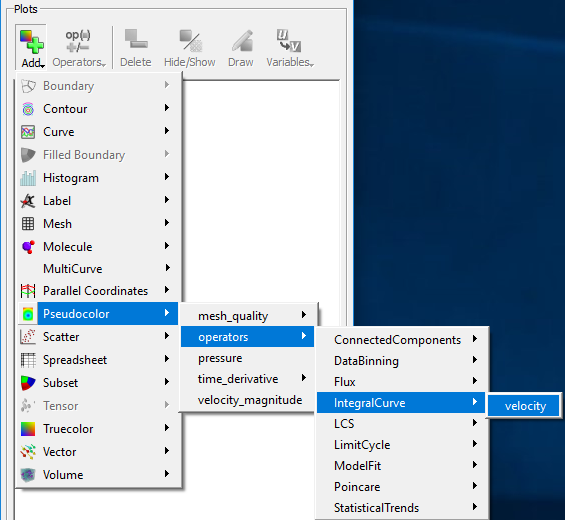
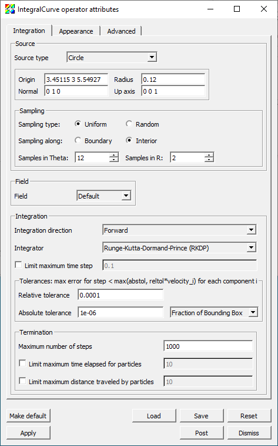
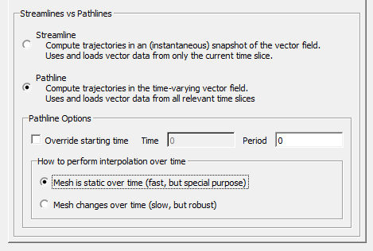
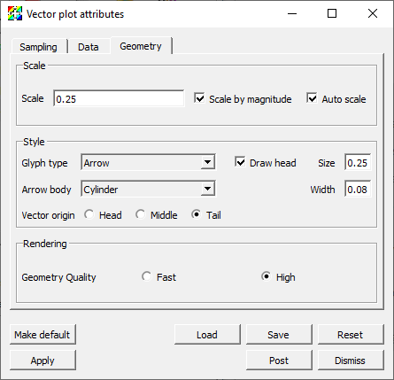
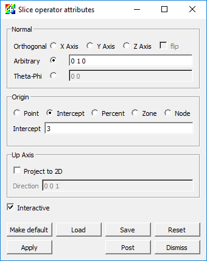
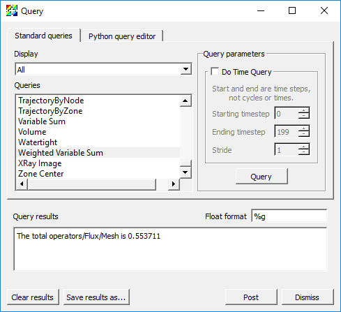

.. _Blood_Flow_Aneurysm:

Aneurysm
========

.. toctree::
    :maxdepth: 2

This tutorial provides a short introduction to VisIt's features while exploring a finite element blood flow simulation of an aneurysm. The simulation was run using the LifeV finite element solver and made available for this tutorial thanks to Gilles Fourestey and Jean Favre, `Swiss National Supercomputing Centre <http://www.cscs.ch/>`_.

Open the dataset
----------------

This tutorial uses the `aneurysm <https://visit-dav.github.io/largedata/datarchives/aneurysm>`_ dataset.

1. Download `the aneurysm dataset <https://visit-dav.github.io/largedata/datarchives/aneurysm>`_.
2. Click on the *Open* icon to bring up the File open window.
3. Navigate your file system to the folder containing "aneurysm.visit".
4. Highlight the file "aneurysm.visit" and then click *OK*.

Plotting the mesh topology
--------------------------

First we will examine the finite element mesh used in the blood flow simulation.

Create a Mesh plot
~~~~~~~~~~~~~~~~~~

1. Go to *Add->Mesh->Mesh*.
2. Click *Draw*.

   Adding a mesh plot.

After this, the mesh plot is rendered in VisIt_'s Viewer window. 
Modify the view by rotating and zooming in the viewer window.

Modify the Mesh plot settings
~~~~~~~~~~~~~~~~~~~~~~~~~~~~~

1. Double click on the Mesh plot to open the Mesh plot attributes window.

   The mesh plot attributes window.

2. Experiment with settings for:

  * *Mesh color*
  * *Opaque color*
  * *Opaque mode* - When the Mesh plot's opaque mode is set to automatic, the Mesh plot will be drawn in opaque mode unless it is forced to share the visualization window with other plots, at which point the Mesh plot is drawn in wireframe mode. When the Mesh plot is drawn in wireframe mode, only the edges of each externally visible cell face are drawn, which prevents the Mesh plot from interfering with the appearance of other plots. In addition to having an automatic opaque mode, the Mesh plot can be forced to be drawn in opaque mode or wireframe mode by selecting the *On* or *Off*. This is best demonstrated with the Pseudocolor plot of pressure present.  
  * *Show internal zones*

You will need to click *Apply* to commit the settings to your plot.

   The mesh plot of the aneurysm.

Query the mesh properties
~~~~~~~~~~~~~~~~~~~~~~~~~

VisIt_'s Query interface provides several quantitative data summarization
operations. We will use the query interface to learn some basic information
about the simulation mesh. 

1. Go to *Controls->Query* to bring up the Query window.
2. Select *NumZones* and click *Query*.

   * This returns the number of elements in the mesh.

3. Select *NumNodes* and click *Query*.

   * This returns the number of vertices in the mesh

Note: The terms "zones", "elements", and "cells" are overloaded in
scientific visualization, as are the terms "nodes", "points", and
"vertices".

Additional exercises
~~~~~~~~~~~~~~~~~~~~

* What type of finite element was used to construct the mesh?
* How many elements are used to construct the mesh? 
* How many vertices are used to construct the mesh? 
* On average, how many vertices are shared per element?

Examining scalar fields
-----------------------

In addition to the mesh topology, this dataset provides two mesh fields:

* A scalar field "pressure", associated with the mesh vertices.
* A vector field "velocity", associated with the mesh vertices.

VisIt_ automatically defines an expression that allows us to use the magnitude
of the "velocity" vector field as a scalar field on the mesh. The result of
the expression is a new field named "velocity_magnitude".

We will use Pseudocolor plots to examine the "pressure" and
"velocity_magnitude" fields.

1. Go to *Add->Pseudocolor->Pressure*.
2. Click *Draw*.
3. Double click on the Pseudocolor plot to bring up the Pseudocolor plot attributes window.
4. Change the color table to *Spectral* and check the *Invert* button.
5. Click *Apply*.
6. Click *Draw*.
7. Click *Play* in the *Time* animation controls above the plot list on the main *GUI* window.

You will see the pressure field animate on the exterior of the mesh as the
simulation evolves. 

   The pseudocolor plot of the pressure.

Experiment with:

* Setting the Pseudocolor plot limits.
* Hiding and showing the Mesh plot.

When you are done experimenting, stop animating over time steps using the
*Stop* button.

Query the maximum pressure over time
~~~~~~~~~~~~~~~~~~~~~~~~~~~~~~~~~~~~

We can use the "pressure" field to extract the heart beat signal. We want to
find the maximum pressure value across the mesh elements at each time step
of our dataset. VisIt_ provides a *Query over time* mechanism that allows us
to extract this data.

First, we need to set our query options to use timestep as the independent
variable for our query.

1. Go to *Controls->Query over time options*.
2. Select *Timestep*.
3. Click *Apply* and *Dismiss*.
 

   The QueryOverTime attributes window.

Now we can execute the *Max* query on all of our time steps and collect the
results into a curve.

1. Click on the Pseudocolor plot to make sure it is active.
2. Go to *Controls->Query* to bring up the Query window.
3. Select *Max*.
4. Check *Do Time Query*.
5. Click *Query*.

This will process the simulation output files and create a new window with
a curve that contains the maximum pressure value at each time. 

   The query over time plot.

Additional exercises
~~~~~~~~~~~~~~~~~~~~

* How many heart beats does this dataset cover?
* Estimate the number of beats per minute of the simulated heart (each cycle is 0.005 seconds).

Contours and sub-volumes of high velocity
-----------------------------------------

Examining the velocity magnitude
~~~~~~~~~~~~~~~~~~~~~~~~~~~~~~~~

Next we create a Pseudocolor plot to look at the magnitude of the "velocity"
vector field. 

1. Delete all your existing plots by selecting them all and clicking *Delete*.
2. Go to *Add->Pseudocolor->velocity_magnitude*.
3. Open the Pseudocolor plot attributes window and set the color table options as before.
4. Click *Draw*.

   The pseudocolor plot of the velocity magnitude.

Notice that the velocity at the surface of the mesh is zero. To get a better
understanding of the flow inside the mesh, we will use operators to extract
regions of high blood flow.

Creating a semi-transparent exterior mesh plot
""""""""""""""""""""""""""""""""""""""""""""""

When looking at features inside the mesh, it helps to have a partially
transparent view of the whole mesh boundary for reference. We will add a
Subset plot to create this view of the mesh boundary. 

1. Uncheck *Apply operators to all plots*.

.. figure:: images/Aneurysm-ApplyOperatorsToAllPlots.png

   The apply operators to all plots setting.

2. Go to *Add->Subset->Mesh*.
3. Open the Subset plot attributes window.
4. Change the color to *Light Blue*.
5. Set the *Opacity* slider to *25%*.
6. Click *Apply*.
7. Click *Draw*.

.. figure:: images/Aneurysm-Subset.png

   The transparent subset plot.

Contours of high velocity
"""""""""""""""""""""""""

Now we will extract contour surfaces at high velocity values using the
Isosurface operator.

1. Select the Pseudocolor plot in the plot list.
2. Go to *Operators->Slicing->Isosurface*.
3. Open the Isosurface operator attributes window.
4. Set *Select by* to *Value*, and use "10 15 20".
5. Click *Apply* and *Dismiss*.
6. Click *Draw* and press the *Play* button to animate the plot over time.

You will see the contour surfaces extracted from the "velocity_magnitude"
field animate as the simulation evolves. 

   The transparent subset plot with iso surfaces of velocity magnitude.

Sub-volumes of high velocity
""""""""""""""""""""""""""""

As an alternative to contours, we can also extract the sub-volume between
two scalar values using the Isovolume operator. 

1. Click *Stop* to stop the animation.
2. Remove the Isosurface operator.
3. Go to *Operators->Selection->Isovolume*.
4. Open the Isovolume operator attributes window.
5. Set the *Lower bound* to "10" and the *Upper bound* to "20".
6. Click *Apply* and *Dismiss*.
7. Click *Draw* and press the *Play* button to animate the plot over time.

   The transparent subset plot with an iso volume of velocity magnitude.

Visualizing the velocity vector field
-------------------------------------

This section of the tutorial outlines using glyphs, streamlines, and pathlines
to visualize the velocity vector field from the simulation.

Plotting the vector field directly with glyphs
~~~~~~~~~~~~~~~~~~~~~~~~~~~~~~~~~~~~~~~~~~~~~~

VisIt_'s Vector plot renders a vector field at each time step as a collection
of arrow glyphs. This allows us to see the direction of the vectors as well
as their magnitude. We will create a vector plot to directly view the
simulated "velocity" vector field. 

1. Go to *Add->Vector->velocity*. 
2. Open the Vector plot attributes window.
3. Go to the *Sampling* tab.
4. Set *Stride* to "5".
5. Go to the *Color* section on the *Data* tab.
6. Change the *Magnitude* to *Spectral*, and check the *Invert* option.
7. Go to the *Geometry* tab.
8. In the *Scale* section, set the *Scale* to "0.5".
9. In the *Style* section, set *Arrow body* to *Cylinder*.
10. In the *Rendering* section, set *Geometry Quality* to *High*.
11. Click *Apply* and *Dismiss*.
12. Click *Draw*.
13. Click *Play*.

   The vector plot of velocity.

Examining features of the flow field with streamlines
~~~~~~~~~~~~~~~~~~~~~~~~~~~~~~~~~~~~~~~~~~~~~~~~~~~~~

To explore the flow field further we will seed and advect a set of streamlines
near the inflow of the artery. Streamlines show the path massless tracer
particles would take if advected by a static vector field. To construct
Streamlines, the first step is selecting a set of spatial locations that
can serve as the initial seed points. 

We want to center our seed points around the peak velocity value on a slice
near the inflow of the artery. To find this location, we query a sliced
pseudocolor plot of the "velocity_magnitude".

1. Go to *Add->Pseudocolor->velocity_magnitude*.
2. Open the Pseudocolor plot attributes window and set the color table options as before.
3. Go to *Operators->Slicing->Slice*.
4. Open the Slice operator attributes window.
5. In the *Normal* section set *Orthogonal* to *Y Axis*.
6. In the *Origin* section select *Point* and set the value to "3 3 3".
7. In the *Up Axis* section uncheck *Project to 2D*.
8. Click *Apply* and *Dismiss*.
9. Click *Draw*.

   The velocity magnitude on a slice.

Query to find the maximum velocity on the slice
"""""""""""""""""""""""""""""""""""""""""""""""

1. Click to make sure the Pseudocolor plot of your "velocity_magnitude" slice is active.
2. Go to *Controls->Query*.
3. Select *Max*.
4. Select *Actual Data*.
5. Click *Query*.

This will give you the maximum scalar value on the slice and the x,y,z
coordinates of the node associated with this value. We will use the x,y,z
coordinates of this node to seed a set of streamlines.

   The result of the velocity magnitude query.

Plotting streamlines of velocity
""""""""""""""""""""""""""""""""

1. Go to *Add->Pseudocolor->operators->IntegralCurve->velocity*.

   Creating a streamline plot with the IntegralCurve operator.

2. Open the IntegralCurve operator attributes window.
3. Go to the *Source* section on the *Integration* tab.
4. Set the *Source type* to *Circle*.
5. Set the *Origin* to the value returned from the max query: "3.45115 3 5.54927", excluding any commas in the input text box.
6. Set the  *Normal* to the y-axis: "0 1 0".
7. Set the  *Up axis* to the z-axis: "0 0 1".
8. Set the *Radius* to "0.12".
9. Go to the *Sampling* section.
10. Set *Sampling along:* to *Boundary*.
11. Set *Samples in Theta:* to "12".
12. Go to the *Advanced* tab.
13. In the *Warnings* section, uncheck all of the warning checkboxes.
14. Click *Apply* and *Dismiss*.

   The IntegralCurve operator attributes.

15. Open the Pseudocolor plot attributes window.
16. Go to the *Data* tab.
17. In the *Color* section set the *Color table* to *Reds*.

   The Pseudocolor attributes for the streamline data.

18. Go to the *Line* section on the *Geometry* tab.
19. Set *Line type* to *Tubes*.
20. Set *Tail* to *Sphere*.
21. Set *Head* to *Cone*.
22. Set the head and tail *Radius* to "0.03".

   The Pseudocolor attributes for the streamline geometry.

23. Click *Apply* and *Dismiss*.
24. Click *Draw*.
25. Use the time slider controls to view a few time steps.

   The streamlines of velocity.

Examining features of the flow field with pathlines 
~~~~~~~~~~~~~~~~~~~~~~~~~~~~~~~~~~~~~~~~~~~~~~~~~~~

Finally, to explore the time varying behavior of the flow field we will
use pathlines. Pathlines show the path massless tracer particles would
take if advected by the vector field at each timestep of the simulation. 

We will modify our previous IntergralCurve options to create pathlines.

1. Set the time slider controls to the first timestep.
2. Open the IntegralCurve attributes window.
3. Go to the *Appearance* tab.
4. In the *Streamlines vs Pathlines* section select *Pathline*.
5. In the *Pathlines Options* section set *How to perform interpolation over time* to *Mesh is static over time*.

   The IntegralCurve operator pathline attributes.

6. Click *Apply* and *Dismiss*.

This will process all 200 files in the dataset and construct the pathlines
that originate at our seed points.  

   The pathlines of velocity.

Calculating the flux of a velocity field through a surface
----------------------------------------------------------

To calculate a flux, we will need the original velocity vector, the normal
vector of the surface, and VisIt_'s Flux Operator. We will calculate the flux
through a cross-slice located at Y=3, at the beginning of the artery.

Creating the slice and showing velocity glyphs
~~~~~~~~~~~~~~~~~~~~~~~~~~~~~~~~~~~~~~~~~~~~~~

First we will directly plot the velocity vectors that exist on the slice
through the 3D mesh. 

1. Delete any existing plots.
2. Go to *Add->Vector->velocity*.
3. Open the Vector plot attributes window.
4. Go to the *Sampling* tab and set the *Fixed number* to "40".
5. Go to the *Geometry* tab. 
6. Set *Arrow body* to *Cylinder*.
7. Set *Geometry Quality* to *High*.

   The Vector plot attributes.

8. Click *Apply* and *Dismiss*.
9. Go to *Operators->Slicing->Slice*.
10. Open the Slice operator attributes window.
11. Set *Normal* to *Arbitrary* and to "0 1 0".
12. Set *Origin* to *Intercept* and to "3".
13. Uncheck *Project to 2D*.
14. Click *Make default*, *Apply* and *Dismiss*.
15. Click *Draw*.

   The Slice operator attributes.

In order to give some context to the Vector plot of velocity on the slice
let's add a Pseudocolor plot of velocity_magnitude on the same slice and
a Mesh plot.

16. Go to *Add->Pseudocolor->velocity_magnitude*.
17. Open the Pseudocolor plot attributes window.
18. Set *Limits* to *Use Current Plot*.
19. Click *Apply* and *Dismiss*.
20. Go to *Operators->Slicing->Slice*.
21. Click *Draw*.
22. Go to *Add->Mesh->Mesh*.
23. Open the Mesh plot attributes window.
24. Set *Mesh color* to *Custom* and select a medium grey color.
25. Click *Apply* and *Dismiss*.
26. Click *Draw*.
27. Zoom in to explore the plot results.

   The velocity on the slice.

The Vector plot uses glyphs to draw portions of the instantaneous vector
field. The arrows are colored according to the speed at each point (the
magnitude of the velocity vector). Next we create an expression to evaluate
the vectors normal to the Slice. These normals should all point in the Y
direction. 

Creating a vector expression and using the DeferExpression operator
~~~~~~~~~~~~~~~~~~~~~~~~~~~~~~~~~~~~~~~~~~~~~~~~~~~~~~~~~~~~~~~~~~~

We will use VisIt_'s pre-defined expression to evaluate the normals on a
cell-by-cell basis.

1. Go to *Controls->Expressions*.
2. Click *New*.
3. Change the *Name* to "normals" and the *Type* to *Vector mesh variable*.
4. Go to *Insert function->Miscellaneous->cell_surface_normal* in the *Standard editor* tab.
5. Go to *Insert variable->Meshes->Mesh* in the *Standard editor* tab.

   The Expressions window.

6. Click *Apply* and *Dismiss*.
7. Return to the Vector plot and change its variable to "normals".

You will then get the error message saying: *The 'normals' expression failed because The Surface normal expression can only be calculated on surfaces. Use the ExternalSurface operator to generate the external surface of this object. You must also use the DeferExpression operator to defer the evaluation of this expression until after the external surface operator*. In fact, VisIt_ cannot use the name *Mesh* which refers to the original 3D mesh. It needs to defer the evaluation until after the Slice operator is applied. Thus, we need to add the Defer Expression operator.

8. Go to *Operators->Analysis->DeferExpression*.
9. Open the DeferExpression operator attributes window.
10. Go to *Variables->Vectors->normals*.

   The DeferExpression window.

11. Click *Apply* and *Dismiss*.
12. Click *Draw*.

   The Vector plot of the normals.

13. Verify that all your normals point in the up (Y) direction.

Calculating the flux on the slice
~~~~~~~~~~~~~~~~~~~~~~~~~~~~~~~~~

We are now ready for the final draw.

1. Go to *Add->Pseudocolor->operators->Flux->Mesh*.
2. Go to *Operators->Slicing->Slice*.
3. Open the Slice operator attributes window.
4. Verify that the default values previously saved are used.
5. Move the Slice operator above the Flux operator.
6. Go to *Operators->Analysis->DeferExpression*.
7. Move the DeferExpression operator above the Flux operator just below the Slice operator.
8. Open the Flux operator attributes window.
9. Set the *Flow field* to "velocity".

   The Flux operator attributes window.

10. Click *Apply* and *Dismiss*.
11. Click *Draw*.

   The Vector plot of the flux.

Verify that you have a display that is cell-centered, and that will vary with
the Time slider

12. Get the numerical value of the flux by query-ing for the *Weighted Variable Sum*.

   The result of the Weighted Variable Sum query.
