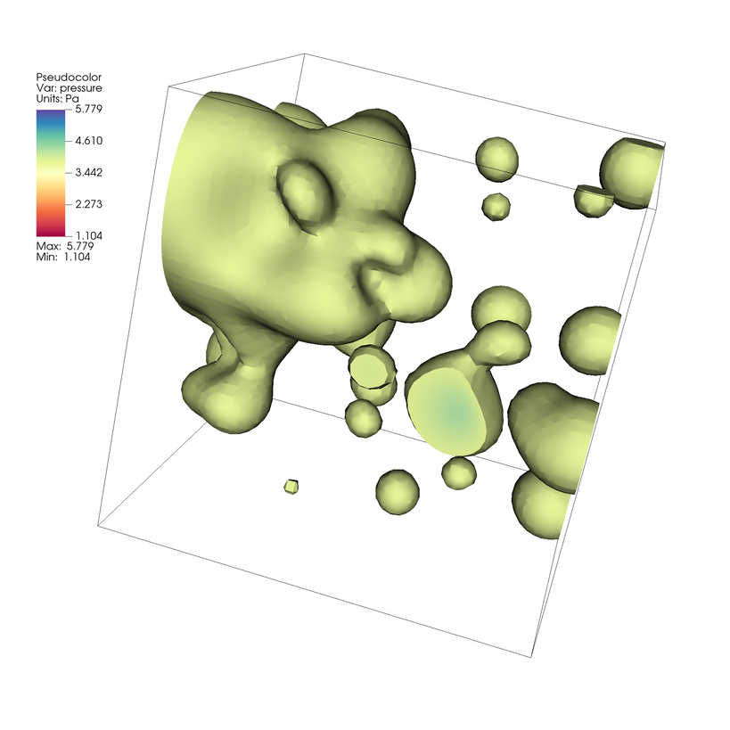

.. _ccl:

Connected Components
=====================

.. toctree::
    :maxdepth: 2

VisIt_ provides an expression and set of queries to help identify and summarize connected subcomponents of a mesh. 
These capabilities can help isolate or compute statistics of complex features embedded in your data.
The connected components algorithm used is unique in that it can not only process simple meshes, but it can also efficiently handle large meshes partitioned in a distributed-memory setting. This tutorial provides an introduction of how to use VisIt's connected components capabilities. The algorithm is not discussed here, for more details on the algorithm see [#ccl_bib_ref]_ .

Open the dataset
----------------

This tutorial uses the "example.silo" dataset from our `tutorial_data <https://visit-dav.github.io/largedata/datarchives/visit_tutorial>`_.

1. Download the `tutorial_data <https://visit-dav.github.io/largedata/datarchives/visit_tutorial>`_ and extract the example files.
2. Start VisIt_ and click the *Open* icon to bring up the File open window.
3. Navigate your file system to the folder containing "example.silo".
4. Highlight the file "example.silo" and then click *OK*.

Use a scalar field to cut our mesh
------------------------------------

This example mesh starts fully connected. First we cut our example mesh to
create a mesh with smaller connected regions that we will label. In the
"example.silo" dataset regions of the high *pressure* values produce an
interesting pattern to explore. In practice, volume fractions or density
values are also useful fields to use.

We compare using two operators, Theshold and Isovolume, to cut the mesh according to a scalar field. These methods produce different mesh topologies which influence the Connected Components Labeling result.

Threshold
~~~~~~~~~~

First, we create a new mesh using the Threshold operator.

#. In the plot list, click *Add->Pseudocolor->pressure*.

#. In the plot list, click *Operators->Selection->Isovolume*

#. Click on the triangle to the left of your Pseudocolor plot and double click 
   Threshold to open up the Threshold attributes. 

#. Once you've opened the Threshold attributes, remove the default row. 
   Add a new variable, select *pressure* and set the Lower bound to *3.9*. 

   .. figure:: images/ccl_thresh_atts.png

      Setting the Isovolume attributes.

#. Click *Apply* and dismiss the Threshold attributes Window.

#. Optionally, open the Pseudocolor attributes Window and change the color table used. These plots use the ``Spectral`` color table.

#. Click *Draw*. You will now see a visualization of the thresholded mesh.

   .. figure:: images/ccl_thresh_render.png

      Visualizing our thresholded example of our dataset.

The Threshold operator simply excludes elements from the mesh based on if the threshold criteria is met.

Isovolume
~~~~~~~~~~ 

Next, we create a new mesh using the Isovolume operator.
We created this in a new viewer window, so we can easily look at both results side-by-side.

#. Create a new viewer window

   .. figure:: images/ccl_new_window.png

      Click to create a new viewer window.

#. Delete any plots in the new window.

#. In the plot list, click *Add->Pseudocolor->pressure*.

#. In the plot list, click *Operators->Selection->Isovolume*

#. Click on the triangle to the left of your Pseudocolor plot and double click Isovolume to open up the Isovolume attributes. 

#. Once you've opened the Isovolume attributes, set Variable to *pressure* and set the Lower bound to *3.9*. 

   .. figure:: images/ccl_isov_atts.png

      Setting the Isovolume attributes.

#. Click *Apply* and dismiss the Threshold attributes Window.

#. Optionally, open the Pseudocolor attributes Window and change the color table used. These plots use the ``Spectral`` color table.

#. Click *Draw*. You will now see a visualization of the cut mesh.

   Visualizing an isovolume from our example of our dataset.

The Isovolume cuts the mesh to include volumes between two Isosurfaces.

Labeling Connected Components with an Expression
-------------------------------------------------

The thresholded mesh has a blocky structure and submeshes remain connected at the edges of blocks. The isovolumed mesh has interpolated cuts, which create a smoother result and less connected submeshes. Next, we use the *conn_components* expression to view and compare connected submeshes for each of these plots.

#. Open the Expressions Window (*Options Menu->Expressions*)

#. Create a new expression named *ccl* with the definition ``conn_components(Mesh)``.

   .. figure:: images/ccl_expr_def.png

      Defining a  *conn_components* expression

#. Click *Apply* and dismiss the Expressions Window.

Now we use the *ccl* expression with our existing pipelines.

Connected Components of Threshold Result
~~~~~~~~~~~~~~~~~~~~~~~~~~~~~~~~~~~~~~~~~

#. Make Window 1 active (The window with the Threshold operator pipeline)

   .. figure:: images/ccl_win_1_active.png

      Changing active window to 1

#. In the plot list, click *Operators->Analysis->DeferExpression*

#. Click on the triangle to the left of your Pseudocolor plot, and double click DeferExpression 
   to open up the DeferExpression attributes. 

#. Once you've opened the DeferExpression attributes, add *ccl* to the list of deferred expressions.

   .. figure:: images/ccl_defer_expr.png

      Setting the DeferExpression attributes. This operator instructs VisIt_ to 
      execute the *ccl* expression on the Threshold result, instead of the original mesh.

#. Click *Apply* and dismiss the DeferExpression attributes Window.

#. Use the Variables menu to change the active variable to *ccl*.

   .. figure:: images/ccl_sel_ccl_expr.png

      Changing active plot variable to *ccl*.

#. Optionally, open the Pseudocolor attributes Window and change the color table used. These plots use the ``Spectral`` color table.

#. Click *Draw*. You will now see the mesh rendered with Connected Component Labels.

   .. figure:: images/ccl_of_thresh.png

      Connected Components of the Threshold Result

We now see a Pseudocolor plot of a new scalar field where each element is associated with its connected component label.
In this case we have 17 connected components labeled using ids 0 - 16.

Connected Components of Isovolume Result
~~~~~~~~~~~~~~~~~~~~~~~~~~~~~~~~~~~~~~~~~

#. Make Window 2 active (The window with the Isovolume operator pipeline )

   .. figure:: images/ccl_win_2_active.png

      Changing active window to 2

#. Repeat the steps above to add a *DeferExpression* operator and set it up to defer the *ccl* expression.

#. Use the Variables menu to change the active variable to *ccl*.

   .. figure:: images/ccl_sel_ccl_expr.png

      Changing active plot variable to *ccl*.

#. Optionally, open the Pseudocolor attributes Window and change the color table used. These plots use the ``Spectral`` color table.

#. Click *Draw*. You will now see the mesh rendered with Connected Component Labels.

   .. figure:: images/ccl_of_isov.png

      Connected Components of the Isovolume Result

Again, we now have Pseudocolor plot of a new scalar field where each element is associated with its connected component label.
In this case we have 19 connected components labeled using ids 0 - 18. You can lock the views between the two windows
to compare the differences in the meshes and identify where the connected components differ.

Using the Connected Component Summary query
-------------------------------------------------

The Connected Components Summary query computes and aggregates all component info and optionally writes this data to an okc file (an XMDF File format) 

The query returns the following details of each component:

.. list-table::
   :widths: 40 30
   :header-rows: 1

   * - Component Data
     - Fields
   * - Component Id
     - comp_label
   * - Centroid
     - comp_x, comp_y, comp_z
   * - Number of Cells (or Zones) per component
     - comp_num_cells
   * - Area (if the dataset is 2D)
     - comp_area
   * - Volume (if the dataset is 3D or RZ)
     - comp_volume
   * - Variable Sum
     - comp_sum
   * - Weighted Variable Sum
     - comp_weighted_sum
   * - Spatial Bounding Box
     - comp_bb_x_min, comp_bb_x_max, comp_bb_y_min, comp_bb_y_max, comp_bb_z_min, comp_bb_z_max
   * - Number of MPI Tasks spanned by the component 
     - comp_num_procs

Next, we use the Connected Components Summary via python on one of our plots to obtain this info.

#. Launch VisIt's Command Line Interface (CLI) (*Controls Menu->Launch CLI*)

   .. figure:: images/ccl_launch_cli.png

      Launch the CLI

#. Run the following code snippets (Example output below is from the Isovolume case)

   *Python Snippet*

   .. code-block:: python

       # Execute our connected components query and get the result 
       Query("Connected Components Summary")
       res = GetQueryOutputObject()

       # Show names in the results dictionary
       print(res.keys())
       
       # Print the array of per component volumes
       print(res["comp_volume"])

   *Output*

   .. code-block:: python

      "Found 19 connected components.\nComponent summary information saved to cc_summary.okc, which can be imported into VisIt"

   .. code-block:: python

      ['comp_bb_x_max', 'comp_bb_z_max', 'comp_sum', 'comp_y', 'comp_num_procs', 'comp_bb_x_min', 'comp_weighted_sum', 'comp_bb_y_min', 'comp_z', 'comp_volume', 'comp_x', 'comp_bb_z_min', 'comp_num_cells', 'connected_component_count', 'comp_bb_y_max']

   .. code-block:: python

       (37.97730226694259, 3.2019942591930146, 1.610134229606217, 33.371787344299676, 907.2334157190477, 4.499707094552377, 0.9447130410516479, 7.414511301985026, 15.064008190720848, 0.18155970817315392, 3.1918362871108457, 22.247388229041434, 2.625056508686029, 78.24442360391282, 2.4172440068352756, 23.494122927868506, 18.57216353121875, 6.944255799937935, 8.499496779401833)

   *Python Snippet*

   .. code-block:: python

       # Print all of the results in a ~human friendly way
       import json
       print(json.dumps(res,indent=2))

   *Output* 

   Lots of text, so we omit it here!

.. [#ccl_bib_ref] C. Harrison, J. Weiler, R. Bleile, K. Gaither, H. Childs. “A Distributed-Memory Algorithm for Connected Components Labeling of Simulation Data” in Topological and Statistical Methods for Complex Data, J. Bennett, F. Vivodtzev, V. Pascucci. Eds. Springer Berlin Heidelberg, pp. 3–21., December 2014
