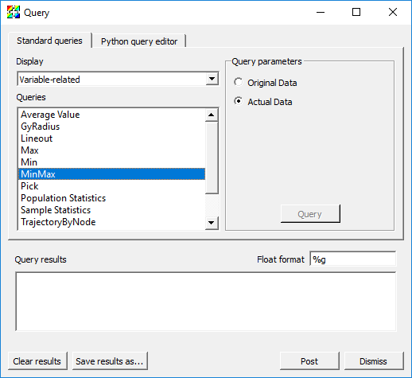
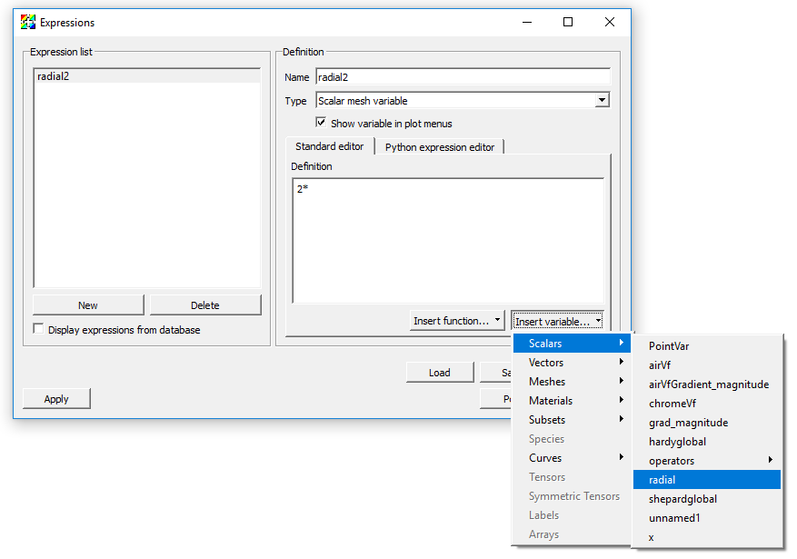

.. _Data_Analysis:

Data Analysis
=============

.. toctree::
       :maxdepth: 2

This section describes two important abstractions in VisIt_: Queries and Expressions.

Queries
-------

What are queries
~~~~~~~~~~~~~~~~

Queries are a mechanism for performing data analysis. 
Example use cases include querying for a number or curve that helps to describe the data set.

Experiment with queries
~~~~~~~~~~~~~~~~~~~~~~~

1. Go to *Controls->Query*.
2. This brings up the Query window.

   The MinMax query

Variable-related
""""""""""""""""

Variable related queries provide information about variables.

1. Change the *Display* in the Query window to be *Variable-related*.
2. Go back to the *GUI*, delete any plots, open up "example.silo", create a Pseudocolor plot of *temp*, and click *Draw*.
3. Highlight *MinMax* and click *Query*.

  * The result will be displayed in the *Query results*. You will see the minimum and maximum values for the variable used by the highlighted plot in the Plot list and their logical and physical coordinates.

4. Apply the Slice operator to your plot.
5. Do another *MinMax* query.

  * It gives you the different results. This is because the Query parameter *Actual Data* is selected. This means the answer will be the minimum and maximum constrained to the slice.

6. Change the Query parameter to be *Original Data*.
7. Do another *MinMax* query.

  * This time the answer will match the result of the first query. It will display the minimum and maximum for what is in the file, not what is on the screen.

1. Now highlight *Variable Sum* and click *Query*.

  * This will sum up the variable values for all cells using the plot highlighted in the Plot list.

2. Now highlight *Weighted Variable Sum* and click *Query*.

  * This will sum up all of the values, but it will weight by area (since you have a slice).
  * For 3D, it will weight by volume.
  * For axi-symmetric 2D calculations, it will weight by revolved volume.

3. Note that both queries have options for doing queries over time (grayed out because we don't have a time varying data set).

  * This is for time varying data and will produce a curve in a separate window.

1. Now highlight *Lineout*.

  * Note that you must have left *Project to 2D* enabled in the Slice operator for this next one to work correctly.

2. Change the start point to "-5 -5 0" and the end point to "5 5 0".
3. Click *Query*.

  * The Lineout query samples data values along a line, producing a 1D dataset from datasets of greater dimension. It creates a new instance of the highlighted plot in the Plot list and copies the plot to another vis window.

4. This is a way to get exact lineouts.
5. You can also take 3D lineouts this way.

1. Now highlight *Pick*.
2. Click *Query*.

  * This will provide information about the zone containing the coordinate "0 0 0".

3. Change the mode to *Pick using coordinate to determine node*.
4. Click *Query*.

  * This will provide information about the node nearest the coordinate "0 0 0".

5. Change the mode to *Pick using domain and element Id*.
6. Click *Query*.

  * This will provide information about the node or zone in the specied domain.

You can also perform a query using the global element id by selecting *Pick using global element Id*. This only works if the file contains global element id information, which this file does not.

Mesh-related
""""""""""""

1. Change the *Display* in the Query window to be *Mesh-related*.
2. Experiment with the *2D area*, *SpatialExtents*, *NumZones*, and *Zone Center* queries.

  * For the *Zone Center* query, you will set the *Domain* to "0".  
  * The domain is used for when you have a parallel file, where the data has been "domain decomposed" for parallel processing.

ConnectedComponents related
"""""""""""""""""""""""""""

1. If you haven't already removed the slice operator, do that now, so you have just a Pseudocolor plot of *temp*.
2. Apply the Isovolume operator.  Change the *Lower bound* of the Isovolume operator attributes to be "4".
3. You will now see a bunch of blobs in space.
4. Change the *Display* in the Query window to be *ConnectedComponents-related*.
5. Perform the *Number of Connected Components* query.

  * It should tell you that there are 15 components.

6. Apply the Clip operator with the default settings.
7. Perform the *Number of Connected Components* query again.

  * It should now say there are 14 components.
  * Operators affect queries.

Queries over Time
-----------------

What are queries over time
~~~~~~~~~~~~~~~~~~~~~~~~~~

Queries over time perform analysis through time and generate a time-curve.

Experiment with queries over time
~~~~~~~~~~~~~~~~~~~~~~~~~~~~~~~~~

Weighted Variable Sum
"""""""""""""""""""""

1. Go to *Controls->Query*.
2. This brings up the Query window.

   The Weighted Variable Sum query

3. Go back to the *GUI*, delete any existing plots, open up "wave.visit", and make a Pseudocolor plot of *pressure*.
4. Find and Highlight *Weighted Variable Sum* and click *Do Time Query*.
5. Options for changing the *Starting timestep*, *Ending timestep* and *Stride* will be available.

  * Note that these are 0-origin timestate indices and not cycles or times.

6. Click *Query*.

  * The result will be displayed in a new Window. By default the x-axis will be cycle and the y-axis will be the weighted summation of the *pressure*.

   The output of the Weighted Variable Sum query over time

Pick
""""

1. Pick can do multiple-variable time curves.
2. Make *Window 2* active, delete the plot, and make *Window 1* active again.
3. Find and Highlight *Pick* in the Query window and click *Do Time Query* to enable time-curve options.

   The Pick query

4. Change the *Variables* option to add *v* using the *Variables->Scalars* dropdown menu.
5. Select *Pick using domain and element Id*. Leave the defaults for *Node Id* and *Domain Id* as "0".
6. Select *Preserve Picked Element Id*.
7. Click *Query*.

  * The result will be two curves in a single xy plot.

8. Make *Window 2* active, delete the plot, and make *Window 1* active again.
9. Change the *Multiple-variable Time Curve options* to *Create Multiple Y-Axes plot*.
10. Click *Query*.

  * The result will be a Multi-curve plot (multiple axes) in *Window 2*.

.. figure:: images/DataAnalysis-QueryPickOutput.png

   The Pick query output

11. **NOTE:**  Time Pick can also be performed via the mouse by first setting things up on the *Time Pick* tab in the Pick window (*Controls->Pick*).

Changing global options
~~~~~~~~~~~~~~~~~~~~~~~

1. Go to *Controls->Query over time options*.
2. This brings up the QueryOverTime window.

   The QueryOverTime window

3. Here you can change the values displayed in the x-axis for all subsequent queries over time.
4. You can also change the window used to display time-curves. By default, the first un-used window becomes the time-curve window, and all subsequent time-curves are generated in the same window.

Built-in queries
----------------

VisIt_ provides a wide variety of built-in queries.
See explanations of these here: :ref:`built-in_queries`

Expressions
-----------

Expressions in VisIt_ create new mesh variables from existing ones. These
are also known as *derived quantities*. VisIt_'s expression system supports
only derived quantities that create a new mesh variable defined over the
*entire* mesh. Given a mesh on which a variable named *pressure* is defined,
an example of a very simple expression is "2\*pressure". On the other hand,
suppose one wanted to sum (or integrate) "pressure" over the entire mesh
(maybe the mesh represents some surface area over which a force calculation
is desired). Such an operation is not an expression in VisIt_ because it
does not result in a new variable defined over the entire mesh. In this
example, summing pressure over the entire mesh results in a single, scalar,
number, like "25.6". Such an operation is supported instead by VisIt_'s
Variable Sum Query. This tends to be true in general; Expressions define
whole mesh variables while Queries define single numerical values (there
are, however, some Queries for which this is not strictly true).

A simple algebraic expression, "2*radial"
~~~~~~~~~~~~~~~~~~~~~~~~~~~~~~~~~~~~~~~~~~~

1. Open up "noise2d.silo".
2. Create a Pseudocolor plot of the variable *radial*.

  * Take note of the legend range, "0...28.28"

3. Go to *Controls->Expressions*.
4. Click on *New* in the bottom left.

  * This will create an expression and give it a default name, "unnamed1".

5. Rename this expression by typing "radial2" into the *Name* field

  * Take note of the *Type* of the variable. By default, VisIt_ assumes the type of the new variable you are creating is a s scalar mesh variable (e.g. a single numerical value for each node or zone/cell in the mesh). Here, we are indeed creating a scalar variable and so there is no need to adjust the *Type*. However, in some of the examples that follow, we'll be creating vector mesh variables and if we don't specify the correct type, we'll get an error message.

6. Place the cursor in the *Definition* pane of the *Expressions* dialog.
7. Type the number "2" followed by the C/C++ language symbol for multiplication, "*".
8. Now, you can either type the name "radial" or you can go to the *Insert Variable...* pulldown menu and find and select the *radial* variable there (see picture at right).

   Using the Expressions window Insert variable

9. Click *Apply*.
10. Now, go to the main VisIt_ *GUI* Panel to the *Variables* pulldown.

  * Note that *radial2* now appears in the list of variables there.

   Expression variable appears in the plot menus

11. Select *radial2* from the pull down and click *Draw*.

  * Visually, the image will not look any different. But, if you take a close look at the legend you will see it is now showing "0...56.57".

Visit supports several unary and binary algebraic expressions including
``+, -, /, \*, bitwise-^, bitwise-&, sqrt(), abs(), ciel(), floor(), ln(), log10(), exp()``
and more.

Accessing coordinates (of a mesh) in expressions
~~~~~~~~~~~~~~~~~~~~~~~~~~~~~~~~~~~~~~~~~~~~~~~~

Here, we'll use the category of *Mesh* expressions to access the coordinates
of a mesh, again, working with "noise2d.silo".

1. Go to *Controls->Expressions*.
2. Click the *New* button and name this expression "Coords".
3. Set the *Type* to *Vector mesh variable* (because coordinates, at least in this 2D example, are a vector quantity).
4. Put the cursor in the *Definition* pane.
5. Go to *Insert Function...* and find the *Mesh* category of expressions and then, within it, find the *coord* function expression.

  * This should result in the insertion of "coord()" in the *Definition* pane and place the cursor between the two parenthesis characters.
  * Note that in almost all cases, the category of *Mesh* expressions expect one or more mesh variables as operands.

6. Now, go to *Insert Variable...* pull down and then to the *Meshes* submenu and select *Mesh*.

  * This should result in *Mesh* being inserted between the parentheses in the definition.

7. Click *Apply*.
8. Now, we'll define two scalar expressions for the "X" and "Y" coordinates of the mesh. While still in the Expressions window,

  1. Click *New*.
  2. Name the new expression "X".

   * Note that VisIt_'s expression system is case sensitive so "x" and "X" can be different variable names.

  3. Leave the type as *Scalar mesh variable*
  4. Type into the definition pane, "Coords[0]"

    * This expression uses the array bracket dereference operator "[]" to specify a particular component of an array. In this case, the *array* being derefrenced is the vector variable defined by "Coords".
    * Note that VisIt_'s expression system always numbers its array indices starting from zero.

  5. Click *Apply*.
  6. Now, repeat these steps to define a "Y" expression for the "Y" coordinates as "Coords[1]".

9. Finally, we'll define the "distance" expression

  1. Click the *New* button.
  2. Give the new variable the name "Dist" (Type should be *Scalar mesh variable*).
  3. Type in the definition "sqrt(X*X+Y*Y)".
  4. Click *Apply*.

Now, we'll use the new "Dist" variable we've just defined to display some data.

1. Delete any existing plots from the plot list.
2. Add a Pseudocolor plot of *shepardglobal*.
3. Add an Isovolume operator.

  * Although this example is a 2D example and so *volume* doesn't seem to apply, VisIt_'s Isovolume operator performs the equivalent operation for 2D data.

4. Bring up the Isovolume operator attributes (either expand the plot by clicking on the triangle to the left of its name in the plot list and double clicking on the Isovolume operator there or go to the *OpAtts* menu and bring up Isovolume operator attributes that way).
5. Set the variable to *Dist*.
6. Set the *Lower bound* to "5" and the *Upper bound* to "7".
7. Click *Apply*.
8. Click *Draw*.

You should get the picture below. In this picture, we are displaying a
Pseudocolor plot of *shepardglobal*, but Isovolumed by our *Dist* expression
in the range "[5...7]".

   Example of using the radial expression

This example also demonstrates the use of an expression *function*, *coord()*
to operate on a mesh and return its coordinates as a vector variable on the
mesh.

VisIt_ has a variety of expression functions that operate on a Mesh including
*area* (for 2D meshes), *volume* (for 3D meshes, *revolved_volume* (for
2D cylindrically symmetric meshes), *zonetype*, and more. In addition,
VisIt_ includes the entire suite of *Mesh quality* expressions from the
`Verdict Library <http://cubit.sandia.gov/public/verdict.html>`_.

Creating vector and tensor valued variables from scalars
~~~~~~~~~~~~~~~~~~~~~~~~~~~~~~~~~~~~~~~~~~~~~~~~~~~~~~~~

If the database contains scalar variables representing the individual
components of a vector or tensor, VisIt_'s Expression system allows you
to construct the associated vector (or tensor). You create vectors in
VisIt_'s Expression system using the curly bracket *vector compose*
"{}" operator. For example, using "noise2d.silo" again as an example,
suppose we want to compose a *Vector* valued expression that has
"shepardglobal" and "hardyglobal" as components. Here are the steps.

1. Go to *Controls->Expressions*.
2. Click the *New* button and set *Name* to "randvec".
3. Be sure to also set the *Type* to *Vector mesh variable*.
4. Place the cursor in *Definition* pane and type "{shepardglobal, hardyglobal}".
5. Click *Apply*.
6. Go to *Plots->Vector*.

  * You should now see *randvec* appear there as a variable name to plot.

7. Add the Vector plot of *randvec*.

In the example above, we used the *vector compose* operator, "{}" to
create a vector variable from multiple scalar variables. We can do the
same to create a tensor variable. Recall from calculus that a rank 0 tensor
is a scalar, a rank 1 tensor is a vector and a rank 2 tensor is a matrix.
So, to create a tensor variable, we use multiple *vector compose* operators
nesting within another *vector compose* operator. Here, solely for the
purposes of illustration (e.g. this isn't a physically meaningful tensor)
we'll use the "X" and "Y" coordinate component scalars we defined earlier
together with the *shepardglobal* and *hardyglobal*.

1. Go to *Controls->Expressions*.
2. Click *New* and set the *Name* to "tensor".
3. Be sure to also set the *Type* to *Tensor mesh variable*.
4. Place the cursor in *Definition* pane and type "{ {shepardglobal, hardyglobal}, {X,Y} }".

  * Note the two levels of curly braces. The outer level is the whole rank 2 tensor matrix and the inner curly braces are each row of the matrix.
  * Note that you could also have defined the same tensor expression using two vector expressions like so, "{randvec, Coords}".

5. Click *Apply*.
6. Add a Tensor plot of *tensor* variable.

   Example of using vector and tensor expressions

Variable compatibility gotchas (tensor rank, centering, mesh)
~~~~~~~~~~~~~~~~~~~~~~~~~~~~~~~~~~~~~~~~~~~~~~~~~~~~~~~~~~~~~

VisIt_ will allow you to define expressions that it winds up determining to
be invalid later when it attempts to execute those expressions. Some common
issues are the mixing of incompatible mesh variables in the same expression
*without* the necessary additional functions to make them compatible.

Tensor rank compatibility
"""""""""""""""""""""""""

For example, what happens if you mix scalar and vector mesh variables
(e.g. variables of different *Tensor rank*) in the same expression?
Again, using "noise2d.silo".

1. Define the expression, "foo" as "grad+shepardglobal" with the *Type* *Vector mesh variable*.

  * Note that *grad* is a *Vector mesh variable* and *shepardglobal* is a *Scalar mesh variable*.

2. Now, attempt to do a Vector plot of *foo*. This works because VisIt_ will add the scalar to each component of the vector resulting a new vector mesh variable
3. But, suppose you instead defined *foo* to be of *Type* *Scalar mesh variable*.

  * VisIt_ will allow you to define this expression. But, when you go to plot it, the plot will fail.

As an aside, as you go back and forth between the Expressions window
creating and/or adjusting expression definitions, VisIt_ makes no attempt
to keep track of all the changes you've made in expressions and
automatically update plots as expressions change. You will have to
manually clear or delete plots to force VisIt_ to re-draw plots in which
you've changed expressions.

In the above example, if on the other hand, you had set type of "foo"
to Scalar Mesh Variable, then VisIt_ would have failed to plot it because
it is adding a scalar and a vector variable and the result of such an
operation is *always* a *Vector mesh variable*. If what you really
intended was a scalar mesh variable, then use one of the expression
functions that converts a vector to a scalar (e.g. *magnitude()* function
or array dereference operator *[]*) to convert the *Vector mesh variable*
in your expression to a scalar mesh variable. So, "grad[i]+shephardglobal"
where "i" is "0" or "1" would work to define a scalar mesh variable.
Or, "magnitude(grad)+shepardglobal" would also have worked.

Centering compatibility
"""""""""""""""""""""""

In "noise2d.silo", some variables are zone centered and some are node
centered. What happens if you combine these in an expression? VisIt_ will
default to zone centering for the result. If this is not the desired
result, use the "recenter()" expression function, where appropriate,
to adjust centering of some of the terms in your expression. For example,
again using "noise2d.silo".

1. Define the *Scalar mesh variable* expression "bar" as "shepardglobal+airVf".

  * For reference, in "noise2d.silo", "shepardglobal" is node centered while "airVf" is zone centered.

2. Do a Pseudocolor plot of "bar".

  * Note that "bar" displays as a zone centered quantity.

3. Now, go back to the expression and recenter "airVf" by adjusting the definition to "shepardglobal+recenter(airVf)".

  * The *recenter()* expression function is a *toggle* in that it will take whatever the variable's centering is and swap it (node->zone and zone->node).
  * The *recenter()* expression function also takes a second argument, a string of one of the values *toggle*, *zonal*, *nodal* to force a particular behavior.
  * Note that when you click *Apply*, the current plot of "bar" does not change. You need to manually delete and re-create the plot (or clear and re-draw the plots).

Finally, note that these two expressions...

* "shepardglobal+recenter(airVf)"
* "recenter(shepardglobal+airVf)"

both achieve a node-centered result. But, each expression is subtly
(and numerically) different. The first recenter's "airVf" to the nodes
and then performs the summation operator at each node. In the second,
there is an implied recentering of "shepardglobal" to the zones first.
Then, the summation operator is applied at each zone center and finally
the results are recentered back to the nodes. In all likelihood this
results in a numerically lower quality result. The moral is that in a
complex series of expressions be sure to take care where you want
recentering to occur.

Mesh compatibility
""""""""""""""""""

In many cases, especially in Silo_ databases, all the available variables
in a database are not always defined on the same mesh. This can complicate
matters involving expressions in variables from different meshes. 

Just as in the previous two examples of incompatible variables where the
solution was to apply some functions to make the variables compatible,
we have to do the same thing when variables from different meshes are
combined in an expression. The key expression functions which enable this
are called *Cross Mesh Field Evaluation* or *CMFE* functions. We will only
briefly touch on these here. CMFEs will be discussed in much greater
detail in a tutorial devoted to that topic.

Again, using "noise2d.silo"

1. Define the expression "gorf" with definition "PointVar + shepardglobal".

  * Note that *PointVar* is defined on a mesh named *PointMesh* while *shepardglobal* is defined on a mesh named *Mesh*.

2. Try to do a Pseudocolor plot of "gorfo". You will get a plot of points and a warning message like this one...

 The compute engine running on host somehost.com issued the following warning:
 In domain 0, your nodal variable "shepardglobal" has 2500 values, but it should have 100.
 Some values were removed to ensure VisIt_ runs smoothly.

So, whats happening here? VisIt_ is deciding to perform the summation
operation on the *PointVar*'s mesh. That mesh consists of 100 points. So,
when it encounters the *shepardglobal* variable (defined on *Mesh* with
50x50 nodes), it simply ignores any values in "shepardgloabl" after the
first 100. Most likely, this is not the desired outcome.

We have two options each of which involves *mapping* one of the variables
onto the other variable's mesh using one of the CMFE expression functions.
We can map *shepardglobal* onto *PointMesh* or we can map *PointVar* onto
*Mesh*. We'll do both here

Mapping *shepardglobal* onto *PointMesh*
""""""""""""""""""""""""""""""""""""""""

1. Define a new expression named "shepardglobal_mapped".
2. Go to *Insert Function...*, then to the *Comparisons* submenu and select *pos_cmfe*.

  * This defines a *position based* cross-mesh field evaluation function. The other option is a *conn_cmfe* or *connectivity-based* which is faster but requires both meshes to be topologically congruent and is not appropriate here.

3. A template for the arguments to the *pos_cmfe* will appear in the *Definition* pane.
4. Replace "<filename:var>" with "<./noise2d.silo:shepardglobal>".

  * This assumes the "noise2d.silo" file is in the same directory from which VisIt_ was started.
  * This defines the *source* or *donor* variable to be mapped onto a new mesh.

5. Replace "<meshname>" with "PointMesh".

  * This defines the *destination* or *target* mesh the variable is to be mapped onto.

6. Replace "<fill-var-for-uncovered-regions>" with "-1".

  * This is needed for position-based CMFE's because the donor variable's mesh and target mesh may not always volumetrically overlap 100%. In places where this winds up being the case, VisIt_ will use this value to fill in.

7. Now with "shepardglobal_mapped" defined, you can define the desired expression, "PointVar + shepardglobal_mapped" and this will achieve the desired result and is shown below.

   The variable Shepardglobal mapped onto a point mesh

Mapping *PointVar* onto *Mesh*
""""""""""""""""""""""""""""""

To be completed. But, cannot map point mesh onto a volumetric mesh. VisIt_
always returns zero overlap.

Combining expressions and queries is powerful
~~~~~~~~~~~~~~~~~~~~~~~~~~~~~~~~~~~~~~~~~~~~~

Suppose you have a database generated by some application code simulating
some object being blown apart. Maybe its a 2D, cylindrically symmetric
calculation. Next, suppose the code produced a "density" and "velocity"
variable. However, what you want to compute is the total mass of some
(portion of) of the object that has velocity (magnitude) greater than
some threshold, say 5 meters/second. You can use a combination of
Expressions, Queries and the Threshold operator to achieve this.

Mass is "density * volume". You have a 2D mesh, so how do you get volume
from something that has only 2 dimensions? You know the mesh represents
a calculation that is cylindrically symmetric (revolved around the y-axis).
You can use the *revolved_volume()* Expression function to obtain the
volume of each zone in the mesh. Then, you can multiply the result of
*revolved_volume()* by *density* to get mass of each zone in the mesh.
Once you have that, you can use threshold operator to display only those
zones with velocity (magnitude) greater than 5 and then a variable sum
query to add up all the mass moving at that velocity.

Here, we demonstrate the steps involved using the "noise2d.silo" database.
Because that database does not quite match the problem assumption described
in the preceding paragraphs, we simply  re-purpose a few of the variables
in the database to serve as our *density* and *velocity* variables in
this example. Namely, we define the expression *density* as an alias for
*shephardglobal* and *velocity* as an alias for *grad*.

   Mass Expression Definition

Here are the steps involved...

1. Go to *Controls->Expressions*.
2. Click *New*.
3. Set the *Name* to "density".
4. Make sure the *Type* is set to *Scalar mesh variable*.
5. Set the *Definition* to "shepardglobal".
6. Click *Apply*.
7. Click *New*.
8. Set the *Name* to "velocity".
9. Make sure the *Type* is set to *Vector mesh variable*.
10. Set the *Definition* to "grad".
11. Click *Apply*.
12. Click *New*.
13. Set the *Name* to "mass".
14. Make sure the *Type* is set to *Scalar mesh variable*.
15. Set the *Definition* to "revolved_volume(Mesh) * density".
16. Click *Apply*.
17. Click the *New* button again (for a new expression).
18. Set the *Name* to "velmag" (for velocity magnitude).
19. Set the *Definition* to "magnitude(velocity)".
20. Go to *Plot->Pseudocolor->mass*.
21. Click *Draw*.

   Mass plot

22. Add *Operator->Threshold*.
23. Open the Threshold operator attributes window.

   Threshold attributes

24. Select the *default* variable and then click *Delete selected variable*.
25. Go to *Add Variable* and select *velmag* from the list of *Scalars*.
26. Set *Lower Bound* to "5".
27. Click *Apply*.

  * Now the displayed plot changes to show only those parts of the mesh that are moving with velocity greater than 5.

   Mass plot after threshold

28. Go to *Controls->Query*.
29. Find the *Variable sum query* from the list of queries.
30. Click the *Query* button. The computed result will be a sum of all the individual zones' masses in the mesh for those zones that are moving with velocity greater than 5.

   The variable sum query result

Automatic, saved and database expressions
~~~~~~~~~~~~~~~~~~~~~~~~~~~~~~~~~~~~~~~~~

VisIt_ defines several types of expressions automatically. For all vector
variables from a database, VisIt_ will automatically define the associated
magnitude expressions. For unstructured meshes, VisIt_ will automatically
define *mesh quality* expressions. For any databases consisting of
multiple time states, VisIt_ will define *time derivative* expressions.
This behavior can be controlled by going to VisIt_'s *Preferences* dialog
and enabling or disabling various kinds of *automatic* expressions.

If you save settings, any expressions you have defined are also saved with
the settings. And, they will appear (and sometimes pollute) your menus
whether or not they are valid expressions for the currently active database.

Finally, databases are also free to define expressions. In fact, many
databases define a large number of expressions for the convenience of
their users who often use the expressions in their post-processing
workflows. Ordinarily, you never see VisIt_'s automatic expressions or a
database's expressions in the Expression window because they are not
editable. However, you can check the *display expressions from database*
check box in the Expressions window and VisIt_ will also show these expressions.
