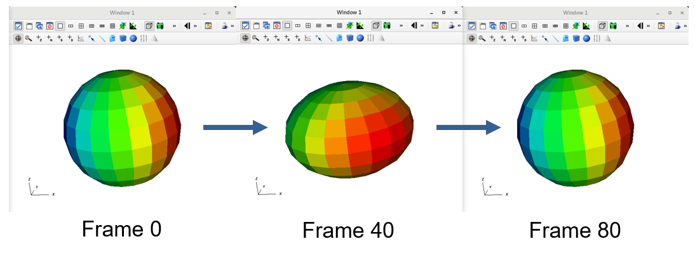

.. _Tutorials_Keyframe_Animation:

Keyframe Animation
==================

.. toctree::
          :maxdepth: 2

This tutorial describes how to use keyframe animations.

There is also a `video <https://youtu.be/tLm_3Vl9rLg>`__ that demonstrates keyframe animation creation using a different example than what is described here.

Keyframe animation overview
---------------------------

Keyframing is an advanced form of animation that allows you create animations where certain animation attributes such as view or plot attributes can change as the animation progresses.
You can design an entire complex animation upfront by specifying a number of animation frames to be created and then you can tell VisIt which plots exist over the animation frames and how their time states map to the frames.
You can also specify the plot attributes so they remain fixed over time or you can make individual plot and operator attributes evolve over time.
With keyframing, you can make a plot fade out as the animation progresses, you can make a slice plane move, you can make the view slowly change, etc.

Using keyframe animation to do modal analysis
---------------------------------------------

Modal analysis is the study of the dynamic properties of linear structures.
It looks for the natural frequencies of a structure.

This tutorial demonstrates using animation to view the results of a modal analysis.

Creating the animation
~~~~~~~~~~~~~~~~~~~~~~

Here we create an animation of elongating a globe using the Displace operator.

Let us start by opening a file, creating a plot, and applying the Displace operator.

1. Open the file ``globe.silo``.
2. Create a Pseudocolor plot of ``dx``.
3. Add the Displace operator.
4. Go to *OpAtts->Transforms->Displace* to bring up the Displace operator attributes window.

   The Displace operator attributes

5. Set the *Displacement multiplier* to ``0``.
6. Set the *Displacement variable* to ``vel``.
7. Click *Apply*.

   Pseudocolor plot of dx with the Displace operator

We will now create a keyframe animation with 81 frames.

8. Go to *Controls->Keyframing*.
9. This will bring up the Keyframe Editor window.
10. Set the *Number of frames* to ``81``.
11. Press *Enter*.
12. Toggle *Keyframing enabled* to on.
13. Click *Apply*.

   The Keyframe Editor after creating the 81 frame animation

We will now set the *Displacement multiplier* to range from ``0`` to ``1`` back to ``0``.

14. Set the *Time* slider on the main control window to ``40``.
15. Set the *Displacement multiplier* to ``1``.
16. Click *Apply*.
17. This will create a Displace operator keyframe at frame 40.
18. Set the *Time* slider on the main control window to ``80``.
19. Set the *Displacement multiplier* to ``0``.
20. Click *Apply*.
21. This will create a Displace operator keyframe at frame 80.

    The Keyframe Editor with the three Displace operator keyframes

Viewing the animation
~~~~~~~~~~~~~~~~~~~~~

Now that we have finished creating our animation we can view it.

1. Set the *Time* slider on the main control window to ``0``.
2. Click the *Play* button.
3. This will play the animation once through.

    Key frames in our animation

Saving the animation
~~~~~~~~~~~~~~~~~~~~

We can also save the animation as a jpeg movie.

1. Go to *File->Save movie* to bring up the Save movie wizard.
2. Click on the *Next>* button to create a new simple movie.
3. Toggle *Specify movie size* to on and set the *Width* to ``1024``.
4. Click on the *->* button to move the definition to the *Output list*.
5. Click the *Next>* button to move to the next wizard pane.
6. Click the *Next>* button to save all the frames.
7. Click the *Next>* button to save the movie with the basename ``movie``.
8. Click the *Next>* button to skip sending an e-mail when the movie is completed.
9. Click the *Finish* button to create the movie.
