MRI
===

.. toctree::
    :maxdepth: 2

This tutorial provides a short introduction to visualizing MRI data using VisIt_. We'll be relying on the Analyze data format, which is developed at the Mayo Clinic.

Open the dataset
----------------

This tutorial uses the `MRI <https://visit-dav.github.io/largedata/datarchives/mri>`_ dataset.

1. Download `the MRI dataset <https://visit-dav.github.io/largedata/datarchives/mri>`_.
2. Click on the *Open* icon to bring up the File open window.
3. Navigate your file system to the folder containing "s01_anatomy_stripped.img".
4. Highlight the file "s01_anatomy_stripped.img" and then click *OK*.

Plotting areas of interest
--------------------------

First, we'll add a Pseudocolor plot and isoloate the visualization to an area that we're interseted in. In this case, it's a human brain located within the dataset.

Create a Pseudocolor plot
~~~~~~~~~~~~~~~~~~~~~~~~~

1. Go to *Add->Pseudocolor->Variable*.

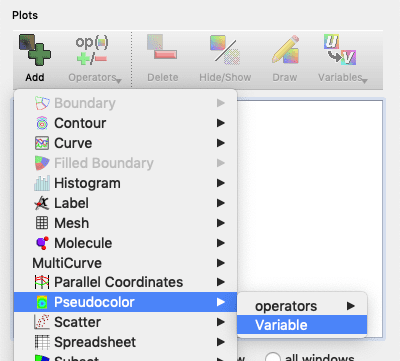

   Adding a Pseudocolor plot.

2. Click *Draw*.

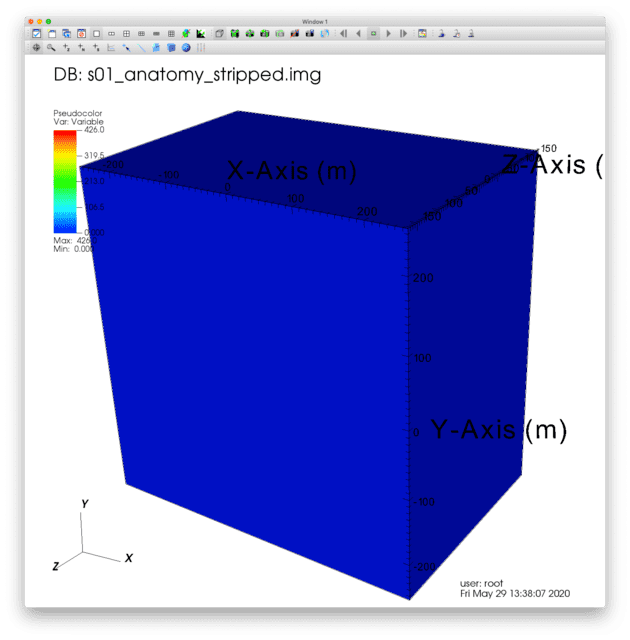

   Visualizing our dataset.

The Pseudocolor plot should now be rendered in VisIt_'s Viewer window.
Modify the view by rotating and zooming in the viewer window.
You'll notice that the visualization doesn't look very interesting at this point. This is because what we're really interested in seeing is hidden within the dataset. 

Add an Isovolume operator
~~~~~~~~~~~~~~~~~~~~~~~~~

Adding an Isolvolume operator will help us remove sections of the dataset that we're uninterested in.

1. Go to *Operators->Selection->Isovolume* to add the Isovolume operator.

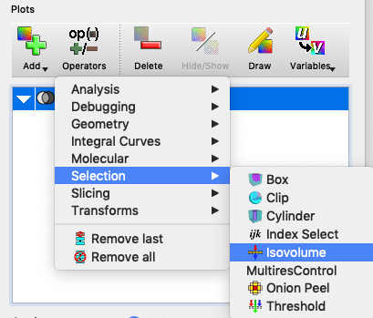

   Adding a Isovolume operator.

2. Click on the triangle to the left of your Pseudocolor plot, and double click Isovolume to open up the Isovolume attributes.

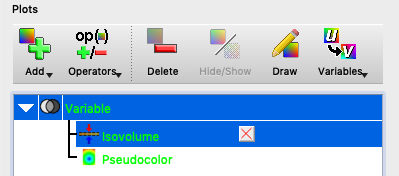

   Opening the Isovolume attributes.

3. Once you've opened the Isovolume attributes, set the Lower bound to 30, and click *Apply*.

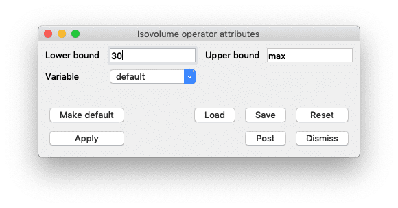

   Changing the Isovolume attributes.

4. Click *Draw*. You will now see a visualization of a human brain.

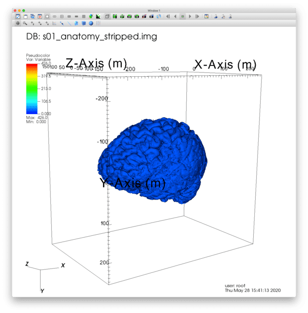

   Visualizing the underlying data of our dataset.

5. You can experiment with changing the lower and upper bounds of the Isolvoume attributes to visualize different sections of the dataset.

Change the color table
~~~~~~~~~~~~~~~~~~~~~~
The default color table doesn't add much to the visualization, so let's change the color table to better suite our needs. In this case, we'll choose Pastel1.

1. Double click Pseudocolor to open up the Pseudocolor attributes.

2. Once there, you can choose your color table.

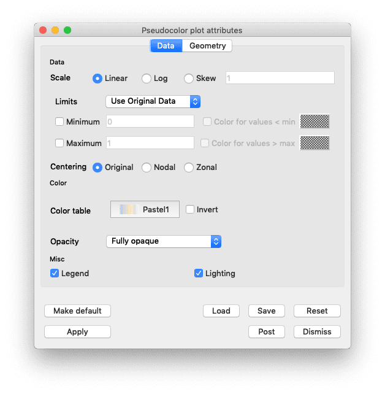

   Changing the color table.

3. Click *Apply* to finalize the change.

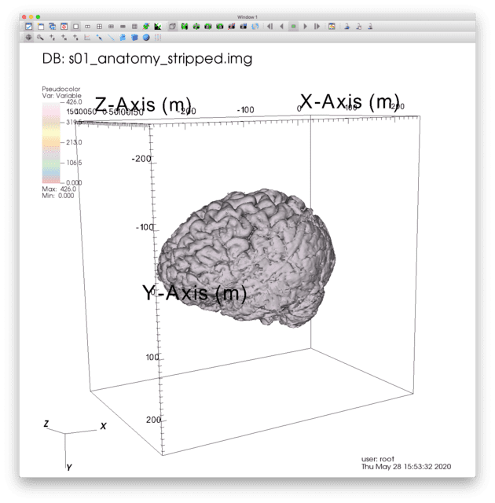

   Visualizing our updated color table.

Exploring our MRI dataset
-------------------------

Now that we've located and visualized the inner section of our dataset, we can further explore characteristics local to this region.

Performing a Slice
~~~~~~~~~~~~~~~~~~

First, we're going to slice out a single cross-section for closer examination.

1. Go to *Operators->Slicing->Slice* to add the Slice operator.
2. Double click on the Slice to bring up the Slice attributes window.
3. There are a lot of options to configure here. For now, we'll leave all of the default settings except for Project to 2D. Uncheck this box.

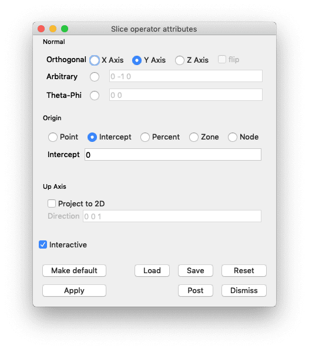

   Changing the Slice attributes.

4. Click *Apply*.
5. Click *Draw*.

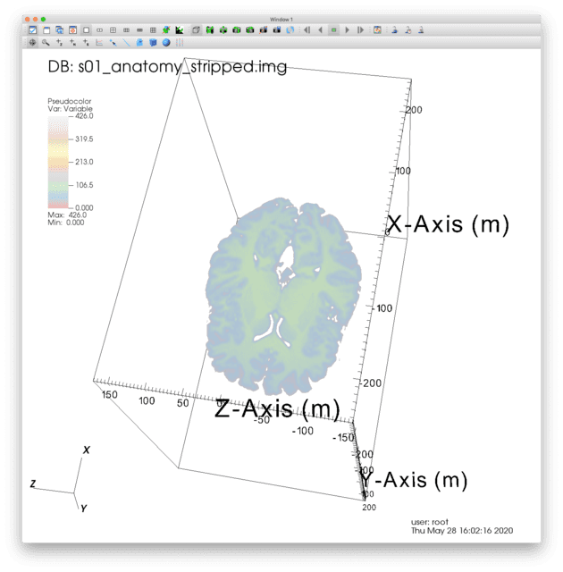

   Visualizing a Slice of our MRI dataset.

Performing a ThreeSlice
~~~~~~~~~~~~~~~~~~~~~~~

Another usefull operator that is similar to Slice is ThreeSlice. This operator creates three axis aligned slices of a 3D dataset, one in each dimension.

1. Remove the Slice operator by clicking the X button to the right of the added Slice.
2. Go to *Operators->Slicing->ThreeSlice* to add the ThreeSlice operator.
3. Double click on the ThreeSlice to bring up the ThreeSlice attributes window. You can move the location of each slice by changing the X, Y, and Z values.

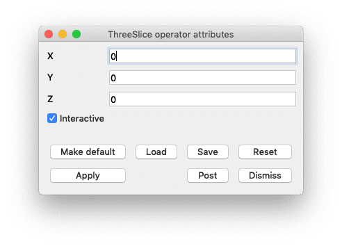

   The ThreeSlice attributes.

4. Click *Apply*.
5. Click *Draw*.

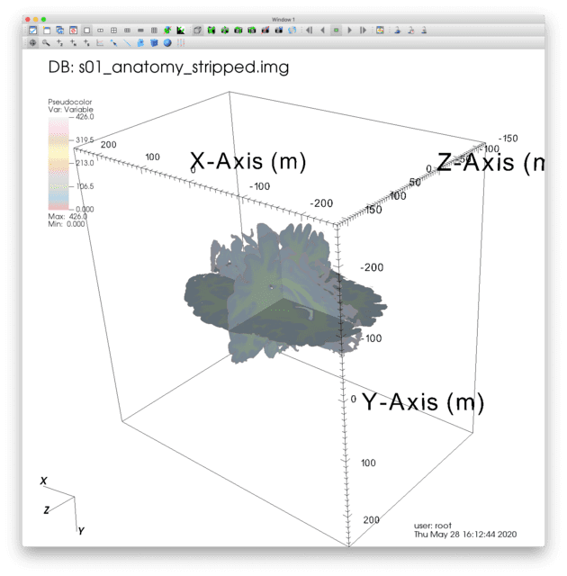

   Visualizing a ThreeSlice of our MRI dataset.

Performing a ThreeSlice using the point tool
""""""""""""""""""""""""""""""""""""""""""""
Along with directly entering the X, Y, Z coordinates for your ThreeSlice in the attributes window, Visit_ also provides the option of using an interactive Point tool for determing these coordinates.

1. In the top left-hand corner of the visualization window, you'll find a button that activates the Point tool. *Click* this button.

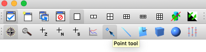

   Activating the Point tool.

2. Once activated, you will see a point surrounded by a red box within the visualization window.

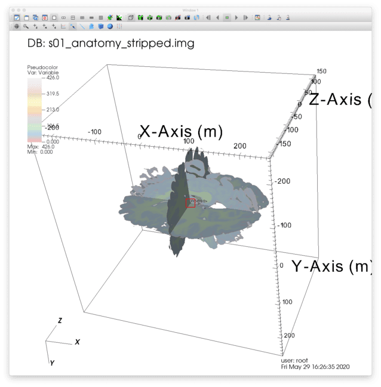

   The activated Point tool.

3. Before changing the orientation of our Point tool, *Click* on the ThreeSlice attributes window so that VisIt_ understands that we want to associate this Point tool with these attributes.
4. *Click* and drag the red box to change the location of the point defining the X, Y, Z coordinates of the ThreeSlice. VisIt_ will automatically update the plot.

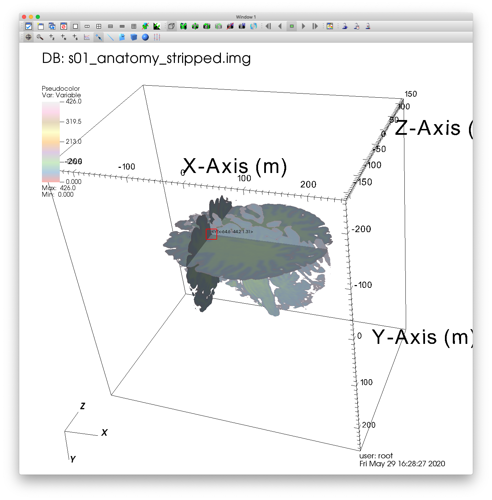

   Performing a ThreeSlice with the Point tool.

5. *Click* the Point tool button again to deactivate the tool.

Performing a Clip
~~~~~~~~~~~~~~~~~

One more way to view the interior of your dataset is to perform a Clip, which clips away entire sections of your data. There are many ways to perform your Clip, each of which has it's own benefits. 

Performing a Clip using a single plane
""""""""""""""""""""""""""""""""""""""

1. Remove the ThreeSlice operator by clicking the X button to the right of the added ThreeSlice.
2. Go to *Operators->Selection->Clip* to add a Clip operator.
3. Double click on the Clip to bring up the Clip attributes window. Again, there are many settings to configure here. The default settings use a single plane for performing the Clip.

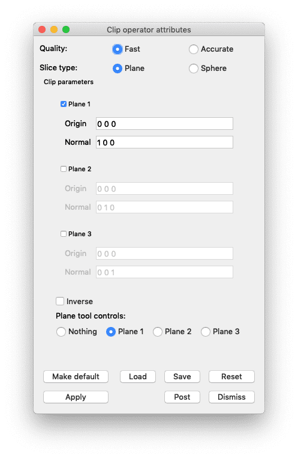

   The Clip attributes.

4. Click *Apply*.
5. Click *Draw*.

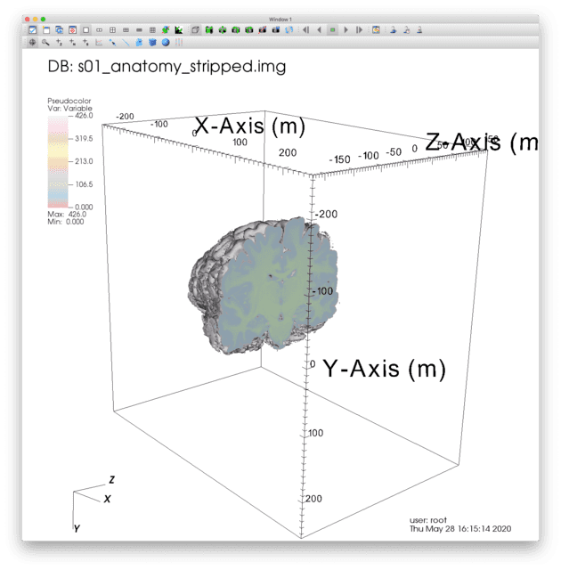

   Visualizing a Clip of our MRI dataset.

Performing a Clip using two planes
""""""""""""""""""""""""""""""""""

1. Return to the Clip attributes window, check the Plane 2 box, and change the normal of Plane 2 to "0 -1 0".

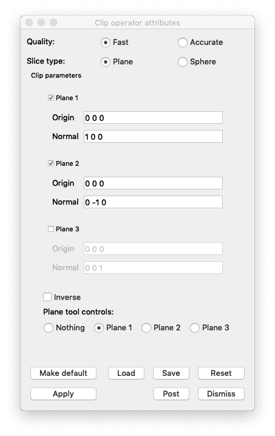

   Altering the Clip attributes.

2. Click *Apply*.

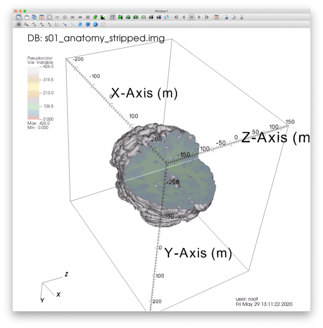

   Visualizing a 2 Plane Clip of our MRI dataset.

Performing a Clip using three planes
""""""""""""""""""""""""""""""""""""

1. Return to the Clip attributes window, and check the Plane 3 box. Next, change the origin of Plane 3 to "0 0 -50".

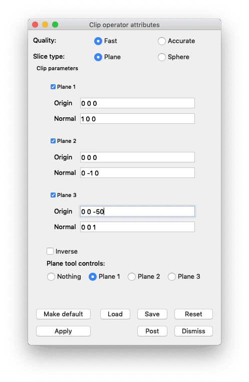

   Altering the Clip attributes.

2. Click *Apply*.

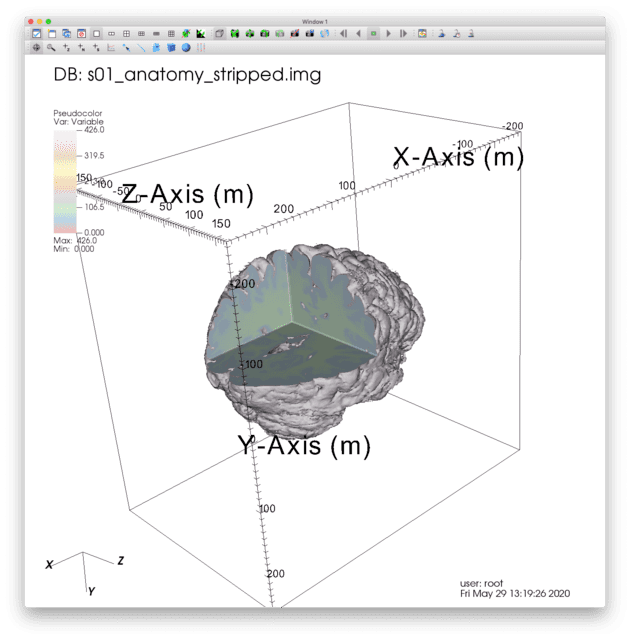

   Visualizing a 3 Plane Clip of our MRI dataset.

Performing a Clip using a sphere
""""""""""""""""""""""""""""""""
Let's update the settings of our Clip so that we remove a spherical section of the data.

1. Double click on the Clip to bring up the Clip attributes window again. Change the Slice type to Sphere. The attribute options should change significantly. Set the Center to "0 100 0", and set the radius to 150.

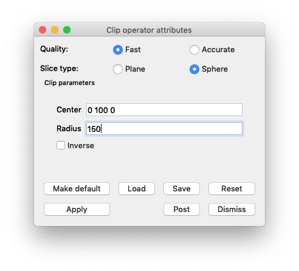

   Changing the Clip attributes.

2. Click *Apply*.
3. Click *Draw*.

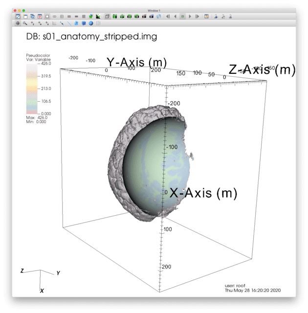

   Visualizing a spherical Clip of our MRI dataset.

Performing a Clip using the Plane tool
""""""""""""""""""""""""""""""""""""""
VisIt_ also provides an interactive Plane tool that can be used to determine your intersecting plane by orienting a 3D axis within the dataset.

1. First, *Click* the Reset button in the Clip attributes window to reset the Clip attributes to their default state.
2. In the top left-hand corner of the visualization window, you'll find a button that activates the Plane tool. *Click* this button.

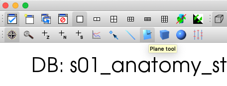

   Activating the Plane tool.

3. Once activated, you will see a 3D axis defining a plane within the visualization window.

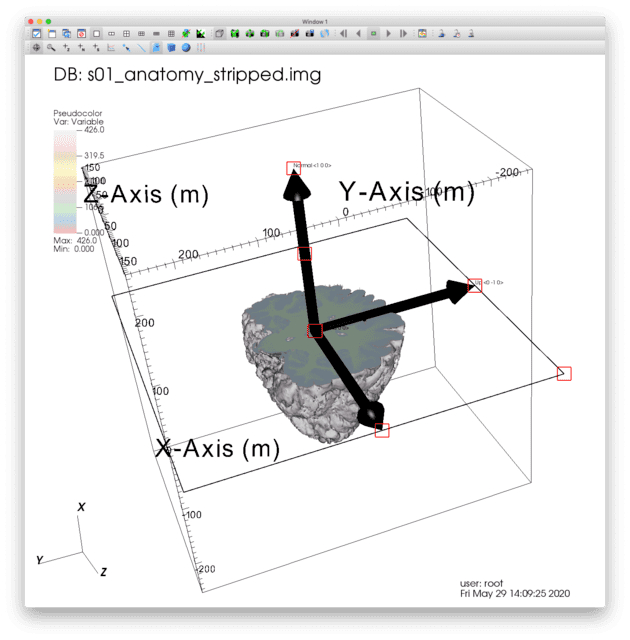

   The activated Plane tool.

4. Before changing the orientation of our Plane tool, *Click* on the Clip attributes window so that VisIt_ understands that we want to associate this Plane tool with these attributes.
5. You will see several red boxes aligned with various points of the Plane tool. Click and drag these red boxes to re-orient the plane you are defining. VisIt_ will automatically perform a Clip at the newly oriented plane.

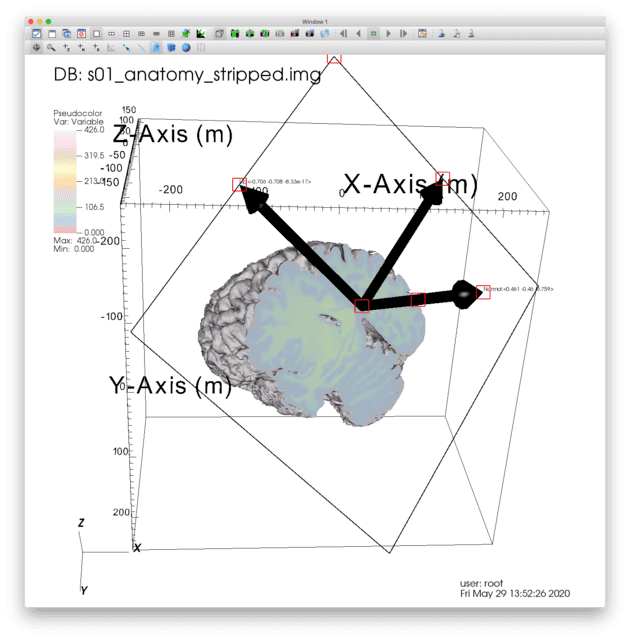

   Performing a Clip with the Plane tool.

Performing a Clip using the Sphere tool
"""""""""""""""""""""""""""""""""""""""
Much like the Plane tool, VisIt_ also provides a Sphere tool, which allows us to interactively define a sphere that can be used to set the Clip attributes.

1. *Click* the Plane tool button to deactivate the Plane tool.
2. *Click* the Sphere tool button, which is in the same row as the Plane tool.

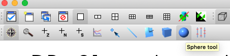

   Activating the Sphere tool.

3. Return to the Clip attributes window and change the Slice type to Sphere. *Click* Apply.

4. You can change the shape and location of the Sphere tool by clicking and dragging the red boxes associated with the Sphere.

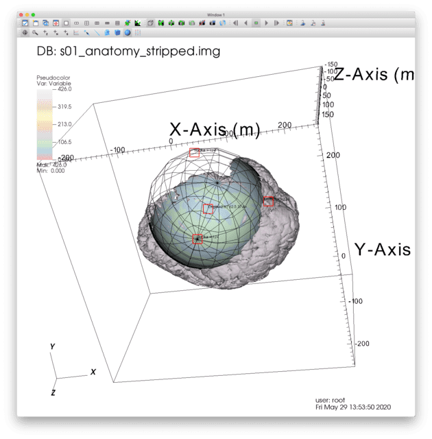

   Performing a Clip with the Sphere tool.
