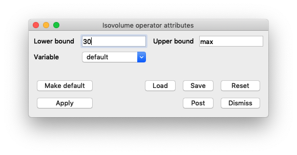
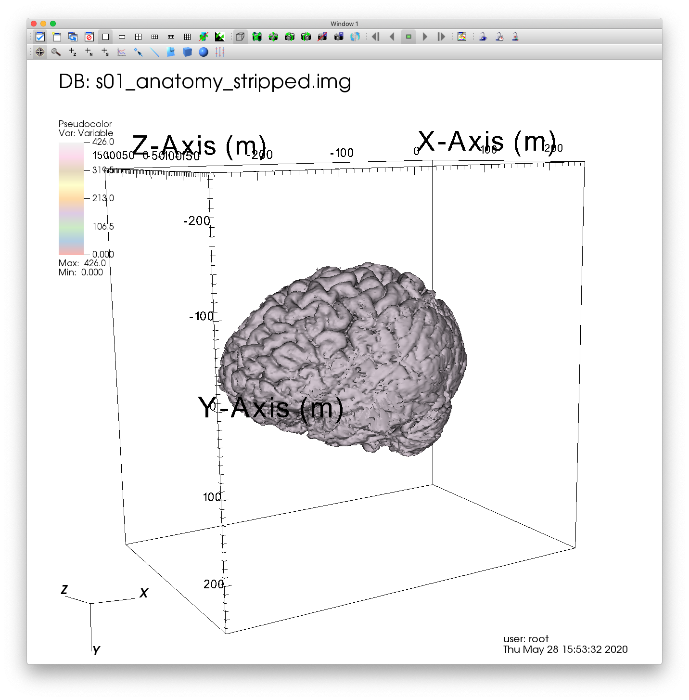
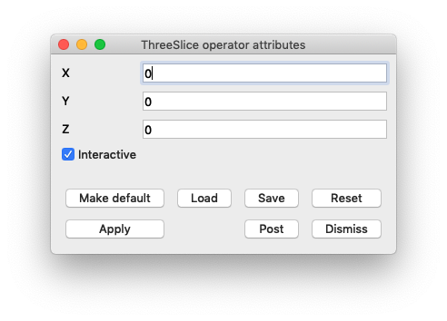
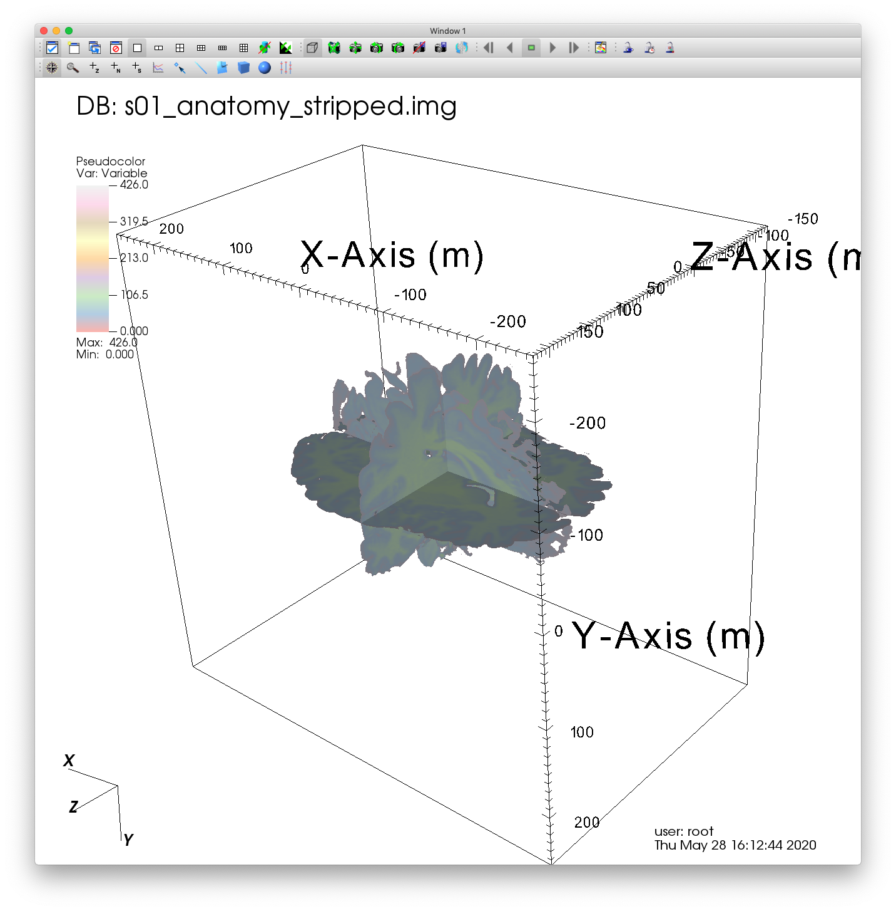
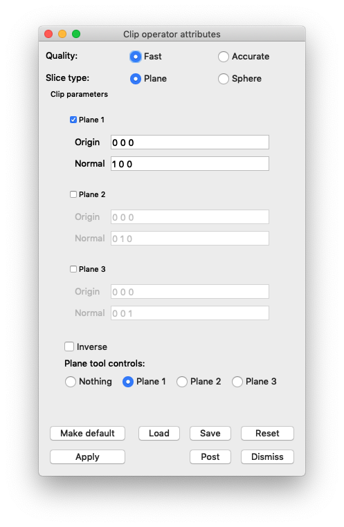
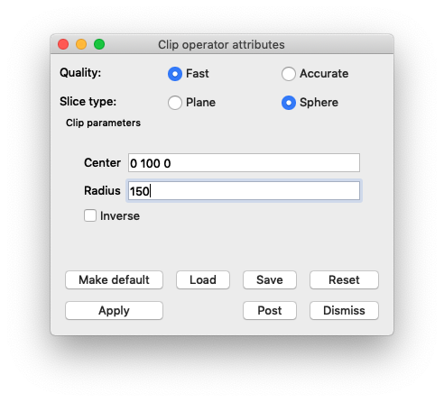

.. _MRI:

MRI
===

.. toctree::
    :maxdepth: 2

This tutorial provides a short introduction to visualizing MRI data using VisIt_. We'll be relying on the Analyze data format, which is developed at the Mayo Clinic.

Open the dataset
----------------

FIXME: add links
This tutorial uses the MRI dataset.

1. Download MRI dataset.
2. Click on the *Open* icon to bring up the File open window.
3. Navigate your file system to the folder containing "s01_anatomy_stripped.img".
4. Highlight the file "s01_anatomy_stripped.img" and then click *OK*.

Plotting areas of interest
--------------------------

First, we'll add a Pseudocolor plot and isoloate the visualization to an area that we're interseted in. In this case, it's a human brain located within the dataset.

Create a Pseudocolor plot
~~~~~~~~~~~~~~~~~~~~~~~~~

1. Go to *Add->Pseudocolor->Variable*.
2. Click *Draw*.

.. figure:: images/MRI_Add_Var.png

   Adding a Pseudocolor plot.

The Pseudocolor plot should now be rendered in VisIt_'s Viewer window.
Modify the view by rotating and zooming in the viewer window.

Add an Isovolume operator
~~~~~~~~~~~~~~~~~~~~~~~~~

You'll notice that the visualization doesn't look very interesting at this point. This is because what we're really interested in seeing is hidden within the dataset. Adding an Isolvolume operator will help us remove sections of the dataset that we're uninterested in.

1. Go to *Operators->Selection->Isovolume*.

.. figure:: images/MRI_Add_Op.png

   Adding a Isovolume operator.

2. Click on the triangle to the left of your Pseudocolor plot, and double click Isovolume to open up the Isovolume attributes.

   Opening the Isovolume attributes.

3. Once you've opened the Isovolume attributes, set the Lower bound to 30, and click *Apply*. You can experiment with this value to see different sections of the dataset.

   Changing the Isovolume attributes.

4. Click *Draw*. You should now see a visualization of a human brain.

.. figure:: images/MRI_Blue_Brain.png

   Visualizing the underlying data of our dataset.

Change the color table
~~~~~~~~~~~~~~~~~~~~~~
The default color table doesn't add much to the visualization, so I suggest changing your color table to better suite your needs. In this case, I'll choose Pastel1.

1. Click on the triangle to the left of your Pseudocolor plot, and double click Pseudocolor to open up the Pseudocolor attributes.

2. Once there, you can choose your color table.

.. figure:: images/MRI_Color_Table.png

   Changing the color table.

3. Click *Apply* to finalize the change.

   Visualizing our updated color table.

Exploring our MRI dataset
-------------------------

Now that we have located and visualized the inner section of our dataset, we can further explore characteristics local to this region.

Performing a Slice
~~~~~~~~~~~~~~~~~~

First, we're going to slice out a single cross-section for closer examination.

1. Go to *Operators->Slicing->Slice*.
2. Double click on the Slice to bring up the Slice attributes window.
3. There are a lot of options to configure here. For now, we'll leave all of the default settings except for Project to 2D. Uncheck this box.

.. figure:: images/MRI_Slice_Op.png

   Changing the Slice attributes.

4. Click *Apply*.
5. Click *Draw*.

.. figure:: images/MRI_Slice.png

   Visualizing a Slice of our MRI dataset.

Performing a ThreeSlice
~~~~~~~~~~~~~~~~~~~~~~~

Another usefull operator that is similar to Slice is ThreeSlice. This operator creates three slices of a 3D dataset, one in each dimension.

1. Remove the Slice operator by clicking the X button to the right of the added Slice.
2. Go to *Operators->Slicing->ThreeSlice*.
3. Double click on the ThreeSlice to bring up the ThreeSlice attributes window. You can move the location of each slice by changing the X, Y, and Z values.

   The ThreeSlice attributes.

4. Click *Apply*.
5. Click *Draw*.

   Visualizing a ThreeSlice of our MRI dataset.

Performing a Clip
~~~~~~~~~~~~~~~~~

One more way to gain access to the subsections of your dataset is to perform a Clip, which clips away entire sections of your data.

1. Remove the ThreeSlice operator by clicking the X button to the right of the added ThreeSlice.
2. Go to *Operators->Selection->Clip*.
3. Double click on the Clip to bring up the Clip attributes window. Again, there are many settings to configure here.

   The Clip attributes.

4. Click *Apply*.
5. Click *Draw*.

.. figure:: images/MRI_Clip.png

   Visualizing a Clip of our MRI dataset.

Performing a spherical Clip
~~~~~~~~~~~~~~~~~~~~~~~~~~~
Let's update the settings of our Clip so that we remove a spherical section of the data.

1. Double click on the Clip to bring up the Clip attributes window again. Change the Slice type to Sphere. The attribute options should change significantly. Set the Center to "0 100 0", and set the radius to 150.

   Changing the Clip attributes.

2. Click *Apply*.
3. Click *Draw*.

.. figure:: images/MRI_Sphere_Clip.png

   Visualizing a spherical Clip of our MRI dataset.
