.. _MakingMovies:

Making Movies
=============

.. toctree::
    :maxdepth: 2

Making movies with VisIt_ runs the gamut from creating a simple movie that
shows the time evolution of a simulation to movies that contain multiple
image sequences, where the image sequences may contain:

1. Titles
2. Fade-ins
3. Image sequences that involve moving the camera around or through the data.
4. Image sequences where each image contains multiple components such as a 3d view of the data and a curve showing the time evolution of a value.
5. Image sequences where operator attributes are modified such as animating a slice plane moving through a data set.

Simple movies can be made with the Save movie wizard and more complex movies
are made using Python scripts. This tutorial will focus on creating simple
movies with the Save movie wizard and using Python scripts.

Creating a movie of a simulation evolving over time
---------------------------------------------------

The simplest type of movie to create is a movie of a simulation evolving
over time. There are several steps to making such a movie.

1. Create a good image for a single time state. This is typically the first or last time state.
2. Animate the movie to make sure the entire movie looks good and change things if they don't.
3. Create the images and encode the movie.

Creating a good image from a single time state
----------------------------------------------

This tutorial uses the **dbreak3d** dataset -- available at
http://www.visitusers.org/index.php?title=Tutorial_Data

The dataset simulates the evolution of water and air in a water tank after
an interface holding a column of water is instantaneously removed.

Display the tank
~~~~~~~~~~~~~~~~

1. Open the file *dbreak3d_boundaries.silo*.
2. Create a Subset plot of *domains*.
3. Click *Draw*.

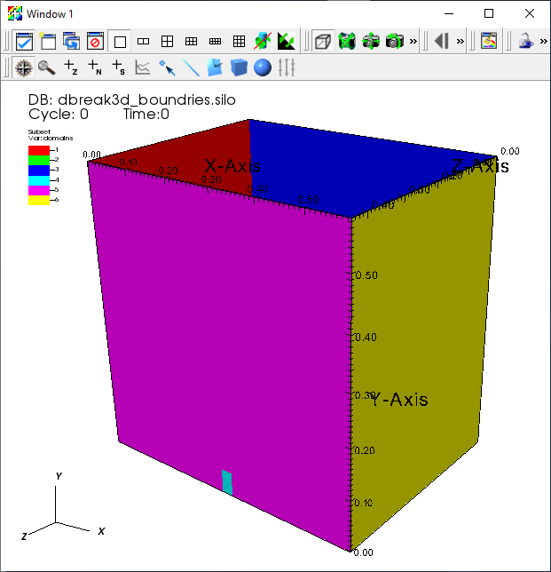

   The default *Subset* plot of the boundaries.

4. The Subset plot shows the different faces that comprise the water tank. We do not want to view all of the boundaries because they will block the fluid data, so next we turn off a few of the boundary faces that are identified as *domains* in the data file.
5. We would like to turn off the magenta and yellow boundaries. From the Subset plot legend we can see that those are *domain5* and *domain6*.
6. Bring up the *Subset* window by clicking on the Ven Diagram next to the Subset plot in the plot list.

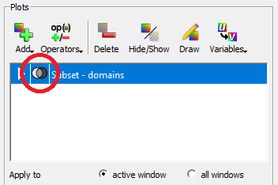

   Bringing up the *Subset* window from the plot list.

7. Click on *domains* to expand the list of domains and deselect *domain5* and *domain6*.

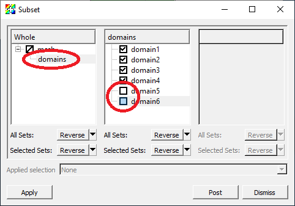

   Removing boundaries with the *Subset* window.

8. Click *Apply*.

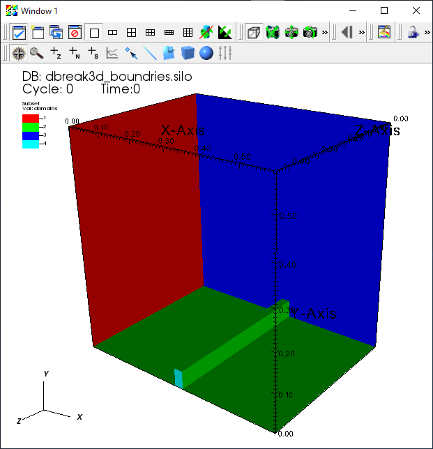

   The *Subset* plot with the boundaries removed.

9. Now let's make all the faces the same color.
10. Double click on the Subset plot in the plot list to bring up the *Subset plot attributes* window.
11. Select *Single* and choose the light pastel green color.

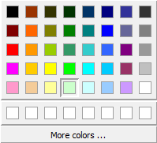

   Changing the colors of the *Subset* plot.

12. Click *Apply* and *Dismiss*.

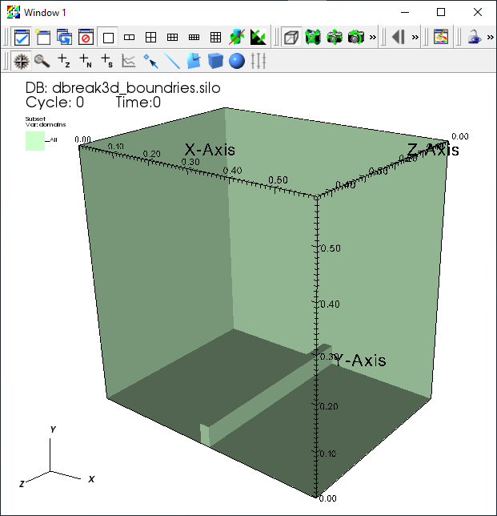

   The *Subset* plot boundaries in a single color.

Display the water
~~~~~~~~~~~~~~~~~

The water information is stored in the file *dbreak3d_fluid.visit* and
contains information about the time evolution of the water. The boundary
of the water can be created using the *alpha1* variable. It represents
the volume fraction of water in a cell. A value of 0.0 means that the
cell doesn't contain any water. A value of 1.0 means that the cell is
completely filled with water. The region containing the water can be
extracted by using the Isovolume operator, selecting the region where
the volume fraction is between 0.5 and 1.0. Let's get started.

1. Open the file *dbreak3d_fluid.visit*.
2. Create a Pseudocolor plot of *alpha1*.
3. Double click on the Pseudocolor plot in the plot list to bring up its attributes.
4. Change the *Color table* to *PuBu*.
5. Change the *Opacity* to *Constant*.
6. Set the *Opacity* slider value to *65%*.
7. Click *Apply* and *Dismiss*.

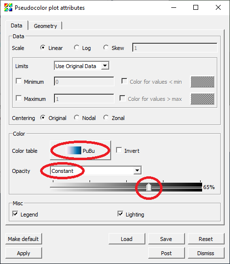

   Setting the *Pseudocolor* attributes for the water.

8. Deselect *Apply operators to all plots* on the main control window below the plot list. This will allow you to apply the Isovolume operator to just the Pseudocolor plot.
9. Go to *Operators->Selection->Isovolume* to add the Isovolume operator to the Pseudocolor plot.
10. Click on the triangle next to the Pseudocolor plot to expand the Pseudocolor plot.
11. Double click on the Isovolume operator to bring up its attributes.
12. Set the *Lower bound* to *0.5*.
13. Select *alpha1* as the *Variable* option.
14. Click *Apply* and *Dismiss*.

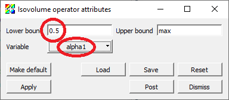

   Using the *Isovolume* operator to select the water.

15. Click *Draw*.

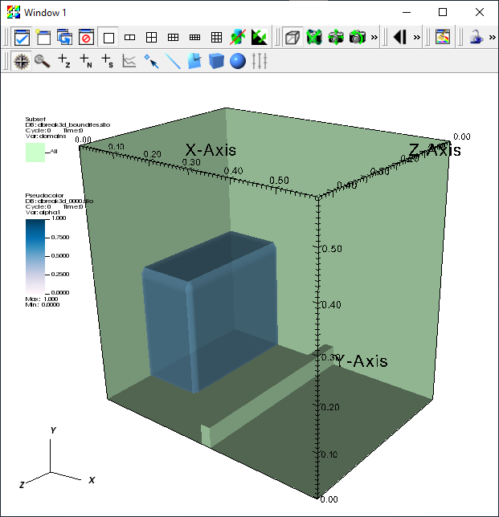

   The boundaries and the water.

Improve the annotations
~~~~~~~~~~~~~~~~~~~~~~~

To make the movie look more polished, we will change the window annotations,
the background color, the lighting and add a time slider.

1. Go to *Controls->Annotation* to bring up the *Annotation* window.
2. Select the *General* tab.
3. Click *No annotations*.
4. Click *Apply*.

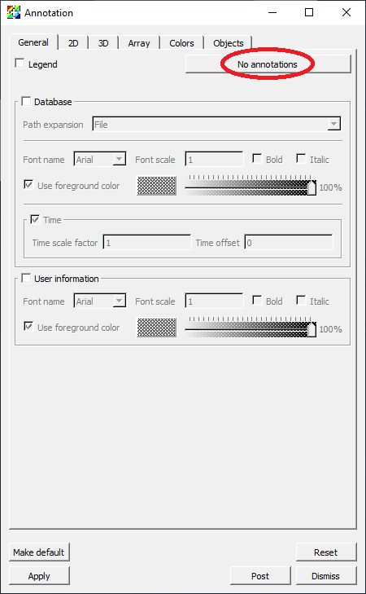

   Turning off all the annotations.

5. Select the *3D* tab.
6. Select *Show bounding box*.
7. Click *Apply*.

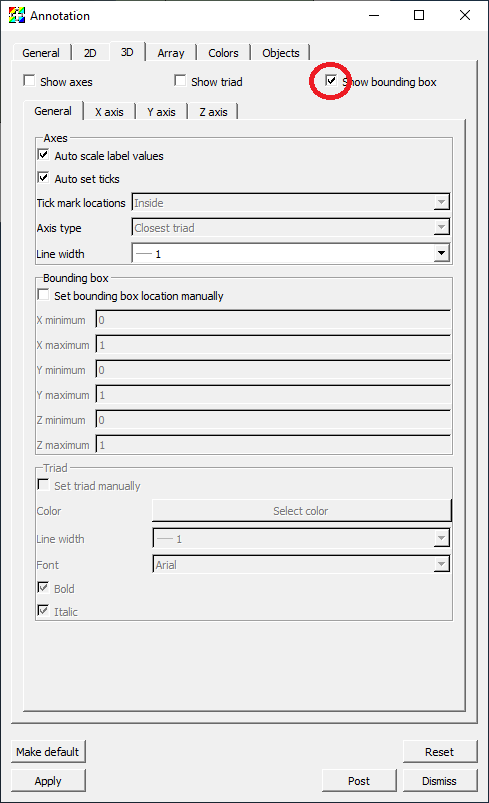

   Adding the bounding box.

8. Select the *Colors* tab.
9. Set the *Foreground color* to be the same color as our tank boundaries plot.
10. Set the *Background style* to *Gradient*.
11. Set the *Gradient style* to *Radial*.
12. Set *Gradient color 1* to be light gray.
13. Set *Gradient color 2* to be very dark gray.
14. Click *Apply*.

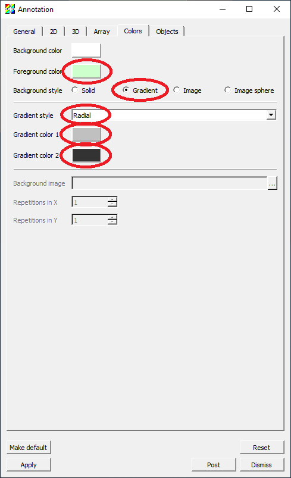

   Setting the foreground and background colors.

15. Select the *Objects* tab.
16. Create a new *Time slider*.
17. Click *Ok* when it prompts you for a name.
18. Set the *Width* to *40%*.
19. Set the *Height* to *7%*.
20. Set the *Start color* to light blue.
21. Set the *End color* to a darker blue.
22. Deselect *Use foreground color*.
23. Set the *Text color* to white.
24. Click *Draw*.

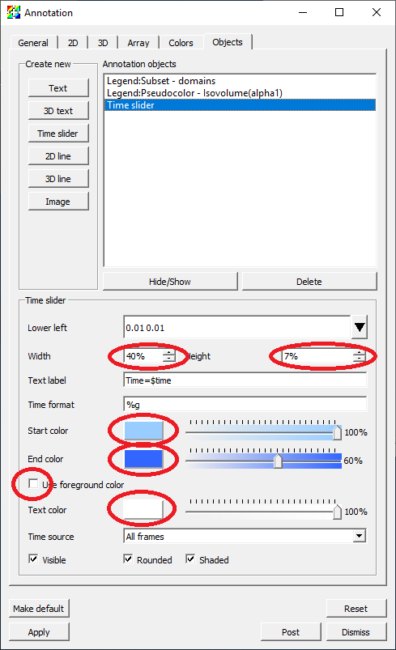

   Setting the time slider attributes.

25. Go to *Controls->Lighting* to bring up the *Lighting* window.
26. Move the light vector up and to the right.
27. Click *Apply*.

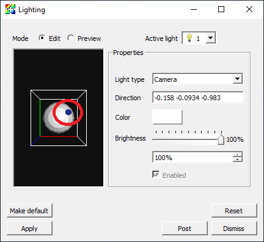

   Setting the light source position.

28. Move the time slider in the main control window to a later time state where the water is splashing up.

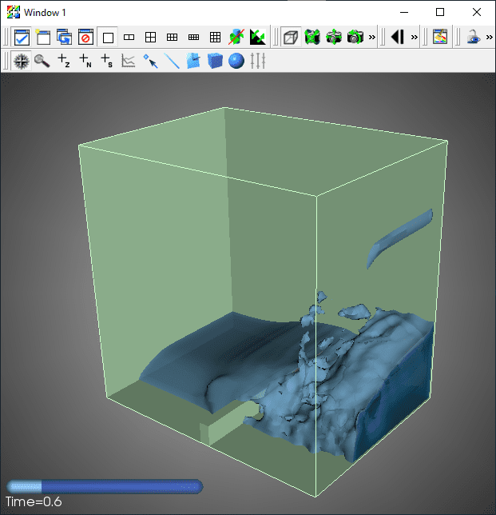

   The final result for an image in the movie.

Encoding the movie with the movie wizard
----------------------------------------

1. Go to *File->Save movie* to bring up the *Save movie wizard* window.
2. Select *New simple movie* and click *Next*.

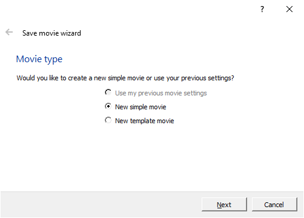

   Using the movie wizard to create a simple movie.

3. Select *Specify movie size*.
4. Ensure the the *lock aspect* setting is selected. While you can encode movies with a different aspect ratio than the aspect ratio of the window on the screen, it is generally not a good idea. Objects are positioned based on a zero to one coordinate system where zero represents either the left edge or the bottom of the image and the heights and widths of objects are based on fraction of the height and width. This causes objects to change position and relative size as the aspect ratio is changed.
5. Change the *Width* to *600*. The *Height* will automatically change to maintain the aspect ratio.
6. Click the right arrow button to create an entry in the *Output* list with the format and resolution information specified on the right hand side of the window. It is possible to change the format and resolution information and click the right arrow button to create additional entries in the *Output* list to encode multiple movies with different settings at once. We are just going to create a single mpeg movie.
7. Click *Next*.

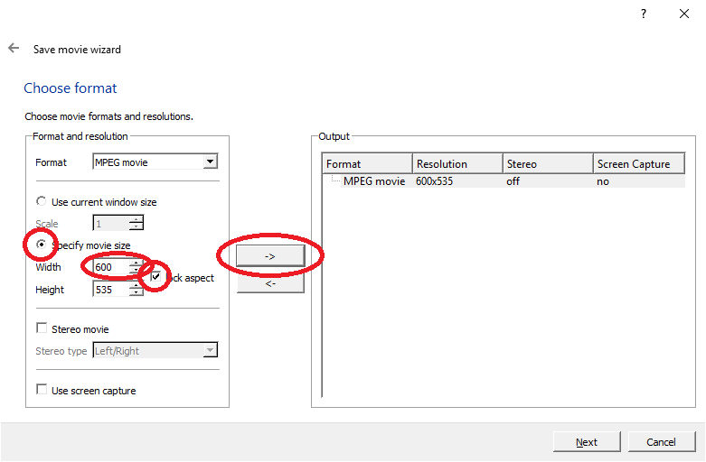

   Setting the movie format and resolution.

8. It is possible to specify the range of time states to use for the movie, as well as specify a stride if you have too many time states saved. The wizard will automatically set the range of time states. We will use all the time states and a stride of one, so we can use the default values.
9. Click *Next*.

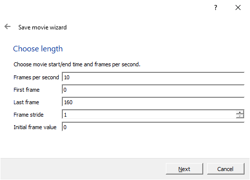

   Setting the length of the movie.

10. You can specify the directory and file name for the movie. We will use the current directory and name the movie *dbreak3d*.
11. Click *Next*.

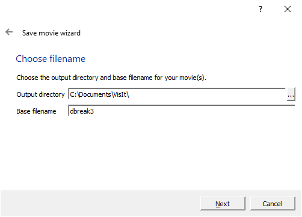

   Setting the name of the movie.

12. You can have VisIt_ send you an e-mail when it has finished creating the movie. Since we will wait for the movie to complete, we don't need an e-mail message to be sent when the movie has been finished and can use the default values.
13. Click *Next*.

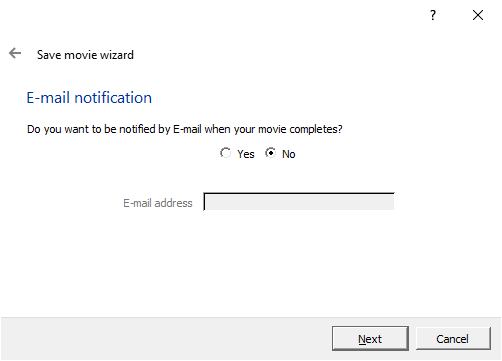

   Setting the e-mail notification for when the movie is complete.

14. You can have VisIt_ generate the movie now using the currently allocated processors, generate the movie with a new instance of VisIt_, or generate the movie at some later time. We will generate the movie now so we can use the default value.
15. Click *Finish*.

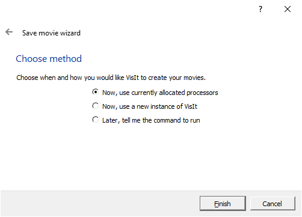

   Creating the movie with the existing processors.

16. This may take a few minutes depending on how fast your computer is. You may want to go get a cup of coffee.
17. A command window will appear while the movie is being generated. When the movie is finished the command window will disappear.
18. On Windows, you may get a window indicating that the VisIt Python Command Line interface has stopped working. If this happens, click on *Close program*. Your movie will have been generated properly.

Playing the movie
~~~~~~~~~~~~~~~~~

You can now play the movie with the native movie player on your system.
On Linux you can use a player such as mplayer. On Mac macOS or Windows you
can typically just double click on the icon for the movie. Note that on
Windows you will need to play the movie with "Windows Media Player" and
not "Movies & TV".

Encoding the movie with a Python script
---------------------------------------

This section of the tutorial is primarily aimed at Linux and Mac macOS
systems. There are usually folder path issues on Windows that will prevent
these Python code snippets from working as shown. In particular, the images
from the image saving may get saved in a different folder from where the
image encoding expects to find them. If you want to get this to work on
Windows, you will need to specify absolute paths for the filenames. At
the moment though, the image encoding won't work at all because there
are issues with absolute paths and paths with spaces in them.

The first step in encoding a movie with a Python script is to create the
images for encoding. The following snippet of Python code will loop over
all the time states and save the images. ::

    # Set the basic save options.
    save_atts = SaveWindowAttributes()
    save_atts.family = 0
    save_atts.format = save_atts.PNG
    save_atts.resConstraint = save_atts.NoConstraint
    save_atts.width = 1200
    save_atts.height = 1068
 
    # Get the number of time steps.
    n_time_steps = TimeSliderGetNStates()
 
    # Loop over the time states saving an image for each state.
    for time_step in range(0,n_time_steps):
        TimeSliderSetState(time_step)
        save_atts.fileName = "dbreak3d%04d.png" % time_step
        SetSaveWindowAttributes(save_atts)
        SaveWindow()

1. Go to *Controls->Command* to bring up the *Commands* window.
2. Copy and paste the code snippet above into the first tab of the *Commands* window.
3. Click *Execute*.

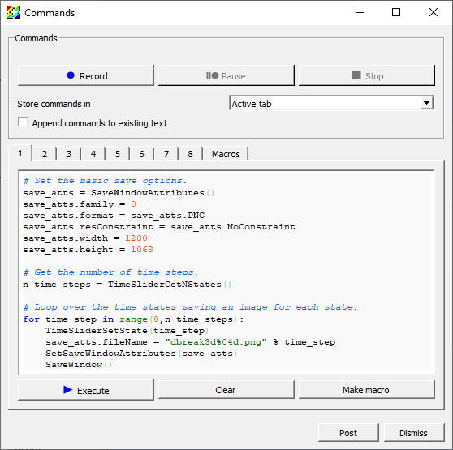

   Saving the movie images with a Python script.

The next step is to encode the movie using the encoder that comes with
VisIt_. You will need the "ffmpeg" encoder to be installed on your system
and in your search path for the encoding module from visit_utils to
function. The following snippet of Python code will load the visit movie
encoding module and encode the movie. ::

    from visit_utils import *
 
    encoding.encode("dbreak3d%04d.png","dbreak3d.mpg",fdup=2)

The first argument specifies the file naming pattern for the input files.
You can use the same format string used to create the images. The movie
encoder doesn't support format strings that have multiple digit sequences
in them, so it is best to keep the name of the input images simple, with
only a single digit sequence.

The second argument is the name of the output file. The extension
determines the file format to create. The available options are: "mpg",
"wmv", "avi", "mov", "swf", "mp4" and "divx". "wmv" is usually the
best choice and plays on most platforms (Linux, macOS and Windows).
"mpg" is lower quality, but should play on any platform.

The last argument specifies the number of times each frame is duplicated.
We are specifying duplicating each image twice. This option is useful
if you don't have a lot of time steps and want to extend the length of
the movie. Movies typically play at 30 frames per second so if you only
have, for example, 60 frames, the movie will only play for about 2 seconds.

1. Copy and paste the code snippet above into the second tab of the *Commands* window.
2. Click *Execute*.

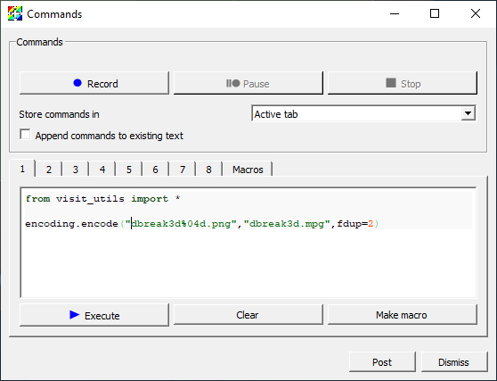

   Encoding the movie images with a Python script.

Other Tips for Making Quality Movies
------------------------------------

Ensure that limits are appropriate and consistent across the entire movie
~~~~~~~~~~~~~~~~~~~~~~~~~~~~~~~~~~~~~~~~~~~~~~~~~~~~~~~~~~~~~~~~~~~~~~~~~

The objects in simulations typically change in size or move in position.
Because of this the view that may be appropriate at the first time step
isn't appropriate at later time states. For example, suppose a simulation
were modeling the explosion of a supernova. As the simulation progresses
the supernova grows in size and at some point most of the supernova may
be outside the view. One possible solution would be to set the size based
on the supernova at the last time state. If this isn't acceptable it may
be necessary to zoom out at a few key points in the simulation to ensure 
that the supernova is still within the view.

Another common issue is that VisIt_ by default will set the extents for
things like the Pseudocolor plot based on the limits of the current time
state. Typically the limits will change over time, which will result in
the meaning of a specific color changing over time. This is typically
not desired behavior for movies. In this case, the limits in the
Pseudocolor plot should be set so that they are appropriate for the
entire time series.

Selecting the resolution
~~~~~~~~~~~~~~~~~~~~~~~~

You should always select an aspect ratio for your movie that shows off
your content the best. One strong consideration is minimizing the amount
of white space in your movie. If your simulation is primarily square then
you will probably want your movie to have a roughly one-to-one aspect
ratio. If it is wider than it is tall then you proably want something
closer to a two-to-one or three-to-two (width-to-height) aspect ratio.
Another important consideration is the type of device you will be
displaying you movie on. These days monitors tend to be wide screen
and a good resolution to have in mind is HDTV (1920 by 1080). It is
probably best to try and add annotations to your movie to fill the
white space so that you can get as close to an HDTV aspect ratio
(16 x 9) as possible.

Rendering images gives the most flexibility
~~~~~~~~~~~~~~~~~~~~~~~~~~~~~~~~~~~~~~~~~~~

If you want to create a movie to show to many people or will be using it
in multiple situations it is best to save images and then manually
encode them using the movie encoding tools in VisIt_, or if you want a
really high quality movie with sound then you can use a third party
movie encoding tool.

If you anticipate using your movie in multiple situations you should
encode it at the highest resolution you expect to need it and then encode
multiple movies at different resolutions. To create the different
resolution movies, you would first resize the images to the desired size
and then encode the movie. A good trick for generating higher quality
anti-aliased movies is to save the images at quadruple the resolution
(two times in each direction) and then resizing them to a quarter of
that resolution before encoding the movie.

Resizing images
~~~~~~~~~~~~~~~

A good tool for resizing image is ImageMagick's convert tool. It is
installed on most Linux and Mac macOS operating systems. If you don't
have ImageMagick installed on your systems and in your search path
the following code snippet will fail. The following snippet of Python
code will run convert to resize the images created earlier to one half
their resolution. ::

    from subprocess import call
 
    for time_step in range(0,n_time_steps,4):
        file1 = "dbreak3d%04d.png" % time_step
        file2 = "dbreak3d_600x534_%04d.png" % time_step
        call(["convert", file1, "-resize", "600x534", file2])

1. Copy and paste the code snippet above into the third tab of the *Commands* window.
2. Click *Execute*.

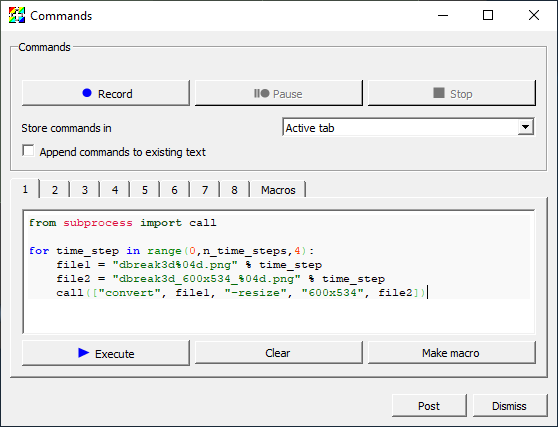

   Resizing the movie images with a Python script.

Convert can also be used to do other types of image manipulations such
as cropping a flipping images. To learn more about convert google
*ImageMagick convert*.

Higher quality encoding with ffmpeg
~~~~~~~~~~~~~~~~~~~~~~~~~~~~~~~~~~~

You can get higher quality encoding using *ffmpeg* instead of VisIt_'s built-in *mpeg2encode*.
If VisIt_ finds *ffmpeg* in your search path it will use that instead of the built in encoder.

You can obtain *ffmpeg* from the `ffmpeg download site <https://www.ffmpeg.org/download.html>`_.
Scroll down a bit until you get to a section labeled *Get packages & executable files*.
Click on the icon representing the OS you desire, this will change the text below the three logos.
Choose and click one of the options and you will be taken to a page with downloads or package information.

You may be able to install *ffmpeg* on Linux with the standard package manager for the flavor of Linux you are running.
For example, to install on Ubuntu::

    apt-get update
    apt-get install -y ffmpeg

