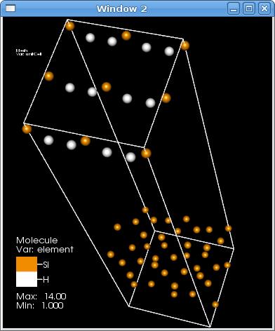
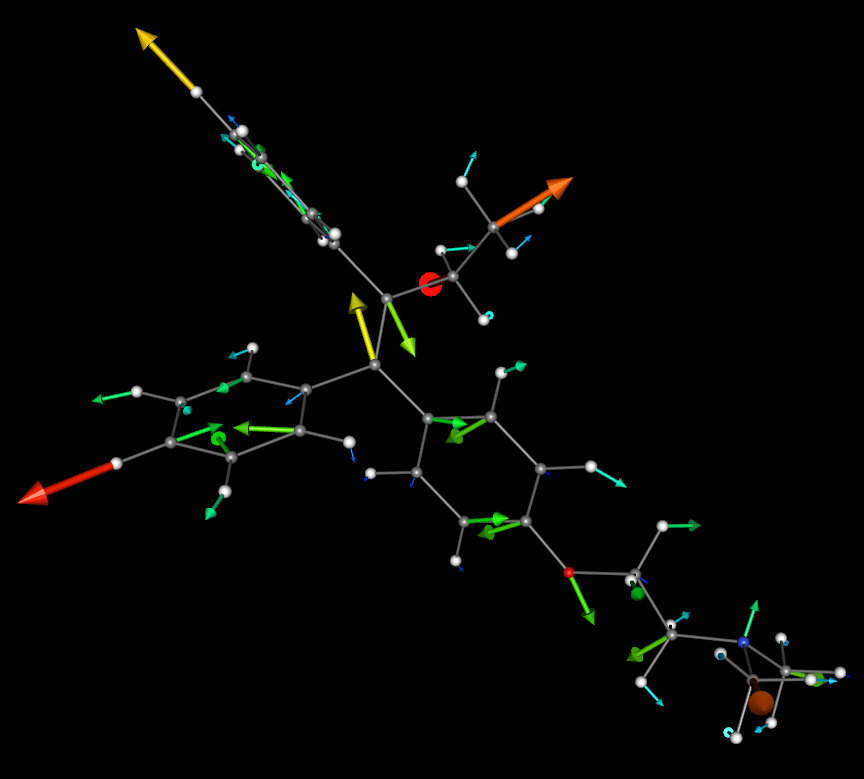

.. _moleculardatafeatures_head:

Molecular data features
~~~~~~~~~~~~~~~~~~~~~~~
The basics of Molecular data visualization in VisIt_ are found in the :ref:`molecule_plot_head`, the :ref:`createbonds_operator_head` and the :ref:`replicate_operator_head`.

Replicate and CreateBonds Examples
""""""""""""""""""""""""""""""""""

.. _molecule_replicate_norep:

   This image shows the original data set, with the original data set's unit cell drawn.
   (The unit cell happens to be orthogonal, but is not actually axis-aligned).
   No replications and no bond creation have yet been applied.

.. _molecule_replicate_boundaries:

   In this image, the :ref:`replicate_operator_head` was applied, with no replications (i.e. X/Y/Z replication counts remaining at 1,1,1), but with the **periodically replicate atoms at unit cell boundaries** feature enabled.  

.. _molecule_replicate_2x:

   Now the replication values have been changed in this image to "2,1,1", with the replication vectors being used as-specified in the file to correspond to the unit cell of the problem.

 
.. _molecule_replicate_wrongbonds:

   This image shows the incorrect result (missing bonds between unit cell instances) occurring in two conditions: either the :ref:`createbonds_operator_head` was applied before replication, or the :ref:`replicate_operator_head` did not have the **Merge into one block** box checked.

.. _molecule_replicate_rightbonds:

   This shows the correct behavior: the **Merge into one block** box was checked, and the :ref:`createbonds_operator_head` was applied after replication, thus allowing bonds to span unit cell instances.

Other plots and operators
"""""""""""""""""""""""""

The following images show plots and operators you might use to explore your data apart from the :ref:`molecule_plot_head` and related operators.
These examples show charge density and force vectors associated with the raw molecular positions and species, all combined in the same window as a :ref:`molecule_plot_head`. 

Pseudocolor Plot and ThreeSlice Operator
''''''''''''''''''''''''''''''''''''''''

.. _mol_plot_pc_charge_threeslice:

   In this image, the charge density grid is shown using the :ref:`pseudocolor_plot_head`, with moderate transparency, after applying the :ref:`ThreeSlice operator` to the grid around a point near the center of the molecule. 

Contour Plot on a 3D Structured Grid
''''''''''''''''''''''''''''''''''''

.. _mol_plot_charge_isosurf:

   In this image,  a :ref:`contour_plot_head` has been applied the charge density grid, with a single low-density value, and some transparency so that the molecule itself is still visible. Note that if you have more than one variable on your grid, for more flexibility you might choose to use the :ref:`Isosurface operator` over one variable and color using the :ref:`pseudocolor_plot_head` on a second variable.

Volume Plot of the 3D Grid
''''''''''''''''''''''''''

.. _mol_plot_vol_charge:

   This shows a :ref:`volume_plot_head` of charge density. Note that the :ref:`volume_plot_head` has a continuously adjustable opacity and by nature allows farther parts of the data to show through to the front, allowing the whole data set to be involved in the final picture. 

Isocontour Lines on a Slice
'''''''''''''''''''''''''''

.. _mol_plot_charge_iso_slice:

   Here we used the :ref:`contour_plot_head` on a slice through the data, with a thicker line width, and a continuous color table to show the increasing charge density.

Vector Plot of Forces on Point Data
'''''''''''''''''''''''''''''''''''

.. _mol_plot_vectors:

   This image shows a :ref:`vector_plot_head` of the force vectors on the atomic data itself. Vectors are both colored and sized using the magnitude of the force vector. 

Analysis Capabilities
"""""""""""""""""""""

Subset Selection
''''''''''''''''
The screenshot in :numref:`Figure %s <molecule_subset_enumeration>` shows the same plot in two windows, but with different subset selection.
The top image shows the standard Molecule plot of a data set.
The bottom shows the :ref:`molecule_plot_head`, but with the "Subset" set to de-select Oxygen atoms.

.. _molecule_subset_enumeration:

   A molecule plot and a subsetted molecule plot

Various file format readers may present a different set of subsets to the user through VisIt.
For example, the *Protein Data Bank* reader presents compounds, residues, and atom type. 
The *VASP* reader presents only the atom type, but is smart enough to restrict the choice to only those elements actually present in the file (while the *PDB* reader presents all 100+ element types). 

Atomic Color Tables
'''''''''''''''''''

VisIt_ includes a variety of color tables, some for continuous variables and some for discrete variables.
For molecular plots, such as ones coloring atoms by their species, VisIt_ includes color tables which match up with residue types or atomic numbers and have similar colors to conventional ones used.
The ones included with VisIt for atomic numbers are called "cpk_rasmol" and "cpk_jmol", and for residue types are "amino_rasmol" and "amino_shapely".

However, you can also create your own.
The easiest way is to start by selecting one of these, typing a new name, e.g. "my_atom_colors", and clicking the **New** button.
This makes a copy of the selected color table with the new name.
You can then edit the colors at will, and when you Save Settings (in the Options menu), it will keep your new color tables in future sessions.

Note that in :numref:`Figure %s <molecule_colortables>`, you see one of the features of the color table editor for atomic data, which is to provide hint labels for the colors in the grid.
Normally these are displayed as numbers, but for atomic color tables it will display the element's symbol instead. 
Note: VisIt_ assumes if the number of colors matches what is in the provided atomic number color tables (which is 110) that it is an atomic color table.
So make sure if you're creating a new atomic color table to create one with the correct number of color values. 

.. _molecule_colortables:

   A color table for plotting molecules

Expressions
'''''''''''

Basic Expression Support
^^^^^^^^^^^^^^^^^^^^^^^^

Numeric expressions, created in VisIt_'s Expressions window, are compatible with molecular data types.
For example, if one created the variable "zcoord" as a Scalar, defined as "coords(mesh)[2]" (where "mesh" is the name of the mesh in your data file containing the atomic data), then it will create a new value, centered at the atoms, of the value of the Z coordinate of the atoms. 

.. _Mol_expr_degree:

.. figure:: images/Mol_expr_degree.png
   :scale: 60%

   Molecule Plot of "degree(mesh)-1" (subtracting 1 because the atom itself is a cell in VTK)

.. _Mol_expr_xcoord:

   Molecule Plot of the X coordinates of the atoms via the expression "coords(mesh)[0]"

Enumerate Expression
^^^^^^^^^^^^^^^^^^^^

One useful expression for some molecular data files is the :ref:`Enumerate Expression <Enumerate_Expression_Function>`.
The most common use case is if your data file contains only a species type index, such as {0, 1, 2, etc.}, but does not have support for mapping this index to an actual atomic number.
In this case, some molecular operations in VisIt_, which require an atomic number (often called "element"), will not work.
In this case, you can use the :ref:`Enumerate Expression <Enumerate_Expression_Function>` to map, e.g. "0" to "14" (Si), "1" to "80" (Hg), etc.
Typically you want to call this new scalar variable "element" as this is the convention VisIt_ follows by default for this variable (though in some plots/operators you can specify a different one).

For example, the LAMMPS readers and VASP POSCAR reader do not have intrinsic knowledge of which type of atom in the file maps to which atomic number -- but they do report the atom type (0,1,2...) as a variable called "species".
To enable the VisIt_ features which use atomic number, define a new expression, called "element", of type "Scalar Mesh Variable", with the definition "enumerate(species, [14,80,8])", which maps the first type to Si, the second to Hg, and the third to O. 

.. _Mol_enum_species:

   Molecule Plot of "species" directly from file.
   Note that it's simply a continuous scalar field as far as VisIt_ is concerned, and can't be used for atomic properites 

.. _Mol_enum_element:

   Molecule Plot of "element" expression defined as an enumeration of "species".
   Note that the Molecule plot can use this element variable to determine atomic radius. 

Enhanced Rendering
''''''''''''''''''

Plot Quality
^^^^^^^^^^^^

Most plots have a number of options which can increase their quality at the cost of performance. Some examples follow.

Molecule Plot Quality
^^^^^^^^^^^^^^^^^^^^^
.. _mol_pretty_molplot:

   The first example, on the left (before) vs. on the right (after), shows what increasing the atom and bond rendering quality can do in the :ref:`molecule_plot_head`. 

Vector Plot Quality
^^^^^^^^^^^^^^^^^^^
.. _mol_pretty_vecplot:

   This second example, left (before) vs. right (after), shows what using cylinders for stems, and higher polygon count vector heads, does for the :ref:`vector_plot_head`. 

Annotations
^^^^^^^^^^^
The example in :numref:`Figure %s <mol_pretty_annot>` shows the same plot before and after modifying various annotation properties, such as:

*    switching to a darker, gradient background
*    turning off the 3D bounding box, coordinate axes, and triad
*    disabling database and user information
*    moving the legend, changing its orientation and size
*    adding a time slider progress bar, and text showing the time value 

.. _mol_pretty_annot:

   Before (left), After (right)

File Export
^^^^^^^^^^^

VisIt_ has the ability to save windows, not just as image formats like PNG and JPEG, but as data files which can be imported into other tools.
Some of these data types can be imported back into VisIt_ or other visualization and rendering tools which might have different rendering features of interest for making renderings. 

POV-Ray
^^^^^^^

One of the exportable data file types in VisIt_, after composing your plots in VisIt_, is a set of POV-Ray scene description files, which are commented and composed in a manner intended to be tweakable by users to achieve results better than what one could get with a real-time rendering tool.
See below for an example.

.. _mol_povray_supercond_small:

   A set of atoms and geometry rendered with POV-Ray.

.. _mol_povray_supercond_closeup:

   A closeup of the previous one, showing reflection, refraction, shadows, and varying surface characteristics. 

Data File Formats
'''''''''''''''''

VisIt_ contains readers for over 100 different scientific, code-specific, and other general file formats.
Below are listed several of the most specific to molecular data.

Note that many of these formats have lax restrictions on naming, and VisIt_ may not automatically detect the file type.
To force VisIt_ to try your desired file reader (as listed in quotation marks in the section header below), use that reader's name as the input to the "-assume_format" command when launching VisIt_.
For example, "visit -assume_format CTRL" will try the LMTO CTRL reader before reverting to its automatic detection code, and "visit -assume_format LAMMPS" will try the two LAMMPS readers first.

VASP (CHGCAR, POSCAR, OUTCAR) File Formats
^^^^^^^^^^^^^^^^^^^^^^^^^^^^^^^^^^^^^^^^^^

The `VASP code <http://cms.mpi.univie.ac.at/vasp/>`_, as described in the link, is "a package for performing ab-initio quantum-mechanical molecular dynamics (MD) using pseudopotentials and a plane wave basis set."
Its output is ASCII text in several files, and the VASP reader in VisIt_ supports "OUTCAR" and "POSCAR" for varieties of atomic positions and variables, and "CHGCAR" for charge density grids.

Since the charge density grids can get very large, the VisIt_ CHGCAR reader is actually parallelized to help speed the ASCII-binary conversion process on multi-node machines when using the MPI-enabled version of VisIt_'s computation engine.
It will decompose the grid into as many domains as you have processors, and each will read and process its chunk of data.
Since this is an ASCII format, the speedup for the I/O portion will not scale to large numbers of processors, but the decomposition will also help the rest of the pipeline scale in parallel for other compute-intensive operations.

LAMMPS (input structure and output dump) File Formats
^^^^^^^^^^^^^^^^^^^^^^^^^^^^^^^^^^^^^^^^^^^^^^^^^^^^^

`LAMMPS <http://lammps.sandia.gov/>`_ is the "Large-scale Atomic/Molecular Massively Parallel Simulator". 
The VisIt_ LAMMPS reader supports two flavors of data files used with LAMMPS.

The first is the output dump file in Atom style, usually ending in ".dump". 
Here's a small example of that format with three variables per atom (the final three columns):

::

  ITEM: TIMESTEP
  1500
  ITEM: NUMBER OF ATOMS
  5
  ITEM: BOX BOUNDS
  0.0 2.0
  0.0 3.0
  0.0 2.5
  ITEM: ATOMS
  2 1  0.0 0.0 1.0  0 0 0
  4 1  2.0 3.0 2.5  0 0 0
  1 2  1.4 0.7 0.0  0 3 1
  3 2  0.3 1.0 0.5  0 1 7
  5 2  1.7 2.0 0.2  0 7 7

In this example, the second and fourth atoms are of the first species type, and the first, third, and fifth are of a second species.
So you'll need to create an enumerate expression to create the atomic numbers needed for various molecular operations.
For example, create a variable called "element", of type Scalar Mesh Variable, and define it as "enumerate(species, [1, 8])" -- this maps the first species to hydrogen, and the second to oxygen.

Note that the LAMMPS Atom-style dump has changed: the ITEM line with ATOMS now specifies the columns which were be written out.
To continue supporting the old atom-style dump format, the reader assumes a format string of "id type x y z" (i.e. unscaled atom coordinates) if the line only contains the word "ATOM" with no format specified.
The new default is "id type xs ys zs" (scaled atom coordinates) for the updated format.
See the LAMMPS documentation of the "dump" command for details.

The second format is the input format used for the LAMMPS "read_data" command.
Its file extension is not standardized, but can sometimes be ".eam", ".meam", and ".rigid".

::

  Position data on strange chemical

       5       atoms
       2       atom types
       0.0 2.0     xlo xhi
       0.0 3.0     ylo yhi
       0.0 2.5     zlo zhi

  Atoms

   2    1      0.0           0.0           1.0
   4    1      2.0           3.0           2.5
   1    2      1.4           0.7           0.0
   3    2      0.3           1.0           0.5
   5    2      1.7           2.0           0.2

(As an aside, note that there is a "proper" EAM file containing pair potentials. Though the "EAM" refers to the embedded atom potential method in both usages, these are different files.)

The ProteinDataBank (.pdb) File Format
^^^^^^^^^^^^^^^^^^^^^^^^^^^^^^^^^^^^^^

The `Protein Data Bank (PDB) archive <http://www.rcsb.org/>`_ contains molecular files in a standard ASCII format.
The format, however, is used for a wide range of molecular data, not just proteins. 
See the `docs <http://www.wwpdb.org/docs.html>`_ for a full description of the file format.
The PDB reader supports ATOM, HETATM, HETNAM, MODEL/ENDMDL, TITLE, SOURCE, CONECT, and COMPND directives.

This is a simple example of a 2-compound, 4-element type data file with a single model.

::

  COMPND    First
  ATOM      1  N   TYR A   1      27.557 -46.589  10.074  1.00  0.00           N  
  ATOM      2  H   TYR A   1      28.603 -46.872   9.068  1.00  0.00           H  
  COMPND    Second
  ATOM      3  C   TYR A   1      29.675 -45.772   8.980  1.00  0.00           C  
  ATOM      4  O   TYR A   1      30.403 -45.678   7.992  1.00  0.00           O

The XYZ File Format
^^^^^^^^^^^^^^^^^^^

The .xyz file format is a simple ASCII format used for describing atom positions, species, possibly variables, and possibly with multiple time steps.
Here's a simple example file:

::

  ``   3
  Some file comment
  H      22.3844     2.0352     0.0000
  O      18.4512     3.5123     0.0000
  Cu     14.2455     6.1056     7.3436``

Note that the first line lists the number of atoms, the second is a comment (or blank), and the third starts the data.
In each data line, there is the element name, then the X, Y, and Z coordinates. 
Note that you may have several variables after the Z coordinate -- VisIt_ will allow up to 6 extra variables.
Below is an example with three extra variables, which will be called "var0" through "var2" inside VisIt_, and can be combined into vectors or included in any other plotting or analysis operation VisIt_ supports.

::

   3

   H      22.3844     2.0352     0.0000     7   7.8    8
   O      18.4512     3.5123     0.0000    12   1.6    9
   Cu     14.2455     6.1056     7.3436    10   1.4   10

To support multiple timesteps in a single file, simply concatenate each timestep at the end of the previous one, with no blank lines or other separators. 
The VisIt_ XYZ reader also supports atomic numbers instead of element symbols in the first column and also supports the rather dissimilar CrystalMaker flavor of .xyz file (which we don't describe here).

Wikipedia has a page on the `XYZ format <http://en.wikipedia.org/wiki/XYZ_file_format>`_, though it does not mention the possibility of extra variables or multiple timesteps, both of which are supported by VisIt_.

The LMTO CTRL File Format
^^^^^^^^^^^^^^^^^^^^^^^^^

The CTRL file is a format used by the `STUTTGART TB-LMTO program <http://www.fkf.mpg.de/andersen/LMTODOC/LMTODOC.html>`_.
LMTO is the linear muffin-tin orbital method used in density functional theory (DFT). 
This CTRL reader supports the STRUC, CLASS, SITE, ALAT, and PLAT file categories.
(See `this page <http://www.fkf.mpg.de/andersen/LMTODOC/node15.html>`_ for more details.)

Using the VTK File Format for Molecular Data
^^^^^^^^^^^^^^^^^^^^^^^^^^^^^^^^^^^^^^^^^^^^

The VTK file format is well-understood by VisIt, as it is the underlying low-level data model for many of its internal data types.
The VTK structure best used for molecular data is that of a "vtkPolyData" type, where the vertices are the atoms, lines are the bonds (if desired), and fields on the atoms are point data fields.
An example of an approximate of a water molecule in the ASCII VTK file format is shown below:

::

  # vtk DataFile Version 3.0
  vtk output
  ASCII
  DATASET POLYDATA

  POINTS 3 float
  1.0 0.5 1.5
  0.2 0.1 0.8
  0.4 0.2 2.3

  LINES 2 6
  2 0 1
  2 0 2

  VERTICES 3 6
  1 0 
  1 1 
  1 2 

  POINT_DATA 3
  SCALARS element float
  LOOKUP_TABLE default
  8 1 1
  SCALARS somefield float
  LOOKUP_TABLE default
  0.687 0.262 0.185

If you have no bonds in the file, or would prefer to use the :ref:`createbonds_operator_head` to generate them inside VisIt_, simply drop the three lines of text in the "LINES" section of the file.
For more detailed information about the VTK formats, see http://www.vtk.org/VTK/img/file-formats.pdf.
Note that what are called the "Legacy" formats are both simpler and may be more widely supported than the more recent, and complex, XML formats

Acknowledgements
^^^^^^^^^^^^^^^^

This work was supported in part by the Department of Energy (DOE) Office of Basic Energy Sciences (BES), through the Center for Nanophase Materials Sciences (CNMS) and Oak Ridge National Laboratory (ORNL), as well as the Advanced Simulation and Computing (ASC) Program through Lawrence Livermore National Laboratory (LLNL). 
