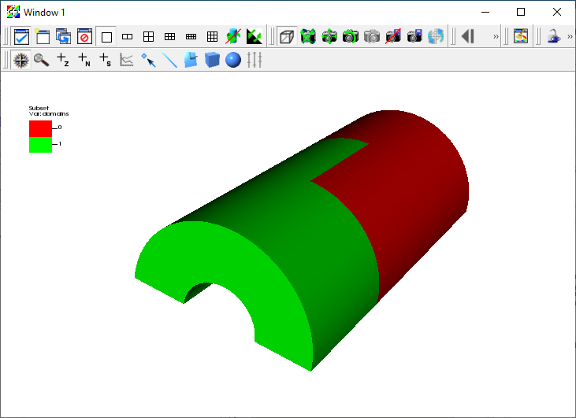

.. _Tutorials_Partitioning:

Partitioning
============

.. toctree::
          :maxdepth: 2

This tutorial describes how to Partition meshes.

Partitioning overview
---------------------

Partitioning meshes is commonly needed in order to evenly distribute work among many simulation ranks.
VisIt_ provides the ability to partition meshes when exporting data in Blueprint format.
Full M to N repartioning is supported for both structured and unstructured meshes.

The partitioning algorithms built into VisIt_ are fairly simple.
The goal was not to provide sophisticated partiting algorithms but rather provide the mechanism to partition the data.
In order to support more sophisticated partitioning algorithms, VisIt_ supports the ability to use a variable to specify the partitioning.
This enables using an external repartitioning tool to define the partitions.

The built-in partitioning algorithm
-----------------------------------

Increasing the number of blocks
~~~~~~~~~~~~~~~~~~~~~~~~~~~~~~~

The built-in partitioning algorithm will split blocks when increasing the number of blocks.
It will first sort the list of blocks from largest to smallest in terms of cell count.
It will then split the largest block and insert the two new blocks into the list in the appropriate locations.
It will continue splitting the largest block and inserting the new blocks into the list until the desired number of blocks is reached.
In the case of an unstructured mesh it will split the block in half.
In the case of a structured mesh it will split it in half along the longest dimension based on the number of cells. 

   Examples of increasing the number of blocks

Decreasing the number of blocks
~~~~~~~~~~~~~~~~~~~~~~~~~~~~~~~

The built-in partitioning algorithm will merge blocks when decreasing the number of blocks.
It will first sort the list of blocks from largest to smallest in terms of cell count.
It will then merge the two smallest blocks and insert the block into the list in the appropriate location.
It will continue merging the two smallest blocks and inserting the new block into the list until the desired number of blocks is reached.
In the case of an unstructured mesh it will merge matching points.
By default, the points must match exactly to be merged.
It is possible to set a merge tolerance that indicates how close two points need to be to be considered a match.
In the case of a structured mesh it will try to maintain it as a structured mesh if possible.
If it is not possible, it will convert them to an unstructured mesh and merge matching points as specified above.

   Examples of decreasing the number of blocks

An example of using the built-in partitioning algorithm
-------------------------------------------------------

Here we will go through an example of partitioning a 3-dimensional multi-block unstructured mesh.

Let us start by opening a file and creating a plot.

1. Open the file ``multi_ucd3d.silo``.
2. Create a Subset plot of ``domains(mesh1)``.

   Subset plot of the original 36 block mesh

Now we are ready to export the data.

3. Go to *File->Export database*.
4. This brings up the Export Database window.
5. Change the *File name* to ``multi_ucd_repart``.
6. Change the *Export to* to *Blueprint*.
7. Click *Apply* and *Export*.

   The Export Database window.

This will bring up the Export options for Blueprint writer window.

8. Change the *Operation* to *Partition*.
9. Change the *Partition  target number of domains* to ``2``.
10. Click *OK*.

   The Blueprint writer window

Now let us plot the new partitioned mesh.

11. Click *Delete* in the main control window.
12. Open the file ``multi_ucd3d_repart.cycle_000000.root``.
13. Create a Subset plot of ``domains``.

   Subset plot of the new partitioned 2 block mesh

An example of using a field to partition the mesh
-------------------------------------------------

Here we will go through an example of partitioning a 3-dimensional rectilinear mesh using a field. The field will be generated using a expression that has ones and zeros to partition the mesh into two arbitrary blocks.

Let us start by opening a file and creating a plot.

1. Open the file ``noise.silo``.
2. Create a Pseudocolor plot of ``hardyglobal``.

   Pseudocolor plot of hardyglobal

We will use the ``hardyglobal`` variable to create a variable that is one where the variable is greater than or equal to 2.8 and zero otherwise.

3. Go to *Controls->Expressions*.
4. Click *New* to create a new expression.
5. Change the *Name* text field to ``part``.
6. Set the *Definition* to

::

    if(ge(recenter(hardyglobal),zonal_constant(Mesh, 2.8)),zonal_constant(Mesh,1.),zonal_constant(Mesh,0.))

7. Click *Apply* and *Dismiss*.

   Defining part in the Expressions window

Now let us look at the ``part`` variable.
 
8. Go to *Variables->part* to change the Pseudocolor variable to ``part``.

   Pseudocolor plot of part

Now we are ready to export the data.
When partitioning using a variable the partitioning variable must either be the variable being plotted or listed as one of the variables in the *Variables* portion of the window.
In this case we are plotting the partitioning variable, so we do not have to list it as an additional variable.

3. Go to *File->Export database*.
4. This brings up the Export Database window.
5. Change the *File name* to ``noise_repart``.
6. Change the *Export to* to *Blueprint*.
7. Click *Apply* and *Export*.

   The Export Database window.

This will bring up the Export options for Blueprint writer window.

8. Change the *Operation* to *Partition*.
9. Change the *Partition  target number of domains* to ``2``.
10. Change the *Flatten/Partition extra options* to

::

    selections:
      -
       type: field
       domain_id: any
       field: part

Note that the options are in yaml and the indentation is critical.

   The Blueprint writer window

Now let us plot the new partitioned mesh.

11. Click *Delete* in the main control window.
12. Open the file ``noise_repart.cycle_000000.root``.
13. Create a Subset plot of ``domains``.

   Subset plot of the new partitioned 2 block mesh
