.. _Potential_Flow:

Potential Flow
===============

.. toctree::
    :maxdepth: 2

This tutorial demonstrates VisIt's features while exploring results from simple simulations of `potential based flow <https://en.wikipedia.org/wiki/Potential_flow>`_ around an obstruction, specifically an airfoil. Potential flow assumes irrotational flow. That is, there is no rotational motion in the flow, no vortices or eddies. This assumption is valid for low velocities and certain types of gases/fluids and obstructions. When the flow does involve rotation, a more complex solution involving Navier-Stokes equations is required.

The potential flow solver is a mini-app developed using the `MFEM <http://www.mfem.org/>`_ finite element library. The example is available for this tutorial thanks to Aaron Fischer and Mark Miller of `LLNL <http://www.llnl.gov>`_. The data set includes VTK output files for a set of solutions where the angle of attack of the velocity varies from -5 degrees to 25 degrees.

Open the dataset
----------------

This tutorial uses the `potential flow <https://visit-dav.github.io/largedata/datarchives/potential_flow>`_ dataset.

1. `Download <https://visit-dav.github.io/largedata/datarchives/potential_flow>`_ the potential flow dataset.
2. Click on the *Open* icon to bring up the File open window.
3. Navigate your file system to the folder containing "potential_flow_ang_sweep.visit".
4. Highlight the file "potential_flow_ang_sweep.visit" and then click *OK*.

Plotting the mesh topology
--------------------------

First we will examine the mesh used by the solver.

Create a Mesh plot
~~~~~~~~~~~~~~~~~~

1. Go to *Add->Mesh->main*.
2. Click *Draw*.

After this, the mesh plot is rendered in VisIt_'s Viewer window. 
This is a 2D mesh, modify the view by planning and zooming in the viewer window.
Zoom in near the airfoil and look at the mesh structure.

Modify the Mesh plot settings
~~~~~~~~~~~~~~~~~~~~~~~~~~~~~

1. Double click on the Mesh plot to open the Mesh plot attributes window.

2. Experiment with settings for:

  * *Mesh color*
  * *Opaque color*
  * *Opaque mode* 

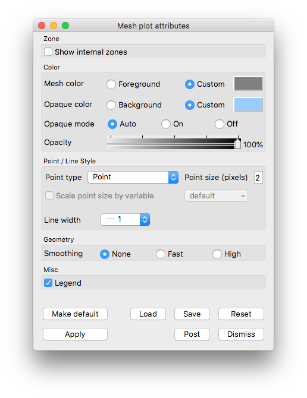

   Example mesh plot settings for the Potential Flow data.

You will need to click *Apply* to commit the settings to your plot.

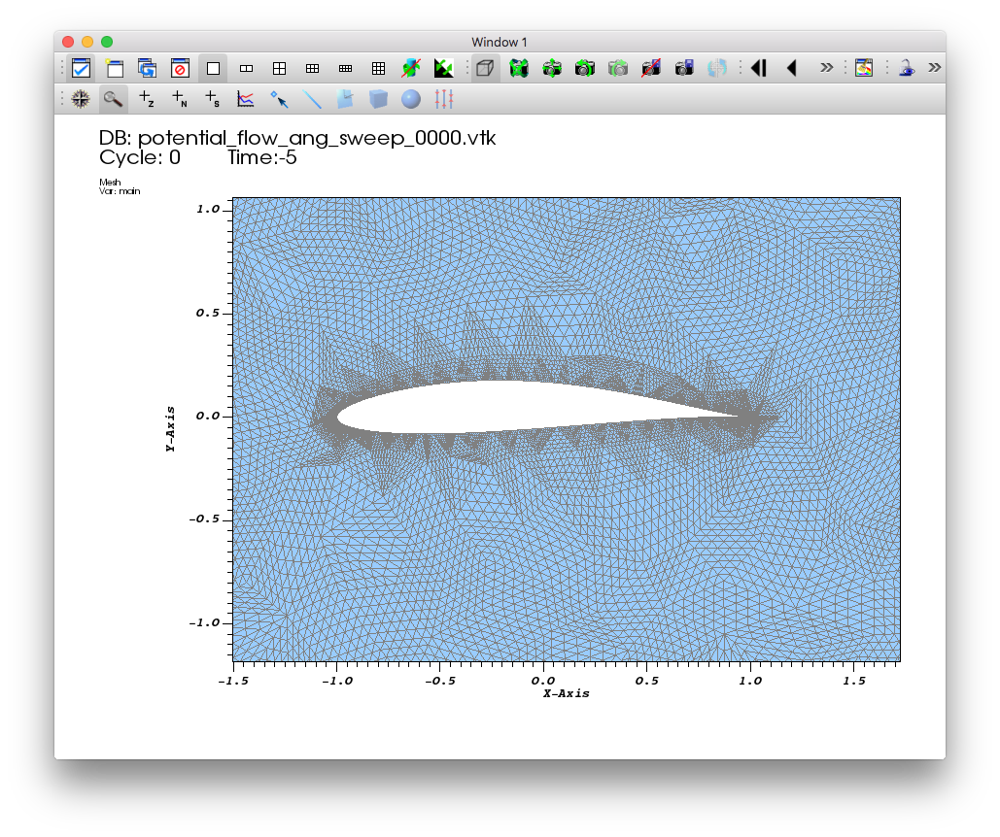

   Example mesh plot result the Potential Flow data.

Examining the velocity magnitude
---------------------------------

In addition to the mesh topology, this dataset provides a vector field "v", representing the velocity, associated with the mesh vertices.

VisIt_ automatically defines an expression that allows us to use the magnitude
of the "v" vector field as a scalar field on the mesh. The result of
the expression is a new field named "v_magnitude".

We will use Pseudocolor plots to examine the "pressure" and
"velocity_magnitude" fields.

1. Go to *Add->Pseudocolor->v_magnitude*.
2. Click *Draw*.
3. Double click on the Pseudocolor plot to bring up the Pseudocolor plot attributes window.
4. In the *Limits* section, enable the *Maximum* checkbox and set the limit to *1*.
5. In the *Color* section,cChange the color table to *Spectral* and check the *Invert* button.

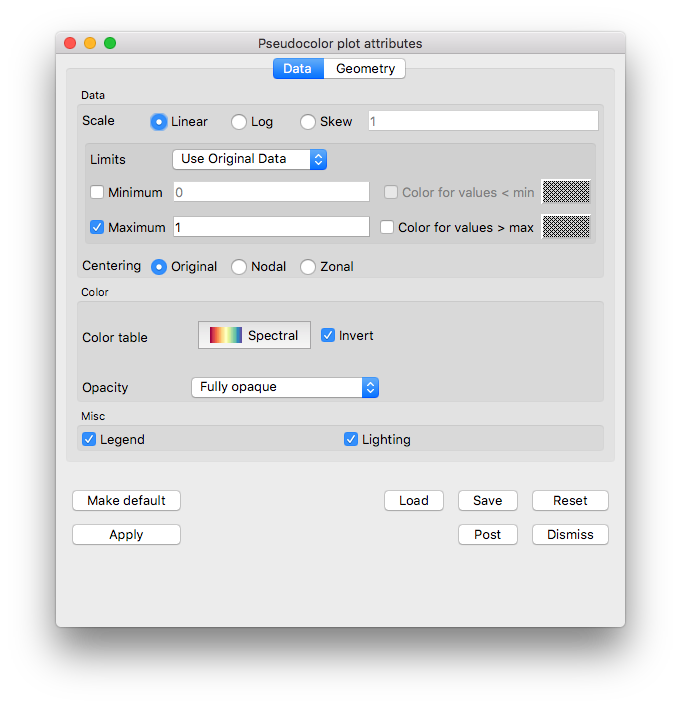

   The pseudocolor plot attributes for the velocity magnitude example.

6. Click *Apply*.
7. Click *Draw*.
8. Drag the *Time* animation controls above the plot list on the main *GUI* window.

You will see the velocity magnitude solutions for the different angles of attack.

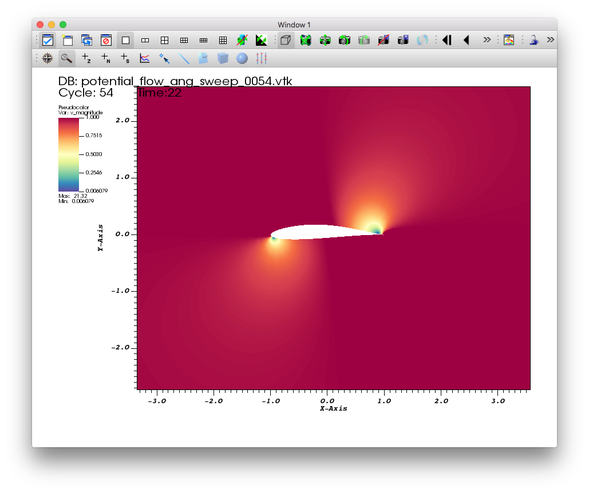

   The pseudocolor plot of the velocity magnitude.

Experiment with the *Color for values > max* option to see where the range is being clipped.

Contours of velocity magnitude
~~~~~~~~~~~~~~~~~~~~~~~~~~~~~~~~

Now we will add an additional plot to view velocity magnitude contours

1. Go to *Add->Contour->v_magnitude*.
2. Double click on the Contour plot to bring up the Contour plot attributes window.
3. In the *Contour Levels* section, enable the *Maximum* checkbox and set the limit to *1*. 
4. In the *Lines* section, set the *Line width* to *2*.

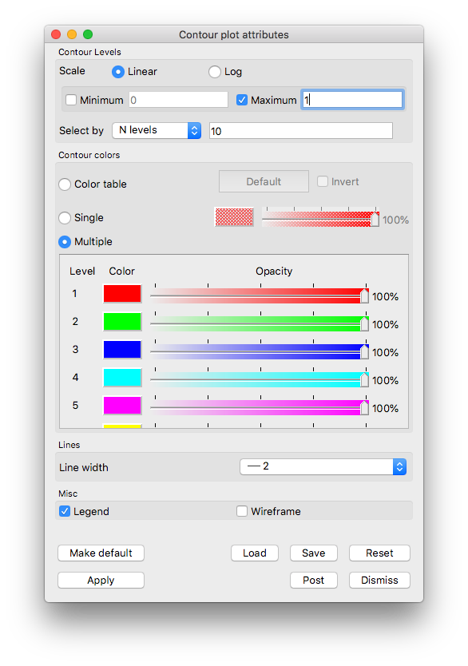

   Example contour plot settings for Potential Flow velocity magnitude.

5. Click *Apply*.
6. Click *Draw*.
7. Drag the *Time* animation controls above the plot list on the main *GUI* window.

You will see the contours of the velocity magnitude solutions for the different angles of attack.

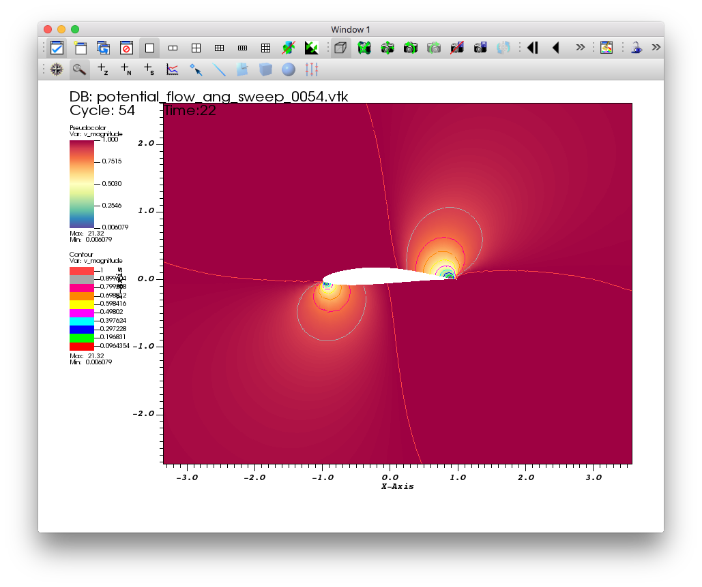

   A contour plot of the velocity magnitude.

Delete the contour plot when you are finished exploring, but keep the pseudocolor plot.

Visualizing the velocity vector field
-------------------------------------

This section of the tutorial outlines using glyphs and streamlines
to visualize the velocity vector field from the simulation.

Plotting the vector field directly with glyphs
~~~~~~~~~~~~~~~~~~~~~~~~~~~~~~~~~~~~~~~~~~~~~~

VisIt_'s Vector plot renders a vector field at each time step as a collection
of arrow glyphs. This allows us to see the direction of the vectors as well
as their magnitude. We will create a vector plot to directly view the
simulated "v" vector field. 

1. Go to *Add->Vector->v*. 
2. Open the Vector plot attributes window.
3. Go to the *Vectors* tab.
4. Set *Stride* to "17".

   *Vectors* tab settings for example vector plot of velocity

5. Go the the *Data* tab.
6. In the *Limits* section, enable the *Maximum* checkbox and set the value to "1".
7. In the *Color* section, change the *Magnitude* to *viridis*

.. figure:: images/PotentialFlow-Vectors-Atts-2.png

   *Data* tab settings for example vector plot of velocity

8. Go to the *Glyphs* tab.
9. In the *Scale* section, uncheck *Scale by magnitude* and *Auto scale*.

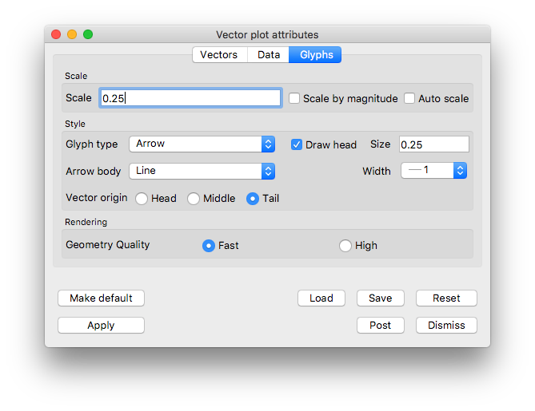

   *Glyphs* tab settings for example vector plot of velocity

10. Click *Apply* and *Dismiss*.
11. Click *Draw*.
12. Zoom in near the airfoil.
13. Drag the *Time* animation controls above the plot list on the main *GUI* window.

   The vector plot of velocity.

You will see glyphs of velocity solutions for the different angles of attack.

Delete the vector plot when you are finished exploring, but keep the pseudocolor plot.

Examining features of the flow field with streamlines
~~~~~~~~~~~~~~~~~~~~~~~~~~~~~~~~~~~~~~~~~~~~~~~~~~~~~

To explore the flow field further we will seed and advect a set of streamlines
on the left side of the mesh. Streamlines show the path massless tracer
particles would take if advected by a static vector field. To construct
Streamlines, the first step is selecting a set of spatial locations that
can serve as the initial seed points. 

The flow moves left to right, we will use a vertical line of seed points on 
the left side of the mesh.

Plotting streamlines of velocity
""""""""""""""""""""""""""""""""

1. Go to *Add->Pseudocolor->operators->IntergralCurve->v*.

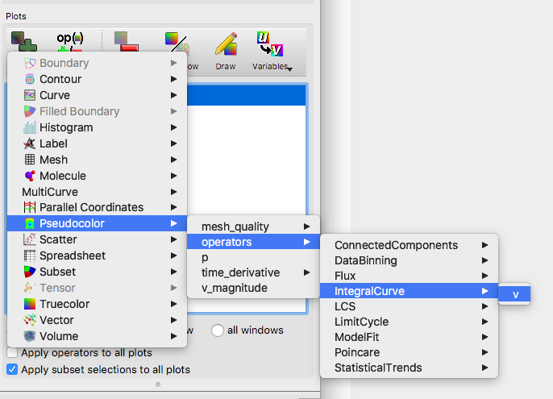

   Creating a streamline plot with the IntegralCurve operator.

2. Open the IntegralCurve operator attributes window.
3. Go to the *Source* section on the *Integration* tab.
4. Set the *Source type* to *Line*.
5. Set the *Start* to "-2 -2 0", excluding any commas in the input text box.
6. Set the *Stop* to "-2 2 0".
7. Set *Samples along line* to "10".
8. Click *Apply* and *Dismiss*.
9. Click *Draw* on the Main GUI

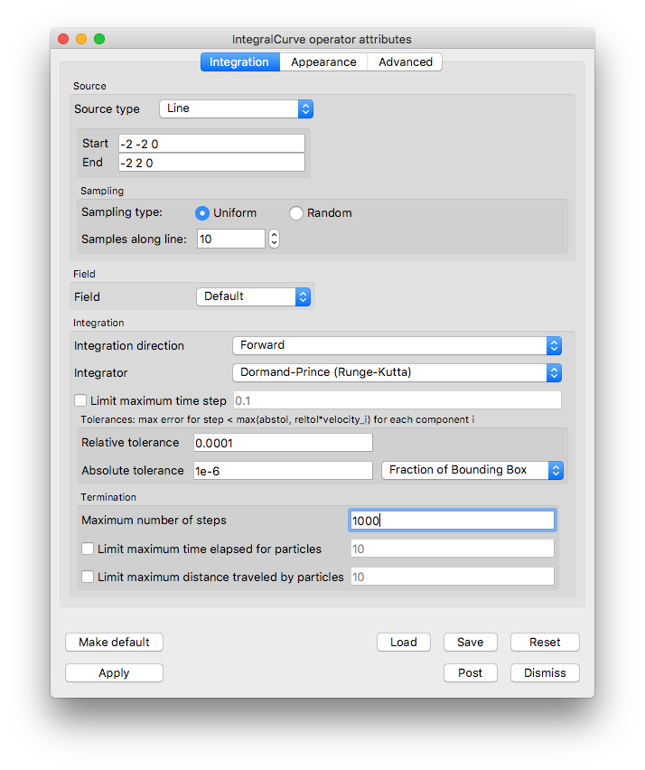

   The IntegralCurve operator attributes.

11. Open the Pseudocolor plot attributes window.
12. Go to the *Data* tab.
13. In the *Color* section set the *Color table* to *viridis*.

.. figure:: images/PotentialFlow-Streamline-PC-Atts-Data.png

   The Pseudocolor attributes for the streamline data.

14. Go to the *Line* section on the *Geometry* tab.
15. Set *Line type* to *Ribbons*.
16. Set *Tail* to *Sphere*.
17. Set the tail *Radius* to "0.025".

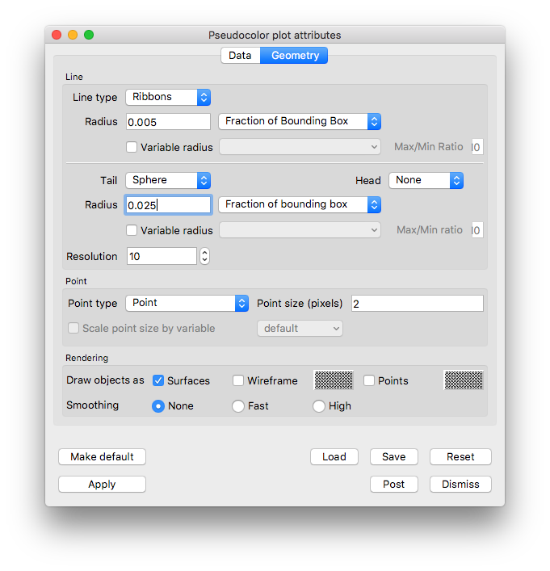

   The Pseudocolor attributes for the streamline geometry.

18. Click *Apply* and *Dismiss*.
19. Click *Draw*.
20. Use the time slider controls to view a few different angles of attack solutions.

   The streamlines of velocity at 0 degree angle of attack.

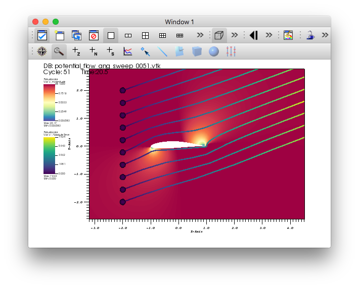

   The streamlines of velocity at 20.5 degree angle of attack.

