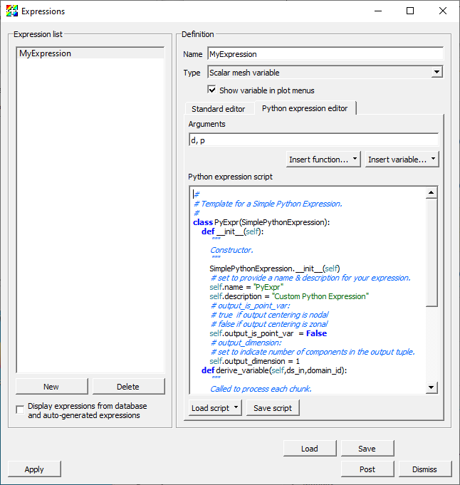
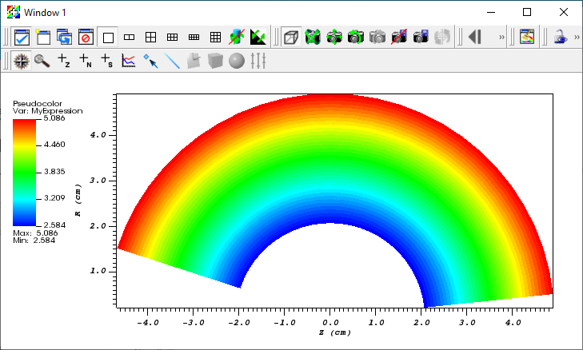
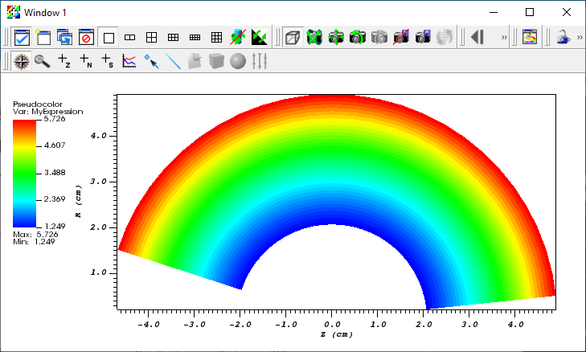

.. _Tutorials_Python_Expressions:

Python Expressions
==================

.. toctree::
       :maxdepth: 2

This tutorial describes using Python expressions.
Python expressions are an advanced feature and should olny be used if the needed functionality is not available in the :ref:`standard expression system <Expressions>`.

Python Expressions Overview
---------------------------

When the available expressions fail to provide needed functionality, users can extend VisIt_'s expression system in arbitrary ways using Python expressions.
However, Python expressions require users to become somewhat converscent in detailed aspects of how mesh and variable data is represented in terms of VTK objects as well as how they are decomposed and processed in parallel.
Nonetheless, Python expressions provide a powerful approach to filling in gaps in needed functionality.

Python expressions are run on the compute engine and will run in parallel whenever a) the compute engine is parallel and b) the input dataset is decomposed for parallel.
Python expressions operate on ``vtkDataSets``, which provide access to mesh variables as well as the mesh coordinates and topology.
Python expression also have access to VisIt_'s metadata as well as access to MPI when running in parallel.
Python expressions return a ``vtkDataArray``, which allows returning new variables.
It is not possible to change the mesh topology or coordinates *within* a Python expression.
However, it is possible to *combine* Python expressions with :ref:`Cross Mesh Field Evaluation (CMFE) functions <Comparison_Expressions>` which can have the effect of changing mesh topology and coordinates.
The functionality is available through the **GUI** and the **CLI**.
When using the **GUI**, they can be created in the *Expressions* window. 
When using the **CLI**, they can be created with the *DefinePythonExpression* function.

Creating a Python Expression with the **GUI**
---------------------------------------------

We will now go through the steps required to create a Python expression using the **GUI**.

Let us start by opening a file and creating a plot.

1. Open the file ``curv2d.silo``.
2. Create a Psuedocolor plot of ``d``.

Now let us go ahead and create the Python expression.

3. Go to *Controls->Expressions*.
4. This brings up the Expressions window.
5. Click *New* in the *Expression list* to create a new expression.
6. Change the *Name* in the *Definition* section to "MyExpression".
7. Click on the *Python expression editor* tab in the *Definition* section.
8. Select *Insert variable...->Scalars->d* to add ``d`` to the *Arguments* text field.
9. Select *Insert variable...->Scalars->p* to add ``p`` to the *Arguments* text field.
   Note that the variable names are seperated by a comma.
   If the variable names are not separated by commas you will get a cryptic error message when you try to plot the expression.
10. Click *Load script->Template->Simple filter* to add a template of a Python expression in the *Python expression script* editor. 

   The Expressions window with the simple filter template

At this point you modify the template to create your expression.
A common practice is to make modifications to the script and test it using the Pseudocolor plot.
Changes to the script can be made either by modifying the script in the *Python expression script* editor or modifying it in an external text editor and then reloading the script.
Generaly speaking, modifying the script in the *Python expression script* editor is easier than doing it in an external text editor except that it is difficult to tell how many spaces are at the beginning of the line since the editor does not use a fixed width font.

Developing the script in the *Python expression script* editor
~~~~~~~~~~~~~~~~~~~~~~~~~~~~~~~~~~~~~~~~~~~~~~~~~~~~~~~~~~~~~~

The following steps can be used to iteratively develop your script using the *Python expression script* editor.

1. Edit the script.
2. Click the *Apply* button.
3. Go to *Variables->d* to change the variable to ``d``.
   The first time you try your script this will not be necessary since the variable is already ``d``.
4. Go to *Variables->MyExpression* to change the variable to "MyExpression" and execute the script.

Developing the script in a text editor
~~~~~~~~~~~~~~~~~~~~~~~~~~~~~~~~~~~~~~ 

The following steps can be used to iteratively develop your script using a text editor.

Before you can modify the script you will need to save it.

1. Click *Save script* to save the script.

Now you are ready to modify the script.

2. Edit the script with your favorit editor.
3. Go to *Load script->File* to load the script.
4. Click the *Apply* button.
5. Go to *Variables->d* to change the variable to ``d``.
   The first time you try your script this will not be necessary since the variable is already ``d``.
6. Go to *Variables->MyExpression* to change the variable to "MyExpression" and execute the script.
 
Python Expression Example 1
---------------------------

This example adds two cell centered variables.
It demonstrates accessing multiple variables and performing simple operations with them to generate a result.

Here is the example script.

.. literalinclude:: ../../test/tests/hybrid/python_example_1.vpe
   :start-at: class MyExpression(SimplePythonExpression):
   :end-at: py_filter = MyExpression

Let us start off by creating a Pseudocolor plot from the expression.

1. Copy the script into the *Python expression script* editor.
2. Click the *Apply* button.
3. Go to *Variables->MyExpression* to change the variable to the expression.

   The Pseudocolor plot of MyExpression

Now let us take a look at the script and see what each portion does.

The ``__init__`` method provides information about the expression, including

* That it inherits from ``SimplePythonExpression``.
* The name of the expression.
* A description of the expression.
* A flag indicating that the output is not a point centered value.
* A flag that the output is a scalar.

.. literalinclude:: ../../test/tests/hybrid/python_example_1.vpe
   :start-at: def __init__(self):
   :end-before: def modify_contract(self,contract):

The ``modify_contract`` method can be used to request special information for the expression from VisIt_.
In this case it is a no-op.

.. literalinclude:: ../../test/tests/hybrid/python_example_1.vpe
   :start-at: def modify_contract(self,contract):
   :end-before: def derive_variable(self,ds_in,domain_id):

The ``derive_variable`` method performs the real work of the expression.
It is passed the input ``vtkDataSet`` and the ``domain_id``.

.. literalinclude:: ../../test/tests/hybrid/python_example_1.vpe
   :start-at: def derive_variable(self,ds_in,domain_id):
   :end-before: # Get the data array for the first variable

The following lines get the ``vtkDataArrays`` for the cell values for the two variables and the number of cells.

.. literalinclude:: ../../test/tests/hybrid/python_example_1.vpe
   :start-at: # Get the data array for the first variable
   :end-before: # Create a scalar float array with ncells values for the result

The following lines set the output ``vtkDataArray`` to be an array of floats with 1 component and ncells values.

.. literalinclude:: ../../test/tests/hybrid/python_example_1.vpe
   :start-at: # Create a scalar float array with ncells values for the result
   :end-before: for i in range(ncells):

Now we loop over the cells, setting the output value for each cell.

.. literalinclude:: ../../test/tests/hybrid/python_example_1.vpe
   :start-at: for i in range(ncells):
   :end-before: # Add the i'th value from the first variable to the i'th

The following lines add the two variables for the current cell.

.. literalinclude:: ../../test/tests/hybrid/python_example_1.vpe
   :start-at: # Add the i'th value from the first variable to the i'th
   :end-before: # Store the value in the i'th value in the result

The following lines set the result value for the current cell.

.. literalinclude:: ../../test/tests/hybrid/python_example_1.vpe
   :start-at: # Store the value in the i'th value in the result
   :end-before: return res

Once we have finished processing all the cells, we return the ``vtkDataArray``.

.. literalinclude:: ../../test/tests/hybrid/python_example_1.vpe
   :start-at: return res
   :end-at: return res

Using your Python Expression with the **CLI**
~~~~~~~~~~~~~~~~~~~~~~~~~~~~~~~~~~~~~~~~~~~~~

The Python expression we just created can also be used with the **CLI**.

We will start by saving the script we just created.

1. Click *Save script* and save the script with the name ``MyExpression.py``.

The following script will open ``curv2d.silo`` and create a Pseudocolor plot of the expression.

.. code-block:: python

  OpenDatabase("/usr/gapps/visit/data/curv2d.silo")

  DefinePythonExpression("MyExpression", ['d', 'p'], file="MyExpression.py")

  AddPlot("Pseudocolor", "MyExpression")
  DrawPlots()

Python Expression Example 2
---------------------------

This example operates on 2D meshes and takes the distance around the edges of each cell and multiplies it by the value of the cell.
It demonstrates accessing the coordinates and topology of the mesh as well as a variable.

Here is the example script.

.. literalinclude:: ../../test/tests/hybrid/python_example_2.vpe
   :start-at: from math import sqrt
   :end-at: py_filter = MyExpression

Let us start off by creating a Pseudocolor plot from the expression.

1. Copy the script into the *Python expression script* editor.
2. Click the *Apply* button.
3. Go to *Variables->MyExpression* to change the variable to the expression.

   The Pseudocolor plot of MyExpression

The ``__init__`` and ``modify_contract`` methods are the same as the previous example, so we will only look at the ``derive_variable`` method.

.. literalinclude:: ../../test/tests/hybrid/python_example_2.vpe
   :start-at: def derive_variable(self,ds_in,domain_id):
   :end-before: # Get the data array for the variable

The following lines get the ``vtkDataArray`` for the cell values and the number of cells.

.. literalinclude:: ../../test/tests/hybrid/python_example_2.vpe
   :start-at: # Get the data array for the variable
   :end-before: # Create a scalar float array with ncells values for the result

The following lines set the output ``vtkDataArray`` to be an array of floats with 1 component and ncells values.

.. literalinclude:: ../../test/tests/hybrid/python_example_2.vpe
   :start-at: # Create a scalar float array with ncells values for the result
   :end-before: for i in range(ncells):

Now we loop over the cells, setting the output value for each cell.

.. literalinclude:: ../../test/tests/hybrid/python_example_2.vpe
   :start-at: for i in range(ncells):
   :end-before: # Get the i'th cell

The following lines get the current cell and the number of edges in the cell.

.. literalinclude:: ../../test/tests/hybrid/python_example_2.vpe
   :start-at: # Get the i'th cell
   :end-before: # Sum up the lengths of the edges

Now we loop over the edges, calculating the sum of the lengths of the edges.

.. literalinclude:: ../../test/tests/hybrid/python_example_2.vpe
   :start-at: # Sum up the lengths of the edges
   :end-before: # Get the j'th edge

We calculate the length of the edge from the 3D coordinates of the end points of the edge, which we add to the sum.

.. literalinclude:: ../../test/tests/hybrid/python_example_2.vpe
   :start-at: # Get the j'th edge
   :end-before: # Multiply the sum by the i'th value of the variable

Once we have summed the lengths of the edges we multiply the sum by the cell value and set it in the result.

.. literalinclude:: ../../test/tests/hybrid/python_example_2.vpe
   :start-at: # Multiply the sum by the i'th value of the variable
   :end-before: return res

Once we have finished processing all the cells, we return the ``vtkDataArray``.

.. literalinclude:: ../../test/tests/hybrid/python_example_2.vpe
   :start-at: return res
   :end-at: return res

Using your Python Expression with the **CLI**
~~~~~~~~~~~~~~~~~~~~~~~~~~~~~~~~~~~~~~~~~~~~~

This Python expression can also be used with the **CLI**, just as the one in the first example, except the specification of the variables to use is slightly different.
Since you are only passing a single variable you would use ``("d")`` for the list of variables.

.. code-block:: python

  OpenDatabase("/usr/gapps/visit/data/curv2d.silo")

  DefinePythonExpression("MyExpression", ("d"), file="MyExpression.py")

  AddPlot("Pseudocolor", "MyExpression")
  DrawPlots()

Using VTK in Python
-------------------

The VTK Python interface mirrors the C++ interface.

To find out information on a particular VTK class, type the name of the class in your favorite search engine.

Here are links to some VTK classes that will be of most use to you.

* `vtkCell <https://vtk.org/doc/nightly/html/classvtkCell.html>`_
* `vtkDataArray <https://vtk.org/doc/nightly/html/classvtkDataArray.html>`_
* `vtkDataSet <https://vtk.org/doc/nightly/html/classvtkDataSet.html>`_
* `vtkDoubleArray <https://vtk.org/doc/nightly/html/classvtkDoubleArray.html>`_
* `vtkFloatArray <https://vtk.org/doc/nightly/html/classvtkFloatArray.html>`_
