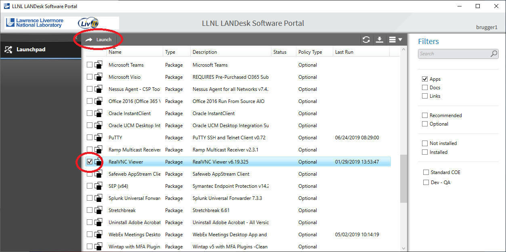

.. _RemoteUsage:

Remote Usage
============

.. toctree::
    :maxdepth: 2

VisIt_ can be used remotely in several different manners. Some make use of
capabilities native to VisIt_, such as running VisIt_ in client/server mode,
and some make use external mechanisms such as VNC. We will also touch
briefly on using interactive versus batch allocations.

Using VisIt_ with VNC
---------------------

The VNC tutorial will focus on using RealVNC at the Lawrence Livermore
National Laboratory (LLNL). Using VNC at other computer centers will be
similar, but will be unique to each site.

Installing VNC
~~~~~~~~~~~~~~

If your system is an LLNL managed system you can install it via the LLNL
workstations catalog for MacOS or Windows. Alternatively, you can download
the `RealVNC client <https://www.realvnc.com/download/viewer/>`_
and install it on your desktop. VNC clients not supplied by RealVNC will
not work at LLNL.

Installing RealVNC on an LLNL managed Windows system
~~~~~~~~~~~~~~~~~~~~~~~~~~~~~~~~~~~~~~~~~~~~~~~~~~~~

1. Select *LANDESK Management->Portal Manager* from the Start menu.
2. Click on *RealVNC Viewer* in the list of software packages.
3. Click *Launch* to install the package.

   The LLNL LANDesk Software Portal

Installing RealVNC on an LLNL managed Mac system
~~~~~~~~~~~~~~~~~~~~~~~~~~~~~~~~~~~~~~~~~~~~~~~~

1. Start MacPatch from *Applications->MacPatch.app*.
2. Select the **Software** tab and scroll down until you find the *RealVNC Viewer*.
3. Click the *Install* button in the right column to install the package.

.. figure:: images/MacPatch.png

   MacPatch: LLNL Managed Software

Starting up the RealVNC client
~~~~~~~~~~~~~~~~~~~~~~~~~~~~~~

There is a lot of additional content on using
`RealVNC <https://hpc.llnl.gov/software/visualization-software/vnc-realvnc>`_
at Livermore Computing.

At this point we will focus on running RealVNC on Windows. Other than
starting the Viewer, everything should be pretty much the same for
Windows, MacOS and Linux.

1. Select *RealVNC->VNC Viewer* from the Start menu.
2. This will bring up the VNC Viewer.

Now we are ready to create the profiles for logging into the CZ and RZ.

.. figure:: images/Remote-VNCViewer1.png

   The VNC Viewer

1. Select *File->New connection...*.
2. This will bring up the Properties window.
3. Change the *VNC Server* field to "czvnc.llnl.gov:5999".
4. Change the *Name* field to "CZ VNC".
5. Click *Ok*.

.. figure:: images/Remote-VNCViewer2.png

   The VNC Viewer Properties window

6. This will create a profile for logging into the CZ VNC.
7. Now do the same for the RZ.
8. Select *File->New connection...*.
9. Change the *VNC Server* field to "rzvnc.llnl.gov:5999".
10. Change the *Name* field to "RZ VNC".
11. Click *Ok*.
12. Your VNC Viewer window should now contain two connection profiles.

.. figure:: images/Remote-VNCViewer3.png

   The VNC Viewer with two profiles

Now we are ready to login to one of the systems.

1. Double click on the *CZ VNC* icon
2. This will bring up a login window.
3. Enter your CZ username and password.

This will bring up a Linux desktop. The resolution of the desktop will
probably be low if you have never used the VNC server before. This is so
that it isn't too large if you are on a laptop. To change the resolution
of the display dynamically, bring up a terminal and use the xrandr command.

1. Select *Applications->Terminal*
2. Enter "xrandr" in the terminal to get a list of supported resolutions.
3. Enter "xrandr -s 1280x720" in the terminal to change the resolution to 1280 by 720.
4. Change the resolution back to something more appropriate to your screen.

Recommended resolutions are:

* Dell laptop running Windows: 1280 x 720
* A high-resolution external monitor: 1920 x 1200
* A Mac laptop: 1680 x 1050 (Retina Display) or 1440 x 900

When using VisIt_ you should ssh to another CZ machine so that you don't
overload the VNC server. You should use version 3.1.1 of VisIt_ for the
best performance on a VNC client. Versions prior to 3.0.0 will not work
properly with VNC.

1. Enter "ssh quartz".
2. Enter "visit -v 3.1.1".
3. Run VisIt_ as normal.

.. figure:: images/Remote-VisItVNC.png

   VisIt_ running on the VNC Viewer

Using client/server
-------------------

