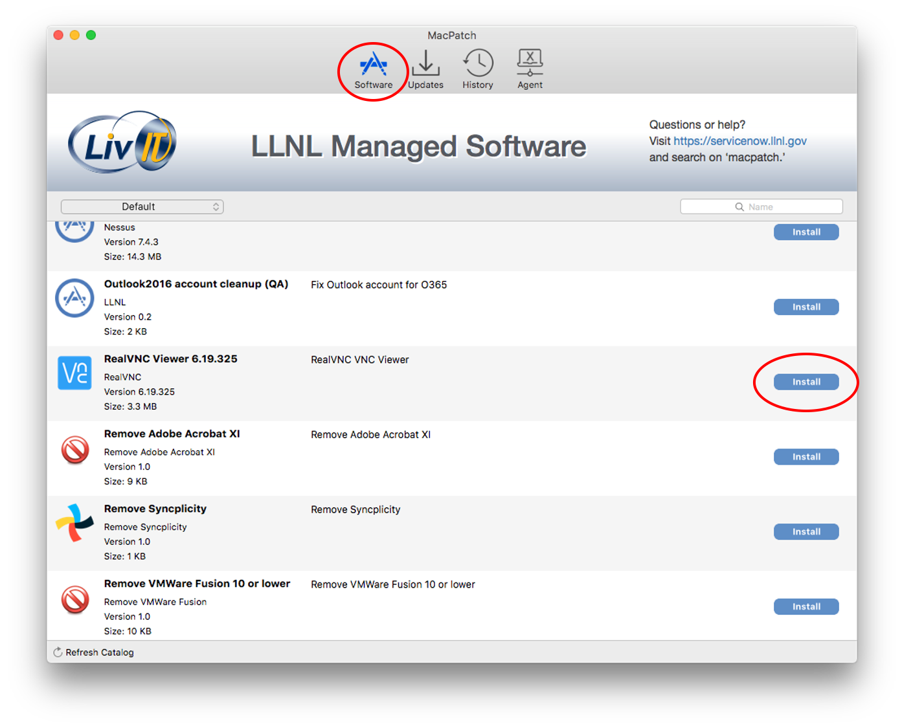
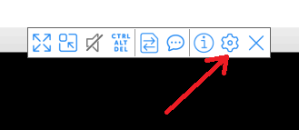
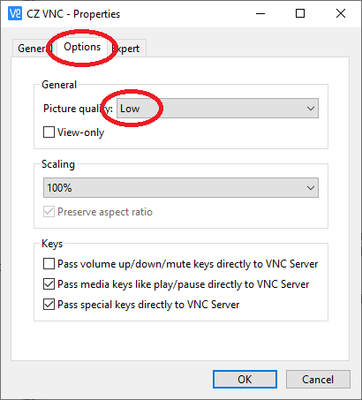
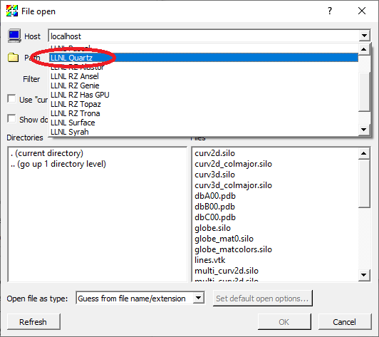

.. _RemoteUsage:

Remote Usage
============

.. toctree::
    :maxdepth: 2

VisIt_ can be used remotely in several different manners. Some use 
capabilities native to VisIt_, such as running VisIt_ in client/server mode,
and some use external mechanisms, such as VNC. We will also touch briefly
on using batch allocations in an interactive manner.

VisIt_ can run remotely in the following ways:

* :ref:`Using X display forwarding<UsingDisplayForwarding>`.

  * Easiest to setup and convenient to use.
  * Lowest interactivity performance.

* :ref:`Using a VNC client<UsingVNC>`.

  * More complex to set up.
  * Convenient to use.
  * Provides high interactivity performance.

* :ref:`Using client/server<UsingClientServer>`.

  * More complex to set up.
  * Provides highest interactivity performance.

.. _UsingDisplayForwarding:

Using X Display forwarding though ssh
-------------------------------------

When VisIt_ is running with X display forwarding through ssh, it is
completely running on the remote system and sending all its graphics
commands over ssh. In one sense this is the easiest to use since you
just launch VisIt_ on you remote system and you are ready to go. Since
you are typically already logged into the remote system and already in
the directory of interest there is no additional setup required, such
as entering passwords or navigating the remote directory structure.
Unfortunately it is also the lowest performing option. Graphical user
interfaces typically send lots of small messages back between the remote
system and the local display. If there is a high latency between them
then simple operations such as clicking on buttons and bringing up
new windows may take a long time. Furthermore, the rendering performance
of the visualization windows suffers because VisIt_ can't leverage the
graphics processing unit on the local system.

When using X Display forwarding you need to have an X Server running on
the display of your local system. In the case of Linux and MacOS, both
will have X Servers running by default. In the case of Windows you will
need to install a X Server on your system and enable it. Fortunately,
most people will already have an X Server installed on their system if
they are using ssh to login to the supercomputing center.

Typically, X display forwarding is enabled by default and all you need
to do is launch VisIt_ on the remote system once you have ssh'ed to the
remote system.

When starting ssh from a command line you will need to use the "-Y"
option. ::

    ssh -Y

Some X Servers may need to have their default options set for use with
VisIt_. This is primarily because VisIt_ uses OpenGL for rendering and
not all X Servers are configured properly to work with OpenGL.

Configuring X-Win32 for use with VisIt_
~~~~~~~~~~~~~~~~~~~~~~~~~~~~~~~~~~~~~~~

The default setting X-Win32 sometimes are not set to work well with
OpenGL. This isn't always the case and will depend on the graphics
card installed on your system. If VisIt_ crashes on your system you
will need to do the following.

1. Bring up the X-Win32 control panel.
2. Go to the *Window* tab.
3. Turn off *Use Direct2D*.
4. Turn on *Use Software Renderer for OpenGL*.
5. Click *Apply*.
6. At this point you should exit all the windows associated with X-Win32 and re-establish you connections to the remote system.

   The X-Win32 control panel

.. _UsingVNC:

Using VNC
---------

When using VNC it looks and behaves just like you were logged into an X
Window display running at the supercomputing site that is constrained
to a single window and is separate from the windowing system running
on your local system. It provides all the conveniences of X display
forwarding but at a much higher interactivity level since the networking
between the remote computer and the VNC server will provide high
bandwidth and low latency. Ideally you would do all your interactions
with the supercomputer center through the VNC client. The one draw back
is that the VNC server compresses the video stream it sends to the VNC
client in order to provide high interactivity. This may result in small
compression artifacts in the images you see in the VNC client.

This portion of the tutorial on using VNC will focus on using RealVNC at the
Lawrence Livermore National Laboratory (LLNL). Using VNC at other computer
centers will be similar, but unique to each site.

Installing VNC
~~~~~~~~~~~~~~

If your system is an LLNL managed system you can install it via the LLNL
workstations catalog for MacOS or Windows. Alternatively, you can download
the `RealVNC client <https://www.realvnc.com/download/viewer/>`_
and install it on your desktop. VNC clients not supplied by RealVNC will
not work at LLNL.

Installing RealVNC on an LLNL managed Windows system
~~~~~~~~~~~~~~~~~~~~~~~~~~~~~~~~~~~~~~~~~~~~~~~~~~~~

1. Select *LANDESK Management->Portal Manager* from the Start menu.
2. Click on *RealVNC Viewer* in the list of software packages.
3. Click *Launch* to install the package.

.. figure:: images/Remote-LANDeskPortal.png

   The LLNL LANDesk Software Portal

Installing RealVNC on an LLNL managed Mac system
~~~~~~~~~~~~~~~~~~~~~~~~~~~~~~~~~~~~~~~~~~~~~~~~

1. Start MacPatch from *Applications->MacPatch.app*.
2. Select the **Software** tab and scroll down until you find the *RealVNC Viewer*.
3. Click the *Install* button in the right column to install the package.

   MacPatch: LLNL Managed Software

Starting up the RealVNC client
~~~~~~~~~~~~~~~~~~~~~~~~~~~~~~

There is a lot of additional content on using
`RealVNC <https://hpc.llnl.gov/software/visualization-software/vnc-realvnc>`_
at Livermore Computing.

At this point we will focus on running RealVNC on Windows. Other than
starting the Viewer, everything should be pretty much the same for
Windows, MacOS and Linux.

1. Select *RealVNC->VNC Viewer* from the Start menu.
2. This will bring up the VNC Viewer.

Now we are ready to create the profiles for logging into the CZ and RZ.

.. figure:: images/Remote-VNCViewer1.png

   The VNC Viewer

1. Select *File->New connection...*.
2. This will bring up the Properties window.
3. Change the *VNC Server* field to "czvnc.llnl.gov:5999".
4. Change the *Name* field to "CZ VNC".
5. Click *Ok*.

.. figure:: images/Remote-VNCViewer2.png

   The VNC Viewer Properties window

6. This will create a profile for logging into the CZ VNC.
7. Now do the same for the RZ.
8. Select *File->New connection...*.
9. Change the *VNC Server* field to "rzvnc.llnl.gov:5999".
10. Change the *Name* field to "RZ VNC".
11. Click *Ok*.
12. Your VNC Viewer window should now contain two connection profiles.

.. figure:: images/Remote-VNCViewer3.png

   The VNC Viewer with two profiles

Now we are ready to login to one of the systems.

1. Double click on the *CZ VNC* icon
2. This will bring up a login window.
3. Enter your CZ username and password.

This will bring up a Linux desktop. The resolution of the desktop will
probably be low if you have never used the VNC server before. This is so
that it isn't too large if you are on a laptop.

.. _SettingScreenResolution:

To change the resolution of the display dynamically, bring up a terminal
and use the xrandr command.

1. Select *Applications->Terminal*
2. Enter "xrandr" in the terminal to get a list of supported resolutions.
3. Enter "xrandr -s 1280x720" in the terminal to change the resolution to 1280 by 720.
4. Change the resolution back to something more appropriate to your screen.

Recommended resolutions are:

* Dell laptop running Windows: 1280 x 720
* A high-resolution external monitor: 1920 x 1200
* A Mac laptop: 1680 x 1050 (Retina Display) or 1440 x 900

When using VisIt_ you should ssh to another CZ machine so that you don't
overload the VNC server. You should use version 3.1.1 of VisIt_ for the
best performance on a VNC client. Versions prior to 3.0.0 will not work
properly with VNC.

1. Enter "ssh quartz".
2. Enter "visit -v 3.1.1".
3. Run VisIt_ as normal.

.. _VNCClientImage:

.. figure:: images/Remote-VisItVNC.png

   VisIt_ running on the VNC Viewer

Troubleshooting VNC issues
~~~~~~~~~~~~~~~~~~~~~~~~~~

Sometimes you can't see anything because the default screen is too large.
There are two solutions to this issue, one is to reduce the resolution of
the desktop and the other is to have the window scale automatically. To
reduce the desktop resolution:

1. Use the scroll bars to navigate to upper left hand corner and bring up a terminal.
2. From the terminal use the "xrandr" command to change the resolution as described :ref:`here<SettingScreenResolution>`.

To have the desktop scale automatically:

1. Go to the slide-out menu at the top center and rest your mouse below the title bar.

   The slide-out menu

2. Click the *Scale automatically* icon.

   Clicking on the Scale automatically icon

3. The window should now resize and you can use the VNC client.

Sometimes the response gets really slow when the VNC server is under heavy
load. One solution is to reduce the picture quality.

1. Go to the slide-out menu at the top center and rest your mouse below the title bar.
2. Click the *Properties* icon.

   Clicking on the Properties icon

3. Click on the *Options* tab.
4. Set the *Picture quality* to *Low*.
5. Click *Ok*.

   Setting the Picture quality to Low

.. _UsingClientServer:

Using client/server
-------------------

When VisIt_ is running in a client/server mode, a portion of VisIt_ is
running on your local system and a portion is running on a remote
compute resource such as a supercomputing center. This will always give
better performance than running on a remote system using X display forwarding,
since interactions with the graphical user interface will be faster and
VisIt_ will be able to leverage the graphics processing unit on your local
system. The portion running on your local system is referred to as the client
and the portion running on the remote compute resource is referred to as the
server. The client is responsible for the graphical user interface and
the rendering window, while the server is responsible for accessing the
data on the remote system, processing it, and sending back geometry to be
rendered or images to be displayed.

When running in client/server mode, VisIt_ makes use of host profiles that
provide information on how to run VisIt_ on the remote system, such as where
VisIt_ is installed and information about the batch system. VisIt_ comes
with host profiles for many different supercomputing systems. This portion
of the tutorial will use the Livermore Computing Center at LLNL.

Installing the host profiles for your computer center
~~~~~~~~~~~~~~~~~~~~~~~~~~~~~~~~~~~~~~~~~~~~~~~~~~~~~

The first thing you will need to do is make sure you have the host profiles
installed for the remote system. You can check this by bringing up the
*Host profiles* window.

1. Select *Options->Host profiles...* to bring up the *Host profiles* window.
2. If the list of *Hosts* is blank or doesn't contain the host of interest, you will need proceed with steps 4 - 10.
3. Click the *Dismiss* button.
4. Select *Options->Host profiles and configuration setup...* to bring up the *Setup Host Profiles and Configuration* window.

.. figure:: images/Remote-ClientServer1.png

   The *Setup Host Profiles and Configuration*

5. Click on the *Lawrence Livermore National Laboratory (LLNL) open network*.
6. Click *Install*.
7. Restart VisIt_.
8. Select *Options->Host profiles...* to bring up the *Host profiles* window.
9. You should now see the host profiles for LLNL.
10. Click the *Dismiss* button.

   The *Host profiles* window with the host profiles for LLNL

Connecting to a remote system
~~~~~~~~~~~~~~~~~~~~~~~~~~~~~

You are now ready to connect to the remote system.

1. Click on the *Open* icon in the *Sources* section of the main window to bring up the *File open* window.
2. Click on the *Host*  pulldown menu and select *LLNL Quartz*.
3. This will bring up a window to enter your password.

   The *File open* window

4. If your username is different on the remote system from the one on your local system you will need to click on *Change username* and change your username.

.. figure:: images/Remote-ClientServer4.png

   The *Enter Password* window

5. The *File open* will now open to your home directory on the remote system.

You are now ready to open files, create plots and do everything you are
used to doing with VisIt_.

File locations when running client/server
~~~~~~~~~~~~~~~~~~~~~~~~~~~~~~~~~~~~~~~~~

When running in client/server mode some files are stored on the local
system and some are stored on the remote system. Most files are stored or
saved on the local system. Some examples include:

* Images
* Movies
* Host profiles
* Settings
* Color tables

The main exception is when exporting data. Those results are saved on the
remote system. This is usually what you want since you will most likely want
to open it on the remote system for further processing.

The window that exports databases is unable to browse the remote file
system, so you will need to carefully type in the path to the directory
to save it in.

Using batch systems interactively
---------------------------------

When VisIt_ normally uses the batch system, it submits the parallel compute
engine to the batch system and then the compute engine runs until it exits.
Sometimes VisIt_ exits because of a crash. Once that happens you will lose
the rest of the batch allocation and you will need to submit a batch job,
which may not always happen immediately. One way around this is to get a
batch job and then run all of VisIt_ in batch system using X display
forwarding (ideally from within a VNC client).

One such mechanism is mxterm, a utility available at LLNL. It submits a
batch job and pops up an xterm. From the xterm, the user can start VisIt_
as many times as they want until the batch job time limit expires. There
may be similar mechanisms available at other supercomputing centers. If
not, it would be fairly straightforward to create such a script for the
batch system at your supercomputing center.

Using mxterm
~~~~~~~~~~~~

The basic mxterm command is: ::

    mxterm <nnodes> <ntasks> <nminutes> <-q queue_name>

An example that gets 1 node with 36 tasks for 30 minutes in the pdebug queue. ::

    mxterm 1 36 30 -q pdebug

When the job starts an xterm window will appear on your screen.

When using an mxterm, you will need to use the mxterm profile when starting
your compute engine.

   Selecting the mxterm host profile
