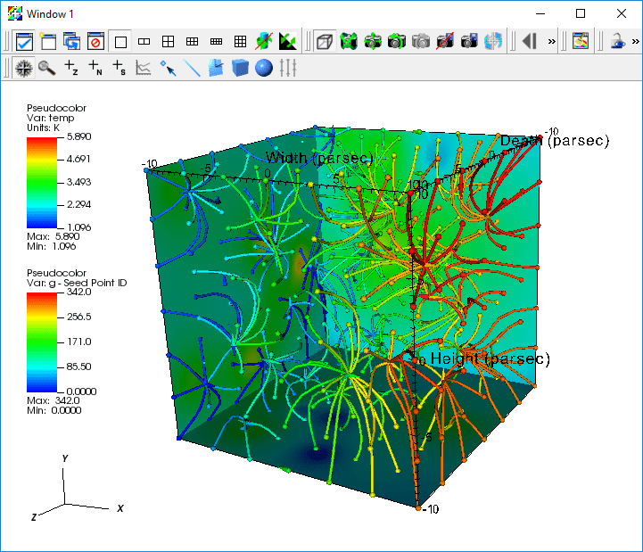
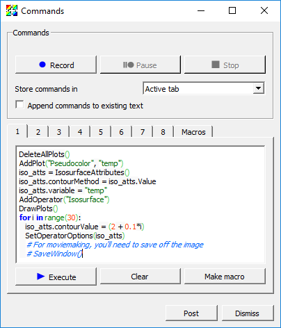

.. _Tutorials_Scripting:

Scripting
=========

.. toctree::
       :maxdepth: 2

This section describes the VisIt_ Command Line Interface (CLI).

Command line interface overview
-------------------------------

VisIt_ includes a rich a command line interface that is based on Python 2.7.

There are several ways to use the *CLI*:

1) Launch VisIt_ in a batch mode and run scripts.

  * Linux: ``/path/to/visit/bin/visit -nowin -cli -s <script.py>``
  * macOS: ``/path/to/VisIt.app/Contents/Resources/bin/visit -nowin -cli -s <script.py>``

2) Launch VisIt_ so that a visualization window is visible and interactively issue *CLI* commands.
3) Use both the standard *GUI* and *CLI* simultaneously.

Launching the *CLI*
-------------------

We will focus on the use case where we have the graphical user interface and
*CLI* running simultaneously. 

To launch the *CLI* from the graphical user interface:

1) Go to *Controls->Command*.

This will bring up the Commands window. The Command window provides a text
editor with Python syntax highlighting and an *Execute* button that tells
VisIt_ to execute the script. Finally, the Command window lets you record
your *GUI* actions into Python code that you can use in your scripts.

A first action in the *CLI*
---------------------------

1) Open "example.silo" in the *GUI* if it not already open.
2) Cut-and-paste the following Python commands into the first tab of the Commands window. ::

      AddPlot("Pseudocolor", "temp")
      # You will see the active plots list in the GUI update, since the CLI and GUI communicate.
      DrawPlots()
      # You will see your plot.

3) Click *Execute*.

Tips about Python
-----------------

1) Python is whitespace sensitive! This is a pain, especially when you are cut-n-pasting things.
2) Python has great constructs for control and iteration, here are some examples: ::

    for i in range(100):
       # use i

    # strided range
    for i in range(0,100,10):
       # use i

    if (cond):
     # stmt

    import sys
    ...
    sys.exit()

Example scripts
---------------

We will be using Python scripts in each of the following sections:
You can get execute them by:

1) Cut-n-paste-ing them into a tab in the Commands window and executing it.

For all of these scripts, make sure "example.silo" is currently open unless
otherwise noted.

Setting attributes
~~~~~~~~~~~~~~~~~~

Each of VisIt_'s Plots and Operators expose a set of *attributes* that control
their behavior. In VisIt_'s *GUI*, these attributes are modified via options
windows. VisIt_'s *CLI* provides a set of simple Python objects that control
these attributes. Here is an example setting the minimum and maximum for the
Pseudocolor plot

.. literalinclude:: tutorial_examples/scripting/listing_1_setting_attributes.py
   :language: python
   :lines: 10-

Animating an isosurface
~~~~~~~~~~~~~~~~~~~~~~~

This example demonstrates sweeping an isosurface operator to animate the
display of a range of isovalues from "example.silo".

.. literalinclude:: tutorial_examples/scripting/listing_2_animating_an_isosurface.py
   :language: python
   :lines: 10-

Using all of VisIt_'s building blocks
~~~~~~~~~~~~~~~~~~~~~~~~~~~~~~~~~~~~~

This example uses a Pseudocolor plot with a ThreeSlice operator applied to
display *temp* on the exterior of the grid along with streamlines of the
gradient of *temp*.

Note that the script below may not work the first time you execute it. In
that case delete all the plots and execute the script again.

   Streamlines

.. literalinclude:: tutorial_examples/scripting/listing_3_using_visits_building_blocks.py
   :language: python
   :lines: 10-

Creating a movie of animated streamline paths
~~~~~~~~~~~~~~~~~~~~~~~~~~~~~~~~~~~~~~~~~~~~~

This example extends the "Using all of VisIt_'s Building Blocks" example by 

* animating the paths of the streamlines
* saving images of the animation
* finally, encoding those images into a movie

(Note: Encoding requires ffmpeg is installed and available in your PATH)

.. literalinclude:: tutorial_examples/scripting/listing_4_creating_a_movie_of_animated_streamline_paths.py
   :language: python
   :lines: 10-

Rendering each time step of a dataset to a movie
~~~~~~~~~~~~~~~~~~~~~~~~~~~~~~~~~~~~~~~~~~~~~~~~

This example assumes the "aneurysm.visit" is already opened.

* Create a plot, render all timesteps and encode a movie.

(Note: Encoding requires that ffmpeg is installed and available in your PATH)

.. literalinclude:: tutorial_examples/scripting/listing_5_rendering_a_dataset_to_a_movie.py
   :language: python
   :lines: 10-

Animating the camera
~~~~~~~~~~~~~~~~~~~~

.. literalinclude:: tutorial_examples/scripting/listing_6_animating_the_camera.py
   :language: python
   :lines: 10-

Automating data analysis
~~~~~~~~~~~~~~~~~~~~~~~~

.. literalinclude:: tutorial_examples/scripting/listing_7_automating_data_analysis.py
   :language: python
   :lines: 10-

Extracting a per-material aggregate value at each timestep
~~~~~~~~~~~~~~~~~~~~~~~~~~~~~~~~~~~~~~~~~~~~~~~~~~~~~~~~~~

.. literalinclude:: tutorial_examples/scripting/listing_8_extracting_aggregate_values.py
   :language: python
   :lines: 10-

.. _Recording_GUI_actions_to_Python_scripts:

Recording *GUI* actions to Python scripts
-----------------------------------------

VisIt_'s Commands window provides a mechanism to translate *GUI* actions into their equivalent Python commands.

1) Open the Commands Window by selecting ''Controls Menu->Command''

   The Commands window

2) Click the *Record* button.
3) Perform *GUI* actions.
4) Return to the Commands Window.
5) Select a tab to hold the python script of your recorded actions.
6) Click the *Stop* button.
7) The equivalent Python script will be placed in the tab in the Commands window.

* Note that the scripts are very verbose and contain some unnecessary commands, which can be edited out.

Learning the *CLI*
------------------

Here are some tips to help you quickly learn how to use VisIt_'s *CLI*:

.. highlight:: bash

1) From within VisIt_'s python *CLI*, you can type "dir()" to see the list of all commands.

  * Sometimes, the output from "dir()" within VisIt_'s python *CLI* is a little hard to look through. So, a useful thing on Linux to get a nicer list of methods is the following shell command (typed from *outside* VisIt_'s python *CLI*)... ::

      echo "dir()" | visit -cli -nowin -forceinteractivecli | tr ',' '\n' | tr -d " '" | sort

  * Or, if you are looking for *CLI* functions having to do with a specific thing... ::

      echo "dir()" | visit -cli -nowin -forceinteractivecli | tr ',' '\n' | tr -d " '" | grep -i material

2) You can learn the syntax of a given method by typing "help(MethodName)"

  * Type "help(AddPlot)" in the Python interpreter.

3) Use the *GUI* to Python recording featured outlined in :ref:`Recording_GUI_actions_to_Python_scripts`. 

4) Use ''WriteScript()'' function, which will create a python script that describes all of your current plots.

  * For more details, see `WriteScript <http://visitusers.org/index.php?title=WriteScript>`_.

.. highlight:: python

5) When you have a Python object, you can see all of its attributes by printing it. ::

    s = SliceAttributes()
    print s
    # Output:
    originType = Intercept  # Point, Intercept, Percent, Zone, Node
    originPoint = (0, 0, 0)
    originIntercept = 0
    originPercent = 0
    originZone = 0
    originNode = 0
    normal = (0, -1, 0)
    axisType = YAxis  # XAxis, YAxis, ZAxis, Arbitrary, ThetaPhi
    upAxis = (0, 0, 1)
    project2d = 1
    interactive = 1
    flip = 0
    originZoneDomain = 0
    originNodeDomain = 0
    meshName = "default"
    theta = 0
    phi = 0

See :ref:`the section on apropos <finding_stuff_from_python>`, ``help`` and ``lsearch`` for more information on finding stuff in VisIt_'s *CLI*.

Advanced features
-----------------

1) You can set up your own buttons in the VisIt_ gui using the *CLI*. See :ref:`visitrc_file`.
2) You can set up callbacks in the *CLI* that get called whenever events happen in VisIt_. See `Python callbacks <http://visitusers.org/index.php?title=Python_callbacks>`_.
3) You can create your own custom Qt *GUI* that uses VisIt_ for plotting. See `PySide recipes <http://visitusers.org/index.php?title=PySide_Recipes>`_.
