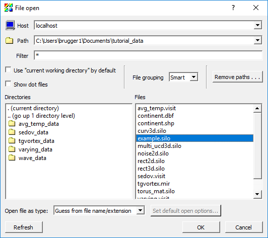
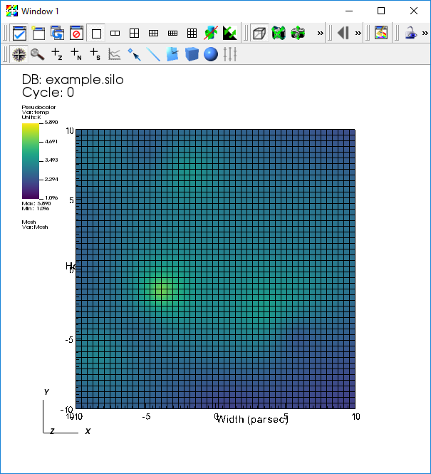
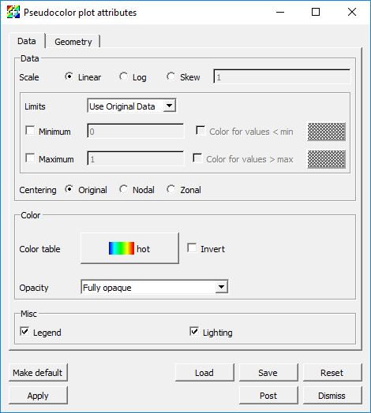
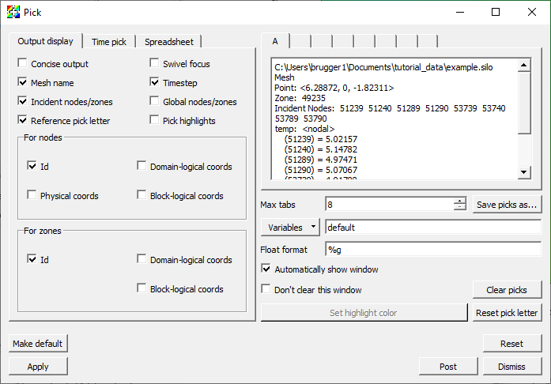

.. _VisIt_Basics:

VisIt Basics
============

.. toctree::
    :maxdepth: 2

Starting VisIt_
---------------

The way you start VisIt_ depends on the platform you are on:

* On Windows, double click on the VisIt_ desktop icon
* On Mac, double click on the VisIt_ icon where you installed it (generally in the /Applications folder).
* On Unix, invoke: ``/path/to/visit/bin/visit``

  * Most people ultimately put ``/path/to/visit/bin`` in their $PATH and then just say ``visit``.

What you see
------------

   The VisIt graphical user interface and visualization window

* The tall grey window on the left is called the **Graphical User Interface**, which will be refered to from here on as the *GUI*. It is the primary mechanism for driving VisIt_.
* The window on the right is called the **visualization window**. It displays results.

Opening files
-------------

The first thing to do is to open files.

1. `Download <https://visit-dav.github.io/largedata/datarchives/visit_tutorial>`_ the tutorial data folder.
2. Go to the *GUI* and click on the *Open* icon.
3. This brings up the File open window.

   The File open window

4. Change the *Path* field to the "tutorial_data" folder.
5. Highlight the file "example.silo" and then click *OK*.

You've opened a file!

Advanced file opening features
~~~~~~~~~~~~~~~~~~~~~~~~~~~~~~

1. In the File open window:

  * There is a field for *Host*. That is how you open a file on another system and run in client/server mode.
  * There is a *Filter*. That is provided to subset the file list to only the files VisIt_ may want.

    * Example filter: "\*.silo \*.vtk"

2. VisIt_ uses heuristics to determine the file type.

  * You can explicitly set the file type by setting the *Open file as type:* to the appropriate type.

3. You can also open files on the command line. For example, ``visit -o file.ext`` opens the file "file.ext".

Making a plot
-------------

1. Click on the *Add* icon to access various plots. This is located about half way down the Main window.
2. Select *Pseudocolor->temp* to add a Pseudocolor plot.
3. After adding a plot, you will see a green entry added to the "Plot list", which is located half way down the *GUI*.

  * This means VisIt_ will draw this plot after you click *Draw*.

   The plot list with a Pseudocolor plot in it

4. Click *Draw*.
5. You should see a plot appear in the visualization window.
6. Go to *Add->Mesh->Mesh*.
7. Click *Draw*.
8. You should now see both a Pseudocolor and Mesh plot.

   A Pseudocolor and mesh plot displayed in a visualization window

9. Highlight the Pseudocolor plot in the Plot list.
10. Click the *Hide/Show* button.

  * This will hide the Pseudocolor plot. You should now see only the Mesh plot.

11. Highlight the Mesh plot and click *Delete*.

  * You should now have an empty visualization window.
  * The Pseudocolor plot should now be selected.

12. Click *Hide/Show*.

  * The Pseudocolor plot should reappear.

Modifying the plot attributes
-----------------------------

1. Go to *PlotAtts->Pseudocolor*. This is located in the menu bar at the top of the Main menu.
2. This brings up the Pseudocolor plot attributes window.

   The Pseudocolor plot attributes window

3. Change the *Scale* from *Linear* to *Log*.
4. Click *Apply*.

  * The colors changed.

5. Click *Minimum* on and change the value to "3".
6. Click *Maximum* on and change the value to "4".
7. Click *Apply*.

  * The colors change again.

8. Change the *Opacity* mode to *Constant*.

  * Change the opacity slider to 50%.

9. Click *Apply*.

* You can now see through the plot. Note that you only see the external faces. If you want to see the data from the whole volume, that will be with the volume plot.

10. Change back the *Scale*, *Limits*, and *Opacity* back to their original settings and click *Apply*.
11. Dismiss the Pseudocolor plot attributes window.

Applying an operator
--------------------

1. Click on the *Operators* button to access various operators. This is located next to the *Add* button.
2. Select *Slicing->Slice* to add a Slice operator.

  * The visualization window will go blank and the Pseudocolor entry in the Plot list will turn green.
  * This allows you to change the slice attributes before applying the Slice operator.
  * We will apply the operator with the default attributes.

3. Click *Draw*.

  * You are now looking at a 2D slice.

4. Go to *OpAtts->Slicing->Slice*.
5. This brings up the Slice operator attributes window.

   The Slice operator attributes window

6. There are many controls for setting the slice plane ... play with them.
7. Operators can be removed by clicking on an expansion arrow in the Plot list, then clicking on the red X icon next to an operator.

   The Expansion arrow and X icon in the Plot list

VisIt_ interaction modes
------------------------

There are six basic interaction modes:

1. Navigate
2. Zoom
3. Zone pick
4. Node pick
5. Spreadsheet pick
6. Lineout

   The visualization tool bar with the icons for setting the interaction mode

The interaction mode is controlled by the toolbar, which is located at the
top of the visualization window. The six interaction modes are all located
together on the toolbar, towards the bottom.

The following descriptions apply to plots of 2D data. Before proceeding:

1. Select *Pseudocolor->temp* to add a Pseudocolor plot of *temp*.
2. Select *Operators->Slicing->Slice* to add a Slice operator.
3. Click *Draw*.
4. Click on the *Reset view* icon in the tool bar to reset the view. It is represented by a camera that has a green "X" around it (The camera is mostly obscured by the X).

Using navigate mode
~~~~~~~~~~~~~~~~~~~

You always start in Navigate mode. Navigate mode is indicated by the Navigate
icon, represented by a compass, being indented. It allows you to pan and
rotate the data set.

1. Put the cursor in the visualization window.
2. Left click (or single click if you do not have a 3 button mouse) and move the mouse.
3. The data set will pan with the mouse.

  * In 3D, the data set rotates.

4. Middle click and move the mouse up and down. The data set will zoom in and out.

  * In 3D, the data set will also zoom in and out.

Using zoom mode
~~~~~~~~~~~~~~~

Zoom mode is indicated by the Zoom icon, represented by a magnifying glass,
being indented. It allows you to zoom the image by selecting a rectangular
region.

1. Click on the Zoom icon.
2. Go to the visualization window and left click (single click) and HOLD IT DOWN.
3. Move the mouse a bit.

  * You should see a rubber band.

4. Lift up the mouse button.

  * You should now be zoomed in so that the viewport matches what was previously inside the rubber band.

Using lineout mode
~~~~~~~~~~~~~~~~~~

Lineout mode is indicated by the Lineout icon, represented by a curve plot
of red and blue curves, being indented. It allows the user to create a plot
of a scalar variable as a function of distance along a line. 
Lineout is specific to 2D.

1. First, reset the view again.
2. Click on the Lineout icon.
3. Put the cursor over the data and left click (single click) and HOLD IT DOWN.
4. Move the mouse a bit.

  * You should see a single line moving around.

5. Lift up the mouse button.
6. A new window will appear. The new window contains a "Lineout", which has *temp* as a function of distance over the line.
7. On the new window, find the Delete window icon, represented by a window with a red circle with a line through it.
8. Click this button.

  * The new window will disappear and you should now have only one window.

Using pick mode
~~~~~~~~~~~~~~~

Pick mode is indicated by the Zone pick or Node pick icon, represented by
a "+" with a small Z or a "+" with a small N, being indented. It allows the
user to query a variable associated with a zone or node.

1. Click on the Zone pick icon.
2. Put the cursor over the data set and left click (single click).
3. This brings up the Pick window.

  * The Pick window contains information about the zone (i.e. cell or element) that you just picked in.

   The Pick output window

Pick can return a lot more information than what it just did if you use
the Pick window.

4. Go to the *Variables* drop down menu and select *Scalars/pressure*.
5. Turn on *Physical Coords* under *For Nodes*.
6. Turn on *Domain-Logical Coords* under *For Zones*.
7. Click *Apply*.
8. Make another pick.

  * You get information about pressure, the coordinates of each node, and the logical coordinates for the zone.

Other plots
-----------

1. We will experiment with the Contour, Filled Boundary, Label, Vector and Volume plots.

Other operators
---------------

1. We will experiment with the Clip and Threshold operators.

Saving an image
---------------

1. With a current plot, go to *File->Save window*.

* This saves an image to the filesystem.

On Windows, the default location for saved images is in *Documents/VisIt/My images*.

Saving a database
-----------------

VisIt_ can be part of a larger tool chain.

1. If you do not already have one, make a Pseudocolor plot of temp from the "example.silo" database.
2. Apply the Threshold operator and change the range to be 3->max.
3. Click *Draw*.
4. Go to *File->Export database*.
5. This brings up the Export Database window.

   The Export Database window

6. Change *Export to* to *VTK*.
7. Be sure to set the output directory or the exported file will be written to the working directory *(on Windows that would be the directory where VisIt_ is installed)*.
8. Click *Export*.

  * The Export options for VTK writer window will pop up at this point. It allows you to specify the options for the VTK writer. We will use the default options.

9. Click *Ok*.

  * A file named "visit_ex_db.vtk" has been saved to the file system.

Subsetting
----------

1. Delete any plots in your visualization window.
2. Open the file "multi_ucd3d.silo".
3. Make a Subset plot of "domains(mesh1)".

  * The plot is colored by "domains", which normally correspond to a simulation's processors.

4. In the Plot list, find the overlapping transparent black and white ovals (like a Venn diagram) and click on it.
5. This brings up the Subset window.

   The Subset window

6. Click on *domains* in the left most panel.

  * This will expand the list of domains in the center panel.

7. Turn off some domains and click *Apply*.

  * You will see some of the domains disappear.
  * Subsetting works with any plot type.

8. Turn all the domains back on.
9. Click on *mat1* in the left most panel.

  * This will expand the list of materials in the center panel.

10. Turn off materials 1 and 3.

  * You will see material 2 only, colored by domain.

This mechanism is used to expose subsetting for materials, domains, AMR levels, and other custom subsettable parts.
