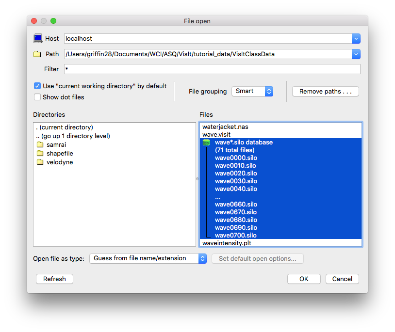
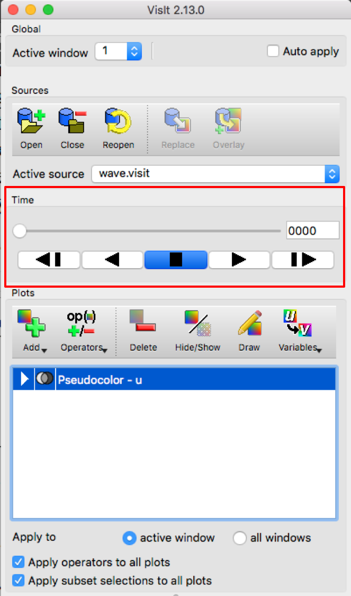
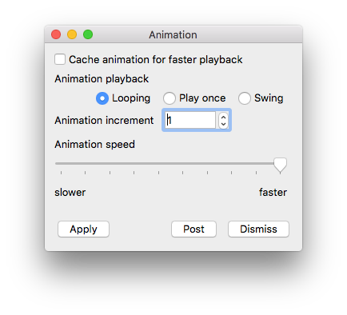

.. _Animation basics:

Animation basics
----------------

Animation is used mainly for looking at how scientific databases evolve over
time. Databases usually consist of many discrete time steps that contain the
state of a simulation at a specific instant in time. Creating visualizations
using just one time step from the database does not reveal time-varying
behavior. To be most effective, visualizations must be created for all time
steps in the database.

The .visit file
~~~~~~~~~~~~~~~

Since scientific databases usually consist of dozens to thousands of time
states. Those time states can reside in any number of actual files. Some
database file formats support multiple time states in a single file while other
formats require each time state to be located in its own file. When all time
states are in their own file, it is important for VisIt to know which files
comprise the database. VisIt attempts to use automatic file grouping to
determine which files are in a database but sometimes it is better if you
provide the actual list of files in a database when you want to generate an
animation using VisIt. You can create a :ref:`.visit <dotvisitfiles>` file that
contains a list of
the files in the database. By having a list of files that make up the database,
VisIt does not have to guess database membership based on file naming
conventions. While this may appear to be inconvenient, it removes the
possibility that VisIt will include a file that is not in the database. It
also frees VisIt from having to know about dozens of ad hoc file naming
conventions. Having a :ref:`.visit <dotvisitfiles>` file also allows VisIt to
make certain
optimizations when generating a visualization. 

VisIt provides a **File grouping** combo box in the **File open** window (see :numref:`Figure %s<file_open_fig>`) 
to assist in grouping related time-varying files into a virtual database. A virtual database accomplishes
the same function as a ``.visit`` file except that no extra file needs to be created.
Selecting *On* or *Smart* will group files into a virtual database. The *On* setting applies file matching
rules to group files with similar prefixes into a virtual database. VisIt will attempt to generate a pattern
from a filename so sequences of numbers can be abstracted out. Multiple files that match the same pattern are
added to the same virtual database.  The *Smart* setting applies the same logic as well as some extra rules 
that permit additional file grouping. For instance, certain file extensions that include numbers such as
``.hdf5`` are excluded from the pattern generation so the number in the file extension
does not prevent useful file groupings. 

.. _file_open_fig:

   File open window 

Flipbook animation
~~~~~~~~~~~~~~~~~~

.. _animation_buttons:

   Animation controls

All that is needed to create a flipbook animation is a time-varying database.
To view a flipbook animation, open a time-varying database, create plots as
usual, and click the **Play** button in the **GUI** shown in :numref:`Figure %s<animation_buttons>`
highlighted in red or
in the visualization window's **Animation Toolbar** . A flipbook animation
repeatedly cycles through all of the time states in the database displaying
the plots for the current time state in the visualization window. The result
is an animation that allows you to see the database evolve over time. The 
**VCR** buttons, shown in :numref:`Figure %s<animation_buttons>` , allow 
you to control how a flipbook animation plays. The animation controls are 
are also used for controlling keyframe animations. Clicking the **Play** 
button causes VisIt to advance the database timestep until the **Stop**
button is clicked. As the plots are generated for each database time state,
the animation proceeds only as fast as the compute engine can generate plots.
As described in the :ref:`animation_window_section` section, you have the option of caching 
the geometry for each time state so animations will play smoothly according 
to the animation playback speed once the plots for each database time state have 
been generated.

Setting the time state
""""""""""""""""""""""

There are several ways that you can set the time state for an animation.
You can use the **VCR** controls to play animations or step through them one
state at a time. You can also use the **Time slider** to access a specific
animation time state. To set the animation time state using the **Time slider**
, click on the time slider and drag horizontally to a new time state. The
time state to which you drag it will be displayed in the **Cycle/Time** text
field as you drag the time slider so you will know when to let go of the
**Time slider** . Once you release the mouse button at a new time state,
VisIt will calculate the visualized plots using the data at the specified
time state.

If you prefer more precise control over the time state, you can type a cycle
or time into the **Cycle/Time** text field to make VisIt jump to the closest
cycle or time for the active database. You can also highlight a new time state
for the active database in the **Selected files** list and then click the
**Replace** button to make VisIt change the time state for the visualization.

.. _animation_window_section:

Animation Window
~~~~~~~~~~~~~~~~

.. _animation_window:

   Animation window

You can open the **Animation Window**, shown in 
:numref:`Figure %s<animation_window>` , by clicking on the **Animation ...**
option from the **Controls** menu. The **Animation Window**
contains controls that allow you to turn off pipeline caching and adjust
the animation playback mode and speed.

Animation playback speed
""""""""""""""""""""""""

The animation playback speed is used when playing flipbook or keyframe
animations. The playback speed determines how fast VisIt cycles through
the database states that make up the animation. Rather than using states
per second as a measurement for the playback speed, VisIt uses a simple
scale of slower to faster. To set the animation playback speed, use the
**Animation speed** slider. Moving the slider to the left and slower setting
slows down animations so they change time states once every few seconds.
Moving the slider to the right and faster setting will make VisIt play the
animation as fast as the host graphics hardware allows.

Pipeline caching
""""""""""""""""

When pipeline caching is enabled, VisIt tries to retain all of the geometric
primitives that are used to draw a plot. This greatly speeds up animations
once the geometry for all time states is cached. The downside to pipeline
caching is that it can consume large amounts of memory. Pipeline caching is
enabled by default, but sometimes it makes sense to turn it off. The deciding
factors are the size of the database, the number of animation frames, and the
number of plots in each animation frame. Try leaving pipeline caching enabled
until you notice performance degradation. To turn off pipeline caching, uncheck
the **Pipeline caching** check box in the **Animation Window** . 

Animation playback mode
"""""""""""""""""""""""

The animation playback mode determines how VisIt gets to the next time state
after playing until the end of the animation. There are three animation
playback modes: looping, play once, and swing. VisIt loops animations by
default so once the end of the animation is reached, it starts playing from the
beginning. When the animation mode is set to play once, VisIt plays the
animation through until the end and then stops playing the animation. When
VisIt reaches the end of the animation in swing mode, the animation starts
playing in reverse until it gets to the start, at which point, it starts
playing forward again. To set the animation mode, click on one of the 
**Looping**, **Play once** , and **Swing** radio buttons in the 
**Animation Window** .
