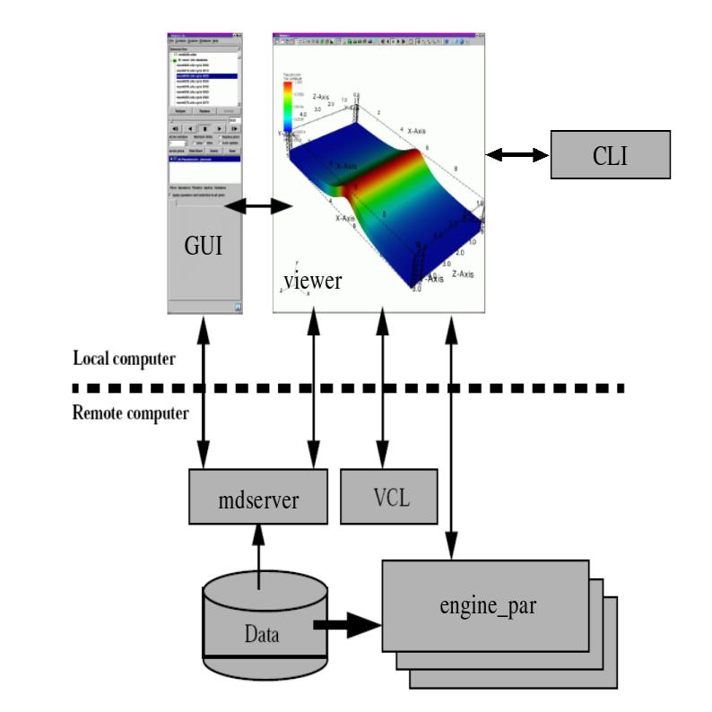
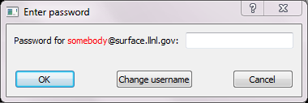
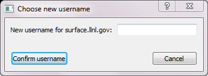
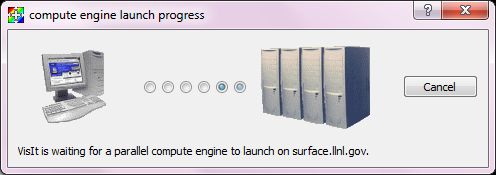

.. _Client-Server Mode:

Client-Server Mode
------------------

When you run VisIt locally, you usually select files and create plots using 
the open database. Fortunately, the procedure for running VisIt in 
client-server mode is no different than it is for running in single-computer 
mode. You begin by launching the :ref:`File Open Window` and typing the name 
of the computer where the files are stored into the **Host** text field.

Once you have told VisIt which host to use when accessing files, VisIt launches
the VisIt Component Launcher (VCL) on the remote computer. The VCL is a VisIt
component that runs on remote computers and is responsible for launching other
VisIt components such as the metadata server (mdserver) and compute engine.
(:numref:`Figure %s<visit_architecture_image>`).  Once you are connected to 
the remote computer and VCL is running, you won't have to enter a password 
again for the remote computer because VCL stays active for the life of your 
VisIt session and it takes care of launching VisIt components on the remote 
computer.

.. _visit_architecture_image:

   
   VisIt's Architecture

If VCL was able to launch on the remote computer and if it was able to
successfully launch the metadata server, the files for the remote computer
will be listed in the **Files** pane of the **File Open Window**, just as if
you were running locally.  You then select the file or virtual database and
click **OK**.  Now that you have files from the remote computer at
your disposal, you can create plots as usual.

Passwords
~~~~~~~~~

Sometimes when you try to access files on a remote computer, VisIt prompts you
for a password by opening a **Password Window**
(:numref:`Figure %s<remote_vis_password>`). If you are prompted for a
password, type your password into the window and click the **Ok** button. If
the password window appears and you decide to abort the launch of the remote
component, you can click the **Password Window's Cancel** button to stop the
remote component from being launched.

.. _remote_vis_password:

   
   Password Window

If your username for the remote machine is not listed correctly, you can
click on the **Change username** button and a new window will pop up allowing
you to enter the proper username for the remote system.  
(:numref:`Figure %s<change_remote_username>`). Enter the correct
username in the text field provided and click **Confirm username**. Proceed
with entering the password in the **Password Window**.

.. _change_remote_username:

   
   Change Username Window

VisIt uses *ssh* for authentication and you can set up ssh so that passwords
are not required. This is called *passwordless* ssh and once it is set up for a
computer, VisIt will no longer need to prompt for a password. 

.. _SettingUpPasswordlessSSH:

Setting Up Password-less SSH
~~~~~~~~~~~~~~~~~~~~~~~~~~~~
The following instructions describe how to set up **ssh** to allow password-less
authentication among a collection of machines.

On the Local Machine
""""""""""""""""""""

If you do not already have a **~/.ssh/id_rsa.pub** file, generate the key::

    cd

    ssh-keygen -t rsa

Accept default values by pressing *<Enter>*.  This will generate two files, 
**~/.ssh/id_rsa** and **~/.ssh/id_rsa.pub**.  The **~/.ssh/id_rsa.pub** file 
contains your public key in one very long line of text.  This information needs 
to be concatenated to the **authorized_keys** file on the remote machine, so 
copy it to a temp file on the remote machine::

     scp ~/.ssh/id_rsa.pub <your-user-name>@<the.remote.machine>:tmp

On the Remote Machine
"""""""""""""""""""""

If you do not already have a **~/.ssh** directory, create one with **r-w-x** 
permission for the owner only::

    cd

    mkdir .ssh

    chmod 700 .ssh

If you do not already have a **~/.ssh/authorized_keys** file, create an empty 
one with permission for the owner only::

    cd ~/.ssh

    touch authorized_keys

    chmod 600 authorized_keys 

Concatenate the temporary file you copied into authorized_keys::

    cd ~/.ssh

    cat authorized_keys ~/tmp > authorized_keys

    rm ~/tmp

Completing the Process
""""""""""""""""""""""

If you have more remote machines you want to access from the same local machine
using *passwordless* ssh, repeat the process starting with copying the 
**~/.ssh/id_rsa.pub** file from the local machine to the remote, and 
continuing from there.

You can also repeat the above sections, reversing the local and remote 
machines, in order to allow *passwordless* ssh to the local machine from the 
remote machine.

Environment
~~~~~~~~~~~

It is important to have VisIt in your default search path instead of specifying
the absolute path to VisIt when starting it. This is not as important when you
run VisIt locally, but VisIt may not run properly in client-server mode if it
is not in your default search path on remote machines. If you regularly run
VisIt using the network configurations provided for LLNL computers then VisIt
will have host profiles, which are sets of information that tell VisIt how to
launch its components on a remote computer. The provided host profiles have
special options that tell the remote computer where it can expect to find the
installed version of VisIt so it is not required to be in your path. If you
did not opt to install the provided network configurations or if you are at a
site that requires other network configurations then you will probably not have
host profiles by default and it will be necessary for you to add VisIt to your
path on the remote computer. You can add VisIt to your default search path on
Linux systems by editing the initialization file for your command line shell.

Launch Progress Window
~~~~~~~~~~~~~~~~~~~~~~

When VisIt launches a compute engine or metadata server, it opens the
**Launch Progress Window** when the component cannot be launched in under four
seconds. An exception to this rule is that VisIt will always show the
**Launch Progress Window** when launching a parallel compute engine or any
compute engine on macOS. VisIt's components frequently launch fast enough
that it is not necessary to show the **Launch Progress Window** but you will
often see it if you launch compute engines using a batch system.

.. _client_server_launch_progress:

   
   Launch Progress Window

The **Launch Progress Window** indicates VisIt is waiting to hear back from the
component being launched on the remote computer and gives you some indication
that VisIt is still alive by animating a set of moving dots representing the
connection from the local computer to the remote computer. The icon used for
the remote computer will vary depending on whether a serial or parallel VisIt
component is being launched. The **Launch Progress Window** for a parallel
compute engine is shown in :numref:`Figure %s<client_server_launch_progress>`. 
The window is visible until the remote compute engine connects back to the 
viewer or the connection is cancelled. If you get tired of waiting for a 
remote component to launch, you can cancel it by clicking the **Cancel** 
button. Once you cancel the launch of a remote component, you can return to 
your VisIt session. Note that if the remote compute is a parallel compute 
engine launched via a batch system, the engine will still run when it is 
finally scheduled but it will immediately die since VisIt has stopped 
listening for it. On heavily saturated batch systems, it might be prudent for 
you to manually remove your compute engine job from the queue.

