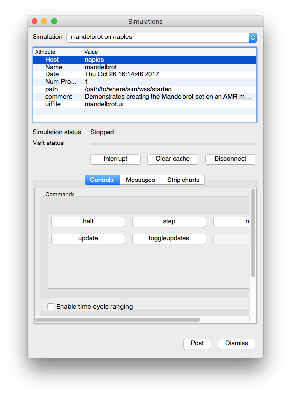

.. _ComputeEngines:

Compute Engines
========================

VisIt can have many compute engines running at the same time. Much of the time
the compute engines are those that are installed with VisIt but on occasion,
simulation codes may be instrumented to act as VisIt compute engines capable of
performing visualization operations on simulation data as it is created. When a
simulation is used as a VisIt compute engine, VisIt can access data directly
from the simulation without the need to translate data into another format or
write it out to disk. When simulations are instrumented to become VisIt compute
engines, they have all of the capabilities of a standard VisIt compute engine
and more. Specifically, simulations can accept additional simulation-defined
control commands that direct them to perform actions such as writing a
restart file. Since simulations offer extra capabilities over a normal VisIt
compute engine, VisIt provides different windows in order to manage them. To
manage compute engines and check on progress, VisIt provides a
**Compute Engine Window**. VisIt provides the **Simulation Window** to
manage simulations, display their progress, and provide extra controls for the
simulations.

Compute Engines Window
----------------------

.. _remote_vis_compute_engine_window:

.. figure:: images/enginewindow.png
   
   Compute Engines Window

You can open the **Compute Engines Window**, shown in
:numref:`Figure %s<remote_vis_compute_engine_window>`, by selecting the
**Compute engines** option from the **Main Window's File** menu. The main
purpose of the **Compute Engines Window** is to display the progress of a
compute engine as it completes a task. The window has two status bars. The top
status bar indicates the progress of the overall task. The
bottom status bar indicates that compute engine's progress through the current
processing stage. The window also provides buttons for interrupting and closing
compute engines, as well as an **Engine Information Area** that indicates how
many processors the engine uses and its style of load balancing.

Picking a compute engine
~~~~~~~~~~~~~~~~~~~~~~~~

The **Compute Engines Window** has the concept of an active compute engine.
Only the active compute engine's progress is displayed in the status bars.
The active compute engine is also the engine that is interrupted or closed.
To pick a new active compute engine, choose a compute engine name from the
**Engine** menu. The **Engine** menu contains the names of all compute engines
that VisIt is running.

Interrupting a compute engine
~~~~~~~~~~~~~~~~~~~~~~~~~~~~~

Some operations in VisIt may take a long time to complete so most computations
are broken down into stages. In the event that you do not want to wait for an
operation to complete, or if you realize that you made a mistake, you can
interrupt a compute engine. When you click the **Interrupt engine** button 
a signal is sent to the compute engine that tells it to stop its work. 
The compute engine handles the interrupt requests after it
completes the current stage so there can be a small delay before the compute
engine is interrupted. Any plots being generated when a compute engine is
interrupted are sent into the error state and are listed in red in the
**Plot list** until they are regenerated.

Closing a compute engine
~~~~~~~~~~~~~~~~~~~~~~~~

.. _remote_vis_close_compute_engine:

.. figure:: images/reallyclose.png
   
   Close compute engine confirmation dialog

You can close a compute engine when you no longer need it by clicking the
**Close engine** button. The compute engine is closed only after you click
**Yes** in a confirmation dialog window.

Clearing a compute engine's cache
~~~~~~~~~~~~~~~~~~~~~~~~~~~~~~~~~~~~

As the compute engine processes data, it caches calculation results in case
they are needed again. This includes meshes and
variables that have been read from databases as well as the results from
more complicated calculations involving expressions and operators. VisIt's
compute engine periodically clears the cache of items that it no longer needs
but if you want to explicitly clear the cache to free up more memory, you can
click the **Clear cache** button in the **Compute Engine Window**.

Simulation Window
-----------------

.. _remote_vis_sim_window:

   
   Simulation Window

You can open the **Simulation Window**, shown in
:numref:`Figure %s<remote_vis_sim_window>`, by selecting the
**Simulations** option from the **Main Window's File** menu. The main purpose
of the **Simulation Window** is to display the progress of a simulation that is
acting as a VisIt compute engine as it completes its visualization tasks. The
**Simulation Window** also provides buttons that direct the simulation to
perform simulation-defined commands such as saving out a restart dump. The list
of commands depends on the functionality that the simulation exposes
to VisIt when instrumented.

The **Simulation Window** is divided up into two main areas. The top of the
window, called the **Simulation attributes** area, displays various attributes
of the simulation such as its name, when it was started, the name of the
computer where it is running, the number of processors, etc. Below the
**Simulation attributes** area, you will find controls that are also present in
the **Compute Engines Window** such as the **Interrupt** button and
**Clear cache** button. The **Disconnect** button is specific to the
**Simulation Window** and when you click it, VisIt will detach from the running
simulation, allowing it to continue its calculation. You can reconnect to 
the simulation later to check on the its progress or create more visualizations. 

Below the **Simulation attributes** area, you can access **Commands**,
**Messages**, and **Strip Charts**. The **Commands** tab displays buttons for
simulation-defined commands. When a simulation is instrumented to act as
a VisIt compute engine, it publishes a list of commands that it will accept
when connected to VisIt. This allows the simulation to provide hooks 
that allow the user to tell the simulation to execute certain commands 
like writing a restart file. Depending on the complexity of the commands 
exposed, VisIt could ultimately be used to steer the simulation as well as 
visualize its results. The **Messages** tab displays messages from the 
simulation. The **Strip Charts** tab shows traces of specific quantities
published from the simulation to VisIt.  

