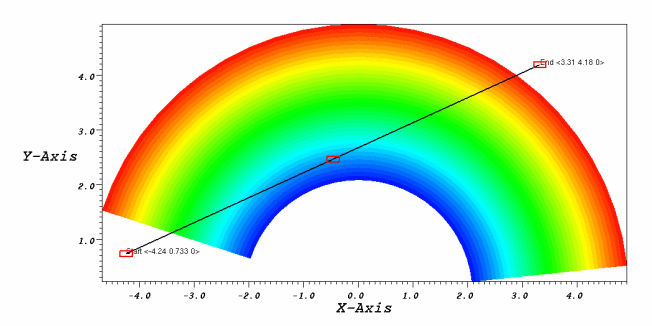
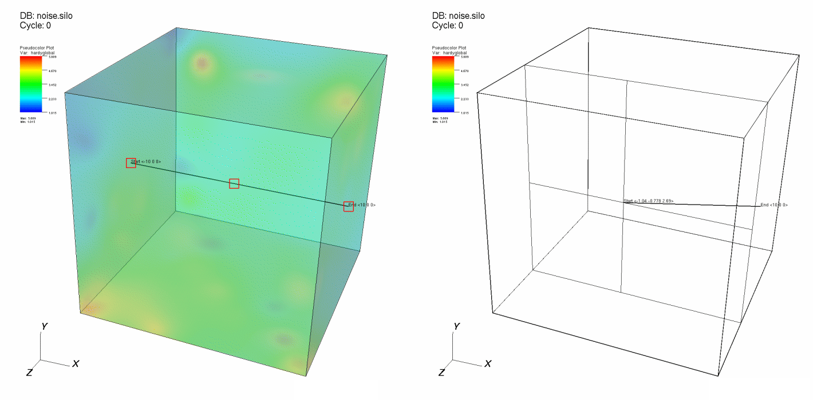

.. _Line Tool:

Line Tool
---------

It is common to create Curve plots when analyzing a simulation database.
Curve plots are created using VisIt_'s lineout mechanism where reference
lines are drawn in a visualization window and Curve plots are created in
another visualization window using the path described by the reference
lines. VisIt_'s line tool allows reference lines to be moved after they are
initially drawn. The line tool allows the user to see a representation of
a line in a visualization window and position the line relative to plots
that exist in the window.

.. _line1:

   Line tool with a 2D plot

The line tool is drawn as a thick line with three hot points positioned
along the length of the line. Both of the line tool's endpoints, as well
as its center, have a hotpoint. Since the line tool can be used for both
2D and 3D databases, the line tool's behavior is slightly different for
2D than it is for 3D. Clicking and dragging on either endpoint will move
the selected endpoint causing the line to change shape. Another way of
moving an endpoint is to hold down the *Ctrl* key and then click on the
point and move the mouse up and down to extend or shorten the line.
Clicking and dragging the middle hot point moves the entire line tool.

In 2D, the line endpoints can only be moved in the X-Y plane
(:numref:`Figure %s <line1>`). In 3D, the line endpoints can be moved in
any dimension. Since it is more difficult to see how the line is oriented
relative to plots in 3D, when the line tool is moved, 3D crosshairs appear.
The crosshairs intersect the bounding box and show the position of the line
endpoint relative to the plots. Clicking and dragging endpoints will move
them in a plane that is perpendicular to the screen. Moving the endpoints,
while first pressing and holding down the *Shift* key, causes the selected
endpoint to move back and forth in the dimension that most faces the
screen. This allows endpoints to be moved in one dimension at a time. An
example of the line tool in 3D is shown in :numref:`Figure %s <line2>`.

.. _line2:

   Line tool in 3D

The line tool can be used to set the attributes for certain VisIt_ operators such as VisIt_'s :ref:`Lineout operator <Lineout operator>`.
If a plot has a Lineout operator applied to it, and the Lineout operator's *interactive* option is turned on (see Lineout's :ref:`LineoutInteractivemode` for more details), the line tool is initialized with that operator's endpoints when it is first enabled.
(*Note:  Due to a current bug, the tool must be activated, deactivated, then activated a second time in order to be properly initialized with the Lineout's endpoint values.*)
As the line tool is repositioned and reoriented, the line tool's line endpoints are given to the Lineout operator and the Curve plots that are fed by the Lineout operator are recalculated.

