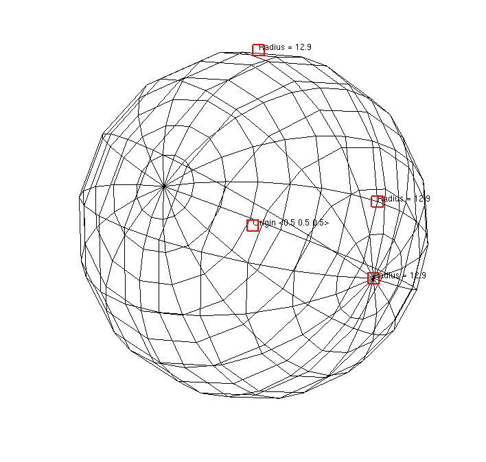

.. _Sphere Tool:

Sphere Tool
-----------

The sphere tool allows you to position a sphere relative to plots that
exist in the visualization window. The sphere tool, shown in
:numref:`Figure %s <spheretool>`, provides several hot points that are
used to position and scale the sphere. The hot point nearest the center
of the sphere is the origin hot point and it is used to translate the
sphere in a plane parallel to the screen. The other hot points are all
used to scale the sphere. To scale the sphere, click on one of the scaling
hot points and move the mouse towards the origin hot point to shrink the
sphere or move the hot point away from the origin to enlarge the sphere.

.. _spheretool:

   Sphere tool

You can use the sphere tool to set the attributes for certain VisIt plots
and operators. The sphere tool is commonly used to set the attributes for
the :ref:`SphereSlice operator`. After applying a SphereSlice operator to a
plot, enable the Sphere tool to interactively position the sphere that
slices the plot. 
