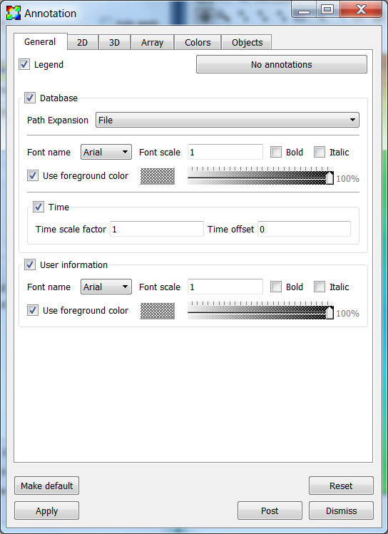
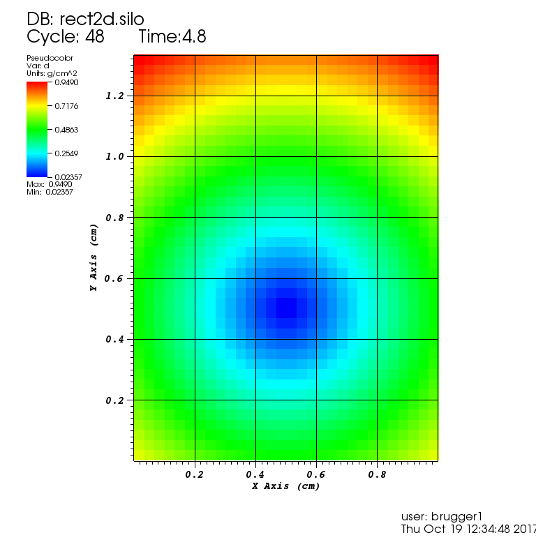
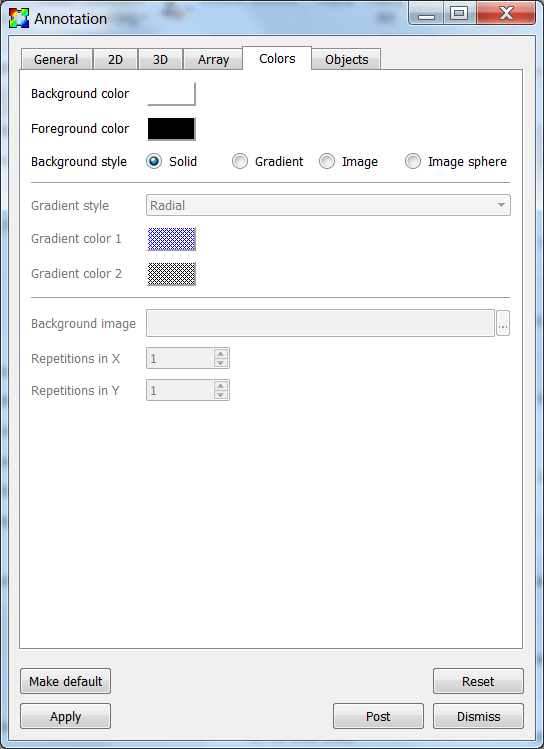
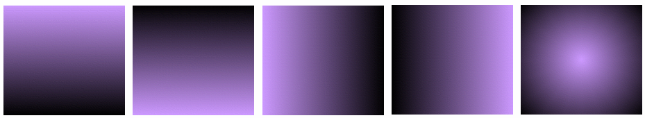
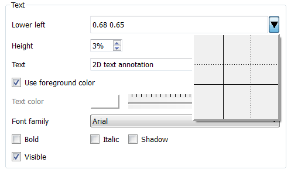
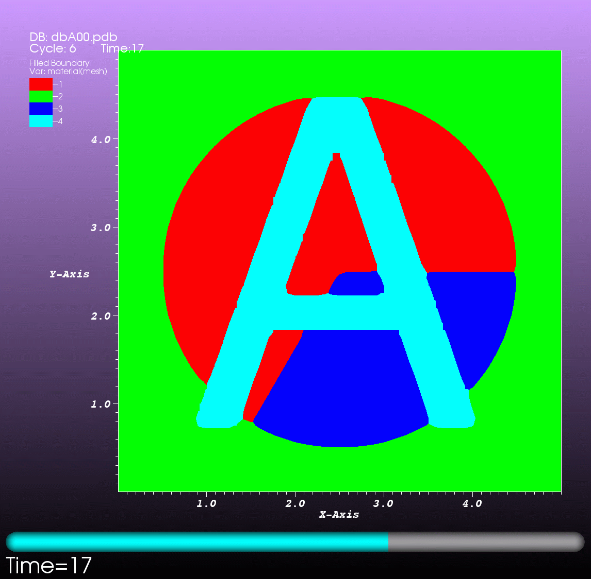
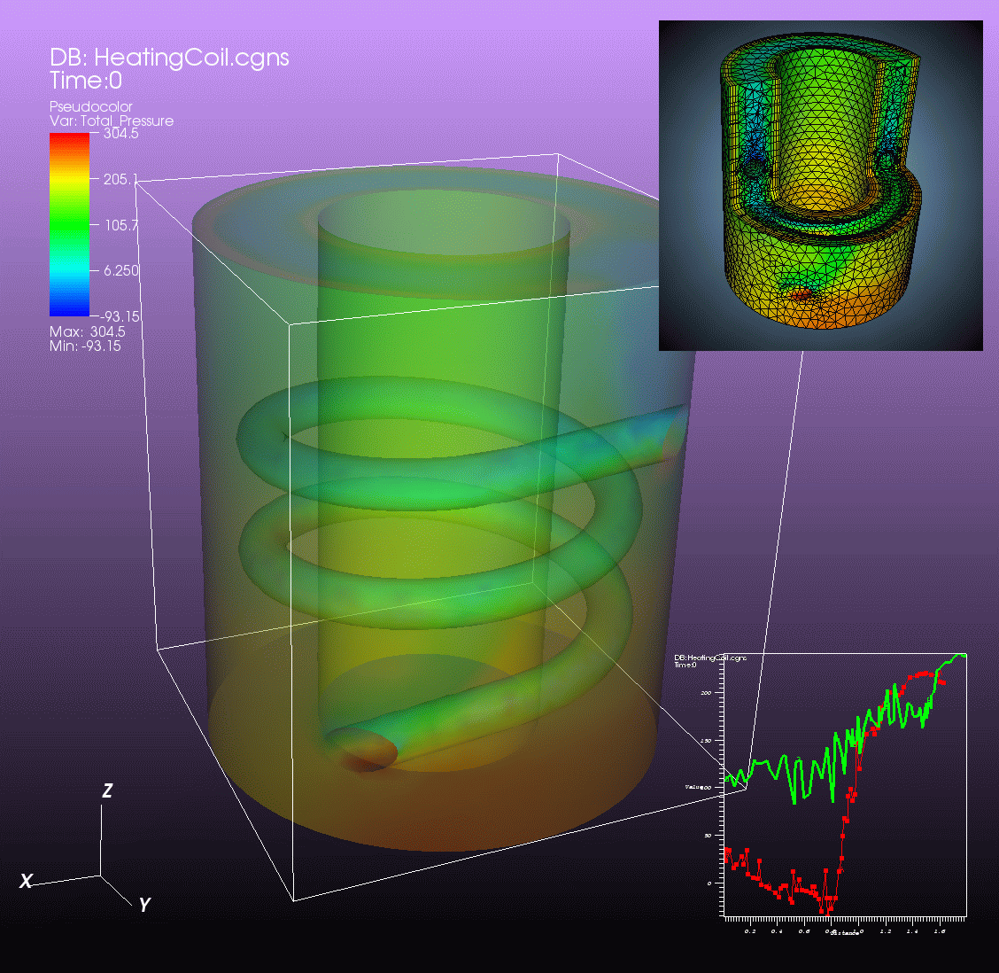

.. _Annotations:

Annotations
-----------

Annotations are objects in the visualization window that convey information
about the plots. Annotations can be global objects that show information
such as the database name, or they can be objects like plot legends that
are directly tied to plots. Annotations are an essential component of a good
visualization because they make it clear what is being visualized and make
the visualization appear more polished.

VisIt_ supports several different annotation types that can be used to enhance
visualizations. The first category of annotations includes general annotations
like the database name, the user name, and plot legends. These annotations
convey a good deal of information about what is being visualized, what values
are in the plots, and who created the visualization. The second category of
annotations include the plot axes and labels. This group of annotations comes
in three groups: 2D, 3D and Array. The attributes for these groups can be
set independently. Colors can greatly enhance the look of a visualization so
VisIt_ provides controls to set the colors used for annotations and the
visualization window that contains them. The third and final category includes
annotation objects that can be added to the visualization window. You can add
as many annotation objects as you want to a visualization window. The currently
supported annotation objects are: 2D text, 3D text, time slider, 2D line,
3D line, and image annotations.

Annotation Window
~~~~~~~~~~~~~~~~~

.. _fig-MakingItPretty-Annotation:

   The Annotation window

The **Annotation Window** (:numref:`Figure %s <fig-MakingItPretty-Annotation>`)
contains controls for the various annotations that can appear in a
visualization window. You can open the window choosing the **Annotation**
option from the **Main Window's Controls menu**. The **Annotation Window**
has a tabbed interface which groups the different categories of annotations
together.

General Annotations
~~~~~~~~~~~~~~~~~~~

.. _fig-MakingItPretty-Annotation2DExample:

   2D plot with annotations 

VisIt_ has a few general annotations that describe the visualization and are
independent of the type of database in the visualization. General annotations
encompass the user name, the database name, and plot legends. The general
annotation controls are located in the **General** tab. 
:numref:`Figure %s <fig-MakingItPretty-Annotation2DExample>` shows common
locations for some general annotations.

Turning plot legends off globally
"""""""""""""""""""""""""""""""""

Plot legends are special annotations that are added by plots. An example of
a plot legend is the color bar and title that the Pseudocolor plot adds to
the visualization window. Normally, plot legends are turned on or off by a
check box in a plot attribute window but VisIt_ also provides a check box in
the **General** tab that can turn off the plot legends for all the plots
in the visualization window. You can use the **Legend** check box at the
top of the **General** tab to turn plot legends off if they are present.

Displaying database information
"""""""""""""""""""""""""""""""

When plots are displayed in the visualization window, the name of the database
used in the plots is shown in the visualization window's upper left corner.
You can turn the database information on or off using the **Database** check
box in the **General** tab.

The **Path Expansion** selection box controls the display of the filename
text. **File** causes just the name of the file to be displayed. **Directory**
causes the directory name of the file to be displayed. **Full** causes the
full path of the file to be displayed. **Smart** uses simulation code
specific conventions to display the file name in an optimal fashion.
**Smart Directory** uses simulation code specific conventions to display
the directory name in an optimal fashion.

The **Time** check box controls the display of the time associated with
the current database. If **Time** is enabled then the **Time scale factor**
and **Time offset** controls become active, allowing you to scale as well
as apply an offset to the time associated with a database when displaying it.

Displaying user information
"""""""""""""""""""""""""""

When you add plots to the visualization window, your username is shown in the
lower right corner. The user information annotation is turned on or off using
the **User information** check box. You may want to turn off user information
when you are generating images for presentations.

2D Annotations
~~~~~~~~~~~~~~

VisIt_ has a number of controls in the **Annotation Window** to control 2D
annotations on the **2D** tab
(:numref:`Figure %s <fig-MakingItPretty-Annotation2DGeneral>`). The 2D
annotation settings are primarily concerned with the appearance of the
2D axes that frame plots of 2D databases.
:numref:`Figure %s <fig-MakingItPretty-Annotation2DExample>` shows a plot
with various annotations.

.. _fig-MakingItPretty-Annotation2DGeneral:

   The general 2D properties

The **Show axes** check box turns on and off the display of the 2D axes.

General 2D axis properties
""""""""""""""""""""""""""

**Auto scale label values** causes the labels to be multiplied by a factor
of 10 to a multiple of 3 power such that the labels are in the range 0.001
to 999. It then displays the multiplier in the axis title. An example is
shown in :numref:`Figure %s <fig-MakingItPretty-AutoscaleAxesLabelsExample>`.
The X-Axis range is 0 to 100,000, which causes the labels to be in the range
0 to 100, with a (x10^3) added to the X-Axis and Y-Axis labels to indicate
that the true range is actually 0 to 100x10^3 or 100,000.

.. _fig-MakingItPretty-AutoscaleAxesLabelsExample:

   2D plot with axes labels being scaled by 10^3

The tick marks are small lines that are drawn along the edges of the 2D
viewport. Tick marks can be drawn on a variety of axes by selecting a new
option from the **Show tick marks** menu. Tick marks can also be drawn on
the inside, outside, or both sides of the plot viewport by selecting a new
option from the **Tick mark locations** menu.

Tick mark spacing is usually changed to best suite the plots in the
visualization window but you can explicitly set the tick mark spacing by
first unchecking the **Auto set ticks** check box and then typing new tick
spacing values into the **Major minimum**, **Major maximum**,
**Major spacing**, and **Minor spacing** text fields in the **X-Axis** and
**Y-Axis** tabs.

Setting the X-Axis and Y-Axis properties
""""""""""""""""""""""""""""""""""""""""

There are tabs for separately controlling the properties of the X and Y
axes. The tab for setting the X-Axis properties is shown in
:numref:`Figure %s <fig-MakingItPretty-Annotation2DAxes>`.

.. _fig-MakingItPretty-Annotation2DAxes:

   The 2D axes properties

The axis titles are the names that are drawn along each axis, indicating
the meaning of the values shown along the axis. Normally, the names used
for the axis titles come from the database being plotted so the axis titles
are relevant for the displayed plots. Many of VisIt_'s database readers
plugins read file formats that have no support for storing axis titles
so VisIt_ uses default values such as: "X-Axis", "Y-Axis". VisIt_ provides
options that allow you to override the defaults or the axis titles that
come from the file. You can control the display of the axis titles by
enabling and disabling the **Title** check box. If you want to override
the axis titles that VisIt_ uses for 2D visualizations, turn on the
**Custom title** check box and type the new axis title into the adjacent
text field.

In addition to overriding the names of the axis titles, you can also
override the units that are displayed next to the axis titles. Units are
displayed only when they are available in the file format and like axis
titles, they are not always stored in the file being plotted. If you want
to specify units for the axes, turn on the **Custom Units** check box
and type new units into the adjacent text field.

The axis labels are the labels that appear along the 2D plot viewport.
By default, the axis labels are enabled and set to appear. You can turn
the labels off by unchecking the **Labels** check box. You can change
the label scale factor by changing the **Scaling (x10^?)** text field.

Tick mark spacing is usually changed to best suite the plots in the
visualization window but you can explicitly set the tick mark spacing by
first unchecking the **Auto set ticks** check box on the **General 2D**
tab and then typing new tick spacing values into the **Major minimum**,
**Major maximum**, **Major spacing**, and **Minor spacing** text fields.

The 2D grid lines are a set of lines that make a grid over the 2D viewport.
The grid lines are disabled by default but you can enable them by checking
the **Show grid** check box. The grid lines correspond to the major tick
marks.

3D Annotations
~~~~~~~~~~~~~~

VisIt_ has a number of controls, located on the **3D** tab in the
**Annotation Window** for controlling annotations that are used when the
visualization window contains 3D plots. Like the 2D controls, these
controls focus mainly on the axes that are drawn around plots.
:numref:`Figure %s <fig-MakingItPretty-Annotation3DExample>` shows an
example 3D plot with the 3D annotations. 
:numref:`Figure %s <fig-MakingItPretty-Annotation3DGeneral>` and
:numref:`Figure %s <fig-MakingItPretty-Annotation3DAxes>` shows the
**Annotation Window's 3D tab**.

.. _fig-MakingItPretty-Annotation3DExample:

.. figure:: images/MakingItPretty-Annotation3DExample.png

   3D plot with annotations

.. _fig-MakingItPretty-Annotation3DGeneral:

   The general 3D properties

The **Show axes** check box turns on and off the display of the 3D axes.

The **Show triad** check box turns on and off the display of the triad
annotation. The triad annotation consists of a small set of axes and is
displayed in the lower left corner of the visualization window and help
you get your bearings in 3D.

The **Show bounding box** check box turns on an off the display of the
bounding box. The bounding box annotation displays the edges of a box that
contains all the data.

General 3D axis properties
""""""""""""""""""""""""""

**Auto scale label values** causes the labels to be multiplied by a factor
of 10 to a multiple of 3 power such that the labels are in the range 0.001
to 999. It then displays the multiplier in the axis title. A 2D example is
shown in :numref:`Figure %s <fig-MakingItPretty-AutoscaleAxesLabelsExample>`.
The X-Axis range is 0 to 100,000, which causes the labels to be in the range
0 to 100, with a (x10^3) added to the X-Axis and Y-Axis labels to indicate
that the true range is actually 0 to 100x10^3 or 100,000.

The tick marks are small lines that are drawn along the edges of the bounding
box surfaces. Tick marks can be drawn on a variety of axes by selecting a
new option from the **Show tick marks** menu. Tick marks can also be drawn
on the inside, outside, or both sides of the plot bounding box by selecting
a new option from the **Tick mark locations** menu.

Tick mark spacing is usually changed to best suite the plots in the
visualization window but you can explicitly set the tick mark spacing by
first unchecking the **Auto set ticks** check box and then typing new tick
spacing values into the **Major minimum**, **Major maximum**,
**Major spacing**, and **Minor spacing** text fields in the **X-Axis**, 
**Y-Axis** and **Z-Axis** tabs.

Setting the X-Axis, Y-Axis and Z-Axis properties
""""""""""""""""""""""""""""""""""""""""""""""""

There are tabs for separately controlling the properties of the X, Y and Z
axes. The tab for setting the X-Axis properties is shown in
:numref:`Figure %s <fig-MakingItPretty-Annotation3DAxes>`.

.. _fig-MakingItPretty-Annotation3DAxes:

   The 3D axes properties

The axis titles are the names that are drawn along each axis, indicating
the meaning of the values shown along the axis. Normally, the names used
for the axis titles come from the database being plotted so the axis titles
are relevant for the displayed plots. Many of VisIt_'s database readers
plugins read file formats that have no support for storing axis titles
so VisIt_ uses default values such as: "X-Axis", "Y-Axis" and "Z-Axis".
VisIt_ provides options that allow you to override the defaults or the axis
titles that come from the file. You can control the display of the axis
titles by enabling and disabling the **Title** check box. If you want to
override the axis titles that VisIt_ uses for 3D visualizations, turn on
the **Custom title** check box and type the new axis title into the
adjacent text field.

In addition to overriding the names of the axis titles, you can also
override the units that are displayed next to the axis titles. Units are
displayed only when they are available in the file format and like axis
titles, they are not always stored in the file being plotted. If you want
to specify units for the axes, turn on the **Custom Units** check box
and type new units into the adjacent text field.

The axis labels are the labels that appear along the edges of the bounding
box. By default, the axis labels are enabled and set to appear. You can
turn the labels off by unchecking the **Labels** check box. You can change
the label scale factor by changing the **Scaling (x10^?)** text field.

Tick mark spacing is usually changed to best suite the plots in the
visualization window but you can explicitly set the tick mark spacing by
first unchecking the **Auto set ticks** check box on the **General 3D**
tab then typing new tick spacing values into the **Major minimum**,
**Major maximum**, **Major spacing**, and **Minor spacing** text fields.

The 3D grid lines are a set of lines that make a grid over the the bounding
box. The grid lines are disabled by default but you can enable them by
checking the **Show grid** check box. The grid lines correspond to the
major tick marks.

.. _Section-MakingItPretty-AnnotationColors:

Annotation Colors
~~~~~~~~~~~~~~~~~

Colors are very important in a visualization since they help to determine
how easy it is to read annotations. VisIt_ provides a tab in the
**Annotation Window**, shown in
:numref:`Figure %s <fig-MakingItPretty-AnnotationColors>`, specifically
devoted to choosing annotation colors. The **Colors** tab contains controls
to set the background and foreground for the visualization window which, in
turn, set the colors used for annotations. The **Colors** tab also provides
controls for more advanced background colors called gradients which are
colors that bleed into each other.

.. _fig-MakingItPretty-AnnotationColors:

   The annotation colors tab

The **Background color** and **Foreground color** buttons allow you to
set the background and foreground colors. To set the color, click the
color button and select a color from the **Popup color menu**
(see :numref:`Figure %s <fig-MakingItPretty-ColorSelectDialog>`).
Releasing the mouse outside of the **Popup color menu** cancels color
selection and the color is not changed. Once you select a new color
and click the **Apply** button, the colors for the active visualization
window change. Note that each visualization window can have different
background and foreground colors.

.. _fig-MakingItPretty-ColorSelectDialog:

   The popup color menu and the color selection dialog

The **Background style** setting allows you to select from four background
styles. The default background style is **Solid** where the entire background
is a single color. The second style is a **Gradient** background. In a
gradient background, two colors are blended into each other in various
ways. The resulting background offers differing degrees of contrast and can
enhance the look of many visualizations. The third style is an **Image**
background, where an image is tiled across the background. The fourth style
is an **Image sphere**, where an image is projected onto a sphere. This can
be used to paint the stars onto the background of an astrophysics simulation.
To change the background style, click the **Background style** radio buttons. 

VisIt_ provides controls for setting the colors and style used for gradient
backgrounds. There are two color buttons: **Gradient color 1** and
**Gradient color 2** that are used to change colors. To change the
gradient colors, click on the color buttons and select a color from the
**Popup color menu**. The gradient style is used to determine how colors
blend into each other. To change the gradient style, make a selection from
the **Gradient style** menu. The available options are Bottom to Top, Top
to Bottom, Left to Right, Right to Left, and Radial. The first four options
blend gradient color 1 to gradient color 2 in the manner prescribed by
the style name. For example, Bottom to Top will have gradient color 1 at
the bottom and gradient color 2 at the top. The radial gradient style puts
gradient color 1 in the middle of the visualization window and blends
gradient color 2 radially outward from the center. Examples of the gradient
styles are shown in :numref:`Figure %s <fig-MakingItPretty-Gradients>`.

.. _fig-MakingItPretty-Gradients:

   The various gradient styles

The **Background image** text field allows you to specify the name of the
file to use for the background image. The **Repetitions in X** and
**Repetitions in Y** settings allow you to specify how many times to
replicate the image in each of the X and Y image directions.

Annotation Objects
~~~~~~~~~~~~~~~~~~

So far, the annotations that have been described can only have a single instance.
To provide more flexibility in the types and numbers of annotations, VisIt_ allows you to create annotation objects, which are objects that are added to the visualization window to convey information about the visualization.
Currently, VisIt_ supports six types of user-creatable annotation objects (2D text, 3D text, time slider, 2D line, 3D line, image) and one automatically generated object tied to specific plots: Legend.
All of those types of annotation objects will be described herein.
The **Objects** tab, in the **Annotation Window** (:numref:`Figure %s <fig-MakingItPretty-AnnotationObjects>` ) is devoted to managing the list of annotation objects and setting their properties.

.. _fig-MakingItPretty-AnnotationObjects:

  
   The annotation objects tab

The **Objects** tab in the **Annotation Window** is divided up into three
main areas. The top of the window is split vertically into two areas that
let you create new annotation objects and manage the list of annotation
objects. The bottom half of the **Objects** tab displays the controls for
setting the attributes of the selected annotation object. Each annotation
object provides a separate user interface that is tailored for setting
its particular attributes. When you select an annotation in the annotation
object list, the appropriate annotation object interface is displayed.

Creating a new annotation object
""""""""""""""""""""""""""""""""

The **Create new** area in the **Annotation Window's Objects** tab contains
one button for each type of annotation object that VisIt_ can create. Each
button has the name of the type of annotation object VisIt_ creates when
you push it. After pushing one of the buttons, VisIt_ creates a new instance
of the specified annotation object type, adds a new entry to the
**Annotation objects** list, and displays the appropriate annotation object
interface in the bottom half of the **Objects** tab to display the attributes
for the new annotation object.

Selecting an annotation object
""""""""""""""""""""""""""""""

The **Objects** tab displays the annotation object interface for the selected
annotation object. To set attributes for a different annotation object, or
to hide or delete a different annotation object, you must first select a
different annotation object in the **Annotation objects** list. Click on a
different entry in the **Annotation objects** list to highlight a different
annotation object. Once you have highlighted a new annotation object, VisIt_
displays the object's attributes in the lower half of the **Objects** tab.

Hiding an annotation object
"""""""""""""""""""""""""""

To hide an annotation object, select it in the **Annotation objects** list
and then click the **Hide/Show** button on the **Objects** tab. To show the
hidden annotation object, click the **Hide/Show** button a second time.
The interfaces for the currently provided annotation objects also have a
**Visible** check box that can be used to hide or show the annotation object.

Deleting an annotation object
"""""""""""""""""""""""""""""

To delete an annotation object, select it in the **Annotation objects**
list and then click the **Delete** button on the **Objects** tab. You can
delete more than one object if you select multiple objects plots in the
**Annotation objects** list before clicking the **Delete** button.

Text annotation objects
"""""""""""""""""""""""

Text annotation objects, shown in 
:numref:`Figure %s <fig-MakingItPretty-AnnotationObjectTextExample>`,
are created by clicking the **Text** button in the **Create new** area on the
**Objects** tab. Text annotation objects are simple 2D text objects that are
drawn on top of plots in the visualization window and are useful for adding
titles to a visualization.

.. _fig-MakingItPretty-AnnotationObjectTextExample:

.. figure:: images/MakingItPretty-AnnotationObjectTextExample.png
  
   Examples of text annotations

The text annotation object properties, shown in
:numref:`Figure %s <fig-MakingItPretty-AnnotationObjectText>`, can be used
to set the position, size, text, colors, and font properties.

.. _fig-MakingItPretty-AnnotationObjectText:

  
   The text annotation interface

Text annotation objects are placed using 2D coordinates where the X, and Y
values are in the range [0,1]. The point (0,0) corresponds to the lower left
corner of the visualization window and the point (1,1) corresponds to the
upper right of the visualization window. The 2D coordinate used to position
the text annotation matches the text annotation's lower left corner. To
position a text annotation object, enter a new 2D coordinate into the
**Lower left** text field. You can also click the down arrow next to the
**Lower left** text field to interactively choose a new lower left coordinate
for the text annotation using the screen positioning control, which represents
the visualization window. The screen positioning control, shown in
:numref:`Figure %s <fig-MakingItPretty-AnnotationObjectPosition>`, lets you
move a set of cross-hairs to any point on a square area that represents the
visualization window. Once you release the left mouse button, the location
of the cross-hairs is used as the new coordinate for the text annotation
object's lower left corner.

.. _fig-MakingItPretty-AnnotationObjectPosition:

  
   Screen positioning control

The size of the text is set using the **Height** spin box. The height is the
fraction of the visualization window height.

To set the text that a text annotation object displays, type a new string into the **Text** text field.
You can make the text annotation object display any characters that you type in.
Whatever text you enter for the text annotation object is used to identify the text annotation object in the **Annotation objects** list.
In addition to the usual text properties, text annotation objects can also include a shadow.

Database values in text annotations
"""""""""""""""""""""""""""""""""""

A variety of values from a database can be displayed in text annotations.
These are introduced with a leading ``$`` character followed by the database value's name.
An optional ``%`` character following the value's name introduces a `printf-style formatting string <https://en.wikipedia.org/wiki/Printf_format_string>`__ which can be used to control the value's printed format.

.. warning::

   Presently, the ``$`` values that are displayed are taken always from the *first* plot in the plot list.
   If the plot list is changed such that the first plot that was in effect at the time the annotation was created, the rendered text for the annotation may change.

The list of values currently supported along with their default formats are 

    +--------------------+----------+-------------------------------------+
    |   **Value name**   | **Fmt**  |       **Meaning**                   |
    +--------------------+----------+-------------------------------------+
    | time               |    %g    |  time value                         |
    +--------------------+----------+-------------------------------------+
    | cycle              |    %d    |  cycle number                       |
    +--------------------+----------+-------------------------------------+
    | index              |    %d    |  state number starting from zero    |
    +--------------------+----------+-------------------------------------+
    | numstates          |    %d    |  total number of states in database |
    +--------------------+----------+-------------------------------------+
    | dbcomment          |    %s    |  database comment                   |
    +--------------------+----------+-------------------------------------+
    | lod                |    %z    |  levels of detail                   |
    +--------------------+----------+-------------------------------------+
    | vardim             |    %d    |  variable dimension                 |
    +--------------------+----------+-------------------------------------+
    | numvar             |    %d    |  number of variables                |
    +--------------------+----------+-------------------------------------+
    | topdim             |    %d    |  topological dim. of assoc. mesh    |
    +--------------------+----------+-------------------------------------+
    | spatialdim         |    %d    |  spatial dim. of assoc. mesh        |
    +--------------------+----------+-------------------------------------+
    | varname            |    %s    |  variable name                      |
    +--------------------+----------+-------------------------------------+
    | varunits           |    %s    |  variable units                     |
    +--------------------+----------+-------------------------------------+
    | meshname           |    %s    |  name of mesh assoc. w/variable     |
    +--------------------+----------+-------------------------------------+
    | filename           |    %s    |  name of database file              |
    +--------------------+----------+-------------------------------------+
    | fulldbname         |    %s    |  full path name of database file    |
    +--------------------+----------+-------------------------------------+
    | xunits             |    %s    |  x units                            |
    +--------------------+----------+-------------------------------------+
    | yunits             |    %s    |  y units                            |
    +--------------------+----------+-------------------------------------+
    | zunits             |    %s    |  z units                            |
    +--------------------+----------+-------------------------------------+
    | xlabel             |    %s    |  x axis label                       |
    +--------------------+----------+-------------------------------------+
    | ylabel             |    %s    |  y axis label                       |
    +--------------------+----------+-------------------------------------+
    | zlabel             |    %s    |  z axis label                       |
    +--------------------+----------+-------------------------------------+
    | itafile1           |    %d    |  ints from ~/.visit/itafile1.txt    |
    |                    |          |  one line per timestep.             |
    +--------------------+----------+-------------------------------------+
    | itafile2           |    %d    |  ints from ~/.visit/itafile2.txt    |
    |                    |          |  one line per timestep.             |
    +--------------------+----------+-------------------------------------+
    | itafile3           |    %d    |  ints from ~/.visit/itafile3.txt    |
    |                    |          |  one line per timestep.             |
    +--------------------+----------+-------------------------------------+
    | ftafile1           |    %g    |  floats from ~/.visit/ftafile1.txt  |
    |                    |          |  one line per timestep.             |
    +--------------------+----------+-------------------------------------+
    | ftafile2           |    %g    |  floats from ~/.visit/ftafile2.txt  |
    |                    |          |  one line per timestep.             |
    +--------------------+----------+-------------------------------------+
    | ftafile3           |    %g    |  floats from ~/.visit/ftafile3.txt  |
    |                    |          |  one line per timestep.             |
    +--------------------+----------+-------------------------------------+
    | stafile1           |    %s    |  strings from ~/.visit/stafile1.txt |
    |                    |          |  one line per timestep.             |
    +--------------------+----------+-------------------------------------+
    | stafile2           |    %s    |  strings from ~/.visit/stafile2.txt |
    |                    |          |  one line per timestep.             |
    +--------------------+----------+-------------------------------------+
    | stafile3           |    %s    |  strings from ~/.visit/stafile3.txt |
    |                    |          |  one line per timestep.             |
    +--------------------+----------+-------------------------------------+

For example, to create a text annoation which displays ``State index = XXX`` where ``XXX`` is the number for the index, set the annotation string to ``State index = $index``.
To display the current cycle number always with 6 digits and leading zeros when necessary, use the string ``$cycle%06d`` where the optional ``%`` followed by a printf-style format string is specified.
To display the first 3 characters of the variable name, use the string ``$varname%.3s``.

The ``$dbcomment`` is often useful because it allows any arbitrary text defined in the database for the current state to be used.
In particular, if the *state space* of a given database is rather complicated involving, for example, not only iterations of the main PDE solve loop but also mesh adaptivity iterations, material advection iterations, etc, the database comment is a way to capture all relevant iteration identifiers.

Multiple database values can appear in a text annotation string and the same value can also appear multiple times.

3D text annotation objects
""""""""""""""""""""""""""

3D text annotation objects, shown in
:numref:`Figure %s <fig-MakingItPretty-AnnotationObject3DTextExample>`,
are created by clicking the **3D Text** button in the **Create new** area on
the **Objects** tab. 3D text annotation objects are extruded text that are
positioned in 3D and are part of the 3D scene, so they may become obscured
by other objects in the scene and will move in space as the image is panned
and zoomed.

.. _fig-MakingItPretty-AnnotationObject3DTextExample:

  
   Examples of 3d text annotations

The 3D text annotation object properties, shown in
:numref:`Figure %s <fig-MakingItPretty-AnnotationObject3DText>`, can be used
to set the text, position, size, orientation and color properties.

.. _fig-MakingItPretty-AnnotationObject3DText:

  
   The 3D text annotation interface

To set the text that a 3D text annotation object displays, type a new string
into the **Text** text field.

3D text annotation objects are placed in 3D coordinates in the same coordinate
system used by the simulation data. To position a 3D text annotation object,
enter a new 3D coordinate into the **Position** text field.

The size of the text can be specified in two different ways. The first is
using a relative height, where the height is a fraction of the size of the
simulation data. The second is a fixed size, where the size is specified
in the coordinate system of the simulation data. If you were to specify a
relative height and apply the Transform operator to scale the data in each
direction by a factor of 10, the size of the text would not change. If you
were to specify a fixed height, scaling the data by a factor of 10 would
result in the text being one tenth the size. To specify a relative height,
select the **Relative** radio button and set the size using the spin box
next to it. The specify a fixed height, select the **Fixed** radio button
and enter the new height in the text box next to it.

The orientation of the text can also be specified in two different ways.
The first is relative to the screen coordinate system and the second is
in the coordinate system of the simulation data. If the orientation is
relative to the screen coordinate system, then rotating the image will
not change the orientation of the text. If the orientation is relative
to the coordinate system of the simulation data, then rotating the image
will change the orientation of the text. To make the orientation relative
to the screen, select the **Preserve orientation when view changes**
radio button. To make the orientation relative to the simulation coordinate
system, uncheck the **Preserve orientation when view changes** radio
button. To set the orientation, set the **Rotate Y**, **Rotate X** and
**Rotate Z** spin boxes. The rotations are applied in the left to right
order of the spin boxes in the interface.

Time slider annotation objects
""""""""""""""""""""""""""""""

Time slider annotation objects, shown in
:numref:`Figure %s <fig-MakingItPretty-AnnotationObjectTimeSliderExample>`,
are created by clicking the Time slider button in the **Create new** area
on the **Objects** tab. Time slider annotation objects consist of a graphic
that shows the progress through an animation using animation and text that
shows the current database time. Time slider annotation objects can be
placed anywhere in the visualization window and you can set their size,
text, colors, and appearance properties.

.. _fig-MakingItPretty-AnnotationObjectTimeSliderExample:

  
   An example of a time slider annotation object

Time slider annotation objects are placed using 2D coordinates where the X,
and Y values are in the range [0,1]. The point (0,0) corresponds to the
lower left corner of the visualization window and the point (1,1) corresponds
to the upper right of the visualization window. The 2D coordinate used to
position the text annotation matches the text annotation's lower left corner.
To position a text annotation object, enter a new 2D coordinate into the
**Lower left** text field. You can also click the down arrow next to the
**Lower left** text field to interactively choose a new lower left coordinate
for the text annotation using the screen positioning control, which represents
the visualization window.

.. _fig-MakingItPretty-AnnotationObjectTimeSlider:

  
   The time slider interface

The size of a time slider annotation object is controlled by settings its
height and width as a percentage of the visualization window height and
width. Type new values into the **Width** and **Height** spin buttons
to set a new width or height for the time slider annotation object.

You can set the text displayed by the time slider annotation object by
typing a new text string into the **Text label** text field. Text is
displayed below the time slider annotation object and it can contain any
message that you want. The text can even include wildcards such as *$time*,
which evaluates to the current time for the active database. If you use
*$time* to make VisIt_ incorporate the time for the active database, you
can also specify the format string used to display the time. The format
string is a standard C-language format string (e.g. "%4.6g") and it
determines the precision used to write out the numbers used in the time
string. You will probably want to specify a format string that uses a
fixed number of decimal places to ensure that the time string remains the
same length during the animation, preventing distracting differences in
the length of the string from taking the eye away from the visualization.
Type a C-language format string into the **Time format** text field to
change the time format string.

Time slider annotations have three color attributes: start color, end
color, and text color. A time slider annotation object displays time like
a progress bar in that the progress bar starts out small and then grows to
the right until it takes up the whole length of the annotation. The color
used to represent the progress can be set by clicking the **Start color**
button and choosing a new color from the **Popup color** menu. As the time
slider annotation object shows more progress, the color that is used to
fill up the time that has not been reached yet (end color) is overtaken
by the start color. To set the end color for the time slider annotation
object, click the **End color** button and choose a new color from the
**Popup color** menu. Normally, time slider annotation objects use the
foreground color of the visualization window when drawing the annotation's text.
If you want to make the annotation use a special color, turn off the
**Use foreground color** check box and click the **Text color** button
and choose a new color from the **Popup color** menu.

Time slider objects have two more attributes that affect their appearance.
The first of those attributes is set by clicking on the **Rounded** check
box. When a time slider annotation object is rounded, the ends of the
annotation are curved. The last attribute is set by clicking on the
**Shaded** check box. When a time slider annotation object is shaded,
simple lighting is applied to its geometry and the annotation will appear
to be more 3-dimensional.

2D line annotation objects
""""""""""""""""""""""""""

2D line annotation objects, shown in
:numref:`Figure %s <fig-MakingItPretty-AnnotationObject2DLine>`, are created
by clicking the **2D Line** button in the **Create new** area on the
**Objects** tab. 2D line annotation objects are simple line objects that are
drawn on top of plots in the visualization window and are useful for pointing
to features of interest in a visualization. 2D line annotation objects can be
placed anywhere in the visualization window and you can set their locations,
arrow properties, and color.

.. _fig-MakingItPretty-AnnotationObject2DLineExample:

  
   Examples of 2D line annotations

2D line annotations are described mainly by two coordinates that specify the
start and end points for the line. The start and end coordinates are specified
as pairs of floating point numbers in the range [0,1] where the point (0,0)
corresponds to the lower left corner of the visualization window and the
point (1,1) corresponds to the upper right corner of the visualization window.
You can set the start or end points for the 2D line annotation by entering
new start or end points into the **Start** or **End** text fields in the 2D
line object interface. You can also click the down arrow to the right of the
**Start** or **End** text fields to interactively choose new coordinates using
the screen positioning control.

.. _fig-MakingItPretty-AnnotationObject2DLine:

  
   The 2D line object interface

Once the 2D line annotation has been positioned there are other attributes
that can be set to improve its appearance. First of all, if the 2D line
annotation is being used to point at important features in a visualization,
you might want to increase the 2D line annotation's width to make it stand
out more. To change the width, select the new pixel width from the **Width**
menu. It is also possible to set the line style. To change the style of the
line, select the new line style from the **Style** menu. After changing the
width and style, the color of the 2D line annotation should be chosen to
stand out against the plots in the visualization. The color that you use
should be chosen such that the line contrasts sharply with the plots over
which it is drawn. To choose a new color for the line, click on the
**Line color** button and choose a new color from the **Popup color** menu.
You can also adjust the opacity of the line by using the opacity slider
next to the **Line color** button.

The last properties that are commonly set for 2D line annotations determine
whether the end points of the line have arrow heads. The 2D line annotation
supports two different styles of arrow heads: filled and lines. To make your
line have arrow heads at the start or the end, make new selections from the
**Begin arrow** and **End arrow** menus.

3D line annotation objects
""""""""""""""""""""""""""

3D line annotation objects, shown in
:numref:`Figure %s <fig-MakingItPretty-AnnotationObject3DTextExample>`,
are created by clicking the **3D Line** button in the **Create new** area on
the **Objects** tab. 3D line annotation objects are lines that are
positioned in 3D and are part of the 3D scene, so they may become obscured
by other objects in the scene and will move in space as the image is panned
and zoomed.

The 3D line annotation object properties, shown in
:numref:`Figure %s <fig-MakingItPretty-AnnotationObject3DLine>`, can be used
to set the position, style and color properties.

.. _fig-MakingItPretty-AnnotationObject3DLine:

  
   The 3D line object interface

3D text annotation objects are placed in 3D coordinates in the same coordinate
system used by the simulation data. To position a 3D line annotation object,
specify the start and end location of the line by entering the start location
in the **Start** text field and the end location in the **End** text field.

There are two types of lines supported, one is a normal line and the other
is a tube. The line type is selected through the **Line type** menu. When
using a normal line, you can specify the normal line width and line style
properties using the **Line Width** and **Line Style** menus. When using
a tube you can specify the tube quality and radius. The tube is created
from a series of flat surfaces around the center of the line to approximate
a tube. The number of surfaces used is controlled by the tube quality. The
tube radius is the radius of the tube in the coordinate system of the
simulation data. These properties can be changed through the **Tube Quality**
and **Tube Radius** menus.

It is also possible to add arrows to the beginning and end of the line. These
can be enabled with the **Begin Arrow** and **End Arrow** toggle buttons.
For each arrow, the user can also control the resolution and radius of the
arrows. The arrows consist of cones places at the ends of the line and are
constructed out of triangles that approximate a cone. The number of triangles
used is controlled by the resolution. The radius is the radius of the
cone in the same coordinate system as the simulation data. The resolution
can be changed using the **Resolution** spin box and the radius is changed
by typing a new value into the **Radius** text field.

Image annotation objects
""""""""""""""""""""""""

Image annotation objects, shown in
:numref:`Figure %s <fig-MakingItPretty-AnnotationObjectImageExample>`,
are created by clicking the **Image** button in the **Create new** area on
the **Objects** tab. Image annotation objects display images from image
files on disk in a visualization window. Images are drawn on top of plots
in the visualization window and are useful for adding logos, pictures of
experimental data, or other views of the same visualization. Image annotation
objects can be placed anywhere in the visualization window and you can set
their size, and optional transparency color.

.. _fig-MakingItPretty-AnnotationObjectImageExample:

  
   An Example of a visualization with two overlaid image annotations

The first step in incorporating an image annotation into a visualization is to choose the file that contains the image that will serve as the annotation.
To choose an image file for the image annotation, type in the full path and filename to the file that you want to use into the **Image source** text field.
You can also use the file browser to locate the image file if you click on the "..." button to the right of the **Image source** text field in the **Image annotation interface**, shown in :numref:`Figure %s <fig-MakingItPretty-AnnotationObjectImage>`.

.. warning::

   Currently, there is a limitation in the use of image annotations while operating in client/server mode.
   The *path* used must be the *same* on both the local (client) and remote (server) machines.
   Often, the only way to achieve this may be to have the image file in ``/tmp`` or ``/var/tmp``.
   For parallel engines, this may necessitate a complicated set of manual steps to a) wait for the parallel job to start, b) identify the node running MPI rank 0 (the only MPI rank where annotations are processed) and c) copy the file to the ``/tmp`` directory on that node assuming access controls will even allow that.

.. _fig-MakingItPretty-AnnotationObjectImage:

  
   The image object interface

After selecting an image file, you can position its lower left coordinate
in the visualization window. The lower left corner of the visualization
window is the origin (0,0) and the upper right corner of the visualization
window is (1,1).

Once you position the image where you want it, you can optionally scale
it relative to its original size. Unlike some other annotation objects,
the image annotation does not scale automatically when the visualization
window changes size. The image annotation will remain the same size -
something to take into account when setting up movies that use the image
annotation. To scale the image relative to its original size, enter new
percentages into the **Width** and **Height** spin boxes. If you want to
scale one dimension of the image and let the other dimension remain
unchanged, turn off the **Lock aspect** check box.

Finally, if you are overlaying an image annotation whose image contains a
constant background color or other area that you want to remove, you can
pick a color that VisIt_ will make transparent. For example,
:numref:`Figure %s <fig-MakingItPretty-AnnotationObjectImageExample>`
shows an image of some Curve plots overlaid on top of the plots in the
visualization window and the original background color in the annotation
object was removed to make it transparent. If you want to make a color in
an image transparent before VisIt_ displays it as an image annotation
object, click on the **Transparent color** check box and then select a
new color by clicking on the **Transparent color** button and picking a
new color from the **Popup color menu**.

Legend annotation objects
"""""""""""""""""""""""""

Legends are automatically added when plots are created, and have names that include the plot type.
:numref:`Figure %s <legend_multiple_image>` shows multiple legends listed in the **Annotation Objects** tab.
The Legend annotation object interface can be used to customize the legends position, size, tick labels and aspects of its appearance.

.. _legend_multiple_image:

    Multiple legends in the **Annotation Objects** tab. 

The **Position** tab, shown in :numref:`Figure %s <legend_position_image>` has controls for position, size and orientation.
VisIt generally controls the positions of legends, but if you want a specific legend to be placed elsewhere in the visualization window, uncheck the **Let VisIt manage legend position** checkbox and modify the **Legend position**.
The 2D coordinate used to position the legend matches the legend's lower left corner.
To change the position of a legend, enter a new 2D coordinate into the
**Legend position** text field.
You can also click the down arrow next to the **Legend position** text field to interactively choose a new lower left coordinate using the screen positioning control, which represents the visualization window.
The screen positioning control, shown in :numref:`Figure %s <fig-MakingItPretty-AnnotationObjectPosition>`, lets you move a set of cross-hairs to any point on a square area that represents the visualization window.
Once you release the left mouse button, the location of the cross-hairs is used as the new coordinate for the legend's lower left corner.

The **X scale** and **Y scale** spin boxes control the size of the legend, with values of '100%' being the default size.  You can enter new values using the text field or use the + and - buttons to the right of the text field.

The **Orientation** of the legend is changed using the corresponding drop-down menu, with options: **Vertical, Text on Right**; **Vertical, Text on Left**; **Horizontal, Text on Top** and **Horizonatal, Text on Bottom**.

.. _legend_position_image:

    The legend object interface for position

The **Tick marks** tab, shown in :numref:`Figure %s <legend_tickmarks_image>`, allows you to change the display of a legend's tick marks.
You can turn off the drawing of tickmarks completely by choosing the **None** option in the **Draw** dropdown menu. 
Other **Draw** options are **Values** (the default), **Labels** and **Values and Labels**.
Legends usually only have **Values** defined for tick marks, so to display **Labels**, you would have to define them by unchecking the **Let VisIt determine tick labels** checkbox and modifying the **Specify tick values and labels** table.
It starts out with the **Values** column filled in with defaults.
You can modify those, add text to the **Labels column** and change the number of table items by using the **Add tick value** and **Delete selected value** buttons.
When modifying, adding, or deleting values in the table, keep in mind they must fall within the Min/Max range of the current plot or they won't be displayed in the legend.
Not all plot types allow adding or deleting values.

.. _legend_tickmarks_image:

    The legend object interface for tick marks

:numref:`Figure %s <legend_filledboundary_image>` shows an example of modifying and displaying **Labels** for a :ref:`boundary_plot_head`. The **Values** have both a number and the name of the material, and the **Labels** were added so that only the material names would be displayed in the legend.

.. _legend_filledboundary_image:

    An example of modifying the Labels on a filled boundary legend

:numref:`Figure %s <legend_appearance_image>` shows the controls for changing the **Appearance** of a legend.

The **Bounding box** checkbox controls whether or not a background bounding box is drawn behind the legend.  When checked, widgets for controlling the color and opacity of the background bounding box will become active.

The title can be turned off via the **Draw title** checkbox.
A custom title can be specified via the **Custom title** checkbox and text edit widgets.

The **Draw min/max** checkbox controls whether or not Min/Max text (where applicable) will be added to the legend.

By unchecking the **Use foreground color** checkbox, you can change the color of the legend's text and tickmarks via the **Text color** button.

**Number format** controls the fromat for tick mark and Min/Max values.
You can modify the font style via the **Font height** text edit, **Font family** dropdown menu and **Bold** and **Italic** check boxes. (**Shadow** is currently disabled).

.. _legend_appearance_image:

    The legend object interface for appearance

:numref:`Figure %s <legend_modified_image>` shows an example of a modified legend, where position, orientation, size, tick marks, background font height and font family have all been changed.

.. _legend_modified_image:

   Example of a modified legend
