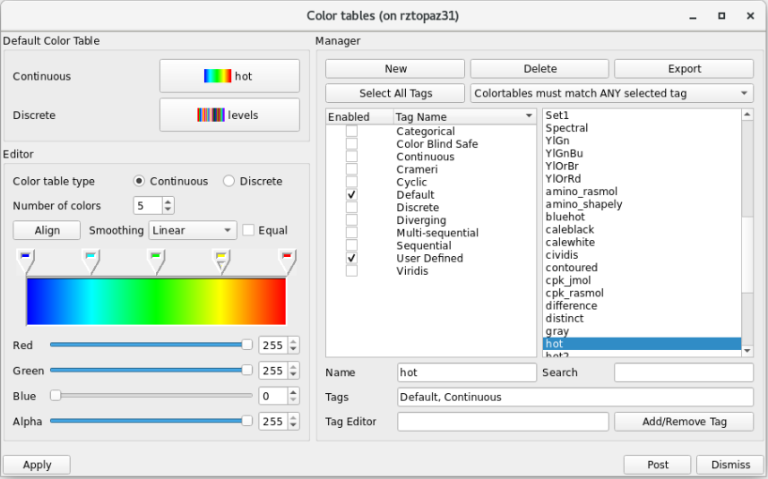
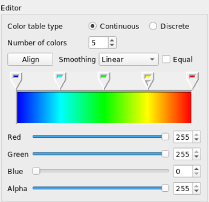
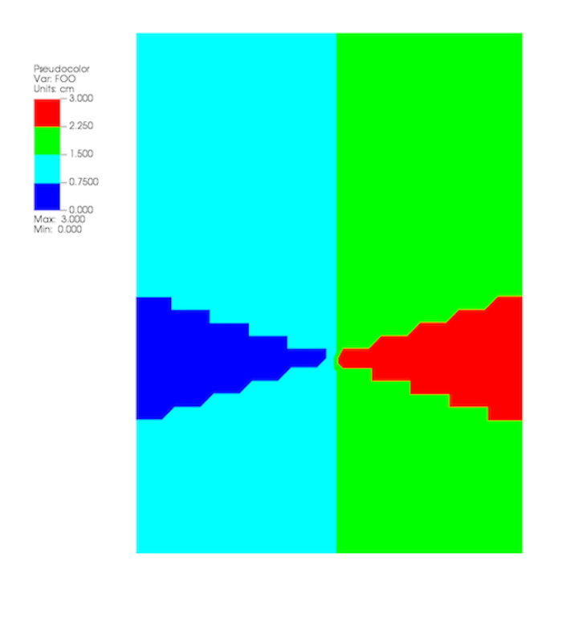
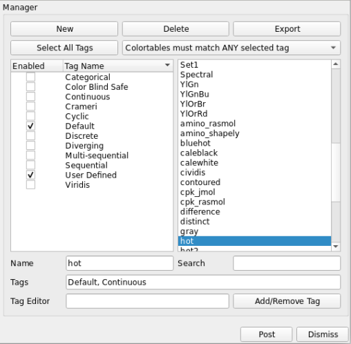

.. _Color_tables:

Color Tables
------------

A color table is a set of colors that is used by certain plots to color
variables. Color tables can be immensely important for understanding
visualizations since changes in color can highlight interesting features.
VisIt_ has several built-in color tables that can be used in visualizations.
VisIt_ also provides a **Color Table Window** for organizing and designing color tables.

Color tables come in two types: continuous and discrete.
Their definitions are dependent upon our notion of a color control point, which is defined as a point in one dimensional space (also between 0 and 1) that has color information (i.e. RGBA values).
A continuous color table is defined as a set of (relatively few) color control points defined at certain intervals such that the gaps between adjacent points are filled by smoothly interpolating their colors.
This makes continuous color
tables look smooth since there are several colors that are blended to form
the color table. Continuous color tables are used by several plots including
the Pseudocolor, Tensor, and Vector plots. A plot that uses a continuous
color table attempts to use all of the colors in the color table. Some
plots that opt to only use a handful of colors from a continuous color
table pick colors that are evenly distributed throughout the color table so
that the plots end up with colors that still somewhat resemble the original
colors from the continuous color table.

A discrete color table is a set of N colors that can be set individually.
There are no other colors in a discrete color table other than the colors
that you provide. 
Internally, a discrete color table is represented as a set of color control points. Their respective positions correspond to the order the colors appear in.
Discrete color tables are usually used by plots like the
Boundary, Contour, FilledBoundary, or Subset plots, which need only a small
set of colors. Typically, these plots use a color from a discrete color
table to color some object and then use the next color to color another
object, and so on. When they reach the end of the color table and still
need more colors, they start again at the beginning with the first color
from the discrete color table.

Color Table Window
~~~~~~~~~~~~~~~~~~

.. _fig-MakingItPretty-ColorTables:

   The color table window

You can open VisIt_'s **Color table window**, shown in :numref:`Figure %s <fig-MakingItPretty-ColorTables>`, by selecting **Color table** from the **Main Window**'s **Controls** menu, or by pressing ``ctrl`` + ``t``.
The **Color table window** is vertically separated into three areas: The top area allows you to set the default color tables. 
The middle area, or the manager portion of the window, allows you to create, delete, and export new color tables, as well as organize all the available color tables.
See :ref:`Filtering_With_Tags` for more information. 
The bottom area, or editor
portion of the window, allows you to edit color tables by adding,
removing, moving, or changing the color of color control points. A
color control point is a point with a color that influences how the
color table will look.

Setting the default color table
"""""""""""""""""""""""""""""""

VisIt_ has a concept of default color tables, which are the color tables
used to color plots that do not specify a color table. There is both a
default continuous color table (for plots that prefer to use continuous
color tables) and a default discrete color table (for plots that prefer
to use discrete color tables). The default color table can be different
for each visualization window. To set the default continuous color table,
select a new color table name from the **Continuous** menu in the
**Default color table** area. To select a new default discrete color
table, select a new color table name from the **Discrete** menu in the
**Default color table** area.
If you would like to see more or less color table options for both the **Continuous** and **Discrete** buttons, see :ref:`Filtering_With_Tags` for instructions on filtering which color tables are available to be used.

Creating a new color table
""""""""""""""""""""""""""

Creating a new color table is a simple process where you first type a
new color table name into the **Name** text field and then click the
**New** button. This creates a copy of the currently highlighted color
table, which is the color table that is selected in the **Manager**
area, and inserts it into the color table list with the specified name.
After creating the new color table, you can modify the color control
points and other attributes to fashion a new color table.

Deleting a color table
""""""""""""""""""""""

To delete a color table, click on a color table name in the color table
list and then click the **Delete** button. 
You can only delete color tables that are not built-in to VisIt_. 
When you delete a color table that is currently set as one of your default color tables, the default color table is set to the color table that comes first in the list. 
If a color table is in use when it is deleted, plots that used the deleted color table will use the default color table from that point on.

Exporting a color table
"""""""""""""""""""""""

If you design a color table that you want to share with colleagues or otherwise use in the future,
click the **Export** button in the **Manager** area to save an XML file
containing the color table definition for the highlighted color table
to your .visit directory. The name of a color table file will usually
be composed of the name of the color table with a *".ct"* extension.
Copying a color table file to a user's .visit directory will allow
VisIt_ to find the color table the next time VisIt_ runs. Look for the
color table file in the directory in which VisIt_ was installed if you
use the Windows version of VisIt_.

Editing a continuous color table
""""""""""""""""""""""""""""""""

.. _fig-MakingItPretty-ColorTableEditContinuous:

   The continuous color table editor

There are a handful of controls in the editor portion of the
**Color table window**, shown in
:numref:`Figure %s <fig-MakingItPretty-ColorTableEditContinuous>`, that
are used to change the definition of a color table. To change a color
table definition, you must alter its color control points. This means
adding and removing color control points as well as changing their
colors and locations.

You can change the number of color control points in a color table using
the **Number of colors** spin box. When a new color control point is
added, it appears to the right of the selected color control point and
to the left of the next color control point. Color control points are
represented as a pointy box just above the color spectrum. The color
control point that has a small triangular mark is the selected color
control point. When a color control point is removed, the color control
point that was created before the deleted color control point becomes
the new selected color control point. Clicking the **Align** button
makes all color control points have equal spacing.

Clicking on a color control point makes it active. You can also use the
Space bar if the color spectrum has keyboard focus. Clicking and dragging
on a color control point changes its position. Clicking the arrow keys
on the keyboard also moves a color control point. To change a color
control point's color, right click on it and choose a new color from the
**Popup color** menu that appears under the mouse cursor. You can also
change the color control point's color by making the color control point
active and then using the **Red**, **Green** and **Blue** sliders.

The **Color table window** also has a couple of settings that can be set
to influence a color table's appearance without having permanent effects
on the color table. The **Smoothing** menu can be used to select between
no smoothing, linear smoothing and cubic spline smoothing. The **Equal**
check box can temporarily tell the color table to ignore the positions
of its color control points and use equal spacing instead. The **Equal**
check box is often used with no smoothing.

Editing a discrete color table
""""""""""""""""""""""""""""""

.. _fig-MakingItPretty-ColorTableEditDiscrete:

   The discrete color table editor

The **Color table window's Editor** area looks different when you edit
a discrete color table. Instead of showing a spectrum of colors, the
window shows a grid of colors that correspond to the colors in the
discrete color table. The order of the color control points is left to
right, top to bottom. To edit a discrete color table, first left click
on the color that you want to edit and then use the **Red**, **Green**,
and **Blue** sliders to change the color. You can also right click on
a color to select it and open the **Popup color** menu to choose a new
color.

Editing color control point positions numerically
"""""""""""""""""""""""""""""""""""""""""""""""""
In both of the sections above, the color control points are *positioned*
graphically using the GUI rather than specifying explicit numerical values.

When a variable is plotted, the variable's values are mapped to the range
``[0...1]`` to determine the colors to associate with the variable's values.
A color table defines a 1:1 association of that range with a set of color
control points. Each control point in a color table is assigned a *position*
in the ``[0...1]`` range.

Sometimes, users want specific numerical values to map to specific colors.
There is no way to achieve this through VisIt_'s color table GUI. The only
solution is to edit a color table manually or, if there are a large number
of color control points to edit, to create a script that produces the color
table.

For example, a user wanted a smoothly graded coloring of a variable using
the following logic and colors...

====================   =========
Variable Value Range   Hex Color
====================   =========
<0                      cccccc
3                       66ccff
10                      66ff66
25                      ffffcc
50                      ffff00
100                     ff9900
1000                    ff0000
>=5000                  9900cc
====================   =========

The above table has 8 colors. The input variable has range ``[0...5000]``.
The first step is to *normalize* the variable's value transitions to the
``[0...1]`` interval and convert the hexadecimal values to rgb colors
using a
`color conversion tool <https://www.w3schools.com/colors/colors_converter.asp>`_.
This information is in the table below.

=========================   =============
Normalized Variable Value     RGB Color
=========================   =============
<0.0      (0/5000)          204  204  204
 0.0006   (3/5000)          102  204  255
 0.002   (10/5000)          102  255  102
 0.005   (25/5000)          255  255  204
 0.01    (50/5000)          255  255  000
 0.02   (100/5000)          255  153  000
 0.2   (1000/5000)          255  000  000
>=1.0  (5000/5000)          153  000  204
=========================   =============

To create this color table, start VisIt_'s GUI and go to
:menuselection:`Controls --> Color table ...` . There, enter a name for the
color table in the **Name** text box. Lets say it is named ``my8colors``.
Clicking the **New** button adds the named table to the list of color
tables, copying the settings of the default color table. For the
example above, we want the **Number of colors** to be set to 8 and the
**Color table type** to be **Continuous**. To create a file for this color
table that can be edited with a text editor, it needs to be exported by
clicking the **Export** button. This will create an XML file in
:ref:`VUSER_HOME/my8colors.ct <color_table_files>` with 8 color control point
entries in it. At this point, the user should exit VisIt_. With a text editor,
the user can now edit the file ``my8colors.ct``. Starting at the *top* of the
file where the *first* color control point is defined (e.g. the one closest to
the *zero* end of the ``[0...1]`` range), edit the *position* and *rgb color*
of the first control point to match the values in the above table. Note that
there is a 4th entry for each rgb color. This is for setting *transparency* of
that color in the range ``[0...255]`` where ``0`` is fully transparent and
``255`` is fully opaque. If *transparency* effects are not needed, this 4th
entry can be ignored and just always set equal to ``255``.

When VisIt_ is restarted, it will load this color table file. The user can then
set this color table as the one to be used in various plots.

One final issue to deal with in this example is how to handle the
user's goal of having all *negative* values in the input variable map
to the first color in the color table and all values greater or equal to 5000
to the last color. To do this, the user will have to define a new variable to
plot using a :ref:`conditional expression <If_Expression_Function>` of the form
``if(lt(var,0),0,if(ge(var,5000),5000,var))`` where ``var`` is the variable and
then use this new *expression variable* in place of ``var`` for the desired
behavior.

.. container:: collapsible

    .. container:: header

        **Show/Hide XML color table file**

    .. code-block:: XML

       <?xml version="1.0"?>
       <Object name="ColorTable">
           <Field name="Version" type="string">3.0.1</Field>
           <Object name="ColorControlPointList">
               <Object name="ColorControlPoint">
                   <Field name="colors" type="unsignedCharArray" length="4">204 204 204 255 </Field>
                   <Field name="position" type="float">0.0</Field>
               </Object>
               <Object name="ColorControlPoint">
                   <Field name="colors" type="unsignedCharArray" length="4">102 204 255 255 </Field>
                   <Field name="position" type="float">0.0006</Field>
               </Object>
               <Object name="ColorControlPoint">
                   <Field name="colors" type="unsignedCharArray" length="4">102 255 102 255 </Field>
                   <Field name="position" type="float">0.002</Field>
               </Object>
               <Object name="ColorControlPoint">
                   <Field name="colors" type="unsignedCharArray" length="4">255 255 204 255 </Field>
                   <Field name="position" type="float">0.005</Field>
               </Object>
               <Object name="ColorControlPoint">
                   <Field name="colors" type="unsignedCharArray" length="4">255 255 0 255 </Field>
                   <Field name="position" type="float">0.01</Field>
               </Object>
               <Object name="ColorControlPoint">
                   <Field name="colors" type="unsignedCharArray" length="4">255 153 0 255 </Field>
                   <Field name="position" type="float">0.02</Field>
               </Object>
               <Object name="ColorControlPoint">
                   <Field name="colors" type="unsignedCharArray" length="4">255 0 0 255 </Field>
                   <Field name="position" type="float">0.2</Field>
               </Object>
               <Object name="ColorControlPoint">
                   <Field name="colors" type="unsignedCharArray" length="4">153 0 204 255 </Field>
                   <Field name="position" type="float">1</Field>
               </Object>
               <Field name="tags" type="stringVector">"UserDefined"</Field>
           </Object>
       </Object>

Numerically Controlled Banded Coloring
""""""""""""""""""""""""""""""""""""""

Sometimes it is convenient to create numerically controlled *banded*
coloring of smoothly varying data. A **Discrete** color table does indeed
wind up *banding* smoothly varying data. However, the band boundaries are
uniformly spaced in the variable's *range* and this may not always be
desirable. Sometimes, it is desirable to have finely tuned banding around
specific portions of the variable's range. This requires the coordination of
a **Discrete** color table and an appropriately constructed
:ref:`conditional expression <If_Expression_Function>`.

For example, given the a smoothly varying variable, ``u``, in the range
``[-1...+1]`` shown in normal (e.g. ``hot``) **Pseudocolor** plot in
:numref:`Fig. %s <fig-MakingItPretty-smooth-coloring>`.

.. _fig-MakingItPretty-smooth-coloring:

   Smoothly colored variable using ``hot`` color table.

we would like to produce a 4-color banded plot using the coloring logic in
the table below...

===============   =====================
Values in Range   Map to this Hex Color
===============   =====================
-inf...-0.95           blue
-0.95...0              cyan
0...+0.95              green
+0.95...+inf           red
===============   =====================

Using a 4-color **Discrete** color table alone, only the plot in
:numref:`Fig. %s <fig-MakingItPretty-uniform-banded-coloring>` is produced.

.. _fig-MakingItPretty-uniform-banded-coloring:

   A 4-color **Discrete** color table coloring alone

This is because the colors in a **Discrete** color table are always uniformly
spaced over the variable's value range. To produce the desired coloring
we need to use a :ref:`conditional expression <If_Expression_Function>` that
maps the input variable into 4 distinct values using the range logic from
the table. In this case, the correct expression would be
``if(lt(u,-0.95),0, if(lt(u,0),1, if(lt(u,0.95),2,3)))``. Then, plotting this
expression using the 4-color **Discrete** color table, the desired coloring is
produced as shown in 

.. _fig-MakingItPretty-numerically-banded-coloring:

   A 4-color **Discrete** color table coloring combined with a
   conditional expression

Converting color table types
""""""""""""""""""""""""""""

It is possible to convert a continuous color table to a discrete color
table and vice-versa using the **Continuous** and **Discrete** radio
buttons in the editor portion of the **Color table window**. Changing the
color table type from discrete to continuous does not change the color
table's color control points; it only changes how they are used. If you
select a discrete color table and click the **Continuous** radio button,
the color table will be changed into a continuous color table and the
**Editor** area will change to continuous mode and show the color table
in a spectrum but no color control points will have changed. You can
even turn the color table back into a discrete color table and the
**Editor** area will show the color table in discrete mode, but the
color control points will not have changed.

Built-In Color Tables
"""""""""""""""""""""

VisIt_ 3.4 supports the notion of *built-in* color tables. 
These are color tables that are either hard coded in VisIt_ or appear in the resources directory. 
They have special rules, namely, they cannot be edited, deleted, or exported. 
They can, however, be copied, using the **New** button as discussed up above.

Better Color Tables
~~~~~~~~~~~~~~~~~~~

VisIt_ includes sets of color tables that are *optimized* for `various properties <https://journals.plos.org/plosone/article?id=10.1371/journal.pone.0199239>`_.
These color tables, although they are less well known and used, often represent better choices
than the *default* **hot** color table.
Some are better for consumers of visual data who have *color vision deficiency (CVD)* (e.g. `color blindness <https://www.colourblindawareness.org/colour-blindness/>`_).
Some represent emerging standards used in various corners of the visualization community.
In some sense, these color table choices are more *inclusive* in that they convey the same information to a broader segment of the population and more *portable* in that they work across a number of different contexts; print, projection, monitor.

The Viridis color tables
""""""""""""""""""""""""

The `Viridis <https://cran.r-project.org/web/packages/viridis/vignettes/intro-to-viridis.html>`_ color tables assert the following properties...

* **Colorful:** spanning as wide a palette as possible so as to make differences easy to see.
* **Perceptually uniform:** meaning that values close to each other have similar-appearing colors and values far away from each other have more different-appearing colors, consistently across the range of values.
* **Robust to colorblindness:** so that the above properties hold true for people with common forms of colorblindness, as well as in grey scale printing.

These color tables all have the ``Color Blind Safe``, ``Viridis``, and ``Default`` tags.

The Crameri color tables
""""""""""""""""""""""""

The `Crameri color maps <https://www.fabiocrameri.ch/colourmaps/>`_ (also called the *Scientific Colour Maps*) assert the following properties.

* **Fairly representing data:** perceptually uniform and ordered to represent data both fairly, without visual distortion, and intuitively.
* **Universally readable:** The color combinations are readable both by color-vision deficient and color-blind people, and even when printed in black and white.
* **Citable & reproducible:** The color maps and their diagnostics are permanently archived and versioned to enable upgrades and acknowledge developers and contributors.

The Crameri color tables define five broad classes of color tables...

* Sequential (``seq``) - good for displaying continuous numerical data.
* Diverging (``div``) - good for displaying comparative data or data differencing.
* Mult-sequential (``2seq``) - good for displaying multi-modal data.
* Cyclic (``cyc``) - good for displaying periodic data.
* Categorical (``jumbled``) - good for displaying categorical data or false contouring of smooth data.

  * This is just a `jumbling <https://www.fabiocrameri.ch/categorical-colour-maps/>`_ of the associated *sequential* color table to maximize perceptual differentiation between *neighboring* data values.

In addition, *discrete* versions consisting of 10 colors from their associated *main* color table are defined.

These color tables all have the ``Color Blind Safe`` and ``Crameri`` tags and are named ``<name>-<class>-<count>`` where ``<name>`` is the specific color table in the Crameri set of color tables, ``<class>`` is one of the five classes defined above and ``<count>`` is defined only for discrete color tables and indicates the number of colors in the table.

.. _Filtering_With_Tags:

Filtering With Tags
~~~~~~~~~~~~~~~~~~~

To aid with choosing a color table, VisIt_ has a color table tagging scheme built into the Color Table Manager. 
Prior to VisIt_ 3.4, users had to select the tag filtering check box to enable tag filtering.
In VisIt_ 3.4, tagging is always enabled.
The manager portion of the color table window is pictured below.

.. _fig-MakingItPretty-ColorTableTags:

   The color table window manager is where tag filtering comes into play.

How it works
""""""""""""

Each color table has a number of tags associated with it. 
These are visible in the **Tags** Bar underneath the color table name.
Users can select tags from the tag list to see only color tables that have those tags.
So, for example, checking the box for the ``Viridis`` tag will cause the color table name box to show color tables that have the ``Viridis`` tag.
However, this does not just affect the color table name box.
All buttons allowing you to choose color tables will now only show color tables that match the current tag filtering selection.
An exception to this is the default continuous and default discrete color table buttons, which will further restrict the set of chooseable color tables to continuous and discrete color tables respectively.

Users can also control how tags are combined: the dropdown button above the list of color table names gives users the option to have color tables match ALL of the selected tags or ANY of the selected tags.
For example, if only the ``Color Blind Safe`` and ``Continuous`` tags are selected and the dropdown is set so color tables match ANY of the selected tags, then all color tables that have *either* the ``Color Blind Safe`` tag or the ``Continuous`` tag will appear. 
However, if you set the dropdown so color tables match ALL of the selected tags, then only color tables that have *both* the ``Color Blind Safe`` tag and the ``Continuous`` tag will appear. 

To view the full list of color tables, users can use the **Select All Tags** Button while the drop down is set so color tables match ANY of the selected tags.
Clicking this button while all tags are selected will deselect all tags.

Specific Behavior
"""""""""""""""""

By default, only the ``Default`` and ``User Defined`` tags are selected (If there are no user defined color tables, the ``User Defined`` tag will not appear in the list). 
The Color Table Manager will retain the tag filtering selection even if the window is closed and reopened.

When a new color table is created, it will inherit the tags from the color table it is based on. 
In addition, it will get the ``User Defined`` tag associated with it. 
The same is true of color tables found in the user's .visit directory. 
When loaded into VisIt_, they will automatically be assigned the ``User Defined`` tag if they do not have it already.

If VisIt_ encounters a color table that does not have any tags, that color table will be assigned the ``No Tags`` tag.

Exporting a color table will export its tags, so they are accessible the next time you use your color table in VisIt_.

Default Tags
""""""""""""

The following is a list of all the tags that appear in VisIt_'s current set of color tables.

* Default
* Color Blind Safe
* Crameri
* Viridis
* Sequential
* Diverging
* Multi-sequential
* Cyclic
* Categorical
* Continuous
* Discrete
* User Defined
* No Tags

Descriptions of most of these tags can be found elsewhere on this page.

Tag Editing
"""""""""""

With VisIt_ 3.4 it is possible to edit tags directly via the Color Table Window. The **Tag Editor** is located beneath the **Tags** bar.
In it, you may type the name of a tag that you wish to either add or remove from the currently selected color table. 
To add the tag to or remove the tag from a color table, click the **Add/Remove Tag** button next to the **Tag Editor**. 
If the tag name you have typed *is not* in the list of tags associated with the current color table, then it will be added upon clicking the **Add/Remove Tag** button.
Likewise, if the tag name you have typed *is* in the list of tags associated with the current color table, then it will be removed upon clicking the **Add/Remove Tag** button.

However, built-in color tables behave differently.
With built-in color tables, it *is* possible to add new tags, but it *is not* possible to remove tags that are present by default. So you can add tags to built-in color tables at will, but you can only remove tags that you or others have added.

Adding a new tag to a color table will immediately add it to the list of tags for filtering.

Prior to VisIt_ 3.4, editing tags in the GUI was not supported. 
To edit a color table's tags, users must directly edit the color table's ``.ct`` file. 
If there are tags defined for that color table, they will appear in a field (usually near the end of the file) called ``tags``. 
Tags can be added to the list as desired. 
VisIt_ generates its tag list from the color table files it reads, so creating a new tag is as easy as writing the name of the tag in a color table file in the tags field.

Another new feature of VisIt_ 3.4 is tag name rules. 
Tags must now only be comprised of alphanumeric characters, whitespace, dashes, equal signs, and greater than and less than signs.

Searching for Color Tables
~~~~~~~~~~~~~~~~~~~~~~~~~~

Another option for finding the right color table is to enable searching. 
With this option, users can type a search term into the **Name** text box, and only color tables that have a name containing that term will appear in the color table name table.

To enable searching, check the box for it to the right of the **Name** text box.
While searching is enabled, searching will happen automatically each time the **Name** text box is edited.
If a selection is made from the color table name table, searching will temporarily pause.
However, as soon as the **Name** text box is edited once more, searching will resume as before.
The only way to stop searching is to disable it via the check box.

Searching also works in tandem with the tagging system. 
So, if tagging is enabled, only results from a search which have the specified tags will appear in the color table name table.

Color Tables and Saving Settings/Sessions
~~~~~~~~~~~~~~~~~~~~~~~~~~~~~~~~~~~~~~~~~

New to VisIt_ 3.4 are updates to how color tables interact with saving state (saving settings and sessions).
Color tables themselves will now never be saved when saving state, since built-in color tables have no changes to save, and user defined color tables are exported to the .visit directory, so there is no color table information to save when saving state.
However, there are two exceptions to this: the current tag filtering selection will be preserved if state is saved, and all modifications to tags will also be saved.
