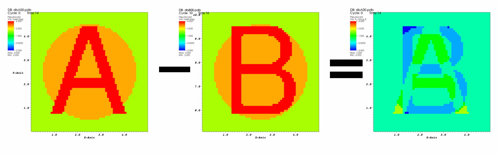

.. _Database comparison:

Database comparison
-------------------

Comparing the results of multiple related simulation databases is one of
VisIt_'s main uses. Users can plot multiple databases in the same
window or adjacent windows, allowing comparison of plots visually.
In addition to these *visual* modes of comparison, VisIt_ also supports
more direct *numerical* comparison through the expression system.
Database comparison allows users to plot direct
differences between two databases or between different time states in the
same database including even in the definition of time derivatives.

Numerical database comparisons use special expressions called
:ref:`Cross-Mesh Field Evaluation (CMFE) <Comparison_Expressions>`
expressions, :ref:`pos_cmfe() <Pos_Cmfe_Expression_Function>` and
:ref:`conn_cmfe() <Conn_Cmfe_Expression_Function>`,
which are capable of mapping a field from one mesh, the *donor*, onto
another mesh, the *target*. The name `conn_cmfe()` stands for
*connectivity-based cross mesh field evaluation* (CMFE). It is a specialization
of *position-based cmfe*, `pos_cmfe()`, for cases in which donor and target
meshes be topologically congruent (e.g. size, connectivity, decomposition,
etc. are identical). More information on CMFE expressions are found in the
:ref:`Cross-Mesh Field Evaluation (CMFE) <Comparison_Expressions>` section
of the :ref:`Exprssions <Expressions>` chapter. There is also a helpful
*wizard*, the
:ref:`Data Level Comparison Wizard <DataLevelComparisonsWizard>`, that
simplifies the process of defining comparison expressions. Here, we
walk through a few basic examples of using :ref:`CMFE <Comparison_Expressions>`
expressions and demonstrate how to use them in comparisons.

Plotting the difference between two databases
~~~~~~~~~~~~~~~~~~~~~~~~~~~~~~~~~~~~~~~~~~~~~

The typical case is where two slightly different databases time series
have been generated from the same simulation code and the user wishes to work
with the *difference* between the two databases *and* to have this difference
update as the time slider is changed.

<mesh/ireg> - conn_cmfe(</usr/local/visit/data/dbB00.pdb[0]id:mesh/ireg>, <mesh>)

In the above expression, the first argument to `conn_cmfe()` serves as the *donor*
field and the second argument is the *target* mesh. This expression is a simple
difference operation of database A minus database B. Note the special `[0]id`
*time specification syntax* before the colon but after the file system path in
the first argument `conn_cmfe()`. The `i` means to interpret the number in
brackets, `[0]` as a time state *index*. The `d` means to further interpret that
number as an index *difference* from the *current* time slider index. This
:ref:`syntax <Pos_Cmfe_Donor_Variable_Synax>` is described in greater detail in
the section describing :ref:`pos_cmfe() <Pos_Cmfe_Expression_Function>`.

The assumption made by this expression is that database A is
the *active* database and the user wishes to map database B onto it to
subtract it from database A's *mesh/ireg* variable. In this example, database
B's *mesh/ireg* field is being mapped onto database A's mesh and their difference
is then being taken. :numref:`Figure %s <a_minus_b>` illustrates
the database differencing operation.

.. _a_minus_b:

   Database B subtracted from database A

Plotting values relative to the first time state
~~~~~~~~~~~~~~~~~~~~~~~~~~~~~~~~~~~~~~~~~~~~~~~~

Plotting a variable relative to its initial values can be important for
understanding how the variable has changed over time. The conn_cmfe
expression is also used to plot values from one time state relative to
the values at the current time state. Consider the following expression:

<mesh/ireg> - conn_cmfe(</usr/local/visit/data/dbA00.pdb[0]i:mesh/ireg>, mesh)

The above expression subtracts the value of *mesh/ireg* at time state zero
(in the `[0]i` without the `d` means to always map *absolute* time index
zero from the *donor*) from the value of *mesh/ireg* at the current time
As the time slider is changed, the values for the *active* database will
change but the part of the expression
using conn_cmfe, which in this case uses the first database time state,
will not change. This allows users to create expressions that compare the
current time state to a fixed time state.

.. _a_minus_a0:

.. figure:: images/a_minus_a0.png

   Time state 6 minus time state 0

Plotting time derivatives
~~~~~~~~~~~~~~~~~~~~~~~~~

Plotting time derivatives is much like plotting the difference between the
current time state and a fixed time state except that instead of being
fixed, the second time state being compared is free to move relative to
the current time state. To plot a simple time derivative such as the
current time state minus the last time state, create an expression similar
to the following expression:

<mesh/ireg> - conn_cmfe(</usr/local/visit/data/dbA00.pdb[-1]id:mesh/ireg>, mesh)

The important piece of the above expression is its use of *"[-1]id"* to
specify a time state delta of -1, which means add -1 to the current time
state to get the time state whose data will be used in the conn_cmfe
calculation. You could provide different values for the time state in the
*[]* operator. Substituting a value of *3*, for example, would make the
conn_cmfe expression consider the data for 3 time states beyond the current
time state. If you use a time state delta, which always uses the *"d"*
suffix, the time state being considered is always relative to the current
time state. This means that as you change time states for the active
database using the time slider, the plots that use the conn_cmfe expression
will update properly. :numref:`Figure %s <a_minus_preva>` shows an example
plot of a time derivative.

.. image:: images/a.png

.. _a_minus_preva:

   Plot of a variable and its time derivative plot
