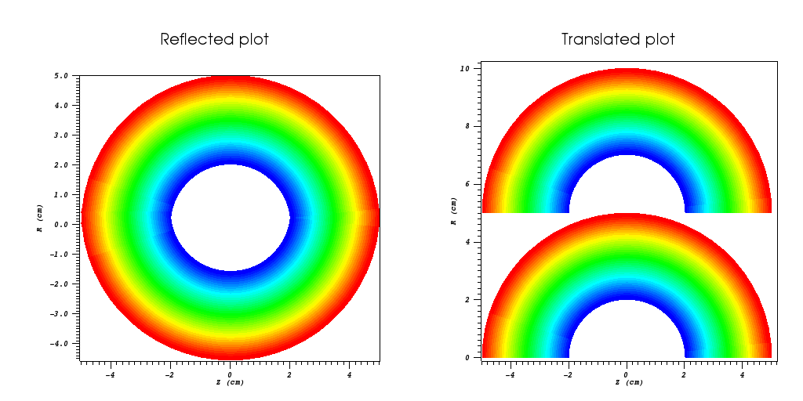
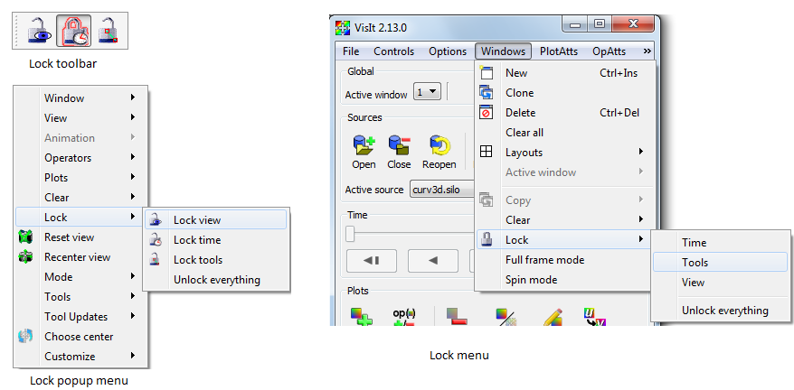
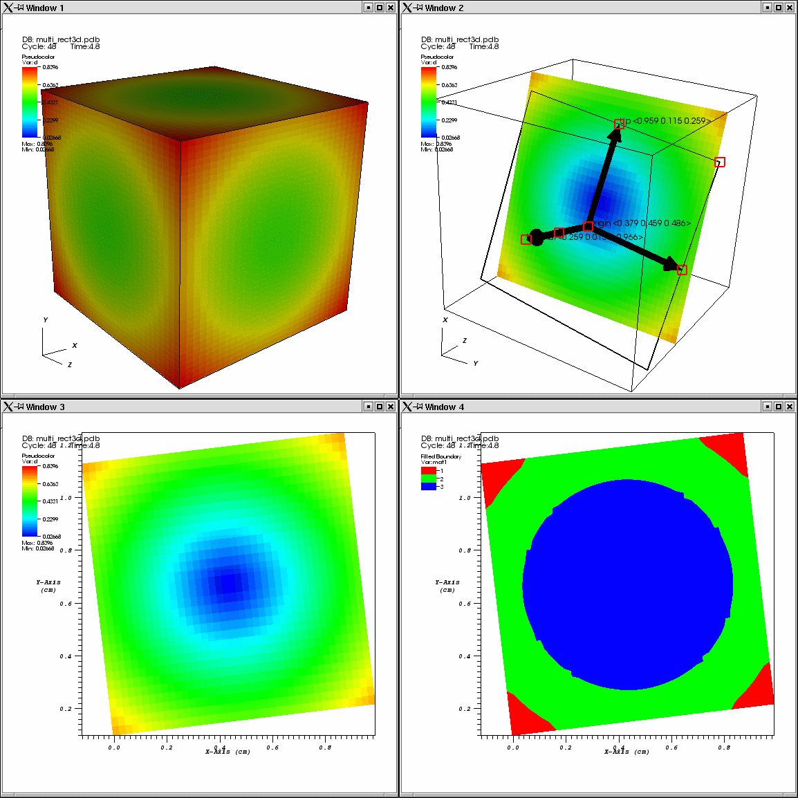

.. _Multiple window operations:

Multiple window operations
--------------------------

This section focuses on some of the common techniques for exploring multiple
databases when you have multiple visualization windows.

Reflection and Translation
~~~~~~~~~~~~~~~~~~~~~~~~~~

When you visualize multiple related databases, they often occupy the same
space in the visualization window since they may have been generated using
the same computational mesh but with different physics. When this is the
case, you can modify the location of the plots from one of the databases
in two immediately obvious ways. First of all, if you simulated the same
object and it does not make use of any symmetry then you could use the 
:ref:`Transform operator` to translate the coordinate system of one of the plots
out of the way of the other plot so you can look at the two plots from the
different databases side by side in the same visualization window. If your
databases make use of symmetry (maybe you only simulated half of the
problem) then you can apply the :ref:`Reflect operator` to one of the plots
to show them side by side but reflected to show the entire problem. Each
method has its merits.

.. _sidebyside:

   Plots side by side using the Reflect or Transform operator

Copying Windows
~~~~~~~~~~~~~~~

If you visualize multiple databases and you want to create identical plots
for each database but have them placed in different visualization windows
then you can either have VisIt copy windows on first reference or you can
clone an existing window and then replace the database used in the new
window's plots with a different database.

If you have already created multiple visualization windows, perhaps as the
result of a change to VisIt's layout, then you can make VisIt copy the
attributes of the active window to another visualization window when you
switch active windows by enabling **Clone window on first reference** in
the **Preferences Window**. To open the **Preferences Window**, choose the
**Preferences** option from the **Main Window's Options** menu. This form
of window cloning copies the plots, lights, colors, etc from the active
window to a pre-existing visualization window when you access it for the
first time. If you have already accessed a visualization window but you would
still like to copy plots, lights, colors, etc from another visualization
window, you can make the destination visualization window be the active
window and then copy everything from the source visualization window using
the **Copy everything** menu option in the **Main Window's Windows** menu.

If you have no empty visualization window to contain plots for the another
database, you can click the **Clone** option in the **Main Window's Windows**
menu to create a new visualization window with the same plots and settings
as the active window. Once the new window has been created, you could
visualize a new database by choosing a new database in the
**Active source** combo box and clicking the **Replace** button.

.. _Locking Windows:

Locking Windows
~~~~~~~~~~~~~~~

When you visualize databases using multiple visualization windows, it is often 
convenient to keep the time state and view in sync between windows so you can 
concentrate on comparing plots instead of dealing with the intricacies of 
setting the view or time state for each visualization window. VisIt's 
visualization windows can be locked with respect to time, view, or interactive 
tools. To lock visualization windows, use the **Popup menu**, **Toolbar**, or 
the **Lock** options from the **Main Window's Windows** menu as shown in 
:numref:`Figure %s <lockmechanisms>`.

.. _lockmechanisms:

   Mechanisms for locking windows

Locking views
"""""""""""""

If you have created plots from related databases in multiple visualization
windows, you can lock the views for the visualization windows together so that
as you change the view in one of the visualization windows with a locked view, 
the other visualization windows with locked views also update to have the same 
view. There are four types of views in VisIt: curve, 2D, 3D, and AxisArray. If 
you have 2D plots in a visualization window, the visualization window is 
considered to be 2D. Locking that 2D visualization window's view will only 
update other visualization windows that are also 2D and vice-versa.  The same 
is true for curve, 3D and AxisArray views. 

Locking time
""""""""""""

If you have created plots from related databases in multiple visualization
windows, you can lock the visualization windows together in time so that as you
change time in one visualization window, it updates in all other visualization
windows that are locked in time.  

Locking visualization windows together in time may cause VisIt to prompt
you to create a new database correlation that involves all of the databases
in the visualization windows that are locked in time. VisIt creates a
database correlation because the visualization windows must use a common
time slider to really be locked in time. If the visualization windows did
not use a common time slider then changing time in one visualization window
would not cause other visualization windows to update. Once VisIt creates
a suitable database correlation for all windows, the active time slider is
set to that database correlation in all visualization windows that are
locked in time. If you alter a database correlation at this point, it will
cause the time state in each locked visualization window to change. Since
the same database correlation is used in all locked visualization windows,
changing the time state for the database correlation changes the time state
in all of the locked windows. This frees you to examine time-varying
database behavior without having to set the time state independently in each 
visualization window.  See :ref:`Database correlations` for more information.

Locking tools
"""""""""""""

In addition to locking visualization windows together with respect to the view 
and time, you can also lock their tools. This capability can be useful when 
exploring data that often requires the use of an operator whose attributes can 
be set interactively using a tool since the same tool can be used to set the 
operator attributes for operators in more than one visualization window. 
See :ref:`InteractiveTools` for information on the different tools and
how they are used.

Consider the following scenario: you have two related 3D databases and you
want to examine the same slice plane for each database and you want each
database to be plotted in a separate visualization window. You can set up
separate visualization windows and slice the plots from each database
independently but locking tools is easier and requires much less setup.

Start off by opening the first 3D database and create the desired plots
from it. If you want to maintain a 3D view of the plots, you can clone the
visualization window to get a new window with the same plots or you can
apply a :ref:`Slice operator` to the plots. Apply a Slice operator but make sure
the slice is *not* projected to 2D and also be sure that its **Interactive**
check box is turned on. Turn on VisIt's plane tool and make sure that tools
are locked. Clone the visualization window twice and for each of the new
visualization windows, make sure that their Slice operator projects to 2D.
There should now be four visualization windows if you opted to keep a 3D
view of the data. In the last visualization window, replace the database
with another related database that you want to compare to the first database.

Now that all of the setup steps are complete, you can save a session
file so you can get back to this state when you run VisIt next time. Now,
in the window that still has a slice in 3D, use the plane tool to reposition
the slice. Both of the 2D visualization windows should also update so they
use the new slice plane attributes calculated by the plane tool. The four
visualization windows, arranged in a 2x2 window layout are shown in
:numref:`Figure %s <lockedtools>`.

.. _lockedtools:

   Multiple visualization windows with locked tools
