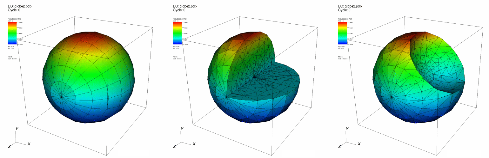
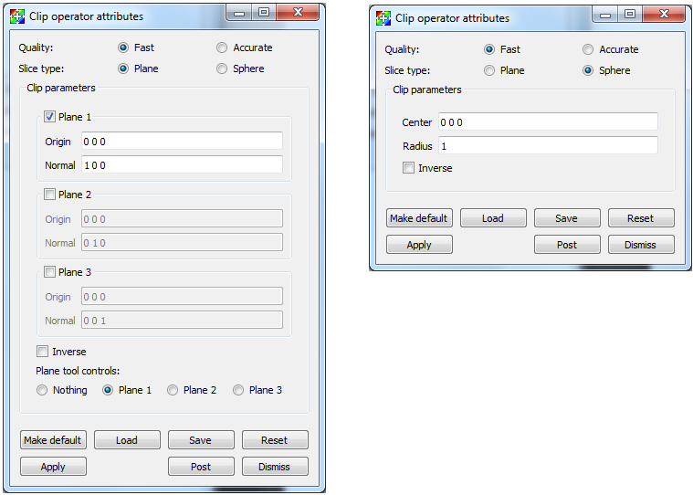
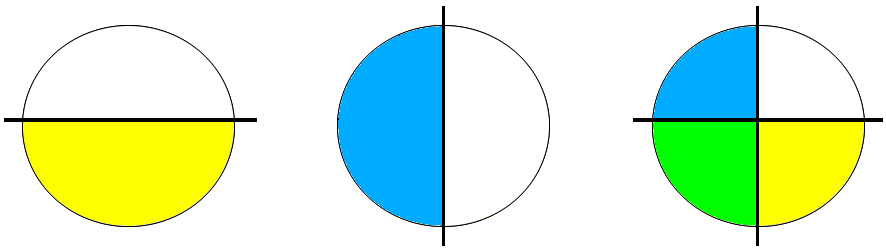
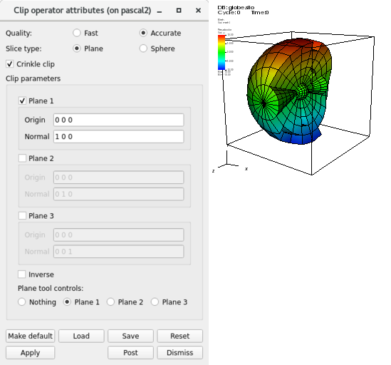

.. _Clip operator:

Clip operator
~~~~~~~~~~~~~

The Clip operator can remove certain shapes from a dataset before it is plotted.
More specifically, the Clip operator can clip away box- or sphere-shaped regions
from a database. The database remains in its original dimension after being 
clipped by the Clip operator and since the Clip operator manipulates the 
database before it is plotted, the surfaces bounding the removed regions are 
preserved in the final plot. While being geared primarily towards 3D databases, 
the Clip operator also clips 2D databases. When applied to 2D databases, the 
Clip operator can remove rectangular or circular regions from the database.
:numref:`Figure %s <clip>` shows a Pseudocolor and Mesh plots with a Clip 
operator.

.. _clip:

   Clip operator example: original plot; clipped with planes; clipped with sphere 

Removing half of a plot
"""""""""""""""""""""""

The Clip operator uses up to three planes to define the region that is clipped 
away. Each plane is specified in origin-normal form where the origin is a point
in the plane and the normal is a vector that is perpendicular to the plane. 
When a plane intersects a plot, it serves as a clipping boundary for the plot. 
The plane's normal determines which side of the plane is clipped away. The 
region on the side of the plane pointed to by the normal is the region that the 
Clip operator clips away. If more than one plane is active, the region that is 
left as a result of the first clip operation is clipped by the next plane, and 
so on.

Only one plane needs to be used to remove half of a plot. Find the center of 
the database by inspecting the 3D axis annotations in the visualization window. 
Type the center as the new plane origin into the **Origin** text field for 
plane 1 then click the **Plane 1** check box for plane 1 (see 
:numref:`Figure %s <clipwindow>`). When the **Apply** button is clicked, half 
of the plot should be removed. You can rotate the clipping plane by entering a 
new normal vector into the **Normal** text field. The normal is specified by 
three floating point values separated by spaces.

.. _clipwindow:

   Clip attributes window 

The **Accurate** option can be used when multiple planes are specified, to 
ensure accuracy when planes intersect a zone but do not clip the vertices. 
It can be up to 6x slower than the **Fast** option.

Removing one quarter of a plot
""""""""""""""""""""""""""""""

To remove a quarter of a plot, you need two clipping planes. To remove one of 
the plot, first remove one half of the plot. Now, enable the second clipping 
plane and make sure that it has the same origin as the first clipping plane but 
a different normal. To remove exactly one quarter of the plot, make sure that 
the normal is perpendicular to plane 1's normal. Also make sure that plane 2's 
new normal points into the region that was clipped away by plane 1. The two 
planes, when considered together, remove one quarter of the plot. For an 
illustration of this, see :numref:`Figure %s<clipcircle>`. In general, the Clip 
operator removes regions defined by the intersection of the regions removed by 
each clipping plane. Follow the same procedure with the third clipping plane to 
remove only one eighth of the plot.

.. _clipcircle:

   Removing one quarter of a plot using two clip planes: Plane1 clipped region + Plane2 clipped region = One quarter removed

Spherical clipping
""""""""""""""""""

The Clip operator not only uses sets of planes to clip databases, it can also 
use a sphere. To make the Clip operator use a clipping sphere, click on the 
**Sphere** tab. To specify the location and size of the sphere, enter a new 
center location into the **Center** text field on the Sphere tab of the Clip 
attributes window and then enter a new sphere radius.

Inverting the clipped region
""""""""""""""""""""""""""""

Once the Clip operator has been applied to plots and a region has been clipped 
away, clicking the **Inverse** check box brings back the clipped region and 
clips away the region that was previously unclipped. Using the **Inverse** 
check box is an easy way to get only the clipped region back so it can be used 
for other operations.  

A common trick when creating animations is to have two identical plots with 
identical Clip operators applied and then switch one Clip operator to have an 
inverted clipping region. This will make the plot appear whole. The plot with 
the inverted clipping region can then be transformed independently of the first 
plot so it appears to slide out of the first plot. Then it is common to fade 
out the second plot and zoom in on the first plot's clipped region.  

Using the crinkle clip
""""""""""""""""""""""

Generally, when using the Clip operator, the clipped surface will be smooth,
but this often isn't representative of the natural surfaces of the cells along
the clipped boundary. The often jagged edges of those cells are cut away and replaced
with new faces to create this smooth result. There are times, though, when
it may be desirable to retain the original cell faces that lay along this
boundary. This can be accomplished by enabling the **Crinkle clip** option, shown
in :numref:`Figure %s <crinkle_clip>`.

.. _crinkle_clip:

   Enabling the Crinkle clip option; Crinkle clip example

