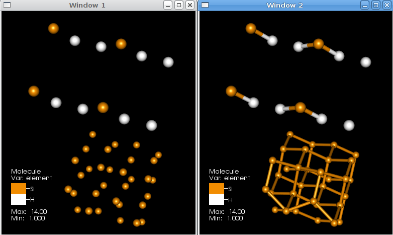
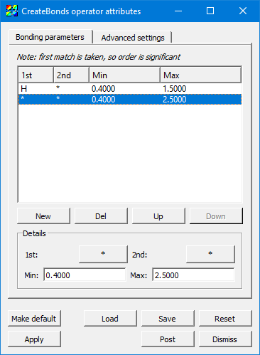
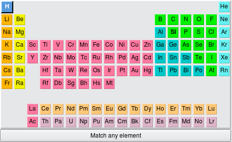
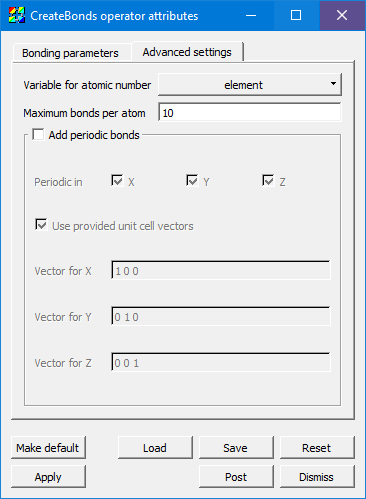

.. _createbonds_operator_head:

Create Bonds operator
~~~~~~~~~~~~~~~~~~~~~

The CreateBonds operator is used to specify ranges of distances for various 
types of atoms and use those ranges to create bonds. The default behavior of 
this operator is to create a bonds between a Hydrogen and any other species 
if the atoms are separated by a distance between 0.4 and 1.2 units 
(e.g. Angstroms) and between a pair of atoms (not including H) if they are 
between 0.4 and 1.9 units apart. This works well for organic molecules. 
However, in :numref:`Figure %s <createbonds_example>`, the default distances 
were not useful. In this case, the values were changed to create a bond 
including H for distances between 0.4 and 1.5 units and for other species 
between 0.4 and 2.5 units. :numref:`Figure %s <createbonds_bonding>`.

.. _createbonds_example:

   Bonds created with different bonding distances

.. _createbonds_bonding:

   CreateBonds bonding parameters

Setting the Bonding parameters 
""""""""""""""""""""""""""""""
The Bonds list contains the bonding pair specifications to algorithm. Each row contains the species **1st** and **2nd**, and the **Min** and **Max** distance which could be considered a bond. 

Note: 

1. A "*" matches any species.

2. It does not matter which species is *1st* and which is *2nd*. The bonds are not unidirectional. 

3. The first match in the list is taken, even if later lines also match, which allows you to specify more specific rules above less-specific rules.

For example, if the first line is "H", "*", "0.4", "1.2", this specifies that the algorithm should create a bond between two atoms if either one is Hydrogen and the distance between them is between 0.4 and 1.2 spatial units.

As a follow-on to this example, suppose the second line is "*", "*", "0.4", and "1.9". Now suppose two atoms exist, H and O, and they are separated by a distance of 1.5 units. Because one is H, it will match the first line, determine the distance is too great (since it's greater than 1.2), and so it will not create a bond between this atom pair. Since this atom pair matched the first line, the second line is not considered, even though the atom pair matches its criteria.

Just below the actual bonding rules list are several buttons: The **New** button creates a new rule, and **Del** deletes it.  **Up** moves the currently selected rule up in the list, and **Down** moves the currently selected rule later in the list. Recall that the order of rules matters because only the first match is considered. 

The **Details** section contains controls to set the values for a rule.  The **1st** and **2nd** controls pop up the species selection widget shown in :numref:`Figure %s <createbonds-selector>`.

.. _createbonds-selector:

   The element selector

To get a wildcard which will match any type of atom, choose **Match any element** at the bottom; it is selectable just as any individual species in the periodic table.

Also, note that there is the possibility for some *hinting* to help guide your selection to the viable types of atoms. (This depends on conditions like file format support.) For example, in this screenshot, the **H** and **Si** elements are in boldface, since the file contains only those types of atoms.  The **Min** and **Max** fields are standard text widgets.  

Advanced settings
"""""""""""""""""

.. _createbonds_advanced:

   The advanced settings tab

**Variable for atomic number** defaults to *element* as per the convention, but it can be set to any integral variable corresponding to the atomic number of each atom.

If you specify the wrong distance, each atom might try to bond to many other atoms. To keep an error like this from causing a severe hit to memory and performance, **Maximum bonds per atom** will stop the process before it gets out of hand.  The default value is *10*, and it could safely be set lower in many cases, but it is user-settable for unusual cases where >10 bonds are needed on some atoms. 

When **Add periodic bonds** is checked, this will make the algorithm see if an atom would bond with an atom past a periodic boundary edge, and add a dangling bond in that case.  Checking this setting will enable the **Periodic in X,Y,Z** controls as well as the controls for **Unit cell vectors**.

**Periodicity in X, Y, Z** can be selected independently (or none).

Some file formats specify the vectors for the unit cell (sometimes called "direct lattice" vectors) containing the molecular data in the file. If they are present and **Use provided unit cell vectors** is checked, then it will use those values instead of the ones specified in this window.  

**Vector for X, Y, and Z** controls the actual vectors describing the amount to displace in each of the three axes. 

Examples in use
"""""""""""""""

See :ref:`moleculardatafeatures_head` for examples of the CreateBonds operator in use with the :ref:`molecule_plot_head`.
