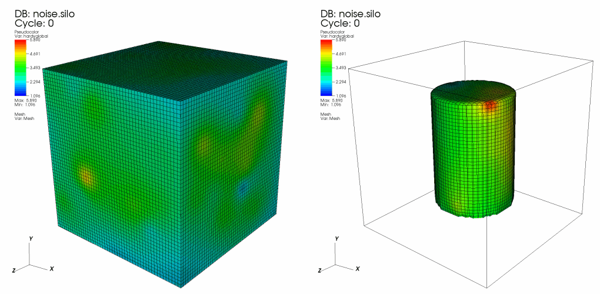
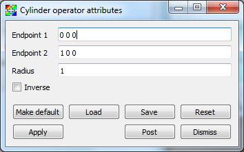
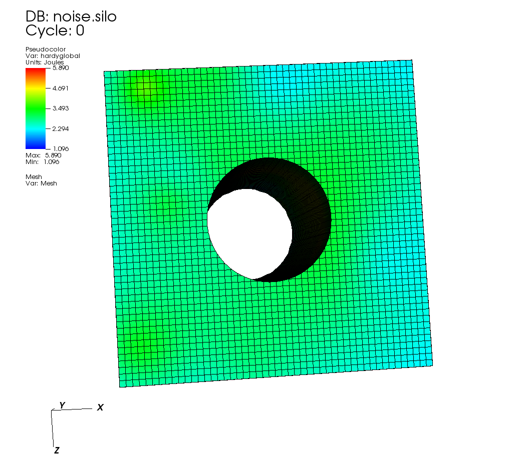

.. _Cylinder operator:

Cylinder operator
~~~~~~~~~~~~~~~~~

The Cylinder operator, shown in :numref:`Figure %s <cylinder>`, slices a dataset with a 
cylinder whose size and orientation are specified by the user. The result is a 
cylindrical surface.

.. _cylinder:

   Cylinder operator example: original plot; plot clipped by cylinder

Setting the cylinder's endpoints
""""""""""""""""""""""""""""""""

There are two ways to set the endpoints for the Cylinder operator. First of all,
you can open the **Cylinder operator window** (see 
:numref:`Figure %s <cylinderwindow>`) and type new 3D points into the 
**Endpoint 1** and **Endpoint 2** text fields. The second, and more interactive 
way to set the endpoints for the Cylinder operator is to use VisIt's interactive
Line tool, which is discussed in the :ref:`InteractiveTools` chapter. The Line 
tool lets you interactively place the Cylinder operator's endpoints anywhere in 
the visualization. The Line tool's endpoints correspond to the centers of the 
cylinder's top and bottom circular faces.  

Setting the radius
""""""""""""""""""

To set the radius used for the Cylinder operator's clipping cylinder, type a 
new radius into the **Radius** text field in the **Cylinder attributes window** .  

.. _cylinderwindow:

   Cylinder operator window.

Inverting the cylinder region
"""""""""""""""""""""""""""""

Once the Cylinder operator has been applied to plots and a cylindrical region 
has been clipped away, clicking the **Inverse** check box brings back the 
cylindrical region and removes the region that was previously shown. 

.. _cylinder_inverse:

   Cylinder with inverse applied
