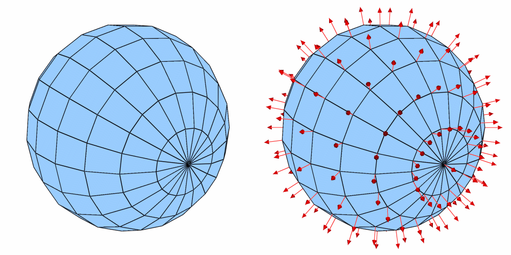

.. _DeferExpression operator:

DeferExpression operator
~~~~~~~~~~~~~~~~~~~~~~~~

The DeferExpression operator is a special-purpose operator that defers 
expression execution until later in VisIt's pipeline execution cycle. This 
means that instead of expression execution taking place before any operators 
are applied, expression execution can instead take place after operators have 
been applied.

Plotting surface normals
""""""""""""""""""""""""

VisIt can use the DeferExpression operator in conjunction with the 
:ref:`ExternalSurface operator` and the surface_normal expression to plot 
surface normals for your plot geometry. To plot surface normals, first create a 
vector expression using the surface_normal expression , which takes the name of 
your plot's mesh as an input argument. Once you have done that, you can create 
a Vector plot of the new expression. Be sure to apply the 
:ref:`ExternalSurface operator` first to convert the plot's 2D cells or 3D 
cells into polygonal geometry that can be used in the surface_normal expression.
Finally, apply the DeferExpression operator and set its variable to your new 
vector expression. This will ensure that the surface_normal expression is not 
evaluated until after the ExternalSurface operator has been applied.

.. _defer:

   DeferExpression operator example

Deferring multiple expressions
""""""""""""""""""""""""""""""

What if you want to color a surface by a new variable equal to **(1.0 - X)^2** where **X** is the x-component of the surface's normal?
Starting with the previous example, and supposing the surface normal expression was defined as **surfn=point_surface_normal("mesh")**.
You would create a new expression to grab the x-component of the normal: **X=(1.0-surfn[0])^2**.
Add a :ref:`Pseudocolor plot` of **X**.
Apply the :ref:`ExternalSurface operator`.
Apply the DeferExpression operator and add both **surfn** and **X** to the list of variables being deferred.

